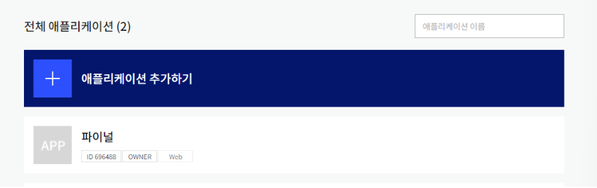
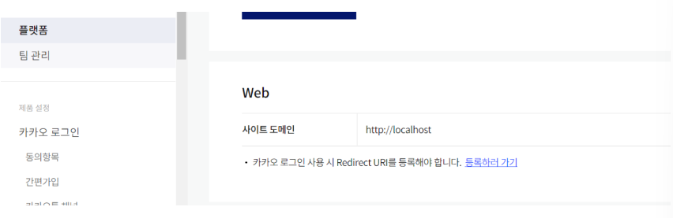
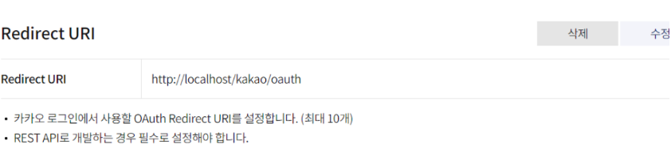
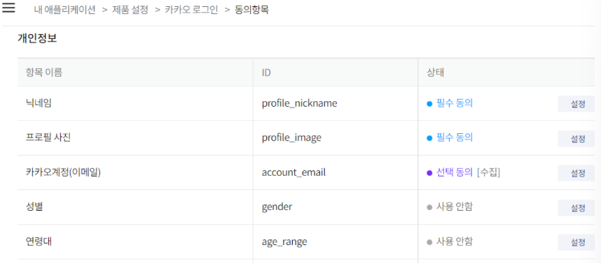

## 본문

### 카카오로그인 API & Javascript

    ● 환경설정
    - SpringBoot
    - JQuery
    - EL
    - JSTL

### 카카오로그인 기본 셋팅

    카카오로그인 API 사용법에는 REST API와 자바스크립트 API가 있지만,
    웹버전이라 브라우저가 자바스크립트를 지원해준다. 그래서 자바스크립트 사용.

    1. 애플리케이션 추가 -> 카카오 API Access key 생성 

    2. 플랫폼 web 사이트 도메인 등록하기

 

    3. redirect URL 등록 (REST API 사용시 필수 등록)

    4. 동의항목 체크

### HTML

    <!-- 로그인 모달창 -->
	

		

			

				

					<button type="button" class="btn-close" data-bs-dismiss="modal" aria-label="Close"></button>
				

					

						<a href="#" class="text-reset p-2" title="Tooltip">비밀번호 찾기</a> 
						 |  
						<a href="registerUser" class="text-reset p-2" title="Tooltip">회원가입</a>
					

				

				

	    		   
SNS 로그인

		    		

			    		<%-- 
			    			카카오 로그인 처리중 중 오류가 발생하면 아래 경고창에 표시된다.
			    			카카오 로그인 오류는 스크립트에서 아래 경고창에 표시합니다.
			    		 --%>
			    		
오류 메세지

						    		
		    			
		    		

		    		<form id="form-kakao-login" method="post" action="kakao-login">
		    			<input type="hidden" name="email"/>
		    			<input type="hidden" name="name"/>
		    			<input type="hidden" name="img"/>
		    		</form>
				

			

		

	

### Javascript

    $(function(){

        $("#btn-kakao-login").click(function(event){

            // a태그 기능 실행멈춤.
            event.preventDefault();  

            // 카카오 로그인 실행시 오류메시지를 표시하는 경고창을 화면에 보이지 않게 한다.
            $("alert-kakao-login").addClass("d-none");

            // 사용자 키를 전달, 카카오 로그인 서비스 초기화.
            kakao.init('본인 접근키 입력');

            // 카카오 로그인 서비스 실행하기 및 사용자 정보 가져오기
            kakao.Auth.login({
                success:function(auth){
                    kakao.API.request({
                        url : '/v2/user/me',
                        success : function(response){
                            // 사용자 정보를 가져와서 form에 추가
                            var account = response.kakao_account;

                            $('#form-kakao-login input[name=email]').val(account.email);
                            $('#form-kakao-login input[name=name]').val(account.profile.nickname);
                            $('#form-kakao-login input[name=img]').val(account.profile.img);

                            // 사용자 정보가 포함된 form을 서버로 제출한다.
                            document.querySelector('#form-kakako-login').submit();
                        },
                        fail : function(error) {
                            // 경고창에 에러메시지 표시
                            $('alert-kakao-login').removeClass("d-none").text("카카오 로그인 처리 중 오류가 발생했습니다.")
                        }
                    }); // api request
                }, // success 결과.
                fail:function(error){
                    // 경고창에 에러메시지 표시
                    $('alert-kakao-login').removeClass("d-none").text("카카오 로그인 처리 중 오류가 발생했습니다.")
                }
            }); // 로그인 인증.
        }) // 클릭이벤트
    })// 카카오로그인 끝.

    - kakao.auth.login(auth)을 request하면 유효시간이 존재하는 토큰을 준다.

    - 그 url이 /v2/user/me 이고, 회원가입을 시키려면 비밀번호를 제외한(비밀번호는 당연히 제공이 안되기 때문) 다른 정보들을 가져와 controller로 보내 유저정보를 추가한다.

    - 로그인 버튼 하나로 회원가입까지 완료되는 것이다.

### Controller 

    @RestController
    @RequestMapping("/auth")
    public class UserController {

        private final UserService userService;  // 서비스 클래스 주입

        @Autowired
        public UserController(UserService userService) {
            this.userService = userService;
        }

        // kakao 로그인 요청을 처리
        @PostMapping("/kakao-login")
        public String loginWithKakao(kakaoLoginForm form) {

            // 카카오 로그인 인증 정보를 로그에 출력
            log.info("카카오 로그인 인증정보: " + form);

            // 카카오 로그인 처리 로직을 서비스에 위임
            User savedUser = userService.loginWithKakao(form);

            // 저장된 회원정보가 있으면 세션에 저장, 없으면 새로 생성하여 세션에 저장
            if (savedUser != null) {
                SessionUtils.addAttribute("LOGIN_USER", savedUser);  // 기존 사용자
            } else {
                SessionUtils.addAttribute("LOGIN_USER", form.toUser());  // 새 사용자
            }

            return "redirect:/";  // 로그인 후 메인 페이지로 리다이렉트
        }
    }

    이렇게 전달받은 정보를 post로 받아서 user 객체에 정보들을 저장하고 테이블에 동일한 email이 있는지 확인. 
    존재하는 경우, savedUser을 세션에 저장한다.
    존재하지 않는 경우, user 정보를 테이블에 저장(service)하고 그 정보를 세션에 저장한 후 home으로 이동시킨다.

    - loginType으로 일반로그인과 구분해야한다.

    일반회원가입과 카카오로그인의 탈퇴방식이 다르고 카카오로그인이면 비밀번호 정보가 없기 때문에, 비밀번호 변경등 일부 서비스에 제한을 둬야함으로 loginType으로 구분해주어야 한다.

### Service (loginType : kakao & normal)

    @Service
    public class UserService {

        private final UserMapper userMapper;  // UserMapper는 DB와의 상호작용을 담당

        @Autowired
        public UserService(UserMapper userMapper) {
            this.userMapper = userMapper;
        }

        // 카카오 로그인 처리 로직
        public User loginWithKakao(kakaoLoginForm form) {
            // 카카오 로그인 폼에서 받은 데이터를 바탕으로 User 객체를 생성
            User user = User.builder()
                            .email(form.getEmail())
                            .name(form.getName())
                            .img(form.getImg())
                            .loginType("KAKAO")  // 카카오 로그인 타입을 고정값으로 설정
                            .build();

            // DB에서 해당 사용자가 이미 있는지 확인
            User savedUser = userMapper.getUserByEmail(user.getEmail());

            if (savedUser != null) {
                // 기존 회원 정보가 있으면 해당 정보를 반환
                return savedUser;
            } else {
                // 새 회원 정보로 저장
                userMapper.addUser(user);
                return user;  // 새로 등록된 사용자
            }
        }

        // 일반 로그인 처리 로직
        public User loginWithNormal(User user, String password) {

            // 비밀번호가 있을 때만 비밀번호를 확인
            User savedUser = userMapper.getUserByEmail(user.getEmail());

            if (savedUser != null && savedUser.getLoginType().equals("NORMAL")) {
                // 일반 회원 로그인
                if (checkPassword(savedUser, password)) {
                    return savedUser; // 비밀번호가 맞으면 로그인 성공
                } else {
                    throw new IllegalArgumentException("비밀번호가 일치하지 않습니다.");
                }
            } else if (savedUser != null && savedUser.getLoginType().equals("KAKAO")) {
                // 카카오 로그인 회원의 경우 비밀번호 변경 제한
                throw new UnsupportedOperationException("카카오 로그인 사용자는 비밀번호 변경이 불가능합니다.");
            }

            return null; // 존재하지 않거나 로그인 실패
        }

        // 비밀번호 일치 여부를 확인하는 메서드 (간단 예시)
        private boolean checkPassword(User savedUser, String password) {
            return savedUser.getPassword().equals(password); // 실제로는 비밀번호를 암호화하여 비교
        }

        // 비밀번호 변경 로직 (카카오 로그인 사용자 제한)
        public User updatePassword(User user, String newPassword) {
            if ("KAKAO".equals(user.getLoginType())) {
                // 카카오 로그인 사용자는 비밀번호를 변경할 수 없음
                throw new UnsupportedOperationException("카카오 로그인 사용자는 비밀번호 변경이 불가능합니다.");
            }
            
            // 비밀번호 변경 처리 로직
            user.setPassword(newPassword);
            userMapper.updateUser(user);
            return user;
        }
    }

    저장된 회원정보인지 확인
    - email로 테이블에서 회원정보를 조회한 결과값이 null이면, 신규회원으로 저장
    - null이 아닌 경우, 저장된 유저정보를 그대로 반환해서 기존회원임을 알려준다.

### Service ('비밀번호 암호화하여 비교' BCrypt적용)

    ● BCryptPasswordEncoder 설정

    @Configuration
    public class SecurityConfig {

        @Bean
        public BCryptPasswordEncoder passwordEncoder() {
            return new BCrtyptPasswordEncoder();
        }
    }

    @Service
    public class UserService {

        private final UserMapper userMapper;  
        private final BCryptPasswordEncoder passwordEncoder;  // BCryptPasswordEncoder 의존성 추가 

        // 카카오 로그인 처리 로직
        public User loginWithKakao(kakaoLoginForm form) {
            User user = User.builder()
                            .email(form.getEmail())
                            .name(form.getName())
                            .img(form.getImg())
                            .loginType("KAKAO")
                            .build();

            User savedUser = userMapper.getUserByEmail(user.getEmail());

            // 이미 존재하는 사용자는 DB에서 가져온 savedUser를 반환하고, 존재하지 않으면 새로 추가한 후 해당 user 객체를 반환.
            if (savedUser != null) {
                return savedUser; // 사용자가 존재하므로, DB에서 찾은 사용자 객체를 반환
            } else { // 사용자가 존재하지 않으므로, 새로 추가 후 새로 만든 사용자 객체를 반환
                userMapper.addUser(user);
                return user;
            }
        }

        // 일반 로그인 처리 로직 (rawPassword = 사용자가 입력한 값)
        public User loginWithNormal(User user, String rawPassword) {
            User savedUser = userMapper.getUserByEmail(user.getEmail());

            if (savedUser != null && savedUser.getLoginType().equals("NORMAL")) {
                if (checkPassword(savedUser, rawPassword)) {
                    return savedUser;
                } else {
                throw new IllegalArgumentException("비밀번호가 일치하지 않습니다.");
                }
            } else if (savedUser != null && savedUser.getLoginType().equals("KAKAO")) {
                throw new UnsupportedOperationException("카카오 로그인 사용자는 비밀번호 변경이 불가능합니다.");
            }
            
            return null;
        }

        // 비밀번호 검증 메서드
        private boolean checkPassword(User savedUser,String rawPassword) {
            return passwordEncoder.matches(rawPassword, savedUser.getPassword());
        }

        // 일반 사용자 등록 시, 비밀번호 암호화 저장
        public void registerUser(User user, String rawPassword) {
            user.setPassword(passwordEncoder.encode(rawPassword)); // 비밀번호를 암호화하여 설정
            userMapper.addUser(user);
        }

        // 비밀번호 변경 로직
        public User updatePassword(User user, String newPassword) {
            if ("KAKAO".equals(user.getLoginType())) {
                throw new UnsupportedOperationException("카카오 로그인 사용자는 비밀번호 변경이 불가합니다.")
            }

            user.setPassword(passwordEncoder.encode(newPassword)); // 새 비밀번호를 암호화하여 저장
            userMapper.updateUser(user);
            return user;
        }
    }