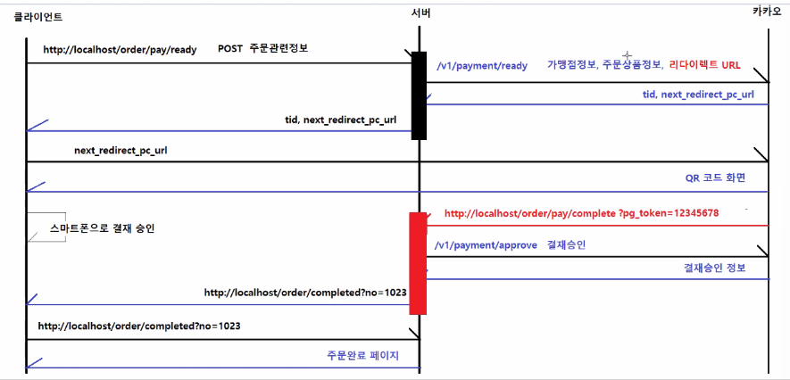

## 본문

### 1. kakaopay 사전 설명

    카카오페이 연동은 request를 2번(1. 결재요청, 2. 결재승인 후) 결재내역정보를 받아와야 한다.

    카카오페이와 카카오로그인은 연동하는 방법이 좀 다르다.
    - 카카오 로그인 : ajax를 이용해 클라이언트 js에서 연동
    - 카카오페이 : controller로 값을 보내 클라이언트가 아닌 서버단에서 통신을 해야한다.

    그 이유는 cors 정책 때문이다.

### CORS(Cross-Origin Resource Sharing)

    : browser에서 다른 domain 간 요청을 제한하는 보안 기능.

    ● cors 동작 원리

    1. 프리플라이트 요청(Preflight Request) 

    일부 요청(POST, PUT, DELETE 메서드를 사용하는 경우)은 실제 요청 전에 OPTIONS 메서드를 사용해 서버에 프리플라이트 요청을 보낸다.
    이 요청을 통해 서버가 CORS를 허용할지 확인하는데, 서버가 특정 출저에서 온 요청을 허용할 경우 응답헤더에(Access-Controller-Allow-Origin)을 포함하여 응답한다.

    2. 서버 응답

    서버가 응답할 때, Access-Control-Allow-Origin 헤더로 허용할 출처를 명시하면, 브라우저는 해당 출처에서의 요청을 허용하고 차단을 해제한다.
    만약 이 헤더가 설정되지 않거나 불일치하면 브라우저는 요청을 차단

    외부서버에서 ajax 요청을 했을 때, cors라는 정책 위반 이슈가 발생한다.
    웹페이지에서 ajax를 동일서버에 요청하는 건 괜찮지만 외부서버에 요청하는 순가 동일 origin이 아니기 때문에 이 요청을 거부하는 보안관련 이슈가 생긴다.

### Q. 카카오로그인은 웹페이지(JSP)에서 외부서버로 ajax요청을 해도 왜 cors 이슈(ajax 요청거부)가 발생하지 않는가?

    - 카카오 로그인 API는 CORS 문제 없이 웹페이지에서 AJAX 요청을 통해 사용할 수 있도록 미리 CORS를 허용해 둔다.

    - 사용자의 로그인 정보를 인증하기 위한 API이기 때문에, 이를 쉽게 사용할 수 있도록 카카오 측에서 CORS를 열어놓고 웹페이지의 AJAX 요청을 허용하고 있다.

    - 다만, 돈과 관련된 api는 보안이슈로 인해 cors를 닫아놓기 때문에 우회해서 요청해야 한다.

### Q. CORS 설정을 우회하는 이유

    보안이 강화된 API는 프론트엔드에서 직접 접근이 불가능하므로, 일반적으로 백엔드 서버에서 중계하여 처리하는 방식이 사용된다.
    백엔드에서 외부 API에 요청을 보내고, 그 결과를 받아 웹페이지에 전달하는 방식으로 우회하는 것이다.

    웹페이지에서 ajax요청을 동일서버에 보내고 그 안에있는 controller/service에서 외부서버에 요청을 보내서 우회하면 cors에 걸리지 않는다.

    - 이럴 때 사용하는 HttpUrlController 객체 / Spring : RestTemplate 객체
    (RestTemplate가 json데이터를 바로 java객체로 변환해주기 떄문에 더 편리, 응답을 바로 object로 맵핑해준다. postForObject)
    
### 2. 카카오 페이 결재 구현 과정

    ● 결재과정 3가지

    1. 결재요청 준비.
    2. 결재요청
    3. 결재승인

    ● 클라이언트 - 서버 - 카카오(외부서버) 데이터 흐름

    1. 클라이언트에서 서버로 주문관련정보를 POST로 던진다.
    2. 서버는 Controller에서 그 값을 받아 카카오 승인요청 url로 던져준다.
    3. 카카오는 승인과 동시에 다음 결재과정의 url과 tid(결재코드)을 서버로 던져주고 서버는 클라이언트에 url을 던진다.
    4. 클라이언트는 그 url로 qr코드 결재 화면에 접근한다.
    5. 결재처리가 되면 카카오에서 우리 서버 controller의 결재 url로 token 값을 보내준다.
    6. 서버는 그 토큰과 처음에 받았던 tid로 결재승인을 요청하고 결재승인 정보를 받아온다.
    7. 주문성공페이지 url을 클라이언트에 보내고 클라이언트는 그 페이지를 서버에 요청한다.
    8. 서버가 주문완료 페이지를 클라이언트에 보내준다.
    (주문완료 페이지가 없다면 ajax에서 결재내역페이지로 보내도 된다.)

### 3. ajax, VO, Service, Controller

    ● ajax

    // 카카오 결재
    $(function(){
        $("#btn-kakao-pay").click(function(){

            // 필수입력 값을 확인
            var name = $("#form-payment input[name='pay-name']").val();
            var tel = $("#form-payment input[name='pay-tel']").val();
			var email = $("#form-payment input[name='pay-email']").val();

            // 필수입력 값 검증
            if (name == "") {
                $("#form-payment input[name='pay-name']").focus()
            }
            if (tel == "") {
				$("#form-payment input[name='pay-tel']").focus()
			}
			if (email == "") {
				$("#form-payment input[name='pay-email']").focus()
			}

            // 결재 정보를 form에 저장.
            let totalPayPrice = parseInt($("#total-pay-price").text().replace(/,/g,''))
            let totalPrice = parseInt($("#total-price").text().replace(/,/g,''))
            let discountPrice = totalPrice - totalPayPrice
            let usePoint = $("#point-use").val()
            let useUserCouponNo = $(":radio[name='userCoupon']:checked").val()

            // 카카오페이 결재전송
            $.ajax({
                type :'get',
                url : '/order/pay',
                data : {
                    total_amount : totalPayPrice,
                    payUserName : name,
                    sumPrice : totalPrice,
                    discountPrice : discountPrice,
                    totalPrice : totalPrice,
                    tel : tel,
                    email : email.
                    usePoint :usePoint,
                    useCouponNo : useUserCouponNo
                },
                success : function(response) {
                    location.href = response.next_redirect_pc_url
                }
            })
        })
    })

    ● VO (결재요청VO, 결재승인요청VO, 결재내역VO)

    1. 결재요청 VO

    public class ReadyResponse {

        private String tid;                     // 결제 고유 번호
        private String next_redirect_pc_url;    // 결제 완료 시, 이동할 페이지
        private String partner_order_id;        // 주문한 사람 ID
    }

    2. 결재승인요청 VO

    public class ApproveResponse {

        private String aid;                     // 요청 고유번호
        private String tid;                     // 결제 고유번호
        private String cid;                     // 가맹점 코드
        private String sid;                     // 정기 결제용 
        private String partner_order_id;        // 주문 번호 
        private String partner_user_id;         // 주문자명 
        private String payment_method_type;     // 결제수단 (CARD/CASH)
        private String item_name;               // 상품명
        private String item_code;               // 상품 코드
        private int quantity;                   // 상품 수량
        private String created_at;              // 결제 준비 요청 시각
        private String approved_at;             // 결제 승인 시각
        private String payload;                 // HTTP 요청 시, 전달되는 데이터
        private Amount amount;                  // 전체 결제 금액(비과세 + 부가세 + 사용한 포인트 + 할인금액)    
    }

    3. 결재내역 VO

    public class Amount {

        private int total;      // 전체 결제 금액
        private int tax_free;   // 비가세
        private int vat;        // 부가세
        private int point;      // 포인트
        private int discount;   // 할인금액
    }

### Service

    @Slf4j
    @Service
    public class KakaoPayService {

        @Autowired
        private CartMapper cartMapper;

        public ReadyResponse payReady(int totalAmount) {

            User user = (User)SessionUtils.getAttribute("LOGIN_USER");
            List<CartDto> carts = cartMapper.getCartByUserNo(user.getNo());
        }
    }

