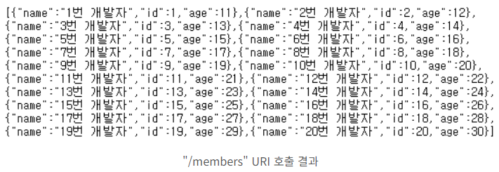
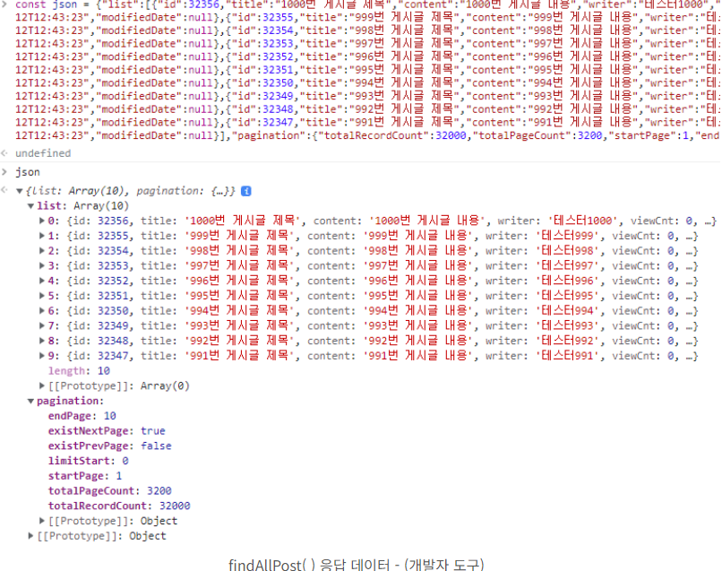
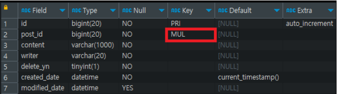

## 본문

### REST 란?
    REST는 "Representational State Transfer"의 약어로, 하나의 URI는 하나의 고유한 리소스를 대표하도록 설계된다는 개념이다. 
    스마트폰과 태블릿 등 서버에 접근하는 디바이스의 종류가 다양해지고 있기에 디바이스의 종류에 상관없이 "공통으로 데이터를 처리할 수 있도록 하는 방식"을 REST라고 한다.

    우리는 지금까지 게시판을 구현하면서 컨트롤러에서 서비스를 호출하고, 사용자가 필요로 하는 데이터를 view로 전달한 후 HTML을 리턴해주는 형태로 진행해왔다. REST API는 사용자가 어떠한 요청을 했을 때 HTML을 리턴하지 않고, Javascript를 이용해서 사용자가 필요로 하는 결과(data)만을 리턴해주는 방식이다.

### 구성
    쉽게 말해 REST API는 다음의 구성으로 이루어져있다.
    - 자원(RESOURCE) : URI
    - 행위(Verb) : HTTP METHOD
    - 표현(Representations)

### 특징
    1) Uniform (유니폼 인터페이스)
    Uniform Interface는 URI로 지정한 리소스에 대한 조작을 통일되고 한정적인 인터페이스로 수행하는 아키텍처 스타일을 말합니다.

    2) Stateless (무상태성)
    REST는 무상태성 성격을 갖습니다. 다시 말해 작업을 위한 상태정보를 따로 저장하고 관리하지 않습니다. 
    "세션 정보나 쿠키정보를 별도로 저장하고 관리하지 않기 때문에 API 서버는 들어오는 요청만을 단순히 처리하면 됩니다." 
    때문에 서비스의 자유도가 높아지고 서버에서 불필요한 정보를 관리하지 않음으로써 구현이 단순해집니다.

    3) Cacheable (캐시 가능)
    REST의 가장 큰 특징 중 하나는 HTTP라는 기존 웹표준을 그대로 사용하기 때문에, 웹에서 사용하는 기존 인프라를 그대로 활용이 가능합니다. 따라서 HTTP가 가진 캐싱 기능이 적용 가능합니다. HTTP 프로토콜 표준에서 사용하는 Last-Modified태그나 E-Tag를 이용하면 캐싱 구현이 가능합니다.

    4) Self-descriptiveness (자체 표현 구조)
    REST의 또 다른 큰 특징 중 하나는 REST API 메시지만 보고도 이를 쉽게 이해 할 수 있는 자체 표현 구조로 되어 있다는 것입니다.

    5) Client - Server 구조
    REST 서버는 API 제공, 클라이언트는 사용자 인증이나 컨텍스트(세션, 로그인 정보)등을 직접 관리하는 구조로 각각의 역할이 확실히 구분되기 때문에 "클라이언트와 서버에서 개발해야 할 내용이 명확해지고 서로간 의존성이 줄어들게 됩니다."

    6) 계층형 구조
    REST 서버는 다중 계층으로 구성될 수 있으며 보안, 로드 밸런싱, 암호화 계층을 추가해 구조상의 유연성을 둘 수 있고 PROXY, 게이트웨이 같은 네트워크 기반의 중간매체를 사용할 수 있게 합니다.

### REST API 디자인 가이드
    - REST API 설계 시 가장 중요한 항목은 다음의 2가지로 요약할 수 있습니다.
    1. URI는 정보의 자원을 표현해야 한다.
        ex)  
            GET /members/delete/1

      위와 같은 방식은 REST를 제대로 적용하지 않은 URI입니다. URI는 자원을 표현하는데 중점을 두어야 합니다. delete와 같은 행위에 대한 표현이 들어가서는 안됩니다.

    2. 자원에 대한 행위는 HTTP Method(GET, POST, PUT, DELETE)로 표현한다.
       위의 잘못 된 URI를 HTTP Method를 통해 수정해 보면
        ex)
            DELETE /members/1

    3. '/' 슬래시 구분자는 계층 관계를 나타내는 데 사용
        ex)
            http://restapi.example.com/houses/apartments

    4. '/' 슬래시 구분자는 URI 마지막 문자로 포함하지 않는다.
        ex)
            http://restapi.example.com/houses/apartments/ (X)

    5. 밑줄(_)은 URI에 사용하지 않는다.
    6. URI 경로에는 소문자가 적합하다.
       URI 경로에 대문자 사용은 피하도록 해야 한다. 대소문자에 따라 다른 리소스로 인식하기 때문이다.
        ex)
            RFC 3986 is the URI (Unified Resource Identifier) Syntax document

    7. 파일 확장자는 URI에 포함하지 않는다.
        ex)
            http://restapi.example.com/members/soccer/345/photo.jpg (X)        

       REST API에서는 메시지 바디 내용의 포맷을 나타내기 위한 파일 확장자를 URI 안에 포함시키지 않는다. Accept header를 사용하자.
        ex)
            GET / members/soccer/345/photo HTTP/1.1 Host: restapi.example.com Accept: image/jpg 
    
    8. 리소스 간의 관계를 표현하는 방법
       REST 리소스 간에는 연관 관계가 있을 수 있고, 이런 경우 다음과 같은 표현방법으로 사용한다.
        ex)
            /리소스명/리소스 ID/관계가 있는 다른 리소스명
            GET : /users/{userid}/devices 
            (일반적으로 소유 ‘has’의 관계를 표현할 때)

### HTTP 응답 상태 코드
    마지막으로 응답 상태코드를 간단히 살펴보도록 하겠습니다. 
    잘 설계된 REST API는 URI만 잘 설계된 것이 아닌 그 리소스에 대한 응답을 잘 내어주는 것까지 포함되어야 합니다. 
    정확한 응답의 상태코드만으로도 많은 정보를 전달할 수가 있기 때문에 응답의 상태코드 값을 명확히 돌려주는 것은 생각보다 중요한 일이 될 수도 있습니다. 혹시 200이나 4XX관련 특정 코드 정도만 사용하고 있다면 처리 상태에 대한 좀 더 명확한 상태코드 값을 사용할 수 있기를 권장하는 바입니다.            

    ● 상태코드
    200 : 클라이언트의 요청을 정상적으로 수행함
    201 : 클라이언트가 어떠한 리소스 생성을 요청, 해당 리소스가 성공적으로 생성됨(POST를 통한 리소스 생성 작업 시)

    400 : 클라이언트의 요청이 부적절 할 경우 사용하는 응답 코드
    401 : 클라이언트가 인증되지 않은 상태에서 보호된 리소스를 요청했을 때 사용하는 응답 코드
          (로그인 하지 않은 유저가 로그인 했을 때, 요청 가능한 리소스를 요청했을 때)
    403 : 유저 인증상태와 관계 없이 응답하고 싶지 않은 리소스를 클라이언트가 요청했을 때 사용하는 응답 코드
          (403 보다는 400이나 404를 사용할 것을 권고. 403 자체가 리소스가 존재한다는 뜻이기 때문에)
    405 : 클라이언트가 요청한 리소스에서는 사용 불가능한 Method를 이용했을 경우 사용하는 응답 코드      

    301 : 클라이언트가 요청한 리소스에 대한 URI가 변경 되었을 때 사용하는 응답 코드
          (응답 시 Location header에 변경된 URI를 적어 줘야 합니다.)         
    500 : 서버에 문제가 있을 경우 사용하는 응답 코드

### REST 방식의 데이터 처리    
    
    ● @ResponseBody

    @Controller 
    public class RestApiTestController {

        @GetMapping("/members")
        @ResponseBody // public @ResponseBody List<Map<String, Object>> findAllMember()와 같이 리턴 타입 앞에도 선언 가능
        public List<Map<String, Object>> findAllMember() {

            List<Map<String, Object>> members = new ArrayList<>();

            for (int i = 1; i <= 20; i++) {
                Map<String, Object> member = new ArrayList<>();
                member.put("id", i);
                member.put("name", i + "번 개발자");
                member.put("age", 10 + i);
                members.add(member);
            }

            return members;
        }
    }

    - findAllMember() 가 return 하는 members 데이터가 출력됩니다.
    

    - Controller 메서드에 @ResponseBody가 붙으면, 스프링의 Message Converter에 의해 화면(HTML)이 아닌 return 타입에 해당하는 데이터 자체를 return.

    ● @RestController
    클래스 레벨에 선언할 수 있으며, @RestController가 붙은 컨트롤러의 모든 메서드에는 자동으로 @ResponseBody가 적용된다.

    @RestController
    @RequiredArgsConstructor
    public class RestApiTestController {

        private final PostService postService;

        @GetMapping("/post")
        public PagingResponse<PostResponse> findAllPost() {
            return postService.findAllPost(new SearchDto());
        }
    }

    브라우저에서 해당 주소로 접속해 보면, 객체 배열인 "list"에는 각각의 게시글 데이터가 담겨있고, "pagination"에는 계산된 페이지 정보가 담겨있는 걸 확인할 수 있다.

    참고로, 홤녀에 출력된 결과 데이터를 개발자 도구의 console에서 변수로 선언한 후 출력하면 다음과 같은 구조로 확인이 가능하다.

### RESTful API의 Response는 어떤 형식
    restful api 응답 형식에는 표준이 존재하지는 않다.
    표준은 존재하지 않지만 response 형식은 크게 2가지 형태로 사용된다.

    ● HTTP Status Code + JSON Body를 사용.

    // GET 요청으로 단일 데이터를 가져올 때
    HTTP/1.1 200
    Content-Type : application/json
    {
        "id": 11,
        "title" : "Effective Java",
        "contents" : "Java Platform Best Practices Guide"
    }    

    // POST 요청으로 데이터를 생성한 결과
    HTTP/1.1 201
    Location : /v1/book/11
    Content-Type : application/json
    {
        "messaeg" : "The Book was created suceessfully"
    }

    ● JSON Body만 사용하는 방식 (HTTP Status Code는 항상 200)
    두 번째 방식은 HTTP 상태 코드를 항상 200으로 응답하며, json body 만을 통해 성공 또는 오류 응답을 판단하고, 해당되는 데이터를 함께 반환하는 방식이다.

    //GET 요청으로 단일 데이터를 가져올 때
    {
        "status" : "success",
        "data" : {
                "id" : 1,
                "title" : "Another blog post"
        }
    }

    //일반적인 에러가 발생했을 때
    {
        "status" : "fail",
        "message" : "fail message"
    }

    //필드 에러가 발생했을 때
    {
        "status" : "fail",
        "message" : "fail message",
        "errors" : [{error1}, {error2} ... ]
    }

    //Exception이 발생했을 때
    {
        "status" : "error",
        "message" : "custom message"
    }

### REST API의 댓글 CRUD 처리
    게시판에 댓글 기능을 구현해 보고, Mapper, Service에 댓글 CRUD 로직을 작성해 두고, @RestController와 jQuery의 Ajax를 이용해서 비동기 방식의 화면(HTML) 처리를 진행.

    1. 댓글 테이블 구조
    
    column              설명
    id              : 댓글 테이블의 PK로 댓글 번호.
    post_id         : 댓글 테이블의 FK로 댓글과 연결되는 게시글 번호.
    content         : 댓글 내용.
    writer          : 댓글 작성자.
    delete_yn       : 댓글 삭제 여부.
    created_date    : 댓글 생성일시.
    modified_date   : 댓글 최종 수정일시.

    2. 댓글 테이블 생성하기
    
    create table tb_comment (
        id bigint not null auto_increament comment '댓글 번호(PK)',
        post_id bigint not null comment '게시글 번호(FK)',
        content varchar(1000) not null comment '내용',
        writer varchar(20) not null comment '작성자',
        delete_yn tinyint(1) not null comment '삭제 여부',
        created_date datetime not null default CURRENT_TIMESTAMP comment '생성일',
        modified_date datetime comment '최종 수정일시',
        primary key(id)
    ) comment '댓글';

    3. 제약 조건(Constrain) 추가하기
    
    1) 제약 조건 생성
    게시글 (tb_post)과 댓글(tb_comment)은 각각 1:N의 관계가 되어야 하며, 관계를 매핑해 주기 위해 테이블에 FK 제약 조건을 추가해야 한다.

       - alert table tb_comments add constraint fk_post_comment foreign key(post_id) references tb_post(id);

    2) 테이블 구조 확인
    이제 테이블 구조를 확인해 보면 post_id에 추가된 제약 조건을 확인할 수 있따. 테이블 구조 확인은 다음의 명령어들을 이용하면 된다.

        2가지 테이블 구조 확인 명령어
       - show full columns from tb_comment; 
       - desc tb_comment; 

    3) 제약 조건 조회
    스크립트를 실행해서 DB(스키마)에 제약 조건이 정상적으로 추가되었는지 확인

        select * 
            from information_schema.table_constraints
            where table_name = 'tb_comment';

    추가적으로, 특정 테이블이 아닌 DB의 모든 제약 조건을 확인하고 싶을 때는 조건절에 table_schema = '스키마 이름'을 입력해 주면 된다.

    4) 댓글 요청 클래스 생성
    INSERT, UPDATE에 사용할 요청 클래스를 생성, 댓글도 게시판과 마찬가지로
    Request, Response 클래스를 분리해서 데이터를 처리.

    @Getter
    @NoArgsConstructor(access = AccessLevel.PROTECTED)
    public class CommentRequest {

        private Long id;           // 댓글 번호 (PK)
        private Long postId;       // 게시글 번호 (FK)
        private String content;    // 내용
        private String writer;     // 작성자

    }

    ● 참고
    @NoArgsConstructor(access = AccessLevel.PROTECED)

    - 클래스의 기본 생성자를 만들어주고, access 속성을 이용해서 객체 생성을 portected로 제한한다.
    
    - 요청 클래스의 각 멤버 변수는 HTML의 form 태그에 선언된 필드(input, textarea 등)의 name 값을 기준으로 파라미터를 전송하며, 전송된 파라미터는 요청 클래스의 set() 메서드에 의해 값이 매핑된다.
    
    하지만, 일반적인 REST API 방식에서는 데이터를 등록/수정 할 때 form 자체를 전송하지 않고, key-value 구조로 이루어진 JSON이라는 문자열 포맷으로 데이터를 전송하기 때문에 set() 메서드가 필요하지 않다.
    (파일 전송하는 경우는 제외)

    - 정리하자면, JSON이라는 포맷으로 데이터를 전달한다.

    5) 댓글 응답 클래스 생성
    @Getter
    public class CommentResponse {

        private Long id;                    // 댓글 번호 (PK)
        private Long postId;                // 게시글 번호 (FK)
        private String content;             // 내용
        private String writer;              // 작성자
        private Boolean deleteYn;           // 삭제 여부
        private LocalDateTime createdDate;  // 생성 일시
        private LocalDateTime modifiedDate; // 최종 수정일시
    } 

    6) 댓글 Mapper 인터페이스 생성
    @Mapper
    public interface CommentMapper {

        /**
         *  댓글 저장
         *  @param params - 댓글 정보
         */
        void save(CommentRequest params);

        /**
         *  댓글 상세정보 조회
         *  @param id - (PK)
         *  @return 댓글 상세 정보
         */ 
        CommentResponse findById(Long id);

        /**
         *  댓글 수정
         *  @param params - 댓글 정보
         */
        void update(CommentRequest params);

        /**
         *  댓글 삭제
         *  @param id - PK
         */
        void deleteById(Long id);

        /**
         *  댓글 리스트 조회
         *  @param postId - 게시글 번호 (FK)
         *  @return 댓글 리스트
         */
        List<CommentResponse> findAll(Long postId);

        /**
         * 댓글 수 카운팅
         * @param postId - 게시글 번호 (FK)
         * @return 댓글 수
         */
        int count(Long postId);

    }

    7) 댓글 MyBatis XML Mapper 생성
    <?xml version="1.0" encoding="UTF-8"?>
    <!DOCTYPE mapper PUBLIC "-//mybatis.org//DTD Mapper 3.0//EN" "http://mybatis.org/dtd/mybatis-3-mapper.dtd">

    <mapper namespace="com.study.domain.comment.CommentMapper">

        <!-- tb_comment 테이블 전체 컬럼 -->
        <sql id="commentColumns">
                id,
                post_id,
                content,
                writer,
                delete_yn,
                created_date,
                modified_date
        </sql>

        <!-- 댓글 저장 -->
        <insert id="save" parameterType="com.study.domain.comment.          
                          CommentRequest" useGeneratedKeys="true"        
                          keyProperty="id">
            INSERT INTO tb_comment (
                <include refid="commentColumns" />
            ) VALUES (
                #{id},
                #{postId},
                #{content},
                #{writer},
                0,
                Now(),
                NULL        
            ) 
        </insert>

        <!-- 댓글 상세정보 조회 -->                                      
        <select id="findById" parameterType="long" resultType="com.study.domain.comment.CommentResponse">
            SELECT 
                <include refid="commentColumns" />
            FROM
                tb_comment
            WHERE
                id = #{value}                
        </select>

        <!-- 댓글 수정 -->
        <update id="update" parameterType="com.study.domain.comment.CommentRequest">
            UPDATE tb_comment
            SET
                modified_date = NOW()
                , content = #{content}
                , writer = #{writer}
            WHERE
                id = #{id}
        </update>

        <!-- 댓글 삭제 -->
        <delete id="deleteById" parameterType="long">
            UPDATE tb_comment
            SET
                delete_yn = 1
            WHERE
                id = #{id}
        </delete>

        <!-- 댓글 리스트 조회 -->
        <select id="findAll" parameterType="long" resultType="com.study.domain.comment.CommentResponse">
            SELECT
                <include refid="commentColumns" />
            FROM
                tb_comment
            WHERE
                delete_yn = 0
                AND post_id = #{value}
            ORDER BY 
                id DESC
        </select>

    </mapper>

    8) 댓글 Service 클래스 생성
    @Service
    @RequiredArgsConstructor
    public class CommentService {

        private final CommentMapper commentMapper;

        /**
         *  댓글 저장
         *  @param params - 댓글 정보
         *  @return Generated PK
         */
        @Transactional
        public Long saveComment(final CommentRequest params) {
            commentMapper.save(params);
            return params.getId();
        }

        /**
         * 댓글 상세정보 조회
         * @param id - PK
         * @return 댓글 상세정보
         */
        public CommentResponse findCommentById(final Long id) {
            return commentMapper.findById(id);
        }

        /**
         * 댓글 수정
         * @param params - 댓글 정보
         * @return PK
         */
        @Transactional
        public Long updateComment(final CommentRequest params) {
            commentMapper.update(params);
            return params.getId();
        }

        /**
         * 댓글 삭제
         * @param id - PK
         * @return PK
         */
        @Transactional
        public Long deleteComment(final Long id) {
            commentMapper.deleteById(id);
            return id;
        }

        /**
         * 댓글 리스트 조회
         * @param postId - 게시글 번호 (FK)
         * @return 특정 게시글에 등록된 댓글 리스트
         */
        public List<CommentResponse> findAllComment(final Long postId) {
            return commentMapper.findAll(postId);
        }

    }

