## 본문

### REST 란?
    REST는 "Representational State Transfer"의 약어로, 하나의 URI는 하나의 고유한 리소스를 대표하도록 설계된다는 개념이다. 
    스마트폰과 태블릿 등 서버에 접근하는 디바이스의 종류가 다양해지고 있기에 디바이스의 종류에 상관없이 "공통으로 데이터를 처리할 수 있도록 하는 방식"을 REST라고 한다.

    우리는 지금까지 게시판을 구현하면서 컨트롤러에서 서비스를 호출하고, 사용자가 필요로 하는 데이터를 view로 전달한 후 HTML을 리턴해주는 형태로 진행해왔다. REST API는 사용자가 어떠한 요청을 했을 때 HTML을 리턴하지 않고, Javascript를 이용해서 사용자가 필요로 하는 결과(data)만을 리턴해주는 방식이다.

### 구성
    쉽게 말해 REST API는 다음의 구성으로 이루어져있다.
    - 자원(RESOURCE) : URI
    - 행위(Verb) : HTTP METHOD
    - 표현(Representations)

### 특징
    1) Uniform (유니폼 인터페이스)
    Uniform Interface는 URI로 지정한 리소스에 대한 조작을 통일되고 한정적인 인터페이스로 수행하는 아키텍처 스타일을 말합니다.

    2) Stateless (무상태성)
    REST는 무상태성 성격을 갖습니다. 다시 말해 작업을 위한 상태정보를 따로 저장하고 관리하지 않습니다. 
    "세션 정보나 쿠키정보를 별도로 저장하고 관리하지 않기 때문에 API 서버는 들어오는 요청만을 단순히 처리하면 됩니다." 
    때문에 서비스의 자유도가 높아지고 서버에서 불필요한 정보를 관리하지 않음으로써 구현이 단순해집니다.

    3) Cacheable (캐시 가능)
    REST의 가장 큰 특징 중 하나는 HTTP라는 기존 웹표준을 그대로 사용하기 때문에, 웹에서 사용하는 기존 인프라를 그대로 활용이 가능합니다. 따라서 HTTP가 가진 캐싱 기능이 적용 가능합니다. HTTP 프로토콜 표준에서 사용하는 Last-Modified태그나 E-Tag를 이용하면 캐싱 구현이 가능합니다.

    4) Self-descriptiveness (자체 표현 구조)
    REST의 또 다른 큰 특징 중 하나는 REST API 메시지만 보고도 이를 쉽게 이해 할 수 있는 자체 표현 구조로 되어 있다는 것입니다.

    5) Client - Server 구조
    REST 서버는 API 제공, 클라이언트는 사용자 인증이나 컨텍스트(세션, 로그인 정보)등을 직접 관리하는 구조로 각각의 역할이 확실히 구분되기 때문에 "클라이언트와 서버에서 개발해야 할 내용이 명확해지고 서로간 의존성이 줄어들게 됩니다."

    6) 계층형 구조
    REST 서버는 다중 계층으로 구성될 수 있으며 보안, 로드 밸런싱, 암호화 계층을 추가해 구조상의 유연성을 둘 수 있고 PROXY, 게이트웨이 같은 네트워크 기반의 중간매체를 사용할 수 있게 합니다.

### REST API 디자인 가이드
    - REST API 설계 시 가장 중요한 항목은 다음의 2가지로 요약할 수 있습니다.
    1. URI는 정보의 자원을 표현해야 한다.
        ex)  
            GET /members/delete/1

      위와 같은 방식은 REST를 제대로 적용하지 않은 URI입니다. URI는 자원을 표현하는데 중점을 두어야 합니다. delete와 같은 행위에 대한 표현이 들어가서는 안됩니다.

    2. 자원에 대한 행위는 HTTP Method(GET, POST, PUT, DELETE)로 표현한다.
       위의 잘못 된 URI를 HTTP Method를 통해 수정해 보면
        ex)
            DELETE /members/1

    3. '/' 슬래시 구분자는 계층 관계를 나타내는 데 사용
        ex)
            http://restapi.example.com/houses/apartments

    4. '/' 슬래시 구분자는 URI 마지막 문자로 포함하지 않는다.
        ex)
            http://restapi.example.com/houses/apartments/ (X)

    5. 밑줄(_)은 URI에 사용하지 않는다.
    6. URI 경로에는 소문자가 적합하다.
       URI 경로에 대문자 사용은 피하도록 해야 한다. 대소문자에 따라 다른 리소스로 인식하기 때문이다.
        ex)
            RFC 3986 is the URI (Unified Resource Identifier) Syntax document

    7. 파일 확장자는 URI에 포함하지 않는다.
        ex)
            http://restapi.example.com/members/soccer/345/photo.jpg (X)        

       REST API에서는 메시지 바디 내용의 포맷을 나타내기 위한 파일 확장자를 URI 안에 포함시키지 않는다. Accept header를 사용하자.
        ex)
            GET / members/soccer/345/photo HTTP/1.1 Host: restapi.example.com Accept: image/jpg 
    
    8. 리소스 간의 관계를 표현하는 방법
       REST 리소스 간에는 연관 관계가 있을 수 있고, 이런 경우 다음과 같은 표현방법으로 사용한다.
        ex)
            /리소스명/리소스 ID/관계가 있는 다른 리소스명
            GET : /users/{userid}/devices 
            (일반적으로 소유 ‘has’의 관계를 표현할 때)

### HTTP 응답 상태 코드
    마지막으로 응답 상태코드를 간단히 살펴보도록 하겠습니다. 
    잘 설계된 REST API는 URI만 잘 설계된 것이 아닌 그 리소스에 대한 응답을 잘 내어주는 것까지 포함되어야 합니다. 
    정확한 응답의 상태코드만으로도 많은 정보를 전달할 수가 있기 때문에 응답의 상태코드 값을 명확히 돌려주는 것은 생각보다 중요한 일이 될 수도 있습니다. 혹시 200이나 4XX관련 특정 코드 정도만 사용하고 있다면 처리 상태에 대한 좀 더 명확한 상태코드 값을 사용할 수 있기를 권장하는 바입니다.            

    ● 상태코드
    200 : 클라이언트의 요청을 정상적으로 수행함
    201 : 클라이언트가 어떠한 리소스 생성을 요청, 해당 리소스가 성공적으로 생성됨(POST를 통한 리소스 생성 작업 시)

    400 : 클라이언트의 요청이 부적절 할 경우 사용하는 응답 코드
    401 : 클라이언트가 인증되지 않은 상태에서 보호된 리소스를 요청했을 때 사용하는 응답 코드
          (로그인 하지 않은 유저가 로그인 했을 때, 요청 가능한 리소스를 요청했을 때)
    403 : 유저 인증상태와 관계 없이 응답하고 싶지 않은 리소스를 클라이언트가 요청했을 때 사용하는 응답 코드
          (403 보다는 400이나 404를 사용할 것을 권고. 403 자체가 리소스가 존재한다는 뜻이기 때문에)
    405 : 클라이언트가 요청한 리소스에서는 사용 불가능한 Method를 이용했을 경우 사용하는 응답 코드      

    301 : 클라이언트가 요청한 리소스에 대한 URI가 변경 되었을 때 사용하는 응답 코드
          (응답 시 Location header에 변경된 URI를 적어 줘야 합니다.)         
    500 : 서버에 문제가 있을 경우 사용하는 응답 코드

### REST 방식의 데이터 처리    
    
    ● @ResponseBody

    목적 : 컨트롤러 메서드가 반환하는 데이터를 HTTP 응답 Body(본문)으로 직접 전송할 때 사용한다.

    동작 방식 : 메서드가 반환하는 객체를 JSON 또는 XML과 같은 특정 포맷으로 직렬화(Serialize)하여 HTTP 응답 본문에 포함시킨다.

    사용 시점 : 주로 REST API에서 데이터를 클라이언트로 전송할 때 사용한다.

    ● @RequestBody

    목적 : HTTP 요청 본문에 담긴 데이터를 컨트롤러 메서드의 파라미터로 직접 전달할 때 사용.

    동작 방식 : 요청 본문에 있는 JSON, XML 등의 데이터를 자바 객체로 역직렬화 하여 메서드 파라미터에 바인딩한다.

    사용 시점 : 주로 클라이언트에서 데이터를 서버로 전송할 때 사용하며, 이 데이터가 요청 본문에 포함될 때 사용한다. 

        @Controller 
        public class RestApiTestController {

            @GetMapping("/members")
            @ResponseBody // public @ResponseBody List<Map<String, Object>> findAllMember()와 같이 리턴 타입 앞에도 선언 가능
            public List<Map<String, Object>> findAllMember() {

                List<Map<String, Object>> members = new ArrayList<>();

                for (int i = 1; i <= 20; i++) {
                    Map<String, Object> member = new ArrayList<>();
                    member.put("id", i);
                    member.put("name", i + "번 개발자");
                    member.put("age", 10 + i);
                    members.add(member);
                }

                return members;
            }
        }

    - findAllMember() 가 return 하는 members 데이터가 출력됩니다.
    

    - Controller 메서드에 @ResponseBody가 붙으면, 스프링의 Message Converter에 의해 화면(HTML)이 아닌 return 타입에 해당하는 데이터 자체를 return.

    ● @RestController
    클래스 레벨에 선언할 수 있으며, @RestController가 붙은 컨트롤러의 모든 메서드에는 자동으로 @ResponseBody가 적용된다.

        @RestController
        @RequiredArgsConstructor
        public class RestApiTestController {

            private final PostService postService;

            @GetMapping("/post")
            public PagingResponse<PostResponse> findAllPost() {
                return postService.findAllPost(new SearchDto());
            }
        }

    브라우저에서 해당 주소로 접속해 보면, 객체 배열인 "list"에는 각각의 게시글 데이터가 담겨있고, "pagination"에는 계산된 페이지 정보가 담겨있는 걸 확인할 수 있다.

    참고로, 홤녀에 출력된 결과 데이터를 개발자 도구의 console에서 변수로 선언한 후 출력하면 다음과 같은 구조로 확인이 가능하다.

### RESTful API Response는 어떤 형식
    restful api 응답 형식에는 표준이 존재하지는 않다.
    표준은 존재하지 않지만 response 형식은 크게 2가지 형태로 사용된다.

    ● HTTP Status Code + JSON Body를 사용.

        // GET 요청으로 단일 데이터를 가져올 때
        HTTP/1.1 200
        Content-Type : application/json
        {
            "id": 11,
            "title" : "Effective Java",
            "contents" : "Java Platform Best Practices Guide"
        }    

        // POST 요청으로 데이터를 생성한 결과
        HTTP/1.1 201
        Location : /v1/book/11
        Content-Type : application/json
        {
            "messaeg" : "The Book was created suceessfully"
        }

    ● JSON Body만 사용하는 방식 (HTTP Status Code는 항상 200)
    두 번째 방식은 HTTP 상태 코드를 항상 200으로 응답하며, json body 만을 통해 성공 또는 오류 응답을 판단하고, 해당되는 데이터를 함께 반환하는 방식이다.

    //GET 요청으로 단일 데이터를 가져올 때
    {
        "status" : "success",
        "data" : {
                "id" : 1,
                "title" : "Another blog post"
        }
    }

    //일반적인 에러가 발생했을 때
    {
        "status" : "fail",
        "message" : "fail message"
    }

    //필드 에러가 발생했을 때
    {
        "status" : "fail",
        "message" : "fail message",
        "errors" : [{error1}, {error2} ... ]
    }

    //Exception이 발생했을 때
    {
        "status" : "error",
        "message" : "custom message"
    }

### REST API 댓글 CRUD 처리
    게시판에 댓글 기능을 구현해 보고, Mapper, Service에 댓글 CRUD 로직을 작성해 두고, @RestController와 jQuery의 Ajax를 이용해서 비동기 방식의 화면(HTML) 처리를 진행.

    1. 댓글 테이블 구조
    
    column              설명
    id              : 댓글 테이블의 PK로 댓글 번호.
    post_id         : 댓글 테이블의 FK로 댓글과 연결되는 게시글 번호.
    content         : 댓글 내용.
    writer          : 댓글 작성자.
    delete_yn       : 댓글 삭제 여부.
    created_date    : 댓글 생성일시.
    modified_date   : 댓글 최종 수정일시.

    2. 댓글 테이블 생성하기
    
        create table tb_comment (
            id bigint not null auto_increament comment '댓글 번호(PK)',
            post_id bigint not null comment '게시글 번호(FK)',
            content varchar(1000) not null comment '내용',
            writer varchar(20) not null comment '작성자',
            delete_yn tinyint(1) not null comment '삭제 여부',
            created_date datetime not null default CURRENT_TIMESTAMP comment '생성일',
            modified_date datetime comment '최종 수정일시',
            primary key(id)
        ) comment '댓글';

    3. 제약 조건(Constrain) 추가하기
    
    1) 제약 조건 생성
    게시글 (tb_post)과 댓글(tb_comment)은 각각 1:N의 관계가 되어야 하며, 관계를 매핑해 주기 위해 테이블에 FK 제약 조건을 추가해야 한다.

       - alert table tb_comments add constraint fk_post_comment foreign key(post_id) references tb_post(id);

    2) 테이블 구조 확인
    이제 테이블 구조를 확인해 보면 post_id에 추가된 제약 조건을 확인할 수 있따. 테이블 구조 확인은 다음의 명령어들을 이용하면 된다.

        2가지 테이블 구조 확인 명령어
       - show full columns from tb_comment; 
       - desc tb_comment; 

    3) 제약 조건 조회
    스크립트를 실행해서 DB(스키마)에 제약 조건이 정상적으로 추가되었는지 확인

        select * 
            from information_schema.table_constraints
            where table_name = 'tb_comment';

    추가적으로, 특정 테이블이 아닌 DB의 모든 제약 조건을 확인하고 싶을 때는 조건절에 table_schema = '스키마 이름'을 입력해 주면 된다.

    4) 댓글 요청 클래스 생성
    INSERT, UPDATE에 사용할 요청 클래스를 생성, 댓글도 게시판과 마찬가지로
    Request, Response 클래스를 분리해서 데이터를 처리.

    @Getter
    @NoArgsConstructor(access = AccessLevel.PROTECTED)
    public class CommentRequest {

        private Long id;           // 댓글 번호 (PK)
        private Long postId;       // 게시글 번호 (FK)
        private String content;    // 내용
        private String writer;     // 작성자

    }

    ● 참고
    @NoArgsConstructor(access = AccessLevel.PROTECED)

    - 클래스의 기본 생성자를 만들어주고, access 속성을 이용해서 객체 생성을 portected로 제한한다.
    
    - 요청 클래스의 각 멤버 변수는 HTML의 form 태그에 선언된 필드(input, textarea 등)의 name 값을 기준으로 파라미터를 전송하며, 전송된 파라미터는 요청 클래스의 set() 메서드에 의해 값이 매핑된다.
    
    하지만, 일반적인 REST API 방식에서는 데이터를 등록/수정 할 때 form 자체를 전송하지 않고, key-value 구조로 이루어진 JSON이라는 문자열 포맷으로 데이터를 전송하기 때문에 set() 메서드가 필요하지 않다.
    (파일 전송하는 경우는 제외)

    - 정리하자면, JSON이라는 포맷으로 데이터를 전달한다.

    5) 댓글 응답 클래스 생성
    @Getter
    public class CommentResponse {

        private Long id;                    // 댓글 번호 (PK)
        private Long postId;                // 게시글 번호 (FK)
        private String content;             // 내용
        private String writer;              // 작성자
        private Boolean deleteYn;           // 삭제 여부
        private LocalDateTime createdDate;  // 생성 일시
        private LocalDateTime modifiedDate; // 최종 수정일시
    } 

    6) 댓글 Mapper 인터페이스 생성
    @Mapper
    public interface CommentMapper {

        /**
         *  댓글 저장
         *  @param params - 댓글 정보
         */
        void save(CommentRequest params);

        /**
         *  댓글 상세정보 조회
         *  @param id - (PK)
         *  @return 댓글 상세 정보
         */ 
        CommentResponse findById(Long id);

        /**
         *  댓글 수정
         *  @param params - 댓글 정보
         */
        void update(CommentRequest params);

        /**
         *  댓글 삭제
         *  @param id - PK
         */
        void deleteById(Long id);

        /**
         *  댓글 리스트 조회
         *  @param postId - 게시글 번호 (FK)
         *  @return 댓글 리스트
         */
        List<CommentResponse> findAll(Long postId);

        /**
         * 댓글 수 카운팅
         * @param postId - 게시글 번호 (FK)
         * @return 댓글 수
         */
        int count(Long postId);

    }

    7) 댓글 MyBatis XML Mapper 생성
    <?xml version="1.0" encoding="UTF-8"?>
    <!DOCTYPE mapper PUBLIC "-//mybatis.org//DTD Mapper 3.0//EN" "http://mybatis.org/dtd/mybatis-3-mapper.dtd">

    <mapper namespace="com.study.domain.comment.CommentMapper">

        <!-- tb_comment 테이블 전체 컬럼 -->
        <sql id="commentColumns">
                id,
                post_id,
                content,
                writer,
                delete_yn,
                created_date,
                modified_date
        </sql>

        <!-- 댓글 저장 -->
        <insert id="save" parameterType="com.study.domain.comment.          
                          CommentRequest" useGeneratedKeys="true"        
                          keyProperty="id">
            INSERT INTO tb_comment (
                <include refid="commentColumns" />
            ) VALUES (
                #{id},
                #{postId},
                #{content},
                #{writer},
                0,
                Now(),
                NULL        
            ) 
        </insert>

        <!-- 댓글 상세정보 조회 -->                                      
        <select id="findById" parameterType="long" resultType="com.study.domain.comment.CommentResponse">
            SELECT 
                <include refid="commentColumns" />
            FROM
                tb_comment
            WHERE
                id = #{value}                
        </select>

        <!-- 댓글 수정 -->
        <update id="update" parameterType="com.study.domain.comment.CommentRequest">
            UPDATE tb_comment
            SET
                modified_date = NOW()
                , content = #{content}
                , writer = #{writer}
            WHERE
                id = #{id}
        </update>

        <!-- 댓글 삭제 -->
        <delete id="deleteById" parameterType="long">
            UPDATE tb_comment
            SET
                delete_yn = 1   // (0 = 삭제x, 1 = 삭제o)
            WHERE
                id = #{id}
        </delete>

        <!-- 댓글 리스트 조회 -->
        <select id="findAll" parameterType="long" resultType="com.study.domain.comment.CommentResponse">
            SELECT
                <include refid="commentColumns" />
            FROM
                tb_comment
            WHERE
                delete_yn = 0
                AND post_id = #{value}
            ORDER BY 
                id DESC
        </select>

    </mapper>

    8) 댓글 Service 클래스 생성
    @Service
    @RequiredArgsConstructor
    public class CommentService {

        private final CommentMapper commentMapper;

        /**
         *  댓글 저장
         *  @param params - 댓글 정보
         *  @return Generated PK
         */
        @Transactional
        public Long saveComment(final CommentRequest params) {
            commentMapper.save(params);
            return params.getId(); // DB에서 자동 생성된 ID를 반환
        }

        /**
         * 댓글 상세정보 조회
         * @param id - PK
         * @return 댓글 상세정보
         */
        public CommentResponse findCommentById(final Long id) {
            return commentMapper.findById(id);
        }

        /**
         * 댓글 수정
         * @param params - 댓글 정보
         * @return PK
         */
        @Transactional
        public Long updateComment(final CommentRequest params) {
            commentMapper.update(params);
            return params.getId();
        }

        /**
         * 댓글 삭제
         * @param id - PK
         * @return PK
         */
        @Transactional
        public Long deleteComment(final Long id) {
            commentMapper.deleteById(id);
            return id;
        }

        /**
         * 댓글 리스트 조회
         * @param postId - 게시글 번호 (FK)
         * @return 특정 게시글에 등록된 댓글 리스트
         */
        public List<CommentResponse> findAllComment(final Long postId) {
            return commentMapper.findAll(postId);
        }

    }

### REST API 댓글 등록
    @RestController, jQuery, Ajax 를 이용해서 화면의 움직임(이동 또는 새로고침)없이 데이터를 주고받는 비동기 처리를 구현해 보자.

    1. 댓글 컨트롤러 클래스 생성
    REST Controller는 HTML이 아닌 데이터 자체를 리턴한다.
    댓글 데이터의 CRUD는 전부 게시글 상세 페이지에서 이루어지기 때문에 화면을 따로 구성할 필요 없이 데이터만 주고 받으면 된다.

    @RestController
    @RequiredArgConstructor
    public class CommentApiController {

        private final CommentService commentService;

        // 신규 댓글 생성
        PostMapping("/posts/{postId}/comments")
        public CommentResponse saveComment(@PathVariable final Long postId, @RequestBody final CommentRequest params) {
            Long id = commentService.saveComment(params);
            return commentService.findCommentById(id);
        }
    }

    ● GPT code

    @RestController
    @RequiredArgsConstructor
    @RequestMapping("/comments")
    public class CommentController {

        private final CommentService commentService;

        @PostMapping
        public ResponseEntity<Long> saveComment(@RequestBody CommentRequest params) {
            Long savedId = commentService.saveCommetn(params);
            return ResponseEntity.ok(savedId);
        }
    }

    2. 상세 페이지 - 댓글 작성 영역 추가하기
    댓글 CRUD는 모두 상세 페이지에서 처리되기 깨문에 view.html에 댓글 영역을 추가해야 된다. view.html의 content 영역에서 수정/삭제/뒤로 버튼을 감싸고 있는 
태그 뒤에 코드를 추가해보자.
    
    <!--/* 댓글 작성 */-->
    

        <fieldset>
            <legend class="skipinfo">댓글 입력</legend>
            

                
<textarea id="content" 
                             name="content" 
                             onkeyup="countingLength(this);" 
                             cols="90" rows="4" 
                             placeholder="댓글을 입력해 주세요.">
                             </textarea>

                
                <button type="button" class="btns" onclick="saveComment();">등 록</button> 
                <i id="counter">0/300자</i>
            

        </fieldset>
    

    3. 상세 페이지 - JS 함수 작성하기
    
    // 댓글에 입력된 글자 수를 카운팅, 300 초과하는 경우, 다시 문자열 추출해서 세팅
    function countingLength(content) {
        if (content.value.length > 300) {
            alert('댓글을 300자 이하로 입력해 주세요.');
            content.value = content.value.substring(0, 300);
            content.focus();
        }
        document.getElementById('counter').innerText = content.value.length + '/300자';
    }

    // DB 댓글 저장, 유효성 검사한 후 data 서버에 전달.
    function saveComment() {

        const content = document.getElementById('content');
        isValid(content, '댓글');

        const postId = [[ ${post.id} ]];
        const params = {
            postId : postId,
            content : content.value;
            writer : '홍길동'
        }

        $.ajax({
            url : '/posts/${postId}/comments',
            type : 'post',
            contentType : 'application/json; charset=utf-8', 
            dataType : 'json', 
            data : JSON.stringfy(params),
            async : false,  
            success : function (response) {
                console.log(response);
            },
            error : function (request, status, error) {
                console.log(error)
            }
        })
    }

    data : 
    서버로 전송할 데이터(파라미터)를 의미합니다. 우리는 생성할 댓글  정보를 params라는 이름의 객체(JSON)에 담아 서버로 전송하는데요. JSON.stringify( ) 함수로 params 객체를 JSON 문자열로 변환해서 전송합니다.

    async : 
    Ajax는 비동기 처리 방식이기 때문에 로직의 실행 순서를 보장할 수 없습니다. 해당 옵션의 기본 값은 "true"인데요. async를 "false"로 설정해주면  Ajax 내의 로직을 순차적으로 실행할 수 있습니다.쉽게 말해, true인 경우에는 서버에서 응답이 내려오지 않아도 다음 로직이 실행되고, false인 경우에는 서버에서 응답이 내려온 후에 다음 로직이 실행됩니다.

    4. 댓글 등록 테스트
    
    리스트 1페이지 최상단에 위치한 32,000번 게시글에 댓글을 등록.

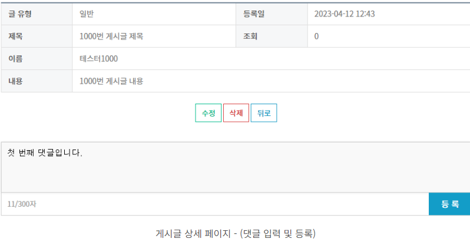    

    다음은 view.html의 saveComment()의 params와 JSON.stringify(params)를 브라우저 개발자 도구의 console에 출력해 보았다.

    서버로 데이터를 전송하는 시점에 JSON.stringify()를 이용해서 객체(params)를 JSON 문자열로 변경한다.

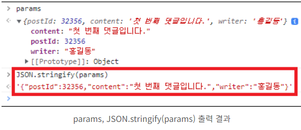

    서버에 요청을 보내면, @PathVariable 파라미터인 postId는 게시글의 PK(32356)를 수집하고, JSON 문자열로 넘어온 댓글 정보는 @RequestBody에 의해 CommentRequest 클래스의 객체인 params에 매핑됩니다.
    
    이때 JSON 문자열의 각 key와 클래스의 멤버 변수명은 동일해야 된다.

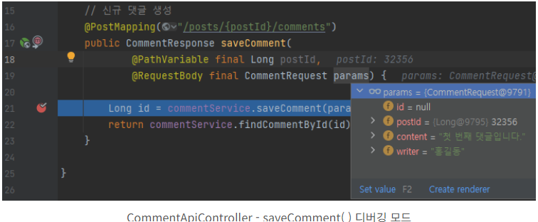    
    서버의 모든 로직이 실행되면 Ajax의 success() 함수가 실행되며, 생성된 게시글 정보가 브라우저 콘솔에 출력된다.

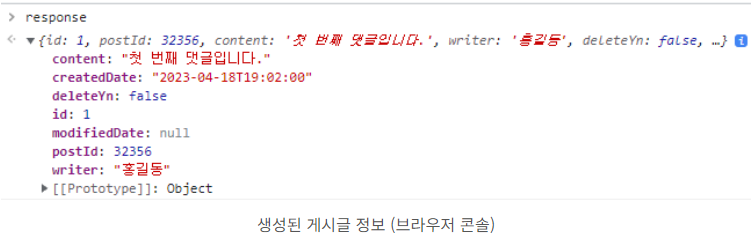    

    테이블에도 정상적으로 저장되었다.

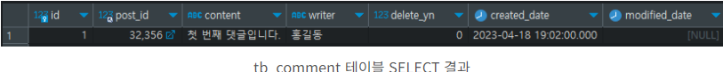    

### REST API 목록 기능
    게시글의 경우, 게시글의 생성/수정/삭제되는 시점에 리스트 페이지로 리다이렉트 하도록 처리했다.

    댓글은 등록/수정/삭제된 시섬에 페이지를 이동하거나 새로고침 하지 않고,
    테이블에서 SELECT 한 결과 데이터를 댓글 영역에 다시 렌더링 한다. 

    1. 댓글 API Controller - 메서드 추가하기

    // 댓글 리스트 조회
    @GetMapping("/posts/{postId}/comments")  
    public LiST<CommentResponse> findAllComment(@PathVariable final Long postId) {
        return commentService.findAllComment(postId); // ajax의 response
    }

    2. 상세 페이지 - 댓글 렌더링 영역 추가하기

    view.html의 content 영역에서 댓글 작성 영역(

)

    <!-- 댓글 렌더링 영역 -->
    

    3. 상세 페에지 - JS 함수 작성하기 & findAllComment() 함수 수정
    
    // 페이지가 로딩되는 시점에 단 한 번만 실행되는 함수.
    window.onload = () => {
        findAllComment();
    }

    // 전체 댓글 조회
    function findAllComment() {

        const postId = [[ ${post.id} ]];

        $.ajax({
            url : '/posts/${postId}/comments',
            type : 'GET',
            dataType : 'JSON',
            async : false,
            success : function (response) {
                console.log(response);

                // 1. 조회된 데이터가 없는 경우
                if (!response.length) {
                    document.querySelector('.cm_list').innerHTML = '

등록된 댓글이 없습니다.

';
                    return false;
                }

                // 2. 렌더링 할 HTML을 저장할 변수
                let commetnHtml = '';

                // 3. 댓글 HTML 추가
                response.forEach(row => {
                    commentHtml += '
                        

                            
                            

                                <em>${row.writer}</em>
                                ${dayjs(row.createdDate).format('YYYY-MM-DD HH:mm')}
                            

                            

${row.content}

                            

                                <button type="button" class="btns">수정</button>
                                <button type="button" class="btns">삭제</button>
                            

                        

                    ';    
                })

                // 4. class가 "cm_list"인 요소를 찾아 HTML을 렌더링
                document.querySelector('.cm_list').innerHTML = commentHtml;
            },
            error : function (request, status, error) {
                console.log(error)
            }
        })
    }

    success() 함수의 response는 CommentApiController의 findAllComment()가 리턴하는 List 타입의 객체배열입니다. 이제 response를 이용해서 댓글 HTML을 그린 후 화면에 렌더링해주면 된다.

    ● 참고 - 템플릿 리터럴 (Template Literals)
    동적으로 HTML 문자열을 생성하는 방식이다. 
    이 방법을 통해 HTML 콘텐츠를 문자열로 조합하여 페이지에 삽입할 수 있다.

    개요
    - 템플릿 리터럴은 Javascript에서 멀티라인 문자열과 문자열 삽입을 더 쉽게 할 수 있게 해주는 문법이다.

    - **백틱("")**을 사용해서 문자열을 감싸고, '${}' 구문을 통해 변수나 표현식을 문자열에 삽입할 수 있다.

    특징
    1. 멀티라인 문자열
       - 템플릿 리터럴을 사용하면 문자열을 여러 줄로 나눌 수 있다.
    2. 문자열 삽입
       - '${}' 구문을 사용하여 변수 값을 문자열에 삽입할 수 있다. 이는 문자열 연결보다 훨씬 간편하다.

       ex)  
       let productHtml = '';
       products.forEach(product => {
           productHtml += '
                

                    <h3>${produc.name}</h3>
                    
${product.description}

                    ${product.price}
                

            ';    
       });

    ● 템플릿 리터럴 사용
        - "---" (백틱으로 감싼 문자열) 안에서 HTML 코드를 작성하고, '${}'
        구문으로 product.name, product.descriptioin, product.price 와 같은 변수를 삽입한다.

    ● forEach 메서드
        - products 배열의 각 product 객체를 순회하며, 각 객체의 속성 값을 사용해 HTML 코드를 생성한다.
        
    ● HTML 문자열 생성
        - productHtml 문자열에 각 produc에 대한 HTML 코드가 누적된다.
        이 문자열은 나중에 innerHTML 속성을 통해 웹 페이지의 특정 요소에 삽입된다.

    템플릿 리터럴을 사용하면 HTML 콘텐츠를 동적으로 생성하고 삽입하는 작업이 더 간결하고 직관적으로 수행될 수 있다.    

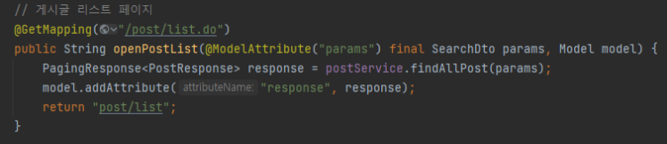

    게시글 리스트와 같은 동기 처리 방식은 컨트롤러에서 HTML으로 데이터를 전달해서 처리하지만, 비동기 처리 방식은 화면 내에서 ajax를 이용해 실시간으로 서버와 데이터를 주고 받을 수 있다.

    findAllComment()의 response.forEach()에서 row는 response에 담긴 각각의 댓글 객체를 의미한다. response를 순환하며 commentHtml에 댓글 HTML을 추가한 후 div.cm_list에 렌더링 한다.

    4. 댓글 조회 테스트
    
    상세 페이지에 접속한 후 F12를 눌러 브라우저 개발자 도구를 열어보면, console에 댓글(response)이 출력되는 것을 확인.

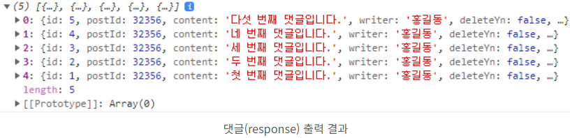

    5. saveComment() 출력 테스트

    이제, 게시글 상세 페이지로 접속해 보면 등록된 댓글이 출력되는 것을 확인.

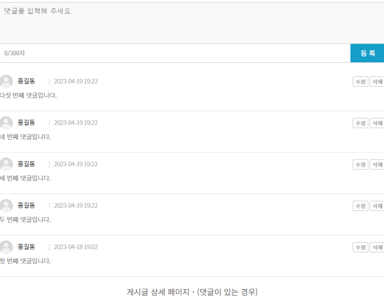

    다음은 등록된 댓글이 없는 경우.
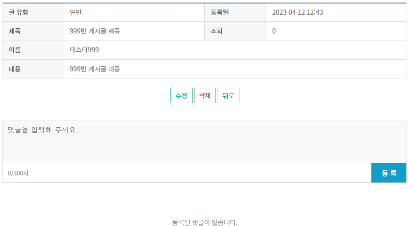

    마지막으로 댓글 저장 함수의 로직을 조감만 손봐주면 된다. 
    view.html의 saveComment()를 수정

    // 댓글 저장
    function saveComment() {

        const content = document.getElementById('content');
        isValid(content, '댓글');

        const postId = [[ ${post.id} ]];
        const params =  {
            postId : postId,
            content : content.value,
            writer : '홍길동'
        }

        $.ajax({
            url : '/posts/${postId}/comments',
            type : 'post',
            contentType : 'application/json; charset=utf-8',
            dataType : 'json',
            data : JSON.sringify(params),
            async : false,
            success : function (response) {
                alert('저장되었습니다.');
                content.value = '';
                document.getElemetById('counter').innerTest = '0/300자';
                findAllComment();
            },
            error : function (request, status, error) {
                console.log(error);
            }
        })
    }

    Ajax의 success()함수의 내부 로직만 변경되었다. 댓글 저장이 완료되면 사용자에게 저장 완료 메시지를 보여주고, 입력했던 댓글 내용과 입력된 자릿수를 초기화한 후 findAllComment()를 호출해서 화면에 댓글을 다시 렌더링 한다.

### 비동기 vs 동기 
    동기 처리 : 컨트롤러에서 데이터와 화면 두 가지를 동시에 처리,
    비동기 처리 : 화면 내에서 데이터의 처리(CRUD)를 실시간으로 서버에 요청.

    동기 방식은 화면의 움직임(페이지 이동 또는 새로고침)이 발생한다. 화면의 움직임은 HTML, CSS, JS 코드가 처음부터 끝까지 다시 렌더링을 하는 것을 의미.(리소스 낭비가 심하다.)

    반대로 비동기 방식의 장점은 페이지를 다시 로딩하지 않아도 된다.
    댓글의 경우, 서버에 필요한 데이터를 요청하고, Javascript로 HTML 코드를 직접 그린 후에 DOM에 코드를 렌더링 하는 방식이다.

    즉, 페이지를 처음부터 로딩하지 않고 최소한의 영역만 변경(리소스 낭비 적음, 속도 유리.)

### REST API 수정 기능 (Modal Layer Popup 이용)
    1. 댓글 API 컨트롤러 - 메서드 추가
    
    // 댓글 상세정보 조회
    @GetMapping("/posts/{postId}/comments/{id}")
    public CommentResponse findCommentById(@PathVariable final Long postId, @PathVariable final Long id) {
        return commentService.findCommentById(id);
    }
    
    - REST API 설계 규칙에서 Document에 해당되는 기능으로, 특정 게시글(postId)에 등록된 모든 댓글 중 PK(id)에 해당되는 댓글을 조회한다.
     
    - 댓글을 수정할 때 사용자에게 기존 댓글 정보를 보여주는 용도이다.

    // 기존 댓글 수정
    @PatchMapping("/posts/{postId}/comments/{id}")
    public CommentResponse updateComment(@PathVariable final Long postId, @PathVariable final Long id, @RequestBody final CommentRequest params) {
        commentService.updateComment(params);
        return commentService.findCommentById(id);
    }

    - 댓글 수정이 완료되면 수정된 댓글 정보(객체)를 리턴해준다.
    saveComment()와 마찬가지로 @RequestBody를 이용해서 JSON 문자열로 넘어오는 댓글 정보를 CommentRequest 객체의 각 멤버 변수에 매핑(바인딩)한다.

    2. 댓글 수정은 "Layer Popup" 또는 "Modal" 로 불리는 팝업을 사용.
    
    <!--/* 댓글 수정 popup */-->
    

        <h3>댓글 수정</h3>
        

            <table class="tb tb_row tl">
                <colgroup>
                    <col style="width:30%;" /><col style="width:70%;" />
                </colgroup>
                <tbody>
                    <tr>
                        <th scope="row">작성자필수 입력</th>
                        <td><input type="text" id="modalWriter" name="modalWriter" placeholder="작성자를 입력해 주세요." /></td>
                    </tr>
                    <tr>
                        <th scope="row">내용필수 입력</th>
                        <td><textarea id="modalContent" name="modalContent" cols="90" rows="10" placeholder="수정할 내용을 입력해 주세요."></textarea></td>
                    </tr>
                </tbody>
            </table>
            

                <button type="button" id="commentUpdateBtn" class="btns btn_st2">수정</button>
                <button type="button" class="btns btn_bdr2" onclick="closeCommentUpdatePopup();">취소</button>
            

        

        <button type="button" class="btn_close" onclick="closeCommentUpdatePopup();"><i class="far fa-times-circle"></i></button>
    

    3. Layer Popup - JS 함수 작성
    
    // 댓글 수정 팝업 open
    function openCommentUpdatePopup(id) {

        const postId = [[ ${post.id} ]];

        $.ajax({
            url : '/post/${postId}/comments/${id}',
            type : 'GET',
            dataType : 'JSON',
            async : false,
            success : function (response) {
                document.getElementById('modalWriter').value = response.writer;
                document.getElementById('modalContent').value = response.content;
                document.getElementById('commentUpdateBtn').setAttribute('onclick', `updateComment(${id})`);
                layerPop('commentUpdatePopup');
            },
            error : function (request, status, error) {
                console.log(error)
            }   
        })
    }

    // 댓글 수정 팝업 close
    function closeCommentUpdatePopup() {
        documnet.querySelectorAll('#modalContent, #modalWriter').forEach(element => element.value = '');
        document.getElementById('commentUpdateBtn').removeAttribute('onclick');
        layerPopclose('commentUpdatePopup');
    }

    - response : 서버에서 반환된 JSON 데이터이다. 댓글 정보(ex_ 작성자, 내용) 포함.
    
    ● Modal vs popup
    - popup은 방문자가 특정 페이지에 '접속할 때 바로 뜨는 창'으로, 홈 화면, 메뉴, 상품 페이지 등 원하는 페이지에서 팝업창이 뜨도록 지정.

    - modal은 방문자가 '특정 버튼 또는 링크를 클릭'했을 때 뜨는 창으로, 페이지 내에서 추가적인 정보를 보여주고 싶을 때 활용.
  
    ● openCommentUpdatePopup() 
    - findCommentById()를 호출해서 댓글 상세정보를 조회한다.
    success() 함수의 response는 URI의 id에 해당되는 단일 댓글 객체이다.

    - layer popup의 작성자와 내용에 기존 댓글 정보를 보여주고, 수정 버튼에 updateComment() 함수를 클릭 이벤트로 바인딩한다.
    모든 댓글은 PK(id)를 기준으로 UPDATE 되기 떄문에, 팝업이 열리는 시점에 수정 버튼에 댓글의 id를 전달해 주어야 한다.
    
    ● closeCommentUpdatePopup()
    - layer popup의 작성자와 내용을 초기화하고, 수정 버튼에 바인딩된 클릭 이벤트를 제거한 후 팝업을 닫는다.

    - layerPopclose() 함수도 마찬가지로 기존에 comment.js에 선언되어 있던 함수로, 화면에 레이어 팝업을 닫는 기증을 한다.

    4. findAllComment() 함수 수정

    각 댓글의 수정 버튼을 클릭했을 때 레이어 팝업이 오픈될 수 있도록 수정 버튼에 클릭 이벤트를 선언해 주어야 한다. 
    view.html의 findAllComment()에서 commentHtml에 그리는 버튼을 변경.

        

            <button type="button" onclick="openCommentUpdatePopup(${row.id});" class="btns">수정</spab></button>
            <button type="button" class="btns">삭제</button>
        

    5.  댓글 목록의 수정 버튼 클릭
    
    이제, 상세 페이지에서 댓글 수정 버튼을 클릭해 보면 레이어 팝업에 기존 댓글 정보가 출력이 된다.
    
    

    다음은 레이어 팝업 수정 버튼이다. 댓글 목록에서 수정을 클릭하면 실행되는 openCommentUpdatePopup() 함수에 의해 onclick 이벤트로 udpateComment()가 바인딩되며, 뒤에서 해당 함수를 이용해 댓글 정보를 수정한다.
    
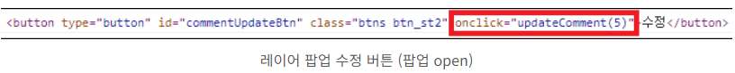

    레이어 팝업 우측 상단의 X 또는 취소 버튼을 클릭하면 closeCommentUpdatePopup() 함수에 의해 onclick 이벤트가 제거 된다.
    
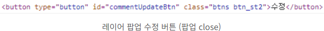    

    6. updateComment() 함수 작성하기
    
    마지막으로, view.html에 레이어 팝업의 수정 버튼을 클릭했을 때 실행되는 updateComment() 함수를 작성해보자.

    // 댓글 수정
    function udpateComment(id) {

        const writer = document.getElementById('modalWriter');
        const content = document.getElementById('modalContent');
        isValid(writer, '작성자');
        isValid(content, '내용');

        const postId = [[ ${post.id} ]];
        const params = {
            id : id,
            postId : postId,
            content : content.value,
            writer : writer.value
        }
    

        $.ajax({
            url : `/posts/${postId}/comments/${id}`,
            type : 'patch',
            contentType : 'application/json; charset=utf-8',
            dataType : 'json',
            data : JSON.stringify(params), 
            async : false,
            success : function (response) {
                alert('수정되었습니다.');
                closeCommentUpdatePopup();
                findAllComment();
            },
            error : function (request, status, error) {
                console.log(error)
            } 
        })
    }

    - stringify - javascript 값을 JSON 문자열로 변환
    - 함수는 파라미터로 댓글의 id를 전달받아 서버로 함께 전송된다.

### 정리
    웹 사이트에서 팝업은 대표적으로 윈도우 팝업과 이번에 사용한 레이어 팝업으로 나뉜다. 
    윈도우 팝업은 사이즈 조절이 가능하며 창을 마음대로 이동할 수 있으나, 레이어 팝업은 창 컨트롤이 불가능하다는 특징이 있다.

    실무에서는 두 가지 팝업 모두를 자주 사용하게 된다. 
    윈도우 팝업은 부모창과 자식창 간의 데이터 전달이 레이어 팝업에 비해 까다롭기 때문에 개인적으로 레이어 팝업 사용을 지향하는 편이다. 

### REST API 삭제 기능    
    1. 댓글 API 컨트롤러 - 메서드 추가
    
    // 댓글 삭제
    @DeleteMapping("/posts/{postId}/comments/{id}")
    public Long deleteComment(@PathVariable final Long postId,          @PathVariable final Long id) {
        return commentService.deleteComment(id);
    }

    - REST API 설계 규칙에서 Document에 해당되는 기능으로, 특정 게시글(postId)에 등록된 모든 댓글 중 PK(id)에 해당되는 댓글을 삭제한다.
    삭제 프로세스가 완료되면 삭제 된 PK(id)를 리턴한다.

    2. findAllComment() 함수 수정

    상세 페이지의 댓글은 findAllComment()를 이용해서 출력하며, 각 댓글의 삭제 버튼을 클릭 했을 때 기능이 작동하도록 클릭 이벤트를 선언해 주어야 한다. view.html의 findAllComment()에서 commentHtml에 그리는 삭제 버튼에 onclick 이벤트를 추가.

    <button type="button" onclick="deleteComment(${row.id});" class="btns">삭제</button>

    3. deleteCommet() 함수 작성

    // 댓글 삭제
    function deleteComment(id) {

        if (!confirm('선택하신 댓글을 삭제할까요?') ) {
            return false;
        }

        const postId = [[ ${post.id} ]];

        $.ajax({
            url : 'posts/${postId}/comments/${id}',
            tyep : 'delete',
            dataType : 'json',
            async : false,
            success : function (response) {
                alert('삭제되었습니다.');
                findAllComment();
            },
            error : function (request, status, error) {
                console.log(error)
            }
        })
    }

    - CommentApiController의 deleteComment()를 호출해서 댓글을 삭제 처리한다. 게시글과 마찬가지로 delete_yn 칼럼의 상태값을 변경하는 논리 삭제 방식이며, 삭제가 완료된 후 findAllComment()로 댓글을 다시 조회.

    4. Indent depth (들여쓰기)를 줄이는 코딩

    코딩에 도움이 되는 팁이다. deleteComment()에서 삭제 여부를 확인한느 if문의 confirm에 not(!)을 붙여 "취소"가 클릭이된 경우에는 로직이 종료되도록 "return false" 처리를 했다.

    아래 코드는 if문 안에서 메인 로직이 실행되는 구조이다.
    우리가 작성한 로직은 Indent depth가 1이지만, 아래 코드는 indent가 1 증가했으니 indent depth는 총 2가 된다.

    // 댓글 삭제
    function deleteComment(id) {
        if (confirm('선택하신 댓글을 삭제할까요?')) {
            const postId = [[ ${post.id} ]];
            $.ajax({
                url : '/posts/${postId}/comments/${id}',
                type : 'delete',
                dataType : 'json',
                async : false,
                success : function (response) {
                    alert('삭제되었습니다.');
                    findAllComment();
                },
                error : function (request, status, eror)
            })
        }
    }

    다음의 두 함수는 같은 기능을 하는 함수이다. printNumber1()은 indent depth가 3이고, printNumber2()는 indent depth가 1이다. 누가 봐도 뒤의 코드가 훨씬 깔끔하다.

    function printNumber1() {
        if (1 === 1) {
            if (2 === 2) { // Indent 1 증가 (depth : 1)
                for (let i = 0; i <= 10; i++) { // Indent depth 1 증가 (depth : 2)
                    console.log(i); // Indent 1 증가 (depth : 3)
                }
            }
        }
    }

    function printNumber2() {
        if (1 !== 1 || 2 !== 2) {
            return false; // Indent 1 (depth : 1)
        }
        for (let i = 0; i <= 10; i++) {
            console.log(i); // Indent 1 (depth : 1)
        }
    }

    이렇듯 함수(메서드)의 로직을 작성할 때 함수가 종료되어야 하는 예외 조건을 앞쪽에 선언해 두고, 메인 로직이 실행되는 구조로 코딩 연습을 해야 한다.

