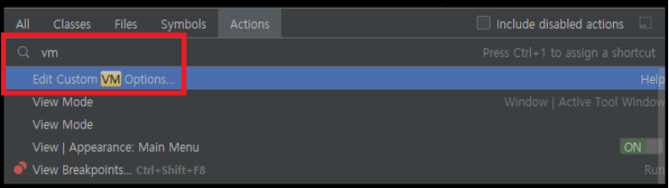
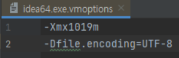
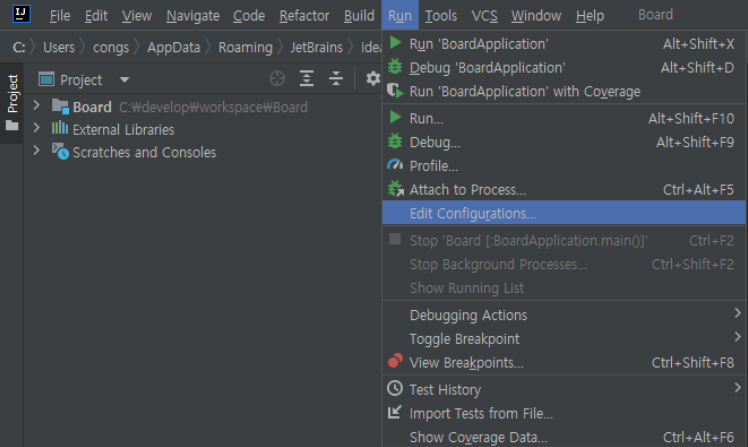
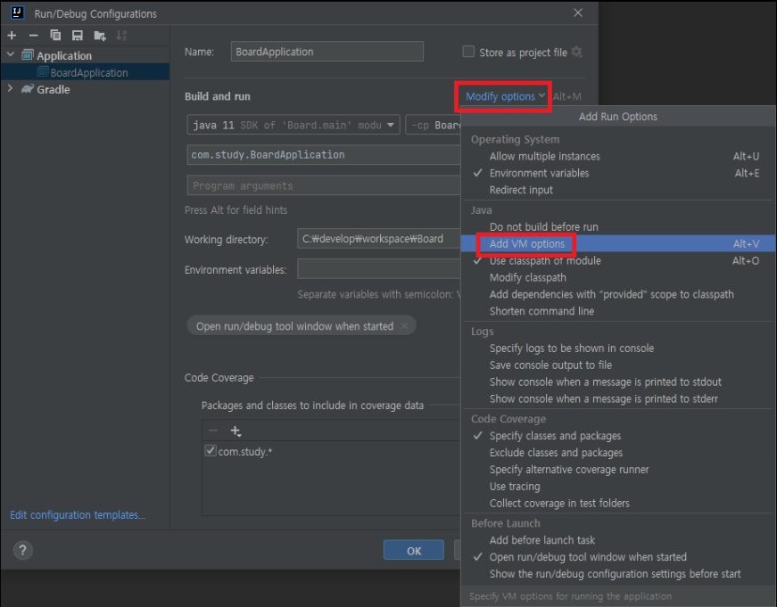
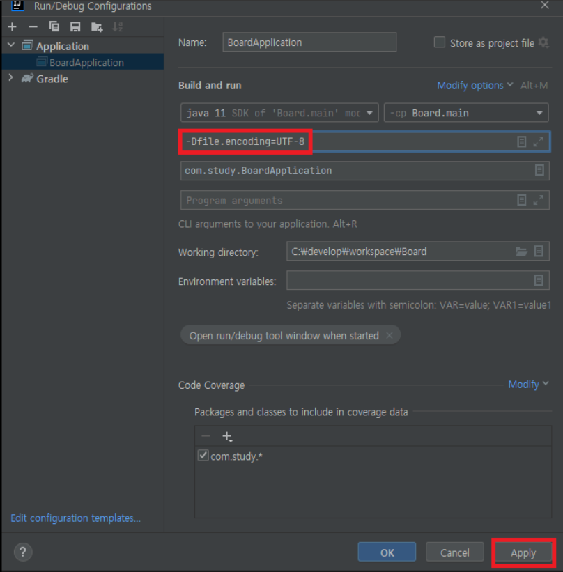
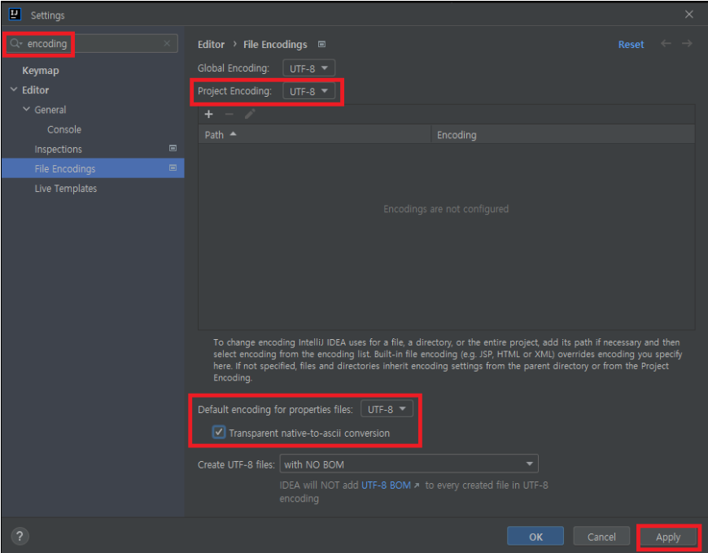
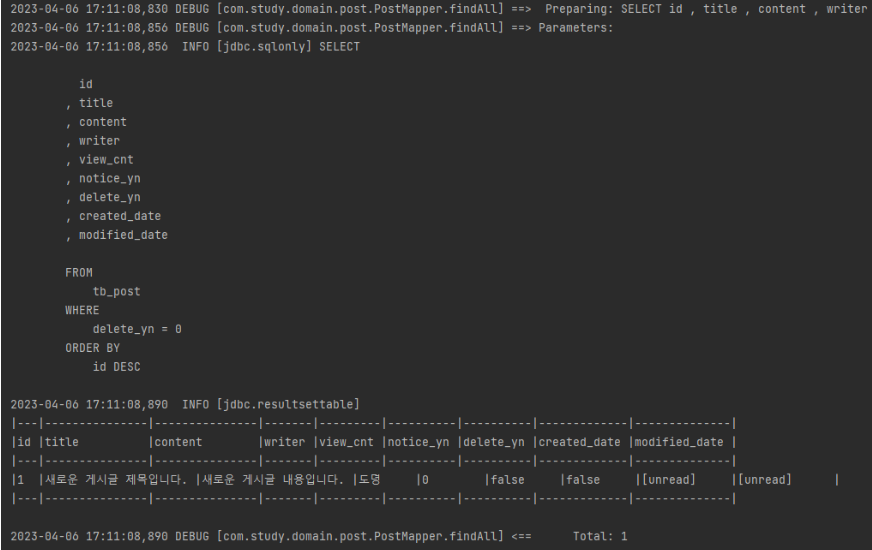
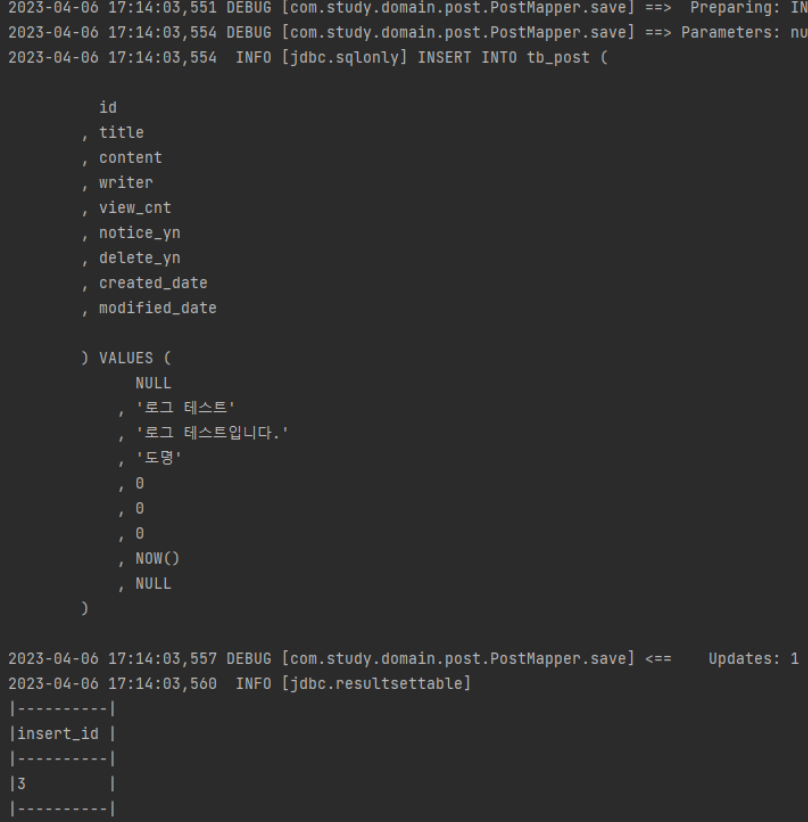

## 본문

### Logback을 이용한 SQL 쿼리 로그 출력하기
    resources directory - logback-spring.xml을 추가.

    <?xml version="1.0" encoding="UTF-8"?>
    <configuration debug="true">

        <!-- Appenders -->
        <appender name="console" class="ch.qos.logback.core.ConsoleAppender">
            <encoder>
                <charset>UTF-8</charset>
                <Pattern>%d %5p [%c] %m%n</Pattern>
            </encoder>
        </appender>

        <appender name="console-infolog" class="ch.qos.logback.core.ConsoleAppender">
            <encoder>
                <charset>UTF-8</charset>
                <Pattern>%d %5p %m%n</Pattern>
            </encoder>
        </appender>

        <!-- Logger -->
        <logger name="com.study" level="DEBUG" appender-ref="console" />
        <logger name="jdbc.sqlonly" level="INFO" appender-ref="console-infolog" />
        <logger name="jdbc.resultsettable" level="INFO" appender-ref="console-infolog" />

        <!-- Root Logger -->
        <root level="off">
            <appender-ref ref="console" />
        </root>
    </configuration>

    - appender : 전달받은 로그를 어디에 출력할지 결정(콘솔 출력, 파일 저장, DB 저장 등)
    - encoder : appender에 포함되어 출력할 로그의 형식을 지정한다.
    - logger : 로그를 출력하는 요소로, level 속성을 통해 출력할 로그의 레벨을 조절하여 appender에 전달한ㄷ. 첫 번째 logger에서 com.study는 java 디렉토리의 java 패키지 경로를 의미한다.

    ● log level
    fatal : 아주 심각한 에러가 발생한 상태.
    error : 요청을 처리하던 중 문제가 발생한 상태.
    warn : 프로그램 실행에는 문제가 없지만, 나중에 시스템 에러의 원인이 될 수 있는 경고성 메시지를 나타낸다.
    info : 어떠한 상태 변경과 같은 정보성 메시지를 나타낸다.
    debug : 개발 시에 디버그 용도로 사용하는 메시지.
    trace : 디버그 레벨이 너무 광범위한 것을 해결하기 위해 좀 더 상세한 이벤트.

### Log4JDBC 라이브러리 추가하기
    콘솔에 SQL 쿼리가 출력되긴 하지만, 한눈에 알아보기 힘든 문제가 있다.
    쿼리 로그가 깔끔하게 정렬된 상태로 출력되고, 쿼리에 대한 추가적인 정보를 제공받을 수 있도록 Log4JDBC를 추가해보자.    

    - implementation 'org.bgee.log4jdbc-log4j2:log4jdbc-log4j2-jdbc4.1:1.16'  /* Log4JDBC */

### UTF-8 Encoding 설정
    intellij에서 Ctrl + Shift + A를 누르고, Actions 탭에 vm을 검색한 후 가장 상단의 Edit Custom VM Options를 클릭.

    - 파일이 열리면, 다음의 설정을 추가.

    - 내장 톰캣(Embedded Tomcat) VM 옵션 추가.

    - 창이 열리면, 우측 상단의 Modify options - Add VM options 클릭.
    

    - VM options 항목이 추가되면 마찬가지로 다음의 설정을 추가해 주세요.
    

    - properties 파일 인코딩 설정
    SQL 쿼리 정렬을 설정하기 위해서는 properties 파일이 필요하다. IDE에서 properties 파일 인코딩이 설정되어 있지 않으면 문제가 발생한다. 설정창에서 "encoding"을 검색한 후 다음과 같이 설정.

### log4jdbc.log4j2.properties 추가
    resources directory log4jdbc.log4j2.properties file 추가하고, 코드 작성
    - log4jdbc.spylogdelegator.name=net.sf.log4jdbc.log.slf4j.      Slf4jSpyLogDelegator
    - log4jdbc.dump.sql.maxlinelength=0

### jdbc-url 과 driver-class-name 변경
    - spring.datasource.hikari.driver-class-name=net.sf.log4jdbc.sql.jdbcapi.DriverSpy
    - spring.datasource.hikari.jdbc-url=jdbc:log4jdbc:mariadb://localhost:3306/board?serverTimezone=Asia/Seoul&useUnicode=true&characterEncoding=utf8&useSSL=false&allowPublicKeyRetrieval=true
    - spring.datasource.hikari.username=username
    - spring.datasource.hikari.password=password
    - spring.datasource.hikari.connection-test-query=SELECT NOW() FROM dual

### 인텔리제이 및 애플리케이션 재실행
    VM 옵션을 확실히 적용하기 위해 IDE와 애플리케이션을 재실행한 후 다시 게시글 리스트로 접속해보면, IDE console에 query 로그와 함께 게시글 정보가 테이블 형태로 출력된다.    

    - 게시글을 생성하는 INSERT 커리도 정상적으로 파라미터가 매핑되어 출력된다.

   

### 정리
    SQL query log 출력은 개발 단계에서 너무나도 필수적인 기능이다.
    디버깅 모드와 함께 사용하면 문제를 더욱 효율적으로 해결 가능하다.

    

    
   

