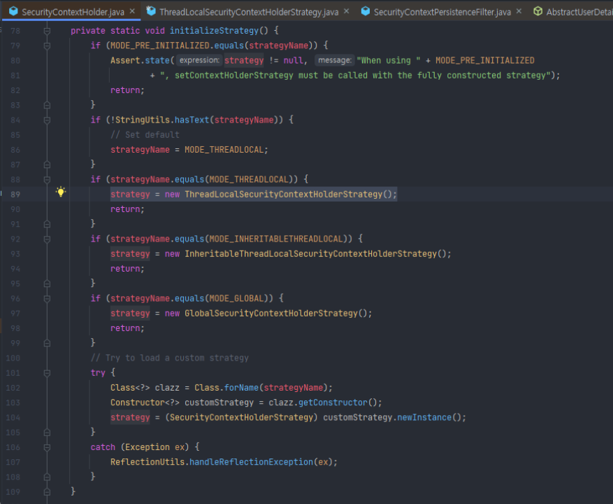
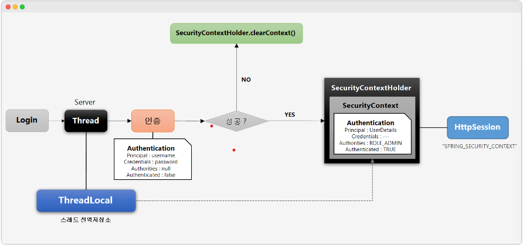

## 본문

### 개요

    우리가 인증을 수행하고 나면 스프링 시큐리티 내에서는 인증 결과(= authentication token)를 SecurityContext라는 곳에 저장하여, 전역적으로 사용이 가능하도록 한다.

    그렇다면 대체 SecurityContext 및 SecurityContextHolder의 구조가 어떤지 알고, 이게 스프링 시큐리티 내부의 어느 필터에서 사용되는지를 알아야 한다.

    SecurityContext, SecurityContextHolder 클래스에 대해 알아보자.

### 1. SecurityContext

    - Authentication 객체가 저장되는 보관소
    - SecurityContextHolder는 strategy에 따라 SecurityContext의 저장 방식이 다름
    - 하지만 일반적으로는 ThreadLocal 에 저장.
    - 덕분에 코드 어디서나 Authentication 을 꺼내서 사용가능.
    - 추가적으로 인증이 완료되면 세션에도 저장됨.
  
    ● 참고
    ThreadLocal : 쓰레드마다 갖는 고유한 저장공간

### 2. SecurityContextHolder

    - SecurityContext 를 감싸는(저장하는) 객체
    - (일반적으로) SecurityContext 저장을 위한 ThreadLocal 를 갖고 있는 객체
    - SecurityContext 객체의 저장 방식(전략 Strategy)을 지정
        - MODE_THREADLOCAL : 스레드당 SecurityContext 객체를 할당, 기본값
        - MODE_INHRIATBLETHREADLOCAL : 메인, 자식 스레드에서 동일한 SecurityContext 사용.
        - MODE_GLOBAL : 프로그램에서 딱 하나의 SecurityContext 만 저장.
    - 각 전략에 따른 전략 클래스가 존재하며, SecurityContextHolder의 메소드 대부분이 이 전략 클래스의 인스턴스에게 작업을 위임하는 형태로 동작한다. 
    - SecurityContextHolder.clearContext() : 기존 SecurityContext 정보 초기화
    
    ● 참고

    Authentication
    - 인증 : 당신이 누구인지 증명
    - 사용자의 인증정보를 저장하는 토큰 개념(구현체 : UsernamePasswordAuthenticationToken)
    - 인증 요청 시, Authentiation 객체에 id/password를 담고 인증 검증을 거친다.
    - 인증 후 최종 인증 결과는 (User 객체, 권한 정보를)담고 SecurityContextHodler에 저장되어 전역적으로 잠조 가능.
            
    Authentication authentication
            = SecurityContextHolder.getContext().getAuthoritication();

    SecurityContextHolder 의 java document 를 읽어보면 앞에 이런 문구가 있다.
        
    - "이 클래스는 다양한 static 메소드를 제공하고, 해당 메소드들은 내부적으로 SecurityContextHolderStrategy 에게 위임처리를 한다."

    즉, SecurityContextHolder 의 실제 일처리는 SecurityContextHolderStrategy 가 한다는 것을 알 수 있다.
    그래서 SecurityContextHolder 초기화 시, initalizeStrategy 메소드가 호출되고, 내부적으로 SecurityContextHolderStrategy 를 결정하게 된다.

    이때 어떤 모드로 세팅했는지에 따라 달라지는데, 기본값은 MODE_THREADLOCAL 모드이기 때문에 아무 설정을 안하면 ThreadLocalSecurityContextHolderStrategy 를 사용한다.

    이름 그대로 스레드로컬을 사용해서 SecurityContext를 보관하는 전략이다.

### 인증 프로세스와 저장소

 

    1. 로그인 시도
    2. 요청을 받는 스레드 하나 생성
    3. 해당 스레드의 고유한 저장소인 ThreadLocal 이 존재
    4. 인증을 실패하면 SecurityContextHolder.clearContext()
    5. 인증에 성공하면 SecurityContextHolder -> SecurityContext 에 인증 토큰 저장
    6. HttpSession 에도 SecurityContext 저장

