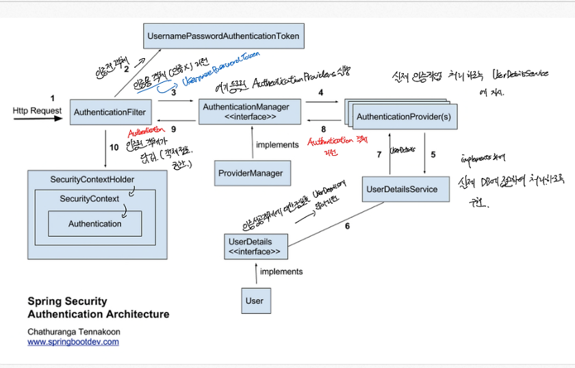
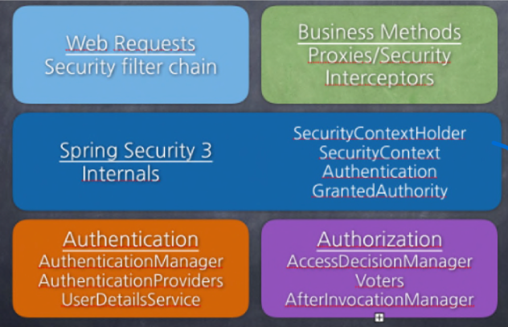

## 본문

## Spring Security

    - Spring Security는 Spring 기반의 애플리케이션의 보안(인증과 권한, 인가 등)을 담당하는 스프링 하위 프레임워크이다.

    - Spring Security는 '인증', '권한'에 대한 부분을 Filter 흐름에 따라 처리한다.

    - Spring Security는 기본적으로 인증(로그인) 절차를 거친 후, 인가(접근 권한) 절차를 진행.

    - 이 때 기본적으로 인증과 인가를 위해 Principal(접근 주체)을 아이디로, Credential(비밀번호)을 비밀번호로 사용하는 Credential 기반의 인증방식을 사용한다.

    ● Filter vs Interceptor

    - Filter : HTTP Request -> WAS -> Filter -> Servlet -> COntroller
               (컨트롤러, Dispatcher Servlet에 가기 전에 적용되므로 가장 먼저 URL 요청을 받는다.(웹 컨테이너에서 관리))

    - Interceptor : HTTP Request -> WAS -> Servlet -> Spring Interceptor -> Controller
                    (Dispatcher Servlet과 Controrller 사이에 위치(스프링 컨테이너에서 관리))

    ● Spring Security Architecure flow

    1. HTTP 요청을 하면, AuthenticationFilter가 요청을 가로챈다.

    2. Filter에서 UsernamePasswordAuthenticationToken에게 인증 전, 객체를 전달하여 인증용 객체(UsernamePasswordToken)을 생성한다.

    3. 필터에서 AuthenticationManager에 객체(UsernamePasswordToken)에 전달.

    4. 구현한 AuthenticationManager에 등록된, AuthenticationProvider를 찾아서 객체(UsernamePasswordToken) 전달.

    5. UserDetailsService에서 실제 DB에 접근하여, 인증 절차를 id와 password로 검증.

    6. DB에 있는 유저라면 (인증에 성공), 인증 성공 객체에 대한 정보(id, password, account, expired, human, lock, enable)와 session을 UserDetails에 담아 return.

    7. AuthenticationProvider에서 UserDetails를 넘겨받아 사용자 정보를 비교.

    8. 인증이 완료되면, 권한 등의 사용자 정보를 담은 Authentication 객체가 return.

    9. 다시 최초에 AuthenticationFilter에 Authentication 객체가 return.   

    10. Authentication 객체를 SecurityContext에 저장.

## main module

    

### 1. ecurityContextHolder

    - 보안 주체의 세부정보 포함, 응용프로그램의 현재 SecurityContext에 대한 세부정보 저장
    - 기본적으로 SecurityContextHolder.MODE_INHERITABLETHREADLOCAL 방법.

    public class SecurityContextHolder {
 
        public static final String MODE_THREADLOCAL = "MODE_THREADLOCAL";
    
        public static final String MODE_INHERITABLETHREADLOCAL = "MODE_INHERITABLETHREADLOCAL";
    
        public static final String MODE_GLOBAL = "MODE_GLOBAL";
    
        private static final String MODE_PRE_INITIALIZED = "MODE_PRE_INITIALIZED";
    
        public static final String SYSTEM_PROPERTY = "spring.security.strategy";
    
    }

### 2. SecurityContext

    - Authentication을 보관(setAuthentication) 및 꺼내서 사용 가능(getAuthentication)

    public interface SecurityContext extends Serializable {

        Authentication getAuthentication();

        void setAuthentication(Authentication authentication);
    }

### 3. Authentication     

    - 현재 접근하는 주체의 정봐와 권한을 담는 인터페이스
    - Authentication 객체는 SecurityContext에 저장되며, SecurityContextHolder를 통해 SecurityContext에 접근하고, Authentication에 접근할 수 있다.

    public interface Authentication extends Principal, Serializable {
 
        Collection<? extends GrantedAuthority> getAuthorities();
        
        Object getCredentials();
        
        Object getDetails();
        
        Object getPrincipal();
        
        boolean isAuthenticated();
        
        void setAuthenticated(boolean isAuthenticated) throws IllegalArgumentException;
        
    }

### 4. GrantedAuthority

    - 현재 사용자(Principal)이 가지고 있는 권한을 의미하는 인터페이스.
    - 보통 ROLE_*의 형태로 사용하며, 보통 roles라고 한다.
    - UserDetailsService에 의해 불러올 수 있고 특정 자원에 대한 접근 권한 검사 및 허용 여부 결정.

    public interface GrantedAuthority extends Serializable {

        String getAuthority();
    }

## Authentication

### 1. AuthenticationManager

    - 실질적으로 인증에 대한 부분을 처리하는 역할(AuthenticationManager에 등록된 AuthenticationProvider에 의해 처리)

    - 인증이 성공하면 2번째 생성자를 이용해 인증이 성공한(isAuthenticated=true) 객체를 생성하여 SecurityContext에 저장.

    - 인증 실패 시, AuthenticationException 예외를 터뜨림.

    public interface AuthenticationManager {
 
        Authentication authenticate(Authentication authentication) throws AuthenticationException;
        
    }

### 2. AuthenticationProvider

    - 실제 인증에 대한 부분을 처리한다.

    - 인증 전의 Authentication 객체를 받아서 인증이 완료된 객체를 리턴하는 역할.

    - 이 인터페이스를 구현하여 Ioc하여, AuthenticationManager에 등록하여 사용하면 된다.

    public interface AuthenticationProvider {
	
        // 인증이 안된 Authentication 객체를 받아 인증된 Authentication 객체로 리턴 
        Authentication authenticate(Authentication authentication) throws AuthenticationException;
    
        boolean supports(Class<?> authentication);
    }

### 3. UserDetailsService

    - UserDetails 객체를 반환하는 메소드 loadUserByUsername(String var1)를 가짐.

    - 이를 구현한 클래스의 내부에 UserRepository를 주입받아 DB와 연결하여 처리. 

    public interface UserDetailsService {
 
        UserDetails loadUserByUsername(String var1) throws UsernameNotFoundException;
    
    }

### 3-1. UserDetails    

    public interface UserDetails extends Serializable {
 
 
        Collection<? extends GrantedAuthority> getAuthorities();
        
        String getPassword();
        
        String getUsername();
        
        boolean isAccountNonExpired();
        
        boolean isAccountNonLocked();
        
        boolean isCredentialsNonExpired();
        
        boolean isEnabled();
        
    }

    - 인증에 성공 후 생성된 객체 UserDetails는 Authentication 객체를 구현한 UsernamePasswordAuthenticationToken을 생성하기 위해 사용됩니다.

    - 인증에 성공한 객체에 대한 정보를 반환하는 메소드를 가지고 있다.
    
    ● 보통 이렇게 UserDetails를 implements하여 사용한다.

    // Security Session => Authentication => UserDetails(PrincipalDetails)
 
    public class PrincipalDetails implements UserDetails {

        private User user;
    
        public PrincipalDetails(User user) {
            this.user = user;
        }
    
        // 해당 User의 권한을 리턴하는 곳
        @Override
        public Collection<? extends GrantedAuthority> getAuthorities() {
            Collection<GrantedAuthority> collection = new ArrayList<>();
            collection.add(
                    new GrantedAuthority(){
                @Override
                public String getAuthority() {
                    return user.getRole();
                }
            });
            return collection;
        }
    
        @Override
        public String getPassword() {
            return user.getPassword();
        }
    
        @Override
        public String getUsername() {
            return user.getUsername();
        }
    
        // 계정 만료여부
        @Override
        public boolean isAccountNonExpired() {
            return true;
        }
    
        // 계정 잠김x 여부
        @Override
        public boolean isAccountNonLocked() {
            return true;
        }
    
        @Override
        public boolean isCredentialsNonExpired() {
            return true;
        }
    
        // 휴면 계정
        @Override
        public boolean isEnabled() {
    
            // 1년동안 로그인 안하면 휴면계정으로 하기로함
            // 현재시간 - 마지막로그인날짜 => 1년초과화면 false
            // else true
            return true;
        }
    }

### 4. UsernamePasswordAuthenticationToken     

    - UsernamePasswordAuthenticationToken은 Authnetication을 implements한 AbstractAuthenticationToken의 하위 클래스로, User의 Id가 Principal 역할을 하고, Password가 Credential의 역할을 한다.

    - UsernamePasswordAuthenticationToken의 첫 번째 생성자는 인증 전의 객체를 생성하고, 두 번째 생성자는 인증이 완료된 객체를 생성한다.
    (인증이 완료 된, 생성자에는 authorities가 포함되어있다.)

    public class UsernamePasswordAuthenticationToken extends AbstractAuthenticationToken {
    
        private static final long serialVersionUID = SpringSecurityCoreVersion.SERIAL_VERSION_UID;
        
        private final Object principal;
        
        private Object credentials;
        
        public UsernamePasswordAuthenticationToken(Object principal, Object credentials) {
            super(null);
            this.principal = principal;
            this.credentials = credentials;
            setAuthenticated(false);
        }
        
        public UsernamePasswordAuthenticationToken(Object principal, Object credentials,
                Collection<? extends GrantedAuthority> authorities) {
            super(authorities);
            this.principal = principal;
            this.credentials = credentials;
            super.setAuthenticated(true); // must use super, as we override
        }
        
            ...
    }

### 정리 

    UserDetails : Spring Security에서 사용자의 정보를 나타내는 interface

    UserDetailsService : 사용자 정보를 조회하는 interface, 주로 DB에서 사용자 정보를 가져오는 로직을 담당

    PrincipalDetails : UserDetails를 구현한 사용자 정의 클래스, 사용자 Entity와 authentication 관련 정보를 담고 잇따.

    PrincipalDetailsService : UserDetailsService 를 구현한 사용자 정의 클래스, DB에서 사용자 정보를 조회하여 PrincipalDetails로 반환.
