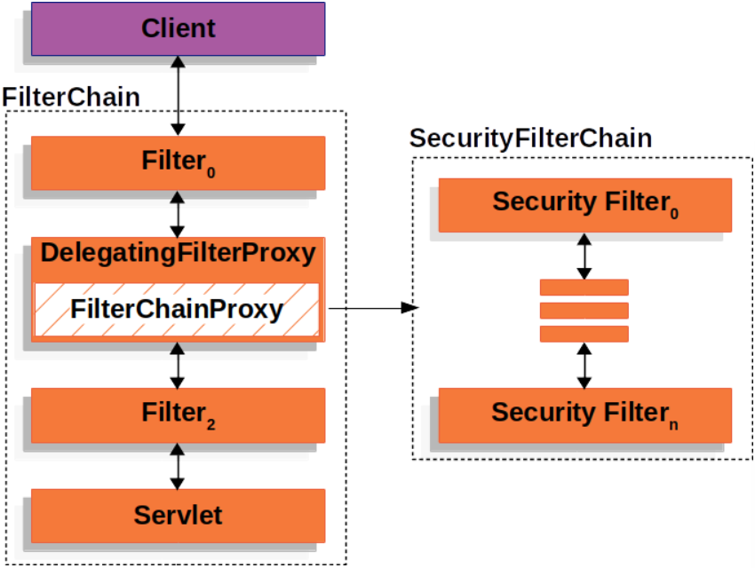
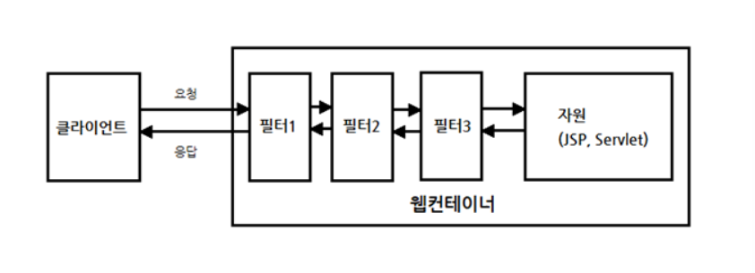

## 소셜 로그인 구현

### 1. Spring Security 설정

    Spring Security를 사용하여, 구글 소셜 로그인을 먼저 구현.

    1. SecurityConfig
       - 이때, Spring Security에 관련된 소셜 로그인과 JWT 설정을 같이 해주고 있다.

    2. Filter
       - security에서 Filter는 가장 중요한 부분이다.
       - 따라서, security는 Servlet FilterChain을 구성하고, 요청을 거치게 된다. 즉, FilterChain을 통과하게 되면 자원의 해당 servlet을 접근할 수 있다.

    - SecurityConfig 파일에서는 이러한 filter에 대한 설정을 커스텀하고 새로운 filter를 추가할 수도 있다.

 

### 2. SecurityConfig class

    @RequiredArgsConstructor
    @EnableWebSecurity
    public class SecurityConfig {

    }