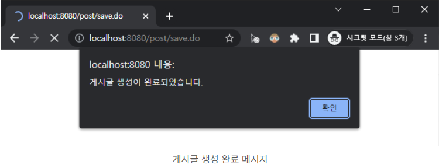

## 본문

### 목적
    컨트롤러에서 특정 페이지로 리다이렉트 하는 시점에 사용자에게 메시지를 보여주는 기능을 구현.

### 비동기 vs 동기
    Alert Message를 구현하기에 앞서, 동기식 처리(synchronous)와 비동기식 처리(Asynchronous)에 대해 설명을 드리겠습니다. 
    현재 우리가 구현하는 게시판은 클라이언트(Client)와 서버(Server)가 통신하는 구조입니다. 쉽게 말해, 클라이언트(사용자)가 어떠한 요청을 했을 때 서버(컨트롤러)에서 데이터를 처리한 후 다시 클라이언트(사용자)에게 응답을 내려주는 개념입니다.

    ● 동기식 처리(synchronous)
    - 사용자가 서버로 A라는 요청을 보냈을 때 A에 대한 응답이 내려오기 전까지 무조건 기다려야 한다.(다른 요청 불가)
    - 페이지가 새로고침 되거나 다른 페이지로 이동하게 되고, 그에 따라 HTML을 처음부터 다시 로딩(렌더링) 함.

    ● 비동기식 처리(Asynchronous)
    - 사용자가 서버로 A라는 요청을 보냈을 때 A에 대한 응답이 내려오기 전에 다른 요청을 보낼 수 없다.
    - 페이지의 새로고침이나 이동 없이, 서버로부터 필요한 결과(데이터)만 전달받아 작업을 수행한다.

        ex) 
            게시글 작성 페이지에서 서버로 게시글 등록을 요청했을 때 데이터 생성이 완료된 후 게시글 리스트 페이지로 이동한다. 
            이번 글에서 구현하는 "controller alert messaeg" 처리하기 기능은 앞의 예시와 같이 서버에서 데이터를 처리한 후 페이지를 리다이렉트 하는 시점에 사용자에 상황에 맞는 메시지를 전달하기 위한 용도로 사용한다.

### 1.메시지 처리용 DTO 클래스
    @Getter
    @AllArgsConstructor
    public class MessageDto {

        private String message;              // 사용자에게 전달할 메시지
        private String redirectUri;          // 리다이렉트 URI
        private RequestMethod method;        // HTTP 요청 메서드
        private Map<String, Object> data;    // 화면(View)으로 전달할 데이터(파라미터)

    }

    - @AllArgsConstructor : PostService의 @RequiredArgsConstructor와 마찬가지로 Lombok 라이브러리에서 제공해주는 기능이다.
    해당 어노테이션이 선언된 클래스에는 전체 멤버 변수를 필요로 하는 생성자가 생성된다.

        ex) @AllArgsConstructor가 대신 생성해주는 코드.
        public MessageDto(String message, String redirectUri, RequestMethod method, Map<String, Object> data) {
            this.message = message;
            this.redirectUri = redirectUri;
            this.method = method;
            this.data = data;
        }
    
    - method : HTTP 요청 메서드이다. RedirectMethod는 spring-web 라이브러리에 포함된 enum(상수 처리용) 클래스이다.
    
    - data : HTML로 전달할 파라미터인다. 페이지별로 전달할 파라미터의 개수는 랜덤하기 때문에 여러 데이터를 key-value 형태로 담을 수 있는 Map을 이용.
  
        ex) 
            페이징 처리가 되었다고 가정해보면, 3페이지에 있는 25번 게시글을 수정했다면, 수정이 완료된 후 다시 3페이지를 유지해야 한다. 이때,
            이전 페이지 정보(page=3)를 data에 담아 리다이렉트 하면 3페이지를 유지할 수 있다.

### 2.Controller methotd 추가
    // 사용자에게 메시지를 전달하고, 페이지를 리다이렉트
    private String showMessageAndRedirect(final MessageDto params, Model model) {
        model.addAttribute("params", params);
        return "common/messageRedirect";
    }            

### 3.HTML 추가
    ● MessageRedirect.html
    <!DOCTYPE html>    
    <html lang="ko" xmlns:th="http://www.thymeleaf.org">
    <head th:replace="fragments/header :: main-head"></head>
    <body>
        <form th:if="${not #maps.isEmpty( params.data )}"       
              id="redirectForm" 
              th:action="${params.redirectUri}" 
              th:method="${params.method}" 
              style="display: none;">
            <input th:each="key, status : ${params.data.keySet()}" 
                   type="hidden" 
                   th:name="${key}" 
                   th:value="${params.data.get(key)}" >
        </form>
        
    </body>

    - form 태그 : MessageDto에 Map 타입으로 선언된 data를 순환해서 각 데이터의 key-value를 hidden 타입의 input으로 추가한다.
    th:if 조건을 통해 data가 비어있지 않은 경우에만 form element를 그린다.

    - onload() 함수
        
        const messge = [[ ${params.message} ]];
        if (meesage) {
            alert(message);
        }

        - 컨트롤러에서 전달받은 message가 있는 경우, 사용자에게 alert 메시지를 보낸다.

        const form = document.getElementById('redirectForm');
        if (form) {
            form.submit();
            return false;
        }

        - if (form) 조건을 통해 HTML 내에 form 태그가 있는지를 우선적으로 체크한다. 앞에서 Map 타입의 객체인 data가 비어있지 않은 경우에만 form 태그를 HTML에 그린다고 했었다.

        MessageDto 타입의 객체인 params의 data가 비어있지 않다면, redirectForm을 컨트롤러로 submit 하고, data가 비어있으면 redierctUri에 해당하는 주소로 이동한다.
        즉, data의 유무에 따라 form 데이터를 submit 할지, 단순히 주소만 이동할지가 결정된다.

### 4.Controller method 수정
    // 신규 게시글 생성
    @PostMapping("/post/save.do")        
    public String savePost(final PostRequet params, Model model) {
        postService.savePost(params);
        MessageDto message = new MessageDto("게시글 생성이 완료되었습니다.", "/post/list.do", RequestMethod.GET, null);
        return showMessageAndRedirect(message, model);
    }

    // 기존 게시글 수정
    @PostMapping("/post/update.do")
    public String updatePost(final PostMessage params, Model model) {
        postService.updatePost(params);
        MessageDto message = new MessageDto("게시글이 수정이 완료되었습니다.", "/post/list.do", RequestMethod.GET, null);
        return showMessageAndRedirect(message, model);
    }

    // 게시글 삭제
    @PostMapping("/post/delete.do")
    public String deletePost(RequestParam final Long id, Model model) {
        postService.deletePost(id);
        MessageDto message = new MessageDto("게시글이 삭제가 완료되었습니다.", "/post/list.do", RequestMethod.GET, null);
        return showMessageAndRedirect(message, model);
    }

### 5.Test   
    - 게시글 생성 테스트입니다.

    - "생성" 완료 메시지가 정상적으로 출력되고, 확인을 클릭하면, 리스트 페이지로 이동합니다.
    
    

        

             