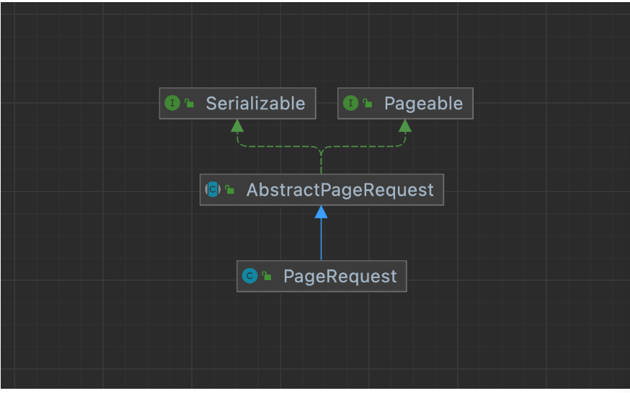
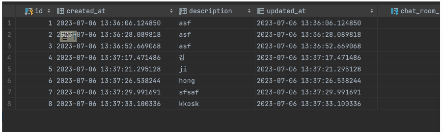
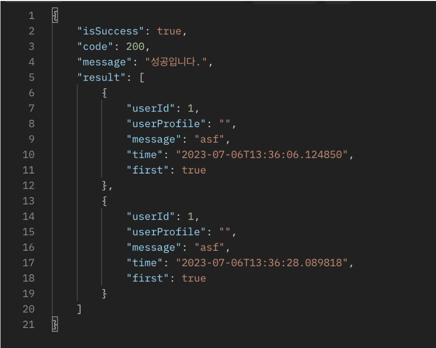
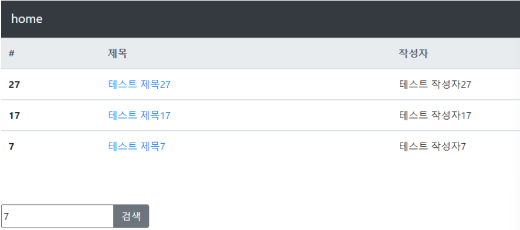
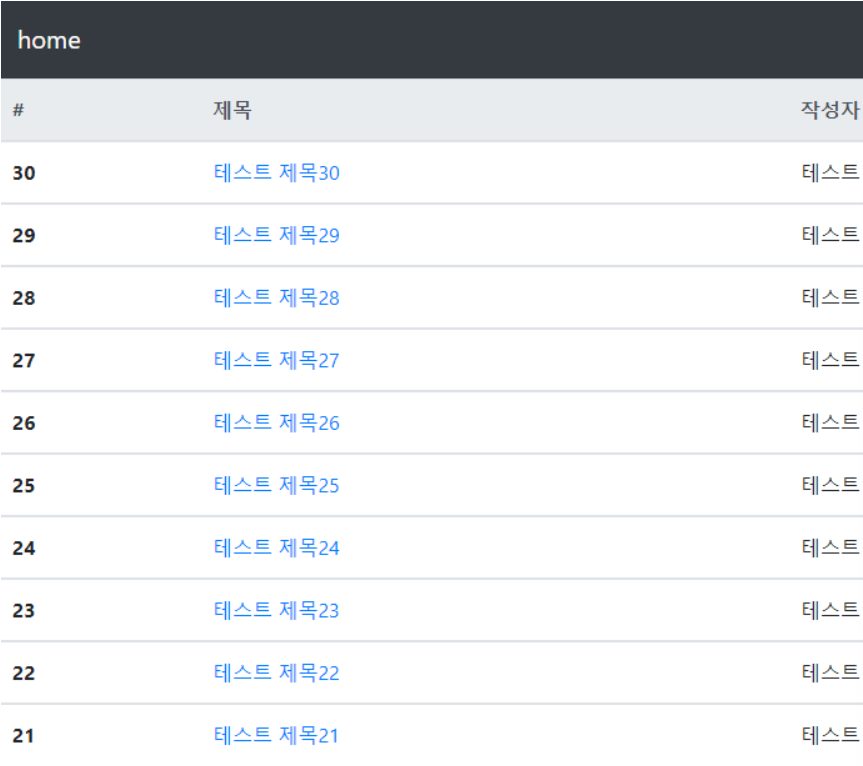

## 본문

### SpringBoot - paging(@PageableDefault 적용)

### part1.Pageable - 정의 
    Spring에서 제공하는 Pagination을 위한 interface 이다.

    위에 구조로 실제 구현체인 PageRequest를 사용한다.

    ● PageRequest 생성자
        
        public class PageRequest extends AbstractPageRequest {

            private static final long serablVersionUID = -45415099...L;

            private final Sort sort;

            protected PageRequest(int page, int size, Sort sort) {

                super(page, size);

                Assert.notNull(sort, "Sort must not be null");

                this.sort = sort;
            }
        }

    - size : 한 페이지당 담길 데이터의 양
    - page : size를 기준으로 몇번째 페이지인지
    - sort : 무엇을 기준으로 정렬할 것인지? 
        ex) createdAt, DESC, description

    - 이것을 기준으로 요청 URL에 변수를 넘기면, 페이지네이션이 동작한다.
        ex) GET/chats/:id?member=1&page=0&size=10&sort=description, DESC
        (없으면 기본값으로 동작한다.)

    ● AbstractPageRequest

        public abstract class AbstarctPageRequest implements Pageable, Serializable {

            private static final long serialVersionUID = 12328255786...L;

            private final int page;
            private final int size;

            public AbstractPageRequest(int page, int size) {

                if (page < 0) {
                    throw new IllegalArgumentException("page index must not be less than zero");
                }

                if (size < 1) {
                    throw new IllegalArgumentException("page size must not be less than one");
                }

                this.page = page;
                this.size = size;
            }
        }

        - 추가적으로 size, page 는 추상 클래스인 AbstractPageRequest에 있습니다. 페이지 넘버와 페이지 사이즈 오류처리를 확인.

### part1.Pageable - 적용
    Pageable이 편리한 점은 Spring Data JPA를 사용시 직ㅈ버 넘겨주면 편리하게 페이지네이션을 할 수 있다는 점 입니다.

    ● Controller
    @GetMapping("/chats/{id}")
    public ResponseEntity<BaseResponse>  findMessageByChatRoomId(@PathVariable("id") Long chatRoo,Id,
     @RequestParam(value = "member", required = true)
     Long memberId, Pageable pageable) {

        List<MessageResponseDto> messages = chatService.findMessage(chatRoomId, memberId, pageable);

        return new ResponseEntity<>(new BaseResponse(message), HttpStatus.OK);
    }

    ● Service
    public List<MessageResponseDto> findMessages(Long chatRoomId, Long requestUserId, Pageable pageable) throws BaseException {

        List<Message> messages = messageRepository.fidnAllByChatRoom_IdOrderByCreatedAt(chatRoomId, pageable);

        return message.stream()
                .map(message -> new MessageResponseDto(message, requestUserId))
                .collect(Collectors.toList());
    }

    ● Repository
    public interface MessageRepository extends JpaRepository<Message, Long> {
        List<Message> findAllByChatRoom_IdOrderByCreatedAt(Long charRoomId, Pageable pageable)
    }

    ● 결과

### part1.Pageable - 테스트
    public ResponseEntity<BaseResponse> findMessageByChatRoomId(
        @PathVariable("id") Long chatRoomId,
        @RequestParam(value = "member", required = true) Long memberId,
        Pageable pageable) {

            log.inf("size = {}, page = {}, sorted = {}, pageable.getPageSize(), pageable.getPageNumber(), pageable.getSort());

            List<MessageResponseDto> message = chatService.findMessages(chatRoomId, memberId, pageable);

            return new ResponseEntity<>(new BaseResponse(message), HttpStatus.OK);
        }

    - 페이지 당 데이터 객수를 2개로 설정한 pagenation에서 0번째 페이지를 가져와 보자

    - 로그에서도 정상적으로 Pageable 에 값이 넘어온것을 확인 가능하다.
        ex) log.info : size = 2, page = 0, sorted = UNSORTED  

### part2.Pageable - Pageable & search 
    part2에서는 세 부분으로 나누어 구현해보겠다.
    1. 검색
    2. 페이징 처리
    3. 검색 페이지에서 페이징

### part2.Pageable - search
    ● Repository
    public interface BoardRepository extends JpaRepository<Board, Long> {

        List<Board> findByTitleContaining(String keyword);
    } 

    - JpaRepository 에서 메서드명의 By이후는 SQL의 where 조건 절에 대응되는 것이다. 이렇게 Containing를 붙여주면 Like 검색이 가능해진다.           

    ● Service
    @Trancsactional
    public List<Board> search(Stirng keyword) {

        List<Board> boardList = boardRepository.findByTitleContaining(keyword);

        return boardList;
    }

    ● Controller
    @GetMapping("/board/search")
    public String search(String keyword, Model model) {

        List<Board> searchList = boardService.search(keyword);

        model.addAttribute("searchList", searchList);

        return "search/searchPage";
    }

    - 이 번 코드는 검색을 하게 되면 URL을 /board/search로 이동시킨 후 검색 리스트들을 뿌려주게 하려고 한다.
  
    ● searchPage.mustache
    
        - mustache
        Mustache는 간단하면서도 강력한 템플릿 엔진으로, 다양한 언어와 프레임워크에서 사용됩니다. 특히, 로직 없는 템플릿 엔진을 지향하며, 데이터와 템플릿을 분리하여 보다 유지보수가 용이한 코드를 작성할 수 있게 도와줍니다.

    {{>layout/header}}

    <table class="table">
        <thead class="thead-light">
        <tr>
            <th scope="col">#</th>
            <th scope="col">제목</th>
            <th scope="col">작성자</th>
            <th scope="col">작성시간</th>
        </tr>
        </thead>
        {{#searchList}}
            <tbody>
            <tr>
                <th scope="row">{{id}}</th>
                <td><a href="/{{id}}">{{title}}</a></td>
                <td>{{author}}</td>
                <td>{{createdTime}}</td>
            </tr>
            </tbody>
        {{/searchList}}
    </table>

    {{>search/searchForm}}

    {{>layout/footer}}    

    ● searchForm.mustache
    
        <form action="/board/search" method="GET">
            

                <input name="keyword" type="text" placeholder="검색어를 입력해주세요">
                <button class="btn btn-secondary">검색</button>
            

        </form>

    - 다음음 검색창이다. form data를 해당 주소로 GET하는 걸 볼 수 있다.
    input에 데이터를 입력하게 되면 Controller가 해당 데이터를 받아 지지고 볶은 다음에 searchPage에 보낸다. 그럼 searchPage가 데이터를 받아 화면을 구성한다.

### part2.Pageable - paging
    ● Service
    @Transactional
    public Page<Board> getBoardList(Pageable pageable) {

        return boardRepository.findAll(pageable);
    }

    - 서비스에서 구현한 페이징 기능이다. 
        Pageable은 JpaRepository.findAll() 파라미터로 pageable만 넣어주면 된다.
    - 주의할 점은 리스트 타입을 Page로 해야 한다.

    ● Controler
    @GetMapping("/")
    public String index(Model model, @PageableDefault(size = 10, sort = "id", direction = Sort.Direction.DESC) Pageable pageable) {

        model.addAttribute("boardList", boardService.getBoardList(pageable));

        return "index";
    }   

    - @PageableDefault 어노테이션을 사용하면 정렬은 물론 페이징 처리, 페이지 사이즈까지 한 줄로 구현 가능하다.
    
    ● 결과

    

    - 페이지 사이즈가 10이고, id를 기준으로 내림차순 정렬되었다.

### part2.Pageable - 검색 페이지에서 페이징
    ● Repository
    public interface BoardRepository extends JpaRepository<Board, Long> {

        List<Board> findByTitleContaining(String keyword, Pageable pageable);
    }

    ● Service
    @Transactional
    public List<Board> search(String keyword, Pageable pageable) {

        List<Board> boardList = boardRepository.findByTitleContaining(keyword, pageable);

        return boardList;
    }

    - 그런데 위에 두 코드를 비교해보면 리스트 타입이 다르다.
      Repository에서는 List 타입이고, Service는 Page로 받는다.
      다른 이유는 JpaRepository가 제공하는 기본 메서드인 findAll()에 Pageable을 사용할 경우에는 리스트 타입을 Page로 해줘야 한다. 

    ● Controller
    @GetMapping("/board/search")  
    public String search(String keyword, @PageableDefault(size = 10, sort = "id", direction = Sort.Direction.DESC) Pageable pageable, Model model) {

        List<Board> searchList = boardService.search(keyword, pageable);

        model.addAttribute("searchList", searchList);

        return "search/searchList";
    }

### part3.Pageable - Mybatis에서 Pageable 적용    