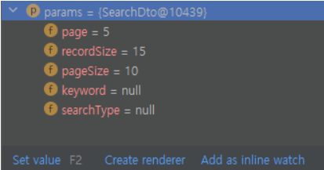

## 본문

### springMVC - paging(MyBatis 적용)

### 1.페이징(Paging)이란?
    - 페이징은 사용자에게 데이터를 제공할 때, 전체 데이터 중의 일부를 보여주는 방식이다.
  
### 2.페이징 파라미터 관리용 클래스 추가하기
    page : 현재 페이지 번호를 의미, 페이지 정보 계산에 사용된다.
    recordSize : 페이지당 출력할 데이터 개수를 의미하며, page와 함께 페이지 정보 계산에 사용된다.
    pageSize : 화면 하단에 출력할 페이지의 크기를 의미하며, 5로 지정하면 1~5까지, 10으로 지정하면 1~10까지의 페이지가 보이게 된다.
    keyword : 검색 키워드를 의미하며, MyBatis의 동적(Dynamic) SQL 처리에 사용된다.
    searchType : 검색 유형을 의미하며, keyword와 함께 검색처리에 사용된다.

    - 페이징과 검색만 해도, view에서 받을 파라미터가 5개나 됩니다.
    이처럼 적지 않은 수의 파라미터는 클래스로 관리하는 게 효율적입니다.

    ● SearchDto
    @Data
    public class SearchDto {

        private int page;             // 현재 페이지 번호
        private int recordSize;       // 페이지당 출력할 데이터 개수
        private int pageSize;         // 화면 하단에 출력할 페이지 사이즈
        private String keyword;       // 검색 키워드
        private String searchType;    // 검색 유형

        public SearchDto() {
            this.page = 1;
            this.recordSize = 10;
            this.pageSize = 10;
        }

        public int getOffset() {
            return (page - 1) * recordSize;
        }

    }
    - 생성자 : 객체가 생성되는 시점에 현재 페이지 번호는 1로, 페이지당 출력할 데이터 개수와 하단에 출력할 페이지 개수를 10으로 초기화합니다.
    - getOffset() : MariaDB에서 LIMIT 구문의 시작 부분에 사용되는 메서드입니다. SQL 쿼리를 작성한 후 해당 메서드가 어떻게 사용되는지 알아보자.

### 추가 : PagingVO (페이징 로직을 컨트롤러, 서비스가 아닌 VO에서 처리)
    public class PagingVO {

        // 현재 페이지, 시작 페이지, 끝 페이지, 게시글 총 갯수, 페이지당 글 갯수, 마지막 페이지, SQL쿼리에 쓸 start, end
        private int nowPage, startPage, endPage, total, cntPerPage, lastPage, start, end;
	    private int cntPage = 5;

        public PagingVO() {            
        }

        public PagingVO(int total, int nowPage, int cntPerPage) {
            setNowPage(nowPage);
            setCntPerPage(cntPerPage);
            setTotal(total);
            calcLastPage(getTotal(), getCntPerPage());
            calcStartEndPage(getNowPage(), cntPage);
            calcStartEnd(getNowPage(), getCntPerPage());
        }
        // 제일 마지막 페이지 계산
        public void calcLastPage(int total, int cntPerPage) {
            setLastPage((int) Math.ceil((double)total / (double)cntPerPage));
        }
        // 시작, 끝 페이지 계산
        public void calcStartEndPage(int nowPage, int cntPage) {
            setEndPage(((int)Math.ceil((double)nowPage / (double)cntPage)) * cntPage);
            if (getLastPage() < getEndPage()) {
                setEndPage(getLastPage());
            }
            setStartPage(getEndPage() - cntPage + 1);
            if (getStartPage() < 1) {
                setStartPage(1);
            }
        }
        // DB 쿼리에서 사용할 start, end값 계산
        public void calcStartEnd(int nowPage, int cntPerPage) {
            setEnd(nowPage * cntPerPage);
            setStart(getEnd() - cntPerPage + 1);
        }
    }

### 3.Mapper와 XML Mapper 수정하기
    ● Mapper 
    // 게시글 리스트 조회
    List<PostResponse> findAll(SearchDto params);

    // 게시글 수 카운팅
    int count(SearchDto params);

    ● Mapper.xml
    <!-- 게시글 리스트 조회 -->
    <select id="findAll" parameterType="com.study.common.dto.SearchDto" 
    resultType="com.study.domain.post.PostResponse">
        SELECT
            <include refid="pstColumns" />
        FROM
            tb_post
        WHERE
            delete_yn = 0
        ORDER BY
            id DESC
        LIMIT #{offset}, #{recordSize}
    </select>

    <!-- 게시글 수 카운팅 -->
    <select id="count" parameterType="com.study.common.dto.SearchDto" resultType="int">
        SELECT 
            COUNT(8)
        FROM
            tb_post
        WHERE
            delete_yn = 0
    </select>

    ● LIMIT
    LIMIT 구문은 SELECT 쿼리와 함께 사용되며, 반환되는 데이터의 개수를 지정할 수 있다.
    - offset : MyBaits에서 쿼리의 parameterType이 클래스의 객체인 경우, XML Mapper의 #{parameter}는 맴버 변수의 getter에 해당됩니다.
    쉽게 말해, get() 메서드를 이용해서 쿼리에 파라미터를 바인딩하는 개념입니다.
    
    findAll 쿼리에서 offset은 SearchDto 클래스의 getOffset() 메서드가 리턴하는, (page - 1) * recordSize를 계산한 값입니다.

        ex) page=3, recordSize를 10으로 가정해보면 (3-1) * 10 = 20입니다. 
        즉, 현재 페이지 번호가 3이라면 "LIMIT 20,10"으로 쿼리가 실행되며, 결론적으로 offset은 조회할 데이터의 시작 위치(몇 번째 데이터부터 조회할 것인지)를 의미.
    
    - recordSize : 시작 위치(offset)를 기준으로 조회할 데이터의 개수를 의미합니다.
  
### 4.Service 수정하기
    public List<PostResponse> findAllPost(final SearchDto params) {
        return postMapper.findAll(params);
    }

### 5.Controller 수정하기
    // 게시글 리스트 페이지
    @GetMapping("/post/list.do")
    public String openPostList(@ModelAttribute("params") final SearchDto params, Model model) {
        List<PostResponse> posts = postService.findAllPost(params);
        model.addAttribute("posts", posts);
        return "post/list";
    }

### 6.자가 복사 이용
    1. 게시글(tb_post) 테이블 초기화 하기
    페이징 테스트를 위해서는 대량의 데이터가 필요하다. 이럴 때 자가 복사를 이용하면 되는데요, DBMS 툴에서 게시글 테이블을 초기화하는 다음의 명령어를 실행.(TRUNCATE는 테이블의 모든 데이터를 DELETE하고, AUTO_INCREMENT를 1로 초기화한다.)    
        ex) TRUNCATE tb_post;

    2. 게시글 1,000개 등록하기
    PostServiceTest에 다음의 테스트 코드를 작성한 후 실행해 주면된다. 
    PostMapperTest에서 호출하는 PostMapper의 findAll()의 구조가 변경되어서 오류가 발생할 테니, PostMapperTest를 전체 주석 처리한 후 실행.
        
        @Test
        void saveByForeach() {
            for (int i = 1; i <= 1000; i++) {
                PostRequest params = new PostRequest();
                params.setTitle(i + "번 게시글 제목");
                params.setContnt(i + "번 게시글 내용");
                params.setWriter("테스터" + i);
                params.setNoticeYn(false);
                postService.savePost(params);
            }
        }
        - 결과 : insert_id = 1000

    3. 테이블 구조 확인하기
    이제 테이블에 대량의 데이터를 INSERT 해주면 된다. 자가 복사를 이용할 때는 테이블 구조를 확인해서 필수로 값이 입력되어야 하는 칼럼을 우선적으로 체크해야 한다. 
    tb_post 테이블은 전체 칼럼 중 id와 날짜를 제외한 모든 칼럼에 필수로 값이 입력되어야 한다.

   

    4.자가 복사 쿼리 실행하기
    DBMS 툴에서 다음의 SQL 쿼리를 실행하면 된다. 쿼리를 실행할 때마다(테이블 전체 데이터 * 2)만큼의 데이터가 INSERT 된다.

        ex) INSERT INTO tb_post 
            (title, content, writer, view_cnt, notice_yn, delete_yn)
            (SELECT title, content, writer, view_cnt, notice_yn, delete_yn FROM tb_post WHERE delete_yn = 0);

    다음은 자가 복사 쿼리를 5번 실행한 결과입니다.

### 7.리스트 페이지 테스트 
    1. 쿼리 스트링 파라미터가 없는 경우
    리스트 페이지에 접속해 보면 가장 마지막으로 등록된 데이터를 기준으로 10건이 출력된다.

    여기서 포인트는 findAll 쿼리의 LIMIT 구문이다. LIMIT의 offset은 page(현재 페이지 번호)와 recordSize(페이지당 출력할 데이터 개수)를 기준으로 계산되는데, 따로 전달한 파라미터가 없기 때문에 리스트 페이지에 접근하는 시점에 SearchDto 클래스의 생성자에 의해 page는 1로, recordSize는 10으로 객체가 생성된다.

    실행된 쿼리의 LIMIT 구문은 getOffset() 과 getRecordSize()의 결과값인 (0, 10)으로 처리된다.

    2. 쿼리 스트링 파라미터가 있는 경우
    이번에는 URL에 강제로 파라미터(page=5, recordeSize=10)를 연결한 후 리스트 페이지로 접근한 결과이다.

    page와recordSize를 파라미터로 전달했기 때문에 LIMIT 구문의 offset과 recordSize에 변화가 생긴다.

  

### 8.Pagination 처리용 클래스 추가하기
    브라우저에서 URL에 강제로 파라미터를 연결했을 때 리스트 데이터가 정상적으로 출력되는 걸 확인했으니, 지금부터는 실전이다.
    웹에서 화면 하단에 페이지 번호를 출력하는 기능을 "Pagination" 이라고 한다. 앞에서 했듯이, SearchDto의 맴버 변수를 이용해서 페이지 정보를 계산한다.

        ex) pagination
        @Getter
        public class Pagination {
            private int totalRecordCount;   // 전체 데이터 수
            private int totalPageCount;     // 전체 페이지 수
            private int startPage;          // 첫 페이지 번호
            private int endPage;            // 끝 페이지 번호
            private int limitStart;         // LIMIT 시작 위치
            private boolean existPrevPage;  // 이전 페이지 존재 여부
            private boolean existNextPage;  // 다음 페이지 존재 여부

            public Pagination(int totalRecordCount, SearchDto params) {
                if (totalRecordCount > 0) {
                    this.totalRecordCount = totalRecordCount;
                    calculation(params);
                }
            }

            private void calculation(SearchDto params) {

                // 전체 페이지 수 계산
                totalPageCount = ((totalRecordCount - 1) / params.getRecordSize()) + 1;

                // 현재 페이지 번호가 전체 페이지 수보다 큰 경우, 현재 페이지 번호에 전체 페이지 수 저장
                if (params.getPage() > totalPageCount) {
                    params.setPage(totalPageCount);
                }

                // 첫 페이지 번호 계산
                setarPage = ((params.getPage() - 1) / params.getPageSize()) * params.getPageSize() + 1;

                // 끝 페이지 번호 계산
                endPage = startPage + params.getPageSize() -1;

                // 끝 페이지가 전체 페이지 수보다 큰 경우, 끝 페이지 전체 페이지 수 저장
                if (endPage > totalPageCount) {
                    endPage = totalPageCount;
                }

                // LIMIT 시작 위치 계산
                limitStart = (params.getPage() - 1) * params.getRecordSize();
                // 이전 페이지 존재 여부 확인
                existPrePage = startPage != 1;

                // 다음 페이지 존재 여부 확인
                existNextPage = (encPage * params.getRecordSize()) < totalRecordCount;
            }
        }

        ● 클래스 구성요소 설명
        - totalRecordCount 
        COUNT(*) 쿼리의 실행 결과, 즉 전체 게시글 개수를 의미한다. 당장은 테이블에서 삭제되지 않은 데이터를 기준으로 카운팅 하지만, 검색 기능이 적용된 후에는 검색 조건의 유무에 따라 필터링해서 카운팅 한다.

        - totalPageCount 
        페이지 하단에 출력할 전체 페이지 개수를 의미한다. 테이블에 1,000개의 데이터(record)가 있고, recordSize(페이지당 출력할 데이터 개수)가 10개라고 가정했을 때, 전체 페이지 개수는 (1,000/10)의 결과인 100개가 된다.

        - startPage
        현재 페이지네이션의 첫 페이지를 의미한다. pageSize(화면 하단에 출력할 페이지 개수)가 10이고, page(현재 페이지 번호)가 5라고 가정했을 때 1을 의미한다.

        - endPage
        현재 페이지네이션의 끝 페이지를 의미한다.pageSize(화면 하단에 출력할 페이지 개수)가 10이고, page(현재 페이지 번호)가 5라고 가정했을 때 10을 의미한다.
        다른 예로 page가 15일 때 startPage는 11이 되고, page가 29일 때 sartPage는 21이 된다.

        - limimStart
        현재 findAll 쿼리의 LIMIT 구문에 사용되는 offset과 동일한 기능을 하는 변수이다. SearchDto의 offset을 대신해서 LIMIT 구문의 첫 번째 인자로 사용된다.

        - existPrevPage
        이전 페이지의 존재 여부를 확인한다.
        현재 위치한 페이지에서 startPage(첫 페이지 번호)가 1이 아니라는 건, 이전 페이지가 존재한다는 걸 의미한다.

        - existNextPage
        다음 페이지의 존재 여부를 확인한다.
        recordSize(페이지당 출력할 데이터 개수)가 10개, endPage(끝 페이지 번호)가 10이라고 가정했을 때 (10 * 10) = 100이라는 결과가 나온다.
        만약 totalRecordCount(전체 데이터 개수)가 105개라면, 다음 페이지가 존재한다는 걸 의미한다.

### 9.XML Mapper 수정하기
    <!-- 게시글 리스트 조회 -->
    <select id="findAll" parameterType="com.study.common.dto.SearchDto" resultType="com.study.domain.post.PostResponse">
        SELECT 
            <include refid="postColumns" />
        FROM
            tb_post
        WHERE
            delete_yn = 0
        ORDER BY 
            id DESC
        LIMIT #{pagination.limitStart}, #{recordSize}
    </select>

### 10.SearchDto 수정
    findAll 쿼리에서는 pagination 객체의 limitStart를 사용하고 있으나, SearchDto에는 Pagination 타입의 멤버가 없으니, SearchDto가 Pagination 타입의 멤버를 갖도록 선언해 주어야 한다.

        ex) SearchDto
        @Data
        public class SearchDto {

            private int page;
            private int recordSize;
            private int pageSize;
            private String keyword;
            private String searchType;
            private Pagination pagination // 기존 게시글에 pagination(하단 번호) 추가

            public SearchDto() {
                this.page = 1;
                this.recordSize = 10;
                this.pageSize = 10;
            }
        }

### 11.Paging 전용 Response 클래스 추가하기
    화면에 페이지 번호를 그리는 작업은 view 단에서 이루어져야 한다. 이때 list.html은 리스트 데이터와 Pagination 객체 모두를 필요로 한다.

    그런데, 현재 PostService의 findAllPost()의 리턴 타입은 List<PostResponse>이다. Pagination 객체를 생성해서 페이지 정보를 계산하는 것까지는 문제가 되지 않지만, 현재의 리턴 타입으로는 리스트 데이터와 Pagination 객체 모두를 컨트롤러로 반환할 수가 없다.

    이를 해결하기 위해, key-value 구조로 이루어진 Map에 리스트 데이터와 Pagination 객체를 담아 리턴해 주어도 되지만, 좀 더 직관적인 처리를 위해 페이징 전용 응답 클래스를 생성해 보자.

        ex) PagingResponse<T> {

            private List<T> list = new ArrayList<>();
            private Pagination pagination;

            public PagingResponse(List<> list, Pagination pagination) {
                this.list.addAll(list);
                this.pagination = pagination;
            }
        }

        - list : java의 제네릭을 활용, T는 Type을 의미하며, 어떤 타입의 객체던 데이터로 받겠다는 의미입니다.

### 12.Service 수정
    이제 PostService의 findAllPost()에 페이지 정보를 계산하는 로직이 추가되어야 한다. 계산된 페이지 정보를 기준으로 findAll 쿼리를 실행하고, PagingResponse 클래스를 이용해서 리스트 데이터와 계산된 페이지 정보를 함께 리턴해 주어야 한다.

    /**
     *  게시글 리스트 조회
     *  @param params - search conditions 
     *  @return list & pagination information
     */      
    public PagingResponse<PostResponse> findAllPost(final SearchDto params) {
        
        // 조건에 해당하는 데이터가 없는 경우, 응답 데이터에 비어있는 리스트와 null을 담아 반환
        int count = postMapper.count(params);
        if (count < 1) {
            return new PagingResponse<>(Collections.emptyList(), null);
        }

        // Pagination 객체를 생성해서 페이지 정보 계산 후 SearchDto 타입의 객체인 params에 계산된 페이지 정보 저장.
        Pagination pagination = new Pagination(count, params);
        params.setPagination(pagination);

        // 계산된 페이지 정보의 일부(limitStart, recordSize)를 기준으로 리스트 데이터 조회 후 응답 데이터 반환
        List<PostResponse> list = postMapper.findAll(params);
        return new PagingResponse<>(list, pagination);
    }

### 13.Controller 수정
    마지막으로 PostController의 openPostList()r가 view로 전달하는 데이터만 변경해 주면 된다.

        ex) Controller
        // 게시글 리스트 페이지
        @GetMapping("/post/list.do")
        public String openPostList(@ModelAttribute ("param") final SearchDto params, Model model) {
            PagingResponse<PostReposne> response = postService.findAllPost(params);
            model.addAttribute("response", repseon);
            return "post/list";
        }

### 14.HTML 수정하기
    이제, Pagination 객체를 이용해서 화면 하단에 페이지 번호를 그리고, 번호를 클릭했을 때 번호에 해당하는 페이지로 이동하는 기능만 구현하면 된다.

    Thymeleaf를 이용해서 HTML을 그려도 되지만, 좀 더 깨끗한 소스 코드를 작성하기 위해 JS를 이용해서 리스트 데이터와 페이지 번호를 그려보자.

    우선 list.html을 다음과 같이 변경해주자. Diffchecker를 이용하면, 기존 코드와 변경된 코드를 쉽게 비교해 볼 수 있다.        
        
    ● list.html(Thymeleaf를 이용한 paging)

    <!DOCTYPE html>
    <html lang="ko" xmlns:th="http://www.thymeleaf.org" xmlns:layout="http://www.ultraq.net.nz/thymeleaf/layout" layout:decorate="layout/basic">
        <th:block layout:fragment="title">
            <title>리스트 페이지</title>
        </th:block>

        <th:block layout:fragment="content">
            

            

                <h3>게시판 관리</h3>
                
<strong>현재 위치 :</strong> 게시판 관리 리스트형 리스트

            

            

                <section>
                    <!--/* 검색 */-->
                    

                        <form id="searchForm" onsubmit="return false;" autocomplete="off">
                            

                                <select title="검색 유형 선택">
                                    <option value="">전체 검색</option>
                                    <option value="">제목</option>
                                    <option value="">내용</option>
                                </select>
                                <input type="text" placeholder="키워드를 입력해 주세요." title="키워드 입력"/>
                                <button type="button" class="bt_search"><i class="fas fa-search"></i>검색</button>
                            

                        </form>
                    

                    <!--/* 리스트 */-->
                    <table class="tb tb_col">
                        <colgroup>
                            <col style="width:50px;"/><col style="width:7.5%;"/><col style="width:auto;"/><col style="width:10%;"/><col style="width:15%;"/><col style="width:7.5%;"/>
                        </colgroup>
                        <thead>
                            <tr>
                                <th scope="col"><input type="checkbox"/></th>
                                <th scope="col">번호</th>
                                <th scope="col">제목</th>
                                <th scope="col">작성자</th>
                                <th scope="col">등록일</th>
                                <th scope="col">조회</th>
                            </tr>
                        </thead>

                        <!--/* 리스트 데이터 렌더링 영역 */-->
                        <tbody id="list">

                        </tbody>
                    </table>

                    <!--/* 페이지네이션 렌더링 영역 */-->
                    

                    

                    <!--/* 버튼 */-->
                    

                        <a th:href="@{/post/write.do}" class="btns btn_st3 btn_mid">글쓰기</a>
                    

                </section>
            
 <!--/* .content */-->
        </th:block>
    </html>
    - <tbody id="list"> : 게시글 리스트 데이터 HTML을 렌더링 할 영역입니다.
    기존에는 타임리프의 th:each를 이용해서 HTML을 그렸었고, 이번에는 자바스크립드를 이용해서 HTML을 그립니다.

### 16.Paging Test
    1. 게시글 리스트 페이지에서 5페이지를 클릭한 결과.
    - URL에 쿼리 스트링이 정상적으로 연결됨을 확인하면
      - localhost:8080/post/list.do?page=5&recordSize=10&pageSize=10 
      - 

    2. 5페이지에서 다음 페이지(>)버튼을 세 번 클릭한 결과.
    

    3. 마지막 페이지에서 이전 페이지(<) 버튼을 세 번 클릭한 결과.
    
    

### 마치며
    여기까지가 기본 적인 페이징 기능 구현입니다. 
    아직 개선해야 할 부분이 몇 가지 남아 있습니다.

    1.검색 유형(searchType)과 검색 키워드(keyword)를 이용한 검색 처리.
    2.SearchDto를 이용해서 이전 페이지 정보 유지하기.
        ex)
            25페이지에 있는 50번 게시글을 "수정/삭제" 하거나, 상세 또는 수정 페이지에서 "뒤로" 버튼을 클릭하면 다시 25페이지로 이동하는 기능.
            즉, 이전에 머무르던 페이지 정보가 유지되어야 한다.

