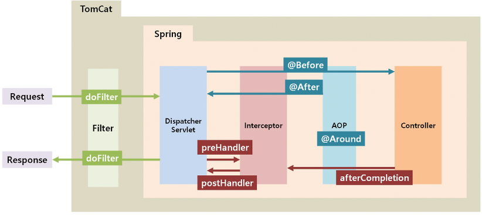
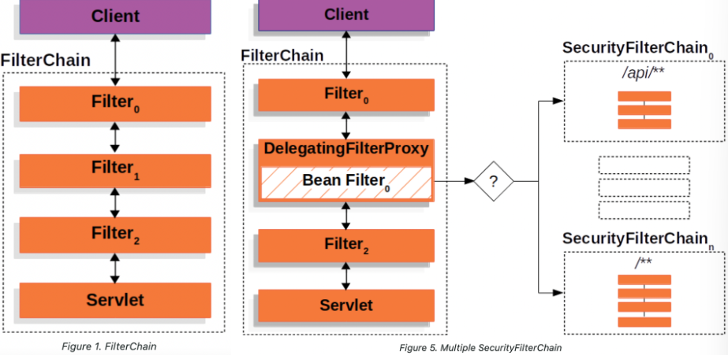

## part1 SpringBoot JWT login - Filter에 대한 이해

### Spring Security Configuration

    스프링 시큐리티를 사용하기 위해 기본적으로 설정파일을 작성해줘야 한다.
    config 패키지를 생성하고 해당 패키지에 SecurityConfig 클래스를 생성한다.

    @Configuration
    @EnableWebSecurity
    @RequiredArgsConstructor
    public class SecurityConfig extends WebSecurityConfigurerAdapter {

        private final CorsFilter corsFilter;

        @Override
        protected void configure(HttpeSecurity http) throws Exception {
            http.csrf().disable();
            http
                .sessionManagement().sessionCreationPolicy(SessionCreationPolicy.STATELESS) // 세션 사용 안함
                .and()
                .addFilter(corsFilter) // 인증(O), security Filter에 등록
                .formLogin().disable() // formLogin 사용 안함
                .httpBasic().disable()
                .authorizeRequests()
                // 이 부분은 커스터마이징
                .antMatchers("/v1/api/member", "/v1/api/member/all", "/v1/api/member/email")
                .access("hasRole('ROLE_USER') or hasRole('ROLE_MANAGER')") or hasRole('ROLE_ADMIN')
                .antMatchers("/v1/api/manager/**")
                .access("hasRole('ROLE_MANAGER') or hasRole('ROLE_ADMIN')")
                .antMatchers("v1/api/admin/**")
                .access("hasRole('ROLE_ADMIN')")
                .anyRequest()
                .permitAll();
        }
    }

    .httpBasic().disable() 
        - JWT은 httpBearer 방식이므로 httpBasic 방식은 disable() 처리한다.
        
    .antMatchers & access
        - 어느 요청이냐에 따라 맞는 권한 여부를 확인

    CORS 차단을 해제하고, JWT 방식으로만 검증할 것이므로 CorsFilter를 추가한다.
        - CorsFilter 클래스를 생성해서 넣어준다.

### CorsFilter class

    @Configuration
    public class CorsConfig {

        @Bean
        public CorsFilter corsFiler() {
            UrlBasedCorsConfigurationSource source = new UrlBasedCorsConfigurationSource();
            CorsConfiguration cofig = new CorsConfiguration();
            config.setAllowCredentials(true) // json 서버응답을 자바스크립트에서 처리할 수 있게 해줌
            config.addAllowedOrigin("*");    // 모든 ip에 응답을 허용
            config.addAllowedMethod("*");    // 모든 HTTPMETHOD에 허용
            cofing.addAllowedHeader("*");    // 모든 HTTPHEADER에 허용
            source.registerCorsConfiguration("/v1/api/**", config);

            return new CorsFilter(source);
        }
    }

### 정리

    지금 JWT를 사용하기 위해 스프링 시큐리티를 설정하고, CORS로 인한 차단을 해제하기 위해 CorsConfig 클래스 내에 CorsFilter 클래스를 새로 만들어줬으며, JWT 이외의 방식에서 사용되는 session, http basic, loginForm 등의 인증방식을 제거해줬다.
    스프링 시큐리티를 사용하고자 한다면 기본적으로 세팅해야 하는 부분이다.    

    

    위의 사진은 HttpRequest&Response에 대한 Spring의 처리 절차를 보여준다.
    Filter가 request, response를 가장 먼저 만가게 되고, Filter에 우리가 사용하는 Spring Security Filter도 포함이 되는 것이다.

    

    정리 해보면, 서비스에 접근하는 사람들을 검증하기 위해 요청자가 Login 시, 발급 받았던 토큰 jwt를 확인하므로 Authentication(인증)을 하는 것이고,
    이후 권한을 확인하는 Authorization(인가)을 하게 되는 것이다.

## part2 SpringBoot JWT login - Filter 적용 테스트