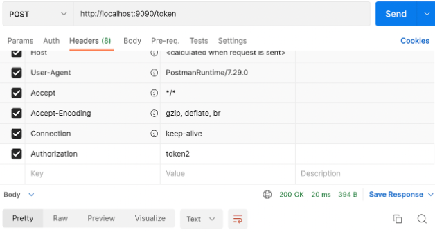
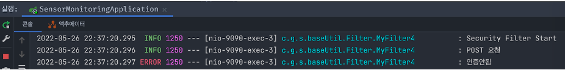
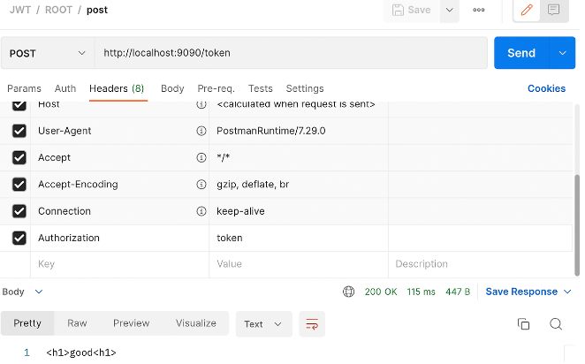
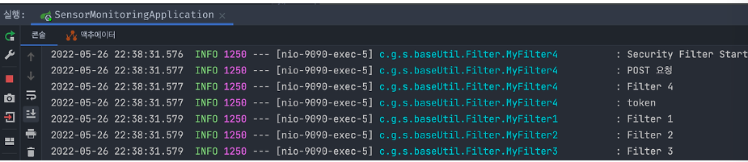
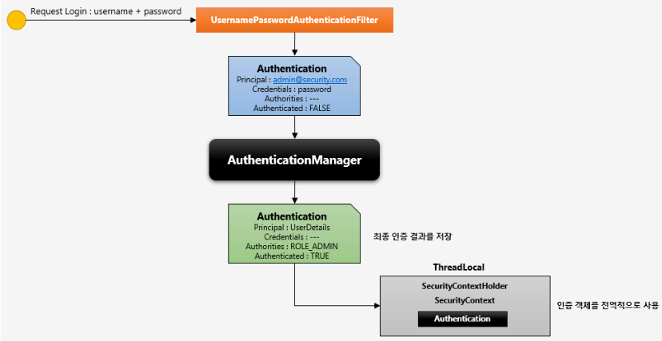
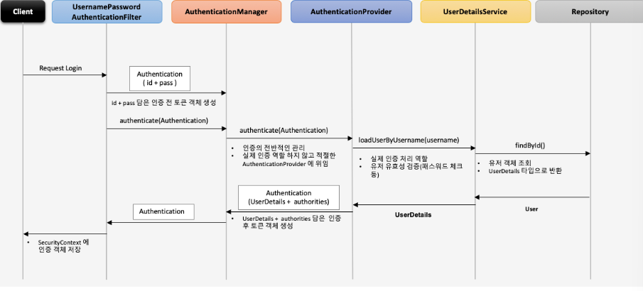

## part1 SpringBoot JWT login - Filter에 대한 이해

### Spring Security Configuration

    스프링 시큐리티를 사용하기 위해 기본적으로 설정파일을 작성해줘야 한다.
    config 패키지를 생성하고 해당 패키지에 SecurityConfig 클래스를 생성한다.

    @Configuration
    @EnableWebSecurity
    @RequiredArgsConstructor
    public class SecurityConfig extends WebSecurityConfigurerAdapter {

        private final CorsFilter corsFilter;

        @Override
        protected void configure(HttpeSecurity http) throws Exception {
            http.csrf().disable();
            http
                .sessionManagement().sessionCreationPolicy(SessionCreationPolicy.STATELESS) // 세션 사용 안함
                .and()
                .addFilter(corsFilter) // 인증(O), security Filter에 등록
                .formLogin().disable() // formLogin 사용 안함
                .httpBasic().disable()
                .authorizeRequests()
                // 이 부분은 커스터마이징
                .antMatchers("/v1/api/member", "/v1/api/member/all", "/v1/api/member/email")
                .access("hasRole('ROLE_USER') or hasRole('ROLE_MANAGER')") or hasRole('ROLE_ADMIN')
                .antMatchers("/v1/api/manager/**")
                .access("hasRole('ROLE_MANAGER') or hasRole('ROLE_ADMIN')")
                .antMatchers("v1/api/admin/**")
                .access("hasRole('ROLE_ADMIN')")
                .anyRequest()
                .permitAll();
        }
    }

    .httpBasic().disable() 
        - JWT은 httpBearer 방식이므로 httpBasic 방식은 disable() 처리한다.
        
    .antMatchers & access
        - 어느 요청이냐에 따라 맞는 권한 여부를 확인

    CORS 차단을 해제하고, JWT 방식으로만 검증할 것이므로 CorsFilter를 추가한다.
        - CorsFilter 클래스를 생성해서 넣어준다.

### CorsFilter class

    @Configuration
    public class CorsConfig {

        @Bean
        public CorsFilter corsFiler() {
            UrlBasedCorsConfigurationSource source = new UrlBasedCorsConfigurationSource();
            CorsConfiguration cofig = new CorsConfiguration();
            config.setAllowCredentials(true) // json 서버응답을 자바스크립트에서 처리할 수 있게 해줌
            config.addAllowedOrigin("*");    // 모든 ip에 응답을 허용
            config.addAllowedMethod("*");    // 모든 HTTPMETHOD에 허용
            cofing.addAllowedHeader("*");    // 모든 HTTPHEADER에 허용
            source.registerCorsConfiguration("/v1/api/**", config);

            return new CorsFilter(source);
        }
    }

### 정리

    지금 JWT를 사용하기 위해 스프링 시큐리티를 설정하고, CORS로 인한 차단을 해제하기 위해 CorsConfig 클래스 내에 CorsFilter 클래스를 새로 만들어줬으며, JWT 이외의 방식에서 사용되는 session, http basic, loginForm 등의 인증방식을 제거해줬다.
    스프링 시큐리티를 사용하고자 한다면 기본적으로 세팅해야 하는 부분이다.    

    

    위의 사진은 HttpRequest&Response에 대한 Spring의 처리 절차를 보여준다.
    Filter가 request, response를 가장 먼저 만가게 되고, Filter에 우리가 사용하는 Spring Security Filter도 포함이 되는 것이다.

    

    정리 해보면, 서비스에 접근하는 사람들을 검증하기 위해 요청자가 Login 시, 발급 받았던 토큰 jwt를 확인하므로 Authentication(인증)을 하는 것이고,
    이후 권한을 확인하는 Authorization(인가)을 하게 되는 것이다.

## part2 SpringBoot JWT login - Filter 적용 테스트

    Filter 
    - 필터는 외부 요청을 가장 먼저 검증하는 곳이다. 커스텀 필터를 만들어 테스트 해보자.

    @Sl4fj
    public class MyFilter implements Filter {
        @Override
        public void doFilter(ServletRequest request, ServletResponse response, FilterChain chain) throws IOException {
            log.info("Filter");
            chain.doFilter(request, response);
        }
    }

    - Filter 인터페이스를 상속받아서 구현해주면 된다. 이때 메소드는 init(), destroy(), doFilter()가 있다.
     
    - Parameter로 웹 요청, 응답과 필터 체인이 있는 것을 확인할 수 있다.

    - chain.doFilter()를 통해 현재 필터에서 로직을 수행하고 다음 필터로 넘기게 된다.
    
### JWT 임시 검증

    @Slf4j
    public class MyFilter4 implements Filter {
        @Override
        public void doFilter(ServletRequest request, ServletResponse response, FilterChain chain) throws IOException {

            HttpServletRequest req = (HttpServletRequest) request;
            HttpServletResponse res = (HttpServletResponse) response;
        }

        /*
            token이 필요하다. id/pw가 정상적으로 들어와서 로그인이 완료되면 토큰을 만들고 반환해준다.
            클라이언트는 요청할 때 마다 header에 Authorization - value 쌍으로 토큰을 넣으면 된다.
            이때 토큰이 서버가 갖고있는 토큰인지 검증많 하면 된다.
        */

        if (req.getMethod().equals(HttpMethod.POST.name())) {
            log.info("POST 요청");
            String headerAuth = req.getHeader("Authorization");
            if (headerAuth.equals("token")) {
                log.info("Filter4");
                log.info(headerAuth);
                chain.doFilter(req, res);
            } else {
                log.error("인증 안됨");
            }
        }   
    }

    - 인가 코드가 확인이 되면 Fitler Chain을 이어서 진행하고, 그렇지 않으면 "인증안됨"을 출력하고 요청을 종료시켜버린다.

    ● Test (잘못된 토큰)

    - 요청 시, Authorization에 "token2"를 넣어서 보내는 경우 

    - security filter에 token2 걸러진 것을 확인할 수 있다.

    ● Test (올바른 토큰)

    - 요청 시, Authorization에 "token"을 넣어서 보내는 경우

    - 정상적인 필터에서 처리되어 모든 필터가 순차적으로 진행된 것을 확인할 수 있다.

    - 이러한 플로우로 최초 로그인 요청 시, ID/PW 검증 후 Token을 발급해주고, 이후 다른 요청들에 대해 Token을 확인하고 confirm/reject 결정을 해주면 되겠다.

## part3 SpringBoot JWT login - UserDetails, UserDetailsService 이해

### 사용하는 이유?

    - 먼저 Spring Security의 동작을 이해해보자.

    1. 시큐리티는 "~/login" 주소로 요청이 오면 가로채서 로그인을 진행한다.

    2. 로그인 진행이 완료되면 시큐리티_session을 만들고 SecurityContextHeader에 저장한다.
    (SecurityContextHolder = 시큐리티 인메모리 세션 저장소)  

    3. 시큐리티가 갖고있는 시큐리티_session에 들어갈 수 있는 Object는 정해져있다.
    (Object == Authentication 타입 객체)

    4. Authentication 안에 User 정보가 있어야 한다.

    5. User 객체 타입은 UserDetails 타입 객체이다.

### 정리

    - Security Session에 객체를 저장해준다.
    - 세션에 저장될 수 있는 객체는 Authentication 타입이다.
    - Authentication 객체는 User 객체를 저장한다.
    - User 객체는 UserDetails 타입이다.
    
    -> 따러서 우리 서비스는 UserDetails 를 상속받는 User를 만들어야 한다.

    Security_Session -> Authentication -> UserDetails 관계를 갖는 것이므로 차례로 접근해서 꺼내면 된다.

    시큐리티_Session에 접근해서 Authentication을 꺼내고 거기서 UserDetails 타입 User를 꺼내면 우리가 원하는 User 객체를 꺼낼 수 있게 된다.

### 정리

    - 스프링 시큐리티는 오는 모든 접근 주제에 대해 Authentication를 생성.
    - Authentication은 SecurityContext에 저장된다.
    - SecurityContext는 SecurityContextHolder가 관리한다.

    -> 따라서, 시큐리티 세션들을 SecurityContextHolder 메모리 저장소에 저장하고, 꺼내서 사용하게 되는 것이다.

### SecurityContext

        - Authentication 객체가 직접 저장되는 저장소로 필요 시, 언제든지 Authentication 객체를 꺼내서 사용할 수 있도록 제공되는 클래스이다.

        - TheadLocal에 저장되어 같은 스레드라면 전역적으로 어디서든 접근이 가능하도록 설계되어있다.

### SecurityContextHolder

        - Authentication을 저장하는 SecurityContext를 관리하는 객체이다.    

### Authentication (인증)

        - 접근자의 존재를 증명
        - Authentication authentication = SecurityContextHolder.getContext().getAuthentication();
            - 이런식으로 Authentication 객체를 SecurityContextHolder 저장소에서 꺼낼 수 있다.

        - 내부 구조
        1. principal : id, User 객체 저장.
        2. credentials : pw
        3. authorities : 인증된 사용자의 권한 목록
        4. details : 인증 부가 정보
        5. Authenticated : 인증 여부 (Boolean)    
        

### UserDetails를 상속받는 PrincipalDetails 클래스 생성

    @Data
    public class PrincipalDetails implements UserDetails {

        private final Member member;

        public PrincipalDetails(Member member) {
            this.member = member;
        }

        // 해당 유저의 권한을 리턴.
        @Override
        public Collection<? extends GrantedAuthority> getAuthorities() {
            Collection<GrantedAuthority> authorities = new ArrayList<>();
            this.member.getRoleList().forEach(R -> {
                authorities.add(() -> R);
            });
            return authorities;
        }
    }

    - Member는 필자 서비스에서 정의한 회원 Entity이다. 각자 자신의 회원 Entity를 맞게 넣어주면 되겟다.
    
    - getAuthorities()는 USER_ROLE, ADMIN_ROLE,,,, 같은 권한 리스트를 가져오게 된다.

    AuthenticationManager.class가 authenticate()를 통해 호출하는 loadUserByUsername() 메소드를 갖고있는 클래스는 UserDetailsService 클래스이다. 이를 상속받는 PrincipalDetailsService 클래스를 생성한다.

### PrincipalDetailsService

    @Slf4j
    @Service
    @RequiredArgsConstructor
    public class PrincipalDetailService implements UserDetailsService {

        private final MemberRepository memberRepository;

        // 시큐리티 session -> Authentication -> UserDetails
        // 시큐리티 세션(내부 Authentication(내부 UserDetails(PrincipalDetails)))
        @Override
        public UserDetails loadUserByUsername(String username) throws UsernameNotFoundException {
            log.info("PrincipalDetailService.loadUserByUsername");
            log.info("LOGIN");
            Member member = memberRepository.findByUsername(username)
                    .orElseThrow(() -> new BussinessException(ExMessage.MEMBER_ERROR_NOT_FOUND));

            return new PrincipalDetails(member);
        }
    }

    - UsernamePasswordAutnenticationFilter 클래스에서 인증을 위해 위 메서드를 호출하게 된다.

    이렇게 필요한 객체 및 클래스를 생성했다. 또한 인증 과정에서 객체 타입이 어떠한 관계들로 되어있는지 정리가 되었으니 실제 로그인 요청을 받아서 Authentication을 발급받고 인증을 하고 JWT 토큰까지 발급받아 보자.

## part4 SpringBoot JWT login - UsernamePasswordAuthenticationFilter를 통한 로그인 로직 구현

    이전 포스터에서 정리한 내용을 기반으로 로직을 작성했다. 회원 로그인을 검증하기 위한 UsernamePasswordAuthenticationFilter를 상속받아,
    로그인 검증을 하고 토큰을 발급받는 JwtAuthenticationFilter 클래스를 구현해본다.

    

### login_authentication_flow

    1. 로그인 요청 (username, password)

    2. UsernamePasswordAuthenticationFilter에서 [username, password]를 이용해서 정상적인 로그인 여부를 검증
        - DI로 받은 AuthenticationManager 객체를 통해 로그인을 시도한다.

        - UserDetailsService를 상속받은 PrincipalDetailsServicve 클래스가 호출되고, loadUserByUsername() 가 실행된다.

        - 제정의된 loadUserByUsername() 메서드에서 회원_Repository에 접근하여 회원을 찾고 검증 후, UserDetails를 상속받은 PrincipalDetail 객체에 회원을 담아서 반환한다.

        - 스프링 시큐리티가 PasswordEncoder를 통해 password를 검증하고 확인이 되면 Authentication을 반환한다.

    3. UsernamePasswordAuthFilter에서 Authentication을 반환받고 이를 스프링 시큐리티에 다시 반환해 준다.
       -  authentication을 반환하므로 시큐리티_session에 저장한다.
            (권한 관리를 위해서 세션에 저장ㅅ)    
    
    4. 검증이 완료되었으므로 JWT를 발급받는다.
 
### JwtAuthenticationFilter

    @RequiredArgsConstructor
    public class JwtAuthenticationFilter extends UsernamePasswordAuthenticationFitler {

        private final AuthenticationManager authenticationManager;

        // login 요청을 하면 로그인 시도를 위해서 실행되는 함수
        @Override
        public Authentication attemptAuthentication(HttpServletRequest request, HttpServletResponse response) throws AuthenticationException {
            log.info("로그인 시도 : JwtAuthenticationFilter.attemptAuthentication");

            ObjectMapper om = new ObjectMapper();

            try {
                // 1. username, password 받는다.

                // 2. 정상적인 로그인 여부를 검증한다.

                // 3. 로그인 성공

                // 4. authentication을 반환해준다.

                return super.attemptAuthentication(request, response);
            }

            // attemptAuthentication()에서 인증이 성공되면 다음 수행되는 메서드, JWT를 발급해준다.
            @Override
            protected void successfulAuthentication(HttpServletRequest request, HttpServletResponse response) {
                log.info("인증완료 : JwtAuthenticationFilter.successfulAuthentication");
                // 5. Jwt 발급

                super.successfulAuthentication(request, response, chain, authResult);
            }
        }
    }

### 1. Username, Password를 받는다.

    request로 넘어오는 [username, password]를 받아서 로그인 요청 객체를 생성 후 Authenticate를 위한 UsernamePasswordAuthenticationToken을 발행한다.

    JwtAuthenticationFilter class {

        ObjectMapper om = new ObjectMapper();

        // 1. username, password 받는다.
        LoginReq login = om.readValue(request.getInputStream(), LoginReq.class);

        // username, password를 이용해서 token 발급
        UsernamePasswordAuthenticationToken authenticationToken = 
                new UsernamePasswordAuthenticationToken(login.getUsername(), login.getPassword());

    }

    - ObjectMapper를 이용하여 HttpServletRequest 요청으로부터 LoginReq 객체를 생성
    
    - 생성된 LoginReq 객체에 접근하여, username/password를 꺼내서 
    UsernamePasswordAuthenticationToken 발급
        - 이때 username은 principal, password는 credentials가 된다.