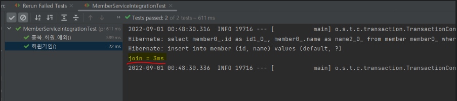
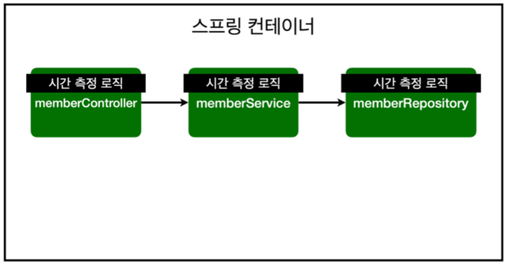
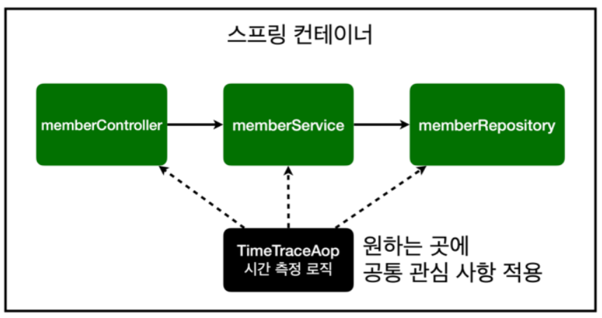
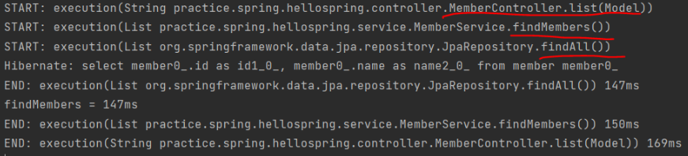
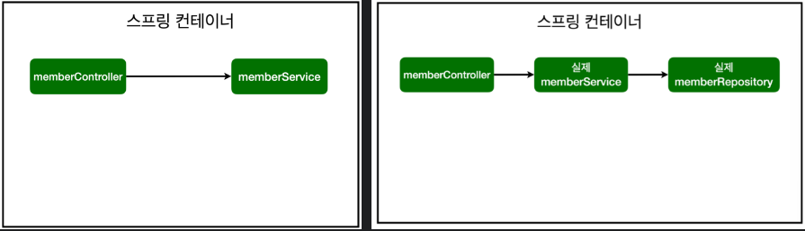
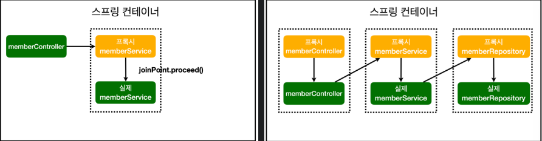
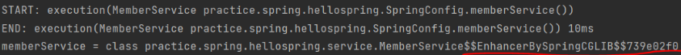

## 본문

### DI (Dependency Injection)

    정의 :

    의존성 주입은 객체 간의 의존 관계를 외부에서 주입하는 설계 패턴
    객체 스스로가 의존성을 생성하거나 관리하지 않고, 필요한 객체를 외부에서 주입받아 사용.

    핵심 :

    - new 키워드 없이 객체를 외부에서 주입받아 사용하는 방식     
    
    목적 :

    - 객체 간 결합도를 낮추고 재사용성을 높이며 테스트를 용의함.

### IoC (Inversion of Control)    

    정의 :

    제어의 역전은 객체의 생성, 생명주기 관리 등 제어권을 개발자가 아닌 프레임워크 or 컨테이너가 담당하도록 하는 개념.

    핵심 :

    - 제어권을 프레임워크에 위임하여 객체의 생성, 주입, 관리 등을 자동화
    - 개발자는 로직 구현에만 집중할 수 있다.

    역할 :

    - 객체 생성 : @Component, @Service, @Repository 등으로 등록된 객체를 스캔하여 생성.
    - 생명 주기 관리 : 객체의 생성부터 소멸까지 관리

    구현 방법 :

    1. 의존성 주입 (DI)
    - constructor, setter, field 주입

    1. 서비스 로케이터
    - IoC 컨테이너를 통해 필요한 객체를 요청하여 사용.

### IoC를 사용하는 코드 VS 사용하지 않는 코드

    ● 사용하지 않는 코드

    public class CoffeeService {

        private final CoffeeRepository coffeeRepository;

        public CoffeeService() {
            // CoffeeRepository 객체를 직접 생성
            this.coffeeRepository = new CoffeeRepository();
        }

        public void makeCoffee(String type) {
            coffeeRepository.save(type);
        }
    }

    public class CoffeeRepository {
        public void save(String type) {
            System.out.println(type + "coffee saved!");
        }
    }

    특징
    - CoffeeService 클래스에서 CoffeeRepository를 직접 생성(new 연산자 사용)
    - 강한 결합(타이트 커플링)으로 인해 객체 교체 및 테스트가 어려움.

    ● 사용한 코드

    // CoffeeRepository interface 변경
    public interface CoffeeRepository {
        void save(String type);
    }

    // CoffeeRepository의 구현체
    @Repository
    public class CoffeeRepositoryImpl implements CoffeeRepsitory {
        public void save(String type) {
            System.out.println(type + "coffee saved!");
        }
    }

    // CoffeeService 클래스에서 IoC 사용
    @Service
    public class CoffeeService {
        private final CoffeeRepository coffeeRepository;

        // 생성자 주입
        @Autowired
        public CoffeeService(CoffeeRepository coffeeRepository) {
            this.coffeeRepository = coffeeRepository;
        }

        public void makeCoffee(String type) {
            coffeeRepository.save(type);
        }
    }

    // Main 클래스에서 IoC 컨테이너 사용
    @SpringBootApplication
    public class CoffeeApplication {
        public static void main(String[] args) {
            ApplicationContext context = SpringApplication.run(CoffeeApplication.class, args);

            // IoC 컨테이너가 관리하는 CoffeeService 가져오기
            CoffeeService coffeeService = context.getBean(CoffeeService.class);
            coffeeService.makeCoffee("Espresso");
        }
    }

    특징
    - 객체 생성 및 주입은 Spring IoC Container 가 담당.
    - CoffeeService 와 CoffeeRepository 간 결합도가 낮아지고 테스트 및 유지보수가 쉬워짐

### DI 와 IoC의 관계

    - DI는 IoC의 한 구현 방법
    - IoC는 더 큰 개념으로, 객체 생성과 관리의 제어권을 외부로 넘기는 것.
    - DI는 IoC 컨테이너가 의존성을 주입하는 구체적인 방식.

### AOP 사용 이유?        

    어떤 경우에 AOP를 사용하나?

    1. 모든 메서드의 호출 시간 측정.
    2. 공통 관심 사항. (cross-cutting concern) vs 핵심 관심 사항 (core conern)
    3. 회원 가입 시간, 회원 조회 시간 측정.

    회원조회(findMembers), 가입(join) 시간 측정 추가 (in MemberService)

    public Long join(Member member) {

        // 중복된 이름을 가진 회원은 가입 불가능 조건
        long start = System.currentTimeMillis(); // 로직 시작 시간 찍기

        tyr {
            validateDuplicateMember(member); // 중복 회원 검증
            memberRepository.save(member);
            return member.getId(); // 회원 가입하면 아이디만 반환하도록 임의 설정
        } finally {
            long finish = System.currentTimeMillis(); // 로직 끝나는 시간 찍기
            long timeMs = finish - start; // 로직 돌아가는데 걸린 시간 계산
            System.out.println("join = " + timeMs + "ms");  // 메서드 명 + 걸린 시간 출력
        }
    }

    - 기존의 join 메서드를 약간 수정해줬다. 

    - 원리는 로직 끝나는 시간 - 로직 시작 시간으로 간단하게 계산하는 방식

    - 이때 시간 찍기위해 >> System.currentTimeMillis() 사용 [ms 단위로 시간 측정해줌]

    - 로직 끝나는 시간은 try가 끝난 이후 finally 문에서 실행해준다.

    

    ● findMembers

    public List<Member> findMembers() {

        long start = System.currentTimeMillis(); // 로직 시작 시간 찍기

        try {
            return memberRepository.findAll(); // List 형으로 반환
        } finally {
            long finish = System.currentTimeMillis(); // 로직 끝나는 시간 찍기
            long timeMs = finish - start; // 로직 돌아가는데 걸린 시간 계산
            System.out.println("findMembers = " + timeMs + "ms"); // 메서드 명 + 걸린 시간 출력
        }
    }

    - 클래스마다 시간 측정 로직을 하나하나 붙여줌 -> 문제 발생

    1. join, findMembers가 try문 안에 들어가고 부가 기능인 시간 측정이 더 눈에 띄는 주객전도 상황...(핵심 관심 사항x)

    2. 시간 측정 로직은 단지 공통 관심 사항일 뿐

    3. 그러나 공통 관심 사항 + 핵심 관심 사항 (=핵심 비즈니스 로직)이 섞여서 혼란.. -> 유지보수 어려움

    4. 그렇다고 공통로직 빼기는 불가능.

    5. 만약 시간 측정 로직을 수정하고 싶음 -> 전부 찾아서 변경 (노가다.) 

    -> 이런 문제 해결을 위해 aop 등장!

### AOP 정의

    배경) 비즈니스 컴포넌트 개발시 중요한 원칙

    1) 낮은 결합도 : DI을 통해 컴포넌드 쿠성 객체들의 결합도 낮출 수 있음 => 의존관계 변환 easy.

    2) 높은 응집도 : 핵심 비즈니스 로직을 분리하여 유지보수에 용이하게 하고, 부가적이고 반복적으로 등장하는 코드들은 따러 몰아서 효율적으로 관리 => AOP 담당.

    : Aspect Oriented Programming (관점 지향 프로그래밍)
    -> 공통 관심 사항 // 핵심 관심 사항으로 분리 -> 관심 분리.
    -> 공통 관심 사항을 한 곳에 다 모아서 구현한 후, 원하는 곳에 적용.

### 시간 측정 로직의 AOP 구현

    1. AOP 패키지 생성 (helloSpring/TimeTraceAop)

    2. AOP 구현
    - AOP로 사용하기 위해, @Aspect 필수

    @Aspect
    public class TimeTraceAop {

        public Object execute(ProceedingJoinPoint joinPoint) throws Throwable {

            // 구현 로직은 전과 동일
            long start = System.currentTimeMillis();

            // 어떤 메서드를 불러올지 확인
            System.out.println("START: " + joinPoint.toString());

            try {
                // proceed = 다음 메서드로 진행
                Object result = joinPoint.proceed();
                return result;
            } finally {
                long finish = System.currentTimeMillis();
                long timesMs = finish - start;

                // 메서드 이름 + 
                System.out.println("END: " + joinPoint.toString() + " " + timeMs + "ms");
            }
        }
    }

    ● joinPoint

    - 메서드가 호출될 대마다 joinpoint로 정보 전달
    - 호출시 마다 중간에서 intercept가 발생함 -> 중간에 인터셉터에서 처리해주는 기술이 AOP 이다.
    - 제공하는 메서드 중 getSignature() : 호출되는 메소드에 대한 다양한 정보를 Signature 객체로 넘김
    
    과정
    클라이언트가 비즈니스 메소드 호출 -> 스프링 컨테이너가 JoinPoint 객체를 생성 -> 메소드 호출 관련 모든 정보를 객체에 저장 -> execute 호출 시 인자로 넘김.

    ● ProceedingJoinPoint (interface) 

    - joinPoint를 상속받은 클래스에 proceed() 메소드가 더해진 것
    - 클라이언트의 요청을 가로챘으니 클라이언트가 호출한 비즈니스 메소드를 호출해 줘야함.
    - proceed() 메소드를 통해 비즈니스 메소드 호출 가능

    3. 작성한 TimeTraceAop를 스프링 빈으로 등록 => Annotation 이용/ 스프링 빈에 직접 등록

       1) @Component Annotation 이용 (Component Scan)

       @Aspect
       @Component
       public class TimeTraceAop {

           public Object execute(ProceedingJoinPoint joinPoint) throws Throwable {...}
       }

       2) 스프링 빈에 직접 등록 (Spring Config) >> 사용

       //SpringConfig
       /**
       * TimeTraceAop 스프링 빈으로 직접 등록
       */
       @Bean
       public TimeTraceAop timeTraceAop() {
           return new TimeTraceAop();
       }

    4. TimeTraceAop 클래스 안에 @Around 추가

    ● @Around

    (공통 관심 사항을 어디에 적용해 줄지 타겟팅 해줌.)
    - 패키지 하위에 전부 적용.
    - 경우에 따라 원하는 클래스명만 정의 가능.

    ● @Component

    - 스프링 컨테이너가 작동하며 클래스를 스캔. @Component가 붙은 클래스들은 자동으로 객체 생성해 스프링 빈에 올림.

    5. 서버 실행 console log

    - 시작부터 스프링 빈 자체가 올라가며 start, end 와 걸린 시간이 로그로 찍힌다.

    - 웹 프라우저를 띄운 후, 회원 목록을 클릭하면,

    회원 목록 조회와 관련된 요소들 (Controller, Service, Repository)이 순서대로 전부 실행되고, 각 소요시간이 출력됨을 알 수 있다.

    + Advice 

    - 공통으로 등장해 AOP로 분리한 코드(=공통 관심 사항)에 해당

    - 5가지 동작 시점이 존재 : before, after, after-returning, after-throwing, around

        - before : 비즈니스 메소드 실행 전 동작

        - After - Returning : 비즈니스 메소드 성공적 리턴 후 동작 (메소드 내부에 리턴값 존재해야 함)

        - After - Throwing : 비즈니스 메소드 실행 중 실패 (예외 발생)시 동작 (catch부분)

        - After : 비즈니스 메소드 실행 후 무조건 실행 (finally)

        - Around : 메소드 호출 자체를 가로채서(intercept) 비즈니스 메소드 특정 실행 시점에 로직 삽입 가능
      
### AOP 정리

    - 회원 가입/조회.. 핵심 관심 사항 <=> 공통 관심 사항을 분리 해준다.
    - 결과적으로 핵심 관심 사항은 핵심 비즈니스 메소드만 남겨놓을 수 있다.
    - 변경할 때 처리가 쉽고, 공통 로직도 원하는 대상을 골라서 쉽게 주입 가능.

    ● AOP 적용 전 의존관계/흐름

    @Autowired
    public MemberController(MemberService memberService) {
        this.memberService = memberService;
    }

    - 컨트롤러에서 서비스 호출 시, 해당 클래스와 바로 직결된 의존관계로 호출
    - memberController 에서 memberService 의존 : memberController 의 메소드 호출 => memberService의 메소드 호출.

    ● AOP 적용 후 의존관계/흐름

   

    - 중간에 AOP 가 끼어든 상태
    - AOP가 중간에서 가짜(by proxy) memberService를 만듦 (클라이언트가 요청한 메소드 가로챔)
        - 스프링 빈 등록 시, 가짜 스프링 빈을 통해 AOP 먼저 다 실행 후 procedd()로 실제 요청한 메소드를 실행시킨다.

        -> 결과적으로 memberController가 호출한 것은 가짜 memberService

   

    - 실제로 getClass를 이용해 확인한 결과
    - memberService를 복제해 조작한 클래스가 객체(=가짜 memberService)가 호출 됐음을 확인 가능 == 프록시가 주입됨

    따라서, AOP는 DI가 기반으로 되어있기에 가능한 기술이라고도 볼 수 있다.

### AOP 적용한 로깅

    - 특정 패키지의 메서드 실행 전후로 로그를 기록.

    @Aspect
    @Component
    @Slf4j
    public class LoggingAspect {

        @PointCut("execution(* com.example.service.."(..))") // 특정 패키지(service)의 모든 메서드
        public void serviceMethods() {}

        @Around("serviceMethods()")
        public Object logExecutionTime(ProceedingJoinPoint joinPoint) throws Throwable {
             
            long start = System.currentTimeMillis();

            log.info("START: {} with arguments {}", joinPoint.getSignature(), joinPoint.getArgs());

            Object result = joinPoint.proceed(); // 실제 메서드 실행

            long executionTime = System.currentTimeMillis() - start;

            log.info("END: {} executed in {}ms", joinPoint.getSignature(), executionTime);

            return result;
        }
    }

    - 호출된 메서드: OrderService.placeOrder(String orderId)

    - 출력 로그

        -START: void com.example.service.OrderService.placeOrder(String) with arguments [order123]

        -END: void com.example.service.OrderService.placeOrder(String) executed in 45ms

### 요즘 프로젝트에서는 잘 사용하지 않는 AOP

    1.프레임워크에서 이미 구현된 기능 활용

    - Spring Security: 보안 기능에서 AOP를 사용하지 않고 @PreAuthorize, @PostAuthorize 같은 애너테이션으로 접근 제어를 처리.

    - Spring Transaction: @Transactional로 트랜잭션 관리가 충분히 가능.

    - Java 8 이상에서는 람다와 함수형 인터페이스를 활용한 코드가 더 간결하고 명확하게 로직을 처리할 수 있습니다.

    ● 로깅 (AOP 대신 @Slf4j)

    @Slf4j
    @Service
    public class OrderService {
        public void placeOrder(String orderId) {
            log.info("START: placeOrder with orderId={}", orderId);
            // 비즈니스 로직
            log.info("END: placeOrder with orderId={}", orderId);
        }
    }

    ● 트랜잭션 관리 (@Transactional로 트랜잭션을 관리.)

    @Service
    public class PaymentService {
        @Transactional
        public void processPayment(Order order) {
            // 트랜잭션 처리 로직
        }
    }

    ● 보안 (Spring Security에서 제공하는 어노테이션 대체)

    @RestController
    public class AdminController {
        @PreAuthorize("hasRole('ADMIN')")
        @GetMapping("/admin/dashboard")
        public String adminDashboard() {
            return "Admin Dashboard";
        }
    }

### 요즘 프로젝트에서 @Aspect를 사용하는 경우    

    1. 커스텀한 공통 관심사를 처리해야 할 때
        예: 서비스 로직의 실행 시간을 특정 방식으로 기록.

    2. 기본 제공 기능으로는 처리할 수 없는 복잡한 요구사항
        예: 비즈니스 로직마다 다른 정책으로 권한을 검사.

    3.레거시 코드 유지보수
        기존 시스템에서 AOP를 사용하고 있다면 계속 사용할 가능성이 높음.
