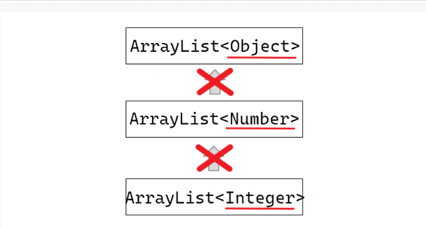

## 본문

### Generics

    "다양한 타입의 객체들을 다루는 메소드나 컬렉션 클래스에 컴파일 시의 타입 check를 해주는 자바의 기능"

    다룰 객체의 타입을 미리 명시해줌으로써 번거로운 형변환을 줄여준다는 의미.

    public class Generics_1 {
        public static void main(String[] args) {
            List<String> stringList = new ArrayList<>();
        }
    }

    ArrayList를 보면 List <>안에는 String이라고 선언해주었다.

### Generic Type class 선언

    Generics 타입은 클래스와 메소드에 선언할 수 있다.

    public class Box {

        Object item;

        void setItem(Object Item) {
            this.item = item;
        }

        Object getItem() {
            return this.item;
        }
    }

    위 클래스를 generics 클래스로 바꾸어주려면 <T>만 붙여주면된다.

    public class Box<T> {

        T item;
    
        void setItem(T Item) {
            this.item = item;
        }
    
        T getItem() {
            return this.item;
        }
    } 

    Box<T>에서 T는 '타입 변수'라고 하며, Type의 첫 글자에서 따온 것입니다.

    일반적으로 타입 변수가 여러 개인 경우에는 Map<K,V>와 같이 콤마를 구분자로 나열하면 됩니다.

    Map에서 지네릭 타입변수는 K는 Key, V는 Value를 의미합니다. 무조건적으로 T를 사용하기 보다 상황에 맞게 의미있는 문자를 선택해서 사용하면 되겠습니다. 일반적으론 아래 표의 타입들이 많이 쓰입니다. 한 글자가 아니여도 상관없지만 통상적으로 한 글자로 사용.

| 타입 | 설명 |
| :----: | :----: |
| T | Type |     
| E | Element |
| K | Key |
| V | Value |
| N | Number |

### Generic Class 객체 생성, 사용

    Generic 클래스가 된 Box 클래스의 객체를 생성할 때는 참조변수와 생성자에 타입 T 대신 사용될 실제 타입을 지정해주어야 한다.

        Box<String> b = new Box<String>();
        b.setItem("ABC");
        System.out.println("b.getItem() = " + b.getItem());

        Box<Long> longBox = new Box<Long>();
        longBox.setItem(1L);
        System.out.println("longBox.getItem() = " + longBox.getItem());

    만일 Box 클래스에 String만 담고 싶다면, 타입 변수를 선언하지 않고, 직접 타입을 적어주는 것도 가능하다.

    예를 들어 위 코드처럼 String 타입으로 한정하여 타입변수를 작성하면 Box<String> b에는 String만 사용할 수 있다.

    또는 클래스를 선언할 때 이렇게 타입을 미리 정해놓아 생성 시, Box<String>으로 제한하는 방법도 있다.

        public Box<String> {

            String item;

            void setItem(String item) {
                this.item = item;
            }

            String getItem() {
                return this.item;
            }
        }

    Generic 클래스의 객체를 생성할 때는 반드시 지켜야할 룰이 있습니다.
    반드시 생성자에 대입된 타입과 참조변수가 일치해야 합니다.

    Box<String> b = new Box<Long>(); // Error
    Box<String> b = new Box<String>(); // OK    

    + 지네릭 클래스의 타입이 상속관계에 있을 때도 선언 시 타입 변수는 일치시켜 주어야 함.

        class Box<T> {
            T item;
        
            void setItem(T item) {
                this.item = item;
            }
        
            T getItem() {
                return this.item;
            }
        }
        
        class RedBox<T> extends Box {}
        
    + JDK 1.7 부터는 추정이 가능한 경우 생성자에 대입된 타입 생략할 수 있습니다.

    Box<String> b = new Box<>();
    Box<String> b = new Box<String>(); // 두 문장이 동일하게 동작합니다.

### 제네릭 타입은 상하관계가 없다.

    객체와 달리 제네긹의 타입 파라미터<> 끼리는 타입이 아무리 상속 관계에 놓인다 한들 캐스팅이 불가능하다.

    제네릭은 전달받은 까 그 타입으로만 서로 캐스팅이 가능하다.

    

    - ArrayList<Object> arrlist = new ArrayList<String>(); // 공변성 지원 X 컴파일 에러
    - ArrayList<Integer> arrlist = new ArrayList<Object>(); // 반공변성 지원 X 컴파일 에러
    
    제네릭 타입은 객체지향의 기능인 다형성을 사용할 수 없다.
    따라서 같은 기능을 하는 메소드를 만들고자 할 때, 여러 타입에 걸쳐 아래와 같이 오버로딩 해주어야 할 것 같지만, 오버로딩 또한 불가능하다.

        why?
        자바에서는 컴파일 시점에 제네릭 타입을 제거해버리기 때문에 FruitBox라는 원시타입만 남게 된다.

        따라서 자바는 컴파일 시점에 이를 오버로딩으로 보지 않고, '메소드 중복 정의'로 볼 수 밖에 없다.

    public static void makeJuice(FruitBox<Fruit> box) {
        String tmp = "";
        for (Fruit f : box.getList()) {
            System.out.println("Fruit = " + f);
        }
    }

    public static void makeJuice(FruitBox<Apple> box) {
        for (Fruit f : box.getList()) {
            System.out.println("Apple = " + f);
        }
    }

    이렇게 제네릭은 다형성과 오버로딩 또한 불가능하기에 이럼 문제들을 해결해주기 위해 나온 기능이 '와일드 카드'이다.

    ● 상한 경계
    - <? extends T> : 와일드 카드의 상한 제한, T와 그 자손들만 가능
    
    ● 하한 경계
    - <? super T> : 와일드 카드의 하한 제한, T와 그 조상들만 가능

    ● 비경계
    - <?> : 제한 X, 모든 타입이 가능. <? extends Object>와 동일
    
    - 와일드 카드는 기호 '?'로 표현하고 ?에는 어떠한 타입도 들어올 수 있습니다.

    이제 아래처럼 와일드 카드를 사용하면 Fruit을 포함한 모든 자손 타입의 FuritBox가 메소드의 매개변수로 넣을 수 있게 된다.

    static Juice makeJuice(FruitBox<? extends Fruit> box) {
        String tmp = "";
        for (Fruit f : box.getList()) tmp += f + " ";
        return new Juice(tmp);
    }

    ● 추가 설명

    FruitBox<? extends Fruit>를 사용하면 Fruit 클래스와 그 자손 클래스들(Apple, Orange등)을 FruitBox의 타입으로 하는 객체를 매개변수로 받을 수 있다.
    이 방식으로 유연하게 다양한 자식 타입을 허용하며, 부모 타입인 Fruit로 제한을 걸 수 있다. 
    이를 통해 Fruit 클래스와 자식 클래스 간의 관계에서 타입 안정성을 유지하면서 메소드 내에서 다양한 자손 타입을 처리할 수 있다.

    class Fruit {
        @Override
        public String toString() {
            return "Fruit";
        }
    }

    class Apple extends Fruit {
        @Override
        public String toString() {
            return "Apple";
        }
    }

    class Orange extends Fruit {
        @Override
        public String toString() {
            return "Orange";
        }
    }

    class Juice {
        private String ingredients;
        public Juice(String ingredients) {
            this.ingredients = ing~~;
        }

        @Override
        publicl String toStirng() {
            return "juice made of: " + ingredients;
        }
    }

    class FruitBox<T> {
        private List<T> list = new ArrayList<>();

        public void add(T item) {
            list.add(item);
        }

        public List<T> getList() {
            return list;
        }
    }

    public class Main {
        static Juice makeJuice(FruitBox<? extends Fruit> box) {
            String tmp = "";
            for (Fruit f : box.getList()) tmp += f + " ";
            return new Juice(tmp);
        }

        public static void main(String[] args) {
        FruitBox<Apple> appleBox = new FruitBox<>();
        appleBox.add(new Apple());
        appleBox.add(new Apple());

        FruitBox<Orange> orangeBox = new FruitBox<>();
        orangeBox.add(new Orange());
        orangeBox.add(new Orange());

        Juice appleJuice = makeJuice(appleBox);
        Juice orangeJuice = makeJuice(orangeBox);

        System.out.println(appleJuice);  // Juice made of: Apple Apple 
        System.out.println(orangeJuice); // Juice made of: Orange Orange 
        }
    }