## 본문

### JVM 구조

    Java는 컴파일 방식과, 인터프리터 방식의 장점을 결합한 하이브리드 언어이다.

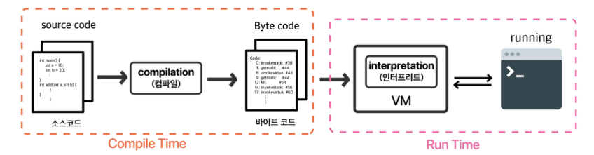

    하이브리드 방식에는 작성된 원시코드를 이진파일로 컴파일하는 과정과, 실제 해당 코드가 실행되는 시점(Runtime)에서 JVM에서 이 이진파일에서 필요한 부분들을 한 줄씩 읽어(interprete) 실행된다.

    Runtime 시점에서 JVM을 통해 동작하여 자바는 운영체제로부터 독립적인 환경에서 실행 사능하다는 장점을 가지고 있다.

### JVM 동작 방식

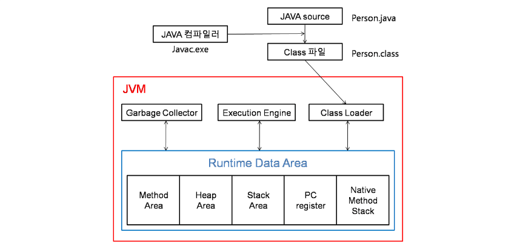

    1. 자바로 작성된 프로그램을 실행하면 JVM은 운영체제로부터 메모리를 할당 받는다.

    2. 자바 컴파일러가 자바 소스코드를 자바 바이트 코드(.class)로 컴파일

    3. 이 바이트 코드 파일을 JVM 내부 Class Loader를 통해 Runtime Data Area로 로딩한다.

        ● Class Loader
            - 자바는 실행 시점에 동적으로 클래스를 읽어오기 때문에, 실행 시점에서 코드가 JVM과 연결된다.

            - Java에서 소스를 작성한 파일을 Java -> 실행 시점에 Java로 부터 필요한 코드를 뽑아온 이후 이진 파일로 변환된 .class 파일들을 적재하는 곳이 Class Loader.
      
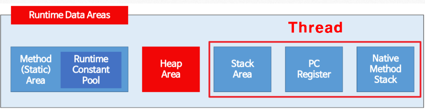      

        ● Runtime Data Area

            - 실행 시점에 사용하는 데이터들은 운영체재로부터 할당받은 메모리 영역인 Runtime Data Area에 메소드 영역, 힙 영역, 스택 영역, PC 레지스터, 네이티브 메소드 스택 5가지로 구분.

            - Class Loader에서 로드 받은 .class 파일들을 메소드 영역에 저장.

    4. Runtime Data Area에 로딩된 .class 파일들을 Excution Engine을 통해 해석된다.   

        ● Execution Engine
            
            Runtime Data Area의 메소드 영역에 배치된 .class 파일들을 Execution Engine에 provide하여, 정의된 내용대로 바이트 코드를 실행시킵니다. (실제적으로 이진파일들이 실행되는 중요한 곳) 

    5. 해석된 바이트 코드는 Runtime Data Area의 각 영역에 배치되어 수행하며, 이 과정에서 Excution Engine에 의해 가비지 컬렉터가 동작하며, 스레드 동기화 또한 이루어집니다.

        ● GC(Garbage Collector)

        - 더 이상 사용하지 않는 메모리를 자동으로 회수해주는 역할
        - 이 덕분에 개발자는 별도로 사용하지 않는 메모리를 관리하지 않아도 됩니다.

        - 어떻게 작동하는가?
            - Heap 메모리 영역에 생성된 객체들 중에 참조되지 않은 객체들을 탐색 후 제거하는 역할을 하며 해당 역할을 하는 시간은 정학이 알 수 없다.

### Runtime Data Area의 각 영역에 어떤게 저장될까?

    1. 메소드 
    
    - 실행 시점에 사용되는 .class 파일들이 메소드 영역에 저장된다.
    - 뿐만 아니라 클래스 멤버 변수의 이름, 데이터 타입, 접근 제어자 정보와 같이 각종 필드 정보들과 메소드 정보 데이터 Type 정보, static 변수, final class, 상수 풀 등이 이 곳에 저장된다.

    2. Heap

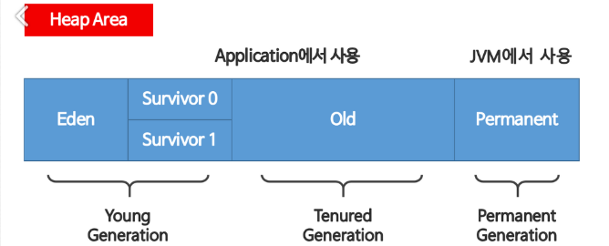  

    - new 키워드로 생성된 객체, 배열이 저장되는 곳

### static area

    하나의 java 파일은 크게 field, constructor, method 로 구성된다.
    그중 필드 부분에서 선언된 변수(전역변수)와 정적 멤버변수(static이 붙은 자료형) static 영역에 데이터를 저장한다.

    static 영역의 데이터는 프로그램의 시작부터 종료가 될 때까지 메모리에 남아있게 된다.다르게 말하면 전역변수가 프로그램이 종료될 때까지 어디서든 사용이 가능한 이유이기도 하다.
    
### Stack area
    
    Stack의 경우에는 정적으로 할당된 메모리 영역이다.
    (데이터의 값이 저장되는 공간.)

    Stack에서는 Primitive 타입 (boolean, char, short, int, long, float, double) 의 데이터가 값이랑 같이할당이 되고,

    또 Heap 영역에 생성된 Object 타입의 데이터의 참조 값이 할당 된다.

    그리고 Stack 의 메모리는 Thread당 하나씩 할당 된다. 만약 새로운 스레드가 생성되면 해당 스레드에 대한 Stack이 새롭게 생성되고, 각 스레드 끼리는 Stack 영역을 접근할 수 가 없다.

    stack 영역은 LIFO(Last In First Out)의 구조를 갖고 변수에 새로운 데이터가 할당되면 이전 데이터는 지워진다.

### Heap area   

    1.
    Heap의 경우에는 동적으로 할당된 메모리 영역이다.

    힙 영역에서는 모든 Object 타입의 데이터가 할당이 된다. (참고로 모든 객체는 Object 타입을 상속받는다.)

    Heap 영역의 Object를 가리키는 참조변수가 Stack에 할당이 된다. 어플리케이션에서의 모든 메모리 중에서 Stack에 쌓이는 애들 빼고는 전부 이 Heap 쌓인다고 보면 편할듯 하다..

    근데 보통 이 Heap 영역의 데이터들은 생명주기가 길다. 그 이유는 대부분 Object의 크기가 크고, 서로 다른 코드블럭에서도 공유가 되다 보니 그런것이다. 

    그리고 Heap 은 Stack 처럼 Thread 마다 하나씩있는게 아니라 여러개의 Thread가 있어도 힙은 단하나의 영역만 존재한다. 헷갈리지 말자.

    2.
    인스턴스 생성 = "class variable = new class();"

    참조현의 데이터 타입을 갖는 객체, 배열 등은 Heap 영역에 데이터가 저장.
    이때 변수(객체, 객체변수, 참조변수)는 stack 영역의 공간에서 실제 데이터가 저장된 Heap 영역의 참조값(해시코드/메모리에 저장된 주소를 연결해주는 값)을 new 연산자를 통해 return.

    다시말해, "실제 데이티를 갖고 있는 Heap 영역의 참조 값을 Stack 영역의 객체를 갖고 있다." 

    이렇게 리턴 받은 참조 값을 갖고 있는 객체를 통해서만 해당 인스턴스를 핸들 할 수 있다.

    ● 예제1
    public class HeapAreaEx01 {

        public static void main(String[] args) {
            int[] a = null; // int형 배열 선언 및 stack 영역 공간 할당
            System.out.println(a); // 결과 : null
            a = new int[5]; // Heap 영역에 5개의 연속된 공간 할당 및 변수 a에 참조값 할당
            System.out.printlnt(a); // 결과 : @14db3331 (참조값)
        }
    }

    설명은 소스 코드의 주석 처리된 부분과 같다. 결국 a변수는 데이터가 저장된 Heap영역의 참조 값을 리턴 받아 갖고 있다.

        - a 변수는 실제 데이터를 저장한 Heap 영역의 참조값을 가진다.

        - int[] a = null;
            - a라는 배열 변수가 stack 영역에 할당된다. 이때 a는 초기화되지 않았으므로 null을 가진다. 즉, 아직 어떤 객체도 가리키지 않는 상태.

        - a = new int[5];
            - Heap 영역에 int 5개의 연속된 메모리 공간을 생성한다. 이 배열은 각 요소가 기본값 0으로 초기화 된다.
            - Heap에 생성된 배열 객체의 주소(참조값)가 a에 할당된다. 이제 a는 Heap의 배열 객체를 참조하게 된다.
    
    따라서 a변수는 Heap에 있는 실제 배열을 가리키는 참조값을 Stack에 저장하고 있는것이다.

    ● 예제2
    public class HeapAreaEx02 {

        public static void main(String[] args) {
            String str1 = new String("joker");
            String str2 = new String("joker");
            if (str1 == str2) {
                System.out.println("같은 주소값 입니다.");
            } else {
                System.out.println("다른 주소값 입니다".);
            }
        }
    }
    
    문자열을 저장하는 String도 참조형이다. new 연산자를 이용해서 생성하면 데이터는 Heap 영역에 저장되고, str1과 str2는 참조 값을 리턴 받는다. 저장된 주소가 다르기 떄문에 "=="으로 비교 시 "다른 주소값 입니다."가 출력되는 것이다. 

    ● 예제3
    class A{}

    public class HeapArea {

        public static void main(String[] args) {
            A a = null; // A타입의 a객체 선언 및 stack 영역 공간 할당.
            System.out.println(a); // 결과 : null
            a = new A(); // Heap 메모리에 공간 할당 및 객체(a)에 참조값 할당
            System.out.println(a); // 결과 : @15db9742
        }
    }

    결국 "객체가 참조 값을 갖는다."

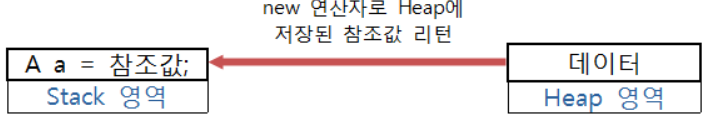

    참고로 Heap에 저장된 데이터가 더 이상 사용이 불필요하다면 메모리 관리를 위해 JVM에 의해 알아서 해제된다. 이러한 기능을 GC라고 한다.

### 예제 코드2

    public class Main {

        public static void main(String[] args) {

            int age = 32;
            String name = "kang";

            List<String> skills = new ArrayList<>();
            skills.add("java");
            skills.add("js");
            skills.add("c++");

            test(skills);

        }

        public static void test(List<String> list) {
            String mySkill = list.get(0);
            list.add("python");
        }
        
    }

    ● int_age = 32; 가 메모리 영역에 할당되는.

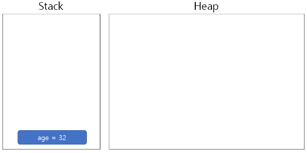   

    ● String name = "kang"; 가 메모리 영역에 할당되는.

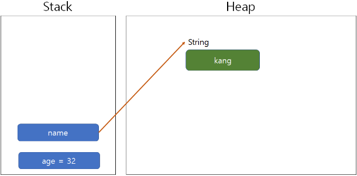

    String -> object를 가리키는 변수만 Stack에 쌓이고, String Object 자체는 Heap에 할당된다.

    ● List<String> skills = new ArrayList<>();

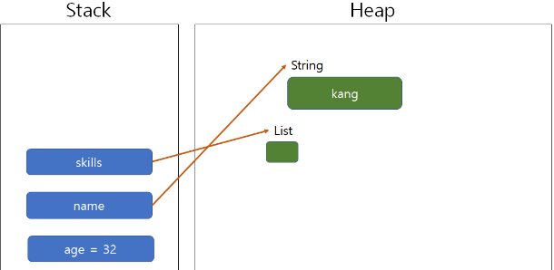

    skills 리스트가 ArrayList로 아직 값이 채워지지않고 생성만됐을 때 상태는 위와 같다.

    ● 여기서 값이 Add가 되면 이렇게 된다.
    skills.add("java");
    skills.add("js");
    skills.add("c++");

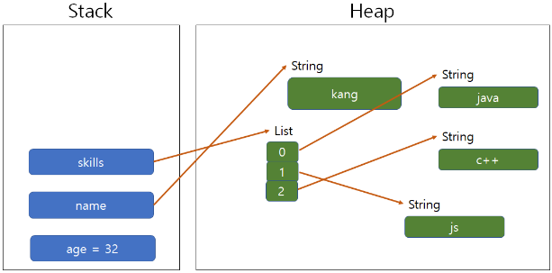

    ● test(skills);
    public static void test(List<String> list) {
        String mySkill = list.get(0);
        list.add("python");
    }

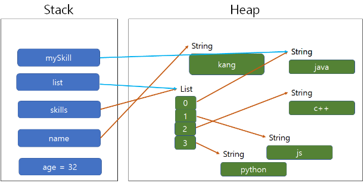

    메서드의 파라미터인 list는 Heap에 할당 되어 있는 List를 가르킬 것이고,
    mySkill은 Heap 영역의 "java" String을 참조할 것이다.
    그리고 list 3번 index에 "python"이라는 값을 연결 시킨다.

    그리고 저 메서드가 종료되면서 Stack에서는 Pop이 일어나면서 Stack에 list랑 mySkill은 날라가버린다.

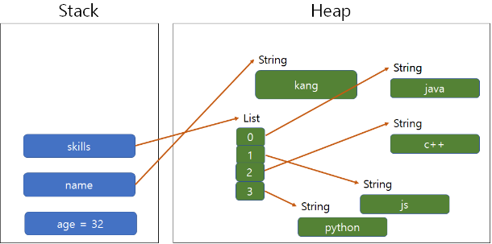

    public class Main {

        public static void main(String[] args) {

            String name = "kang";
            System.out.println("Before Name : " + name);

            changeName(name);
            System.out.println("After Name 1 " + name);

            name += " babo";
            System.out.println("After Name 2 " + name);
        }
        public static void changeName(String s) {
            s += " babo";
        }
    }

    Before Name : Kang
    After Name 1 : Kang
    After Name 2 : Kang babo

    내가 아까부터 설명했던 이론대로라면 After Name 1 도 kang babo가 나와야 한다. 

    ● 그런데 왜 그냥 kang이 나온걸까?

    String name = "kang";
    여기 까지의 메모리 상태를 보면 다음과 같다.

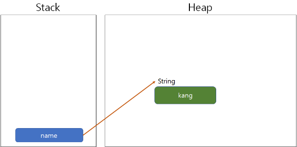

    changeName(name);

    이 메서드가 실행될 때 "kang" object를 파라미터인 s에다가 복사를 하면서 changeName 메서드가 시작된다.

    ● 그런데 List는 그대로 가리켰는데 changeName()는 왜 복사한 값을 가리킬까?

    String이 immutable한 클래스이기 때문이다. 말그대로 변경할 수 없는, 불변의 객체라는 것이다.
    String 이외에도 immutable한 클래스는 Boolean, Integer, Float, Long, Double 등이 있다. 반대로 mutable한 객체는 List, ArrayList, HashMap 등 컬렉션들이 대표적이다.

    changeName 내부의 로직은 실제로 s에다 "babo"라는 문자열을 더하는 것처럼 보이지만 실제로는 새로운 String을 생성하는 것이다.

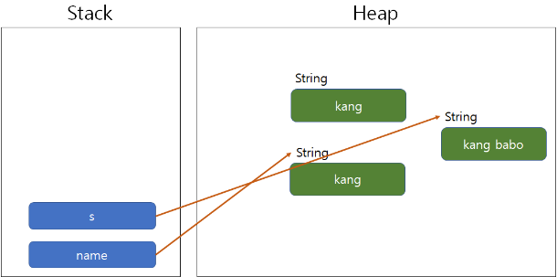 

    하지만 우리가 프린트 찍은 내용은 name 이기 때문에, "kang"이라는 결과가 나온 것이다.
    그리고 s는 메서드 끝나면서 pop 될 것이라 사라진다.

    ● 다음은 name에 직접 "babo"를 붙여보면 아래처럼 될 것이다.

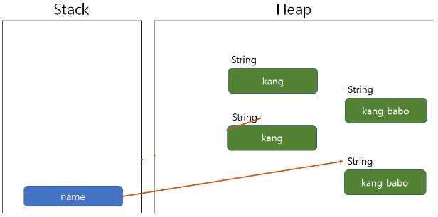

    그렇기에 "kang babo"로 값이 나온다.

