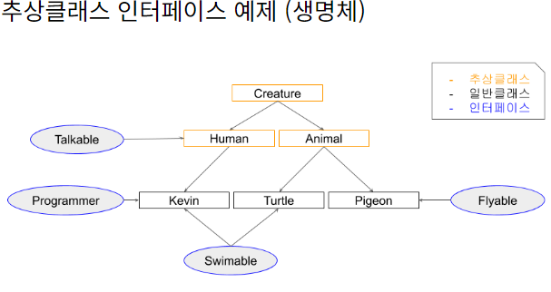

## 본문

### abstract

    선언부만 있고, 구현부가 없는 메소드를 추상 메소드라 하고, 하나 이상의 추상 메소드를 포함하고 있는 클래스는 반드시 abstract 제어자를 붙여야 하며 이를 '추상 클래스'라고 한다.

    추상 클래스는 하나 이상의 추상 메소드를 갖는다고 했는데, 그렇다면 추상 클래스는 반드시 추상 메소드를 가진다고 볼 수 있을까?

    - 항상 그렇진 않다.
      - 추상 메소드를 갖는 클래스는 반드시 추상 클래스로 설정해야 하는 것은 맞지만, 반대로 추상 클래스가 반드시 추상 메소드를 가져야 하냐고 묻는다면 꼭 그렇지 않다.

### 추상 클래스를 사용하는 이유?

    - 추상 클래스는 한마디로 정의하면 미완성 설계도이다.      

    미완성이기 때문에 오직 상속을 통해 하위 클래스에서만 완성될 수 있다.
    추상 클래스 대신에 인터페이스를 쓸 수도 있지만, 인터페이스에서는 선언부만 있기 때문에 이를 구현한 하위 클래스에서는 공통적인 기능이 중복되더라도 모두 중복적으로 구현부에 작성을 해야하지만, 추상 클래스를 사용하면 추상 클래스를 상속받은 하위 클래스들이 추상 클래스에서 설계된 공통적인 기능들에 대한 메소드를 굳이 구현할 필요가 없기 때문이다.

    - interface : 선언부만 존재, 이를 구현체에 작성, 공통 기능이 중복되더라도 중복적으로 작성.

    - abstract : 상속받은 하위 클래스들이 추상 클래스에서 설계된 공통 기능을 굳이 구현할 필요가 없다.

    ● 요약

    1. 객체들의 필드와 메소드의 이름을 추상 메소드에 통일하여 소스의 가독성을 높일 수 있고,

    2. 모든 객체들에 공통적인 메소드와, 필드들을 추상 클래스로 만들고 이 추상 클래스를 하위 자식들이 상속받아 필요한 필드와 메서드를 그대로 상속하고 추상 클래스는 자식에서 재정의 하는 방식을 통해 개발의 효율성을 증대시킬 수 있다.

## interface vs abstrack

    추상 클래스와 인터페이스의 차이점은 그 목적이라고 할 수 있습니다. 추상 클래스는 기본적으로 클래스 이며 이를 상속, 확장하여 사용하기 위한 것입니다. 반면 인터페이스는 해당 인터페이스를 구현한 객체들에 대한 동일한 사용방법과 동작을 보장하기 위해 사용합니다.

    - extends
    코드의 재사용과 확장이 주 목적입니다. 상속받은 클래스는 필요에 따라 메서드를 재정의하거나 추가적으로 확장할 수 있으며, 상위 클래스가 추상 클래스인 경우에는 필수적으로 추상 메서드를 구현해야 합니다.

    - interface
    클래스가 특정 동작을 제공하도록 강제하는 것이 목적입니다 그 객체는 인터페이스를 구현하는 클래스는 모든 인터페이스 메서드를 오버라이딩하여, 인터페이스에 정의된 동작을 반드시 제공하게 됩니다.

    extends : 주로 구현을 재사용하고, 추가적인 기능 확장을 위해 사용.
    interface : 특정 기능의 일관된 사용 방법을 보장하고, 동작을 강제하는 데 중점을 둔다.

### abstrack (클래스이다.)

    ● 목적 
      - 상속을 통한 코드 재사용 
          - 공통적인 기능을 구현하여 여러 하위 클래스에서 코드 중복을 줄임.

      - 상태 유지 
          - 인스턴스 변수를 가질 수 있어, 하위 클래스에서 공통된 상태를 유지하거나 설정할 수 잇음.

      - 부분 구현 제공
          - 메서드의 일부는 구현을 제공하고, 나머지는 하위 클래스에서 구현하도록 강제할 수 있다.

    ● 특징
      - 추상 메서드(구현이 없는 메서드)와 일반 메서드(구현이 있는 메서드)를 모두 가질 수 있습니다.

      - 생성자를 가질 수 있습니다.

      - 인스턴스 변수를 가질 수 있습니다.

      - extends (확대) : 키워드를 사용해서 자신의 기능들을 하위 클래스로 확장 시키는 느낌

### interface (클래스가 아니다.)

    ● 목적
      - 다양한 클래스 간의 계약 
          - 특정 기능을 구현하는 데 필요한 메서드 시그니처(구현부는 없음)를 정의하여, 이를 구현하는 모든 클래스가 동일한 기능을 제공할 수 있도록 함.
    
      - 다중 상속 지원
          - 클래스를 상속하는 것이 아닌 인터페이스를 구현함으로써, 여러 인터페이스를 동시에 구현.

        "인터페이스는 클래스와 별도로 구현 객체가 같은 동작을 한다는 것을 보장하기 위해 사용하는 것에 초점"

    ● 특징
      - 모든 메서드는 기본적으로 추상적이며, Java 8부터는 default 메서드와 
      static 메서드를 포함할 수 있습니다.

      -인스턴스 변수를 가질 수 없습니다. 모든 변수는 기본적으로 public static final입니다.

      - 생성자를 가질 수 없습니다.

      - implements (실행) : 키워드처럼 인터페이스에 정의된 메서드를 각 클래스의 목적에 맞게 기능을 구현하는 느낌
    
### interface va abstrack 정리

|  특징   |  abstrack   |  interface   |
| ------- | ------- | ------- |
| 메서드 구현 | 추상 메서드 + 일반 메서드 | 추상 메서드 (default 메서드 기능)|
| 인스턴스 변수 | 가질 수 있음| 가질 수 없음 |
| 다중 상속 | 불가능 (단일) | 가능 (여러 인터페이스 구현 가능) |
| 상태 유지 | 가능 | 불가능 |
| 목적 | 코드 재사용 및 상태 유지 | 계약 정의 및 느슨한 결합 유지 | 

    우선 추상클래스는 일반적인 클래스와 동일하게 멤버변수와 메서드를 갖습니다. 그리고 추가적으로 '추상메서드'를 갖습니다. 추상 메서드는 메서드의 선언부만 존재하고 구현코드가 없는 아래와 예와 같은 메서드를 말합니다.

        - public String getUserName(int idx);

    구현부가 없는 메서드를 단 하나라도 가진 클래스는 추상 클래스가 됩니다. 추상 클래스가 되면 new 키워드를 사용하여 인스턴스화 할 수 없습니다. 즉, 클래스를 쓸 수 없습니다. 이 클래스를 사용하려면 어떻게 해야 할까요?

    다른 클래스가 이 추상 클래스를 상속받아야 합니다. 상속 받은 자식 클래스가 부모 클래스에 존재하는 추상메서드를 전부 오버라이딩 하여 구현부를 작성하면 비로소 사용할 수 있는 객체가 됩니다.

    인터페이스는 사실 추상 클래스의 특수형태 입니다. 추상 클래스 중에서 멤버 변수와 메서드를 제거한 채 추상 메서드만을 남긴 형태가 인터페이스 입니다. (인터페이스도, public static 상수를 가질 순 있습니다)

    인터페이스도 마찬가지로 이를 구현한 자식 클래스에서 인터페이스의 추상 메서드를 모두 오버라이딩 해야 비로소 객체로 사용할 수 있습니다. (추상클래스나 인터페이스를 구현한 자식 객체가 추상 메서드를 전부 구현하지 않았다면 아예 컴파일이 되지 않습니다. 혹은 자식 객체도 추상클래스가 되어야 합니다.)    
    
### 추상 클래스는 인스턴스 생성이 가능한가?

    - 익명 inner class 생성은 가능하지만, 추상 클래스의 의도와 목적을 알고나면 추상 클래스를 인스턴스로 생성해서 사용할 이유가 전혀 없다.    

### 추상 메소드 접근 제어자 설정에 주의할 점.

    - abstarct 메소드는 static과 함께 사용할 수 없다.

        - absract 제어자는 선언부만 있는 메소드로 하위 클래스에서 구현하여 사용하는 메소드이고, static 제어자를 가지는 메소드는 인스턴스를 생성하지 않고도 사용할 수 있어야 하므로 abstract와 static은 공존할 수 없다.

    - abstract 메소드는 private와 함께 사용할 수 없다.

        - abstract 제어자는 선언부만 있는 메소드로 하위 클래스에서 구현하여 사용되는 메소드.      

    - abstarct 메소드는 final과 함께 사용할 수 없습니다

        - abstract 제어자는 선언부만 있는 메소드로 하위 클래스에서 구현하여 사용하는 메소드인데,
        이 때 final로 오버라이딩을 막아버리면 하위 클래스에서 오버라이딩이 불가능하므로 abstract와 final은 공존할 수 없습니다.  

### 추상 클래스 접근 제어자 설정에 주의할 점.

    - 추상 클래스에는 final 키워드를 붙일 수 없다
      - final 키워드가 클래스에 붙게 되면 클래스를 상속을 못하돌고 막아버리는데, abstract 클래스는 다른 클래스가 상속해서 오버라이딩해야 사용할 수 있으므로, abstarct 와 final 키워드는 공존할 수 없다.(메소드도 마찬가지)