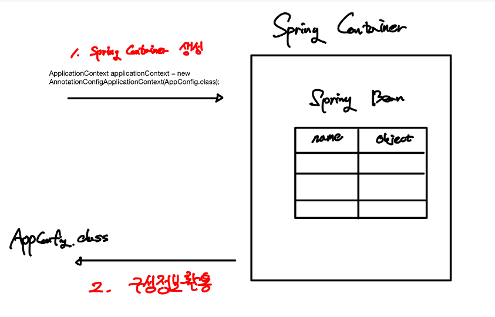
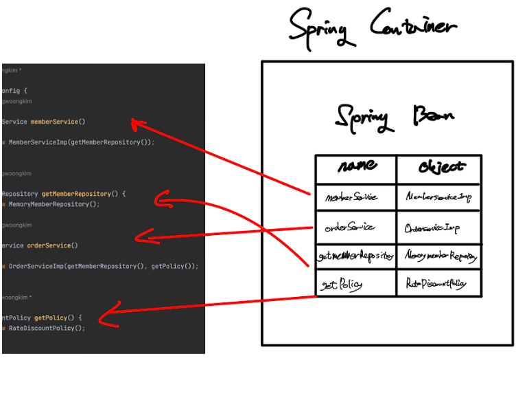
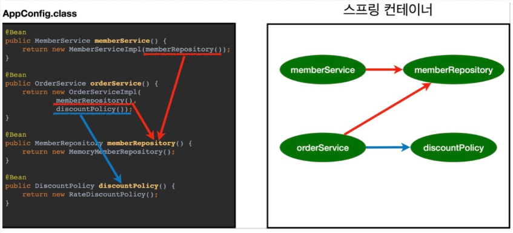
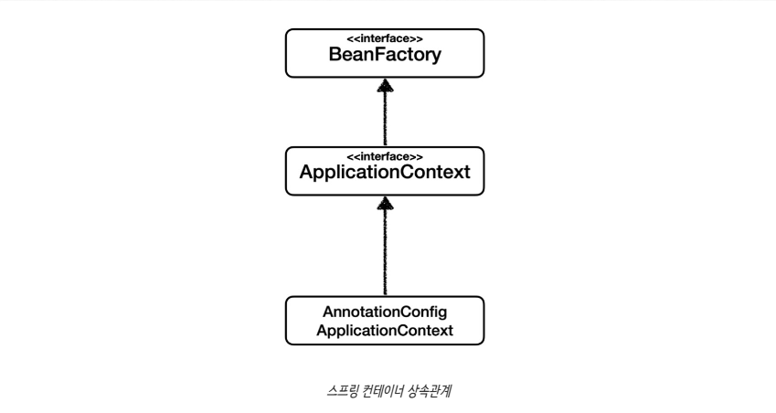

## 본문

### 용어 정리

    ● Bean
    - 스프링은 스프링 컨테이너를 통해 객체를 관리하는데, 스프링 컨테이너에 관리되는 객체를 Bean 이라고 한다.

    ● ApplicationContext 
    - 통상적 스프링 컨테이너
    - 빈을 관리, 검색해주는 것 외에도 여러 기능 

    ● AppConfig 
    - bean 설정/등록(@Configuration/@Bean을 사용하여, Spring 객체 정의), 어노테이션 기반 자바 설정 클래스
    
    ● BeanFactory 
    - bean 관리/조회(IoC container)
    - 스프링 컨테이너 최상위 interface
    - getBean() 제공
  
    -> Application(스프링 컨테이너)가 BeanFactory(bean 관리)를 확장하여 더 많은 기능을 제공하고, AppConfig(bean 등록)의 설정을 기반으로 관리하게 된다.

### Bean

    Spring에서 개발자가 수동으로 Bean을 등록하기 위한 어노테이션이다.
    스프링은 @Bean이 붙은 메서드를 호출해서 반환된 객체를 스프링 컨테이너에 빈으로 등록하고, 필요할 때마다 이 객체를 다른 곳에서 주입할 수 있도록 관리한다.

    @Bean 어노테이션을 통해 객체를 빈으로 등록하면, 스프링이 IoC 원칙에 따라 객체 생성과 관리를 대신해 준다.

### @Bean 만드는 방법 2가지    

    1. 클래스에 @Configuration을 메서드에는 @Bean을 붙이는 방법. (수동)

    ● 역할
    클래스 내에 @Bean 메서드를 정의하여 스프링 컨테이너에 등록할 빈들을 생성하고 설정할 수 있다.

    주로 애플리케이션 전반의 설정을 담당하는 클래스에 붙인다.

    ● 사용
    스프링 컨테이너가 관리하는 여러 객체 간의 관계를 설정하거나, 외부 라이브러리나 특정 구성 요소에 대해 빈을 생성해야 할 때, 사용한다. 

    2. 클래스에 @Component를 붙여 자동으로 만드는 방법. (자동)
     
    ● 역할 
    @Component는 스프링이 자동으로 관리할 객체(빈)로 등록하기 위해 클래스에 붙이는 어노테이션입니다. 

    @Service, @Repository, @Controller와 같은 어노테이션들도 @Component의 구체적인 하위 유형이며, 특정 용도로 관리하는 객체를 등록할 때 사용합니다.

    ● 사용
    @Component를 클래스에 붙이면, 스프링이 애플리케이션 실행 시, 해당 클래스의 객체를 자동으로 생성하고, 스프링 컨테이너에 등록하여 필요 시, 주입.

### @Component vs @Configuration

    - @Component : 스프링 빈으로 등록.
    - @Configutaion : 여러 개의 빈을 생성, 애플리케이션 설정.

### @Bean 사용 이유

    "동일한 역할을 수행하는 객체를 여러 번 만들지 않아도 되기 때문"

    ex)

    public class LoginController {
    private final LoginService loginService = new LoginService(); // 매번 객체 생성
    }

    public class ArticleController {
        private final ArticleService articleService = new ArticleService(); // 매번 객체 생성
    }

    만일 스프링의 Bean 객체를 사용하지 않는다면, 각각의 객체마다, new 연산을 수행해 객체를 만들어야 한다. (동일한 객체가 아니기에 서로 가진 정보도 다르고, 메모리는 또 메모리대로 쓰는 등의 비효율적인 문제가 생긴다.)

    그래서 싱글톤의 특징을 가진 bean을 사용한다면, 동일한 역할을 수행하는 객체를 여러 번 만들지 않아도 된다. 한 번 만들면, 재활용 할 수 있게 된다.

    다시 말해, 스프링 컨테이너가 빈을 관리하므로 싱글톤 패턴을 적용시켜 동일한 인스턴스를 여러 곳에서 공유해 사용할 수 있다는 것이다.

### @Bean 사용 예시

    @Configuration
    public class AppConfig {

        @Bean
        public UserRepository userRepository() {
            return new UserRepositoryImpl(); // UserRepositoryImpl 객체를 빈으로 등록 (userRepository() = userRepositoryImpl 을 가지고 있다.)        }

        @Bean
        public UserService userService() {
            return new UserService(userRepository()); // userRepository 빈을 주입(userRepositoryImpl을 가진) UserService 객체 생성
        }
    }
    - 결국 정리하면 userService 클래스에 userRepository 클래스를 주입하기 위한 객체를 빈으로 등록하는 코드를 보여주는 코드이다.

    - @Configuration : 스프링이 빈 설정 클래스로 인식하게 하는 어노테이션이다.

    - @Bean이 붙은 메서드 : 이 메서드들이 반환하는 객체가 스프링 컨테이너에 빈으로 등록된다.

    ● @Bean 과 IoC

    IoC는 객체의 생성과 의존성 주입을 컨테이너가 대신 관리한다는 원칙이다.
    @Bean은 이 원칙에 따라 객체의 생성, 주입, 소멸을 스프링 컨테이너가 제어하도록 맡기는 역할을 한다.

    ex)
        UserService 가 UserRepository 를 필요로 할 때, UserService 가 직접 UserRepository 객체를 생성하지 않고, AppConfig 에서 @Bean으로 생성된 UserRepository 객체를 주입받게 된다.

### @Bean 과 객체를 비유로 설명

    - Bean = 객체 : 스프링에서 빈은 단순히 생성되고 관리되는 객체를 의미.

    - 만약 스프링 컨테이너가 (=카페 매니저)라고 한다면, 컨테이너는 (=필요한 재료들(bean))를 관리하고 필요할 때마다 제공해 주는 역할

    - 이때 개발자느 빈을 생성, 주입하고 관리해주는 덕분에 코드 간 의존성이 줄어들고, 객체 관리가 더욱 용이 해진다. @Bean은 직접적인 객체 생성 및 관리를 대신하며, 이를 통해 코드의 확장성과 유지보수성이 향상된다.

### AppConfig

    애플리케이션에서 필요한 객체(bean)을 생성하고 의존 관계를 설정하는 중앙 설정 파일 역할을 한다. @Autowired 와 같은 의존정 주입(DI)은 실제로 @Bean 으로 설정된 객체(bean)를 애플리케이션 내에서 주입하는 기능이지만, AppConfig 에서는 어떤 Bean을 사용할지 정의하고, 각 객체의 생성과 의존 관계를 설정한다.

    ● 역할

    1. Bean 생성과 등록 
    - @Bean 어노테이션을 통해 스프링 컨테이너에서 관리할 객체를 생성하고 이를 Bean으로 등록한다.

    2. 의존성 설정
    - Bean 간의 의존 관계를 명시적으로 설정할 수 있다. AppConfig는 필요한 의존 객체를 직접 생성하여 다른 객체의 생성자나 메서드에 전달해 주므로, 클래스 내에서 직접 의존성을 설정할 필요가 없다.

        ● 예시 설정
        - AppConfing 가 있는 경우 or 없는 경우
        - UserService 클래스가 UserRepository를 의존
        - UserService는 UserRepository를 통해 데이터를 관리해야 하므로 UserRepository 객체가 필요.

        1. 클래스 내에서 직접 의존성을 설정하는 경우
        - UserService가 스스로 UserRepository 객체를 생성하는 방식이다.
        - 이는 UserService가 항상 UserRepositoryImpl에 의존하게 되므로 유연성이 떨어지고, 테스트 시 모킹이 어렵다.

        // UserServivce.java
        public class UserService {

            private final UserRepository userRepository;

            // UserService가 직접 UserRepository 객체를 생성
            public UserService() {
                this.userRepository = new UserRepositoryImpl(); // 직접 생성
            }

            // public void performAction() {
                userRepository.save();
            }
        }

        // UserRepository.java
        public interface UserRepository {
            void save();
        }

        // UserRepositoryImpl.java
        public class UserRepositoryImpl implements UserRepository {
            @Override
            public void save() {

            }
        }

        2. AppConfig를 이용해 의존성을 설정하는 경우
        -이제 AppConfig를 사용하여 UserRepository 객체를 주입.
        - UserService는 UserRepository를 직접 생성하지 않고, 외부에서 주입받아 사용.  

          @Configuration
          public class AppConfig {

              @Bean
              public UserService userService() {
                  return new UserService(userRepository()); // 의존 객체를 주입
              }

              @Bean
              public UserRepository userRepository() {
                  return new UserRepositoryImpl();
              }
          }

          // UserService.java
          public class UserService {
              private final UserRepository userRepository;

              // 생성자로 UserRepository 객체를 주입받음
              public UserService(UserRepository userRepository) {
                  this.userRepository = userRepository;
              }

              public void performAction() {
                  userRepository.save();
              }
          }

          // UserRepository.java
          public interface UserRepository {
              void save();
          }

          // UserRepositoryImpl.java
          public class UserRepositoryImpl implements UserRepository {
              @Override
              public void save() {
                  System.out.println("User saved!");
              }
          }

    - AppConfig 클래스는 UserService 와 UserRepository 객체를 스프링 컨테이너에 Bean으로 등록하고, userService Bean을 생성할 때 UserRepository Bean을 주입한다.

    - UserService는 UserRepository를 직접 생서하지 않고, AppConfig에서 주입받기 때문에 유연성이 높아지고, 다른 구현체로 쉽게 교체가능하며, 테스트 모킹도 가능하다.

    ● 요약
    - 직접 의존성 설정: UserService가 직접 UserRepository를 생성하며, 유연성이 떨어집니다.

    - AppConfig를 사용한 설정: AppConfig에서 의존성을 주입하므로 UserService는 UserRepository의 구체적인 구현체에 의존하지 않습니다.

### @Bean vs @Autowired vs @RequiredArgsConstructor

    - @Bean : Bean을 직접 생성하고 등록하는 역할을 한다. 주로 AppConfig에서 사용되며, 스프링 컨테이너가 이 객체들을 관리하고 재사용하도록 설정한다.

    - @Autowired : 주입할 대상의 의존성을 자동으로 찾아서 주입하는 역할을 한다. @Bean으로 이미 등록된 객체(Bean)을 주입하거나 @Component로 관리 중인 Bean을 주입할 때 사용한다.

    - @RequiredArgsConstructor : lombok에서 제공하는 어노테이션으로,
    @Autowired 생략과 final 필드가 자동으로 주입된다.
  
### Bean 생성과 DI 설정
    - 다음과 같은 AppConfig는 UserService가 UserRepository를 의존할 때 이를 생성자 주입을 통해 설정.

    @Configuration
    public class AppConfig {

        @Bean
        public UserService userService() {
            return new UserServiceImpl(userRepository());
        }

        @Bean
        public UserRepository userRepository() {
            return new UserRepositoryImpl();
        }
    }

    - UserService()
        UserServiceImpl 객체를 생성하면서 userRepository()에서 생성한 UserRepository Bean을 주입한다. 이로 인해, UserService와 UserRepository 간의 의존 관계가 명시된다.

    - 생성자 주입 설정
        userService 메서드는 userRepository 메서드에서 생성된 객체를 직접 생성자의 인수로 전달한다.

### AppConfig 로 Bean 설정을 하는 이유

    - 중앙화된 구성 : AppConfig로 모든 Bean을 관리하면 객체 생성과 의존성 관리가 한곳에 모여 있어 구성이 명확해지고 유지보수가 쉬워진다.

    - 유연성 : 상황에 따라 특정 구현체를 교체하거나 다른 환경에서 다른 설정을 적용할 때, AppConfig의 설정만 바꾸면 되므로 코드 변경 없이 구성을 쉽게 조정할 수 있다.    

### Spring Container 생성

    ApplicationContext applicationContext = new AnnotationConfigApplicationContext(AppConfig.class);

    ● ApplicationContext 는 스프링 컨테이너 인터페이스
    스프링 컨테이너는 XML을 기반으로 만들 수 있고, 어노테이션 기반 자바 설정 클래스로 만들 수 있다.
    -> AppConfig 를 사용한 방식이 어노테이션 기반 자바 설정 클래스로 스프링 컨테이너를 생성한 방식.

    - AnnotationConfigApplicationContext는 ApplicationContext Inferface의 구현체
  
    스프링 컨테이너를 부를 때, BeanFactory, ApplicationContext를 구분해서 이야기하지만, BeanFactory를 직접 사용하는 경우는 거의 없기 때문에 통상적으로 ApplicationContext를 스프링 컨테이너라 한다.

    

    - 스프링 컨테이너를 생성할 때는 구성 정보를 지정해주어야 한다.

### Spring bean 등록

  

    스프링 컨테이너는 파라미터로 넘어온 설정 클래스 정보를 사용해서 스프링 빈을 등록한다.
    @Bean 어노테이션이 붙어있는 메소드들을 순차적으로 스프링 빈에 등록한다.
    (AppConfig도 스프링 빈으로 등록된다.)

    빈 이름은 @Bean(name="...")을 통해 직접 부여할 수 있지만 일반적으로 메소드 이름을 사용한다.
    (빈 이름은 중복되면 안된다. 다른 빈이 무시되거나 설정에 따라 기존 빈을 덮어버리는 오류가 발생함.)

### 의존관계 설정

    스프링 컨테이너는 설정 정보를 참고해서 DI를 수행함.
    단순 자바코드를 호출하는 것과 같지만 차이가 있다. 

    - 빈을 생성하고, DI를 하는 단계가 나누어져있다. 자바코드로 스프링빈을 등록하면 생성자를 호출하면서 DI도 한번에 처리된다.

### Spring bean 조회

    public class ApplicationContextInfoTest {
        AnnotationConfigApplicationContext ac = new AnnotationConfigApplicationContext(AppConfig.class);

        @Test
        @DisplayName("모든 빈 출력")
        void findAllBean()
        {
            String[] beanDefinitionNames = ac.getBeanDefinitionNames();
            for (String beanDefinitionName : beanDefinitionNames) 
            {
                Object obj = ac.getBean(beanDefinitionName);
                System.out.println("name = " + beanDefinitionName + " object = " + bean);
            }
        }

        @Test
        @DisplayName("애플리케이션 빈 출력")
        void findApplicationBean()
        {
            String[] beanDefinitionNames = ac.getBeanDefinitionNames();
            for (String beanDefinitionName : beanDefinitionNames)
            {
                BeanDefinition beanDefinition = ac.getBeanDefinition(beanDefinitionName);

                // Role Role_APPLICATION : 직접 등록한 애플리케이션 빈
                // Role Role_INFASTRUCTURE : 스프링 내부에서 사용하는 모든 빈
                if (BeanDefinition.getRole() == BeanDefinition.ROLE_APPLICATION)
                {
                    Object bean = ac.getBean(beanDefinitionName);
                    System.out.println("name = " + beanDefinitionName + " object = " + bean);
                }
            }
        }
    }

    -> 모든 빈 출력
    ac.getBeanDefinitionName() : 스프링에 등록된 모든 빈 이름을 조회
    ac.getBean() : Bean 이름으로 Bean 객체 조회

    -> 애플리케이션 빈 출력
    스프링이 내부에서 사용하는 빈은 제외하고, 내가 등록한 빈만 조회
    getRole()로 구분 가능
    - getRole() == ROLE_APPLICATION : 일반적으로 사용자가 정의한 Bean
    - getRole() == ROLE_INFRASTRUCTURE : 일반적으로 사용자가 정의한 Bean

    스프링 빈 조회 - 기본
    스프링 컨테이너에서 스프링 빈을 찾는 가장 기본적인 조회 방법
    ac.getBean(name, type)
    ac.getBean(type)

    조회 대상 스프링 빈이 없으면 예외 발생
    - NoSuchBeanDefinitionException : No bean named 'xxxxxx' available
  
    ● BeanFactory와 ApplicationContext

    ● 정리

    1. ApplicationContext 는 BeanFactory 의 기능을 상속받는다.
    2. ApplicationContext 는 빈 관리기능 + 편리한 부가 기능을 제고.
    3. BeanFactory 를 직접 사용할 일은 거의 없다. 부가기능이 포함된 ApplicationContext 를 사용한다.
    4. BeanFactory 나 ApplicationContext 를 스프링 컨테이너라고 한다.

### 최종 정리 (GPT 검사 & 수정)

    ● 내가 지금까지 이해한 내용 정리 & 질문

    내가 이해하기에 객체를 등록한다고 했는데, 난 지금까지 필드 객체, 클래스 객체 (new 연산자) 이런식의 클래스 안에서 다루어지는 객체를 bean이라고 생각되었는데 지금까지 설명들을 보면 클래스가 빈으로 등록되는 것 같은데,,, userService, userRepository, userRepositoryImpl 이런 클래스들이 @Bean 어노테이션을 붙인 메서드로 appConfig 설정 클래스에 등록이 되면, 등록된 클래스(= 객체)들이 관리가 되는 것이고, IoC 원칙으로 인해 의존성을 주입 받아 타 클래스(=객체)를 호출하는 방법이라고 생각해, 내가 이해한 글이 틀리면 수정해주고 설명해줘

    ● GPT 답변

    스프링에서 bean은 단순히 클래스 자체를 등록하는 것이 아니라, '클래스를 통해 생성된 인스턴스(객체)를 의미'. 그 자체가 빈으로 등록되는 것이 아니라, "스프링 컨테이너가 관리하는 객체가 빈이 되는 것이다."

    ● 정리

    1. @Bean 어노테이션을 통해 등록된 것은 클래스가 아닌 객체이다.

        - @Bean 어노테이션이 붙은 메서드가 반환하는 객체를 스프링 컨테이너가 빈으로 관리하게 된다.

       ex)
            AppConfig 클래스의 userRepository() 메서드가 new UserRepositoryImpl() 을 반환하면, UserRepositoryImpl의 인스턴스가 스프링 컨테이너에 빈으로 등록된다.

    2. bean(객체)은 싱글톤으로 관리되며, DI를 통해 주입

        - 스프링 컨테이너는 userRepository() 메서드가 반환한 UserRepositoryImpl 객체를 싱글톤으로 관리하며, 필요한 곳에 DI를 통해 주입할 수 있다.

        - userService() 메서드에서 이 userRepository() 메서드로 생성된 빈(객체)을 사용하여 UserService 객체를 생성하고, 이를 빈으로 등록.

    3. 클래스는 객체를 생성하기 위한 설계도일 뿐이고, 빈은 실제로 스프링 컨테이너에서 관리하는 객체이다.    

        - AppConfig에 있는 메서드는 특정 클래스를 인스턴스화하여 스프링에 등록한다.

        - 이때 생성된 객체는 스프링 컨테이너가 관리하는 bean이 되며, 다른 bean들 사이에서 의존성 주입이 가능하다.     

    @Configuration
    public class AppConfig {

        @Bean
        public UserRepository userRepository() {
            // UserRepositoryImpl의 인스턴스를 생성하고 반환, 이 인스턴스가 빈으로 등록됨
            return new UserRepositoryImpl(); 
        }

        @Bean
        public UserService userService() {
            // 위에서 등록된 userRepository 빈을 주입하여 UserService 객체를 생성하고 빈으로 등록
            return new UserService(userRepository());
        }
    }

