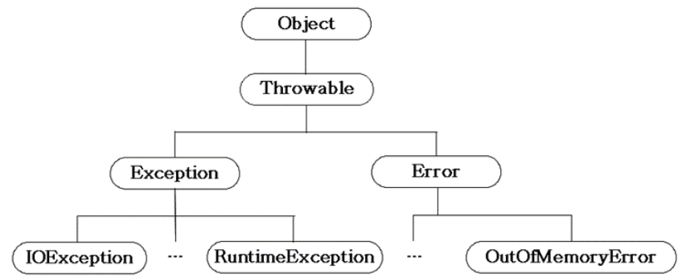
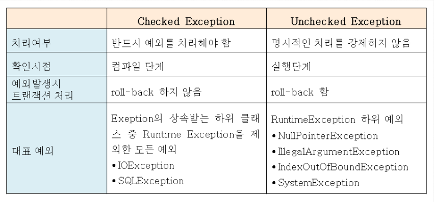

## 본문

### 프로그램 오류

    프로그램이 실행중 어떤 원인에 의해서 오작동을 하거나 비정상적으로 종료되는 경우가 있다.
    이러한 결과를 초래하는 원인을 프로그램 오류라고 한다.

    오류는 발생시점을 기준으로 나누면 "컴파일 에러", "런타임 에러"로 나뉜다.

    ● 컴파일 에러 : 컴파일 시점에 발생하는 에러, Checked 예외
    ● 런타임 에러 : 실행 도중에 발생하는 에러, Unchecked 예외

    이 외에도 논리적 에러가 있는데, 논리적 에러는 컨파일도 잘되고 실행도 잘 되지만 개발자가 의도한 것과 다르게 동작하는 에러를 말한다.
    ex) 창고의 재고가 음수가 되는 등의 에러.

    이렇게 자바에서는 실행 시 발생할 수 있는 프로그램 오류를 "에러" & "예외" 두 가지로 나뉜다. 

    에러는 프로그램 코드로 수습할 수 없는 심각한 오류로, 예를 들면 메모리 부족, 스택 오버 플로우가 있다. 에러는 일단 발생하면 프로그램 실행중에 복구할 수 없기 때문에 비정상적인 종료를 막을 길이 없지만, 예외는 개발자가 이에 대해 적절한 코드를 미리 작성해 놓음으로써 프로그램의 비정상적인 종료를 막을 수 있다.

    자바는 실행 시, 발생할 수 있는 오류를 클래스로 정의하였다.

    

    예외 클래스의 계층구조를 살펴보면 Exception(예외)와 Error(에러)로 나누어져 있다.
    Exception 클래스는 모든 예외의 조상 클래스이며, Exception 또한 Checked 예외와 Unchecked 예외로 나누어져 있다.

    

    - Unchecked 예외는 실행 도중 발생하는 예외로 RuntimeException을 칭하며, 개발자의 실수에 의해서 발생될 수 있는 예외들로 자바의 프로그래밍 요소들과 관계가 깊은 예외이다.

    - 중요한 점은 Unchecked 예외(RuntimeException)는 개발자에 의해 실수로 발생히는 예외이기 때문에 예외에 대한 처리가 강제되지 않는다는 점이다.

      - 예를 들면 값의 null인 참조변수의 멤버를 호출하려 했다던지(NullPointException), 정수를 0으로 나누려고 했다던지 하는 경우에 발생하는 예외(ArtihmeticException)가 있다.