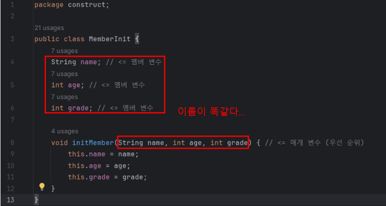
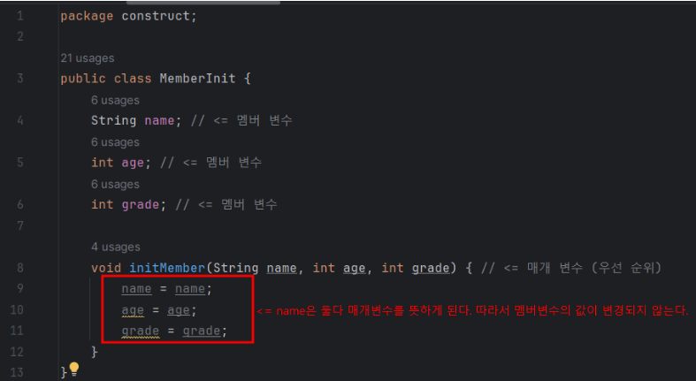

## 본문

### 생성자가 필요한 이유

    public class MemberInit {

        String name;
        int age;
        int grade;
    }

    public static void main(String[] args) {

        MemberInit member1 = new MemberInit();
        member1.name = "user1";
        member1.age = 15;
        member1.gradee = 90;

        MemberInit member2 = new MemberInit();
        member2.name = "user2";
        member2.age = "16;
        member2.grade = 80;

        MemberInit[] members = {member1, member2};

        for (MemberInit member : members) {
            System.out.println("이름: " + member.name + ", 나이: " +
            member.age + ", 성적: " + member.grade);
        }
    }

    ● 결과
    이름: user1, 나이: 15, 성적: 90
    이름: user2, 나이: 16, 성적: 80

    회원 객체를 생성하고 나면 name, age, grade 같은 변수에 초기값을 설정한다.
    아마도 회원 객체를 제대로 사용하기 위해서는 객체를 생성하자 마자 이런 초기값을 설정해야 할 것이다.

    이 코드에는 회원의 초기값을 설정하는 부분이 계속 반복된다. 
    이 반복 코드를 메소드를 이용하여 제거해보겠다.

    public class MethodInitMain2 {

        public static void main(String[] args) {
            MemberInit member1 = new MemberInit();
            initMember(member1, "user1", 15, 90);
            MemberInit member2 = new MemberInit();
            initMember(member2, "user2", 16, 80);

            MemberInit[] members = {member1, member2};

            for (MemberInit member : members) {
                System.out.println("이름: " + member.name + ", 나이: " + member.age + ", 성적: " + member.grade);
            }
        }

        static void initMember(MemberInit member, String name, int age, int grade) {
            member.name = name;
            member.age = age;
            member.grade = grade;
        }
    }

    initMember() 메서드를 사용해서 반복을 제거했다. 그런데 이 메서드는 대부분 Member 객체의 멤버 변수를 사용한다.

    쉽게 얘기해서 Member가 자기 자신의 데이터를 변경하는 기능(메서드)을 제공하는 것이 좋다.

### this

    public class MemberInit {
        String name;
        int age;
        int grade;

        void initMember(string name, int age, int grade) {
            this.name = name;
            this.age = age;
            this.grade = grade;
        }
    }

    public class MethodInitMain3 {

        public static void main(String[] args) {
            MemberInit member1 = new MemberInit();
            member1.initMember("user1", 15, 90);
            MemberInit member2 = new MemberInit();
            member2.initMember("user2", 16, 80);

            MemberInit[] members = {member1, member2};

            for (MemberInit member : members) {
                System.out.println("이름: " + member.name + ", 나이: " + member.age + ", 성적: " + member.grade);
            }
        }
    }

    initMember()는 Member에 초기값 설정 기능을 제공하는 메서드이다.
    다음과 같이 메서드를 호출하면 객체의 멤버 변수에 인자로 넘어온 값을 채우게 된다.

    member1.initMember("user1", 15, 90)

    initMember(String name...)의 코드를 보면 메서드의 매개변수에 정의한 String name과 Member의 멤버 변수의 이름이 String name으로 둘 다 똑같다.
    나미저 변수 이름도 name, age, grade로 모두 같다.

    그렇다면 멤버 변수와 메서드의 매개변수의 이름이 같으면 둘을 어떻게 구분해야 할까?

    ※ 매개변수 
    - 메서드가 호출될 때 외부로부터 전달되는 값을 받는 변수로, 메서드 선언부(파라미터)에 위치한다.
    - 호출 시, 전달된 값을 기반으로 초기화되므로 별도의 초기화가 필요 없다.

    - 이 경우 멤버 변수보다 매개변수가 코드 블럭의 더 안쪽에 있기 때문에 매개변수가 우선순위(변수 이름의 우선권)을 가진다.
    따라서 initMember(String name, int age, int grade) 메서드 안에서 name이라고 적으면 매개변수에 접근하게 된다.

    - 멤버 변수에 접근하려면 앞에 this. 이라고 해주면 된다.
    - this는 인스턴스 자신의 참조값을 가르킨다.

_grammer.png)

    진행 과정
    this.name = name;    // 1. 오른쪽의 name은 매개변수에 접근
    this.name = "user1"; // 2. name 매개변수의 값 사용
    x001.name = "user1"; // 3. this.은 인스턴스 자신의 참조값을 뜻함, 따라서 인스턴스의 멤버 변수에 접근.

### this 제거

    만약 이 예제에서 this를 제거하면 어떻게 될까?   
    다음과 같이 수정하면 name은 둘 다 매개변수를 뜻하게 된다. 
    따라서 멤버변수의 값이 변경되지 않는다.

    정리
    - 매개변수의 이름과 멤버 변수의 이름이 같은 경우 this를 사용해서 둘을 명확하게 구분해야 한다.
    - this는 인스턴스 자신을 가리킨다.

### this 생략

    this는 생략할 수 있다. 이 경우 변수를 찾을 때 가까운 지역변수(매개변수도 지역변수다)를 먼저 찾고 없으면, 그 다음으로 멤버 변수를 찾는다.
    멤버 변수도 없으면 오류가 발생하게 된다.

    다음 코드는 필드 이름과 매개변수의 이름이 서로 다른 경우

    public class MemberThis {
        String nameField;
        void initMember(String nameParameter) {
            nameField = nameParameter;
        }
    }

    예를 들어서 nameFeild는 앞에 this가 없어도 멤버 변수에 접근한다.
    - nameField는 먼저 지역변수(매개변수)에서 같은 이름이 있는지 찾는다.
    - nameParameter는 먼저 지역변수(매개변수)에서 같은 이름이 있는지 찾는다.
        이 경우 매개변수가 있으므로 매개변수를 사용한다.
    - 항상 매개변수부터 찾는다.

### this와 코딩 스타일

    다음과 같이 멤버 변수에 접근하는 경우에 항상 this 를 사용하는 코딩 스타일도 있다.

    public class MemberThis {
        Stirng nameField;
        void initMember(String nameParameter) {
            this.nameField = nameParameter;
        }
    }
    
    this.nameField를 보면 this를 생략할 수도 있지만, 생략하지 않고 사용해도 된다. 이러헥 this를 사용하면 이 코드가 멤버 변수를 사용한다는 것을 눈으로 쉽게 확인 가능하다.

### 생성자

    프로그래밍을 하다보면 객체를 생성하고 이후에 바로 초기값을 할당해야 하는 경우가 많다.
    따라서 앞서 initMember()와 같은 메서드를 매번 만들어야 한다.
    그런데 대부분의 객체 지향 언어는 객체를 생성하자마자 즉시 필요한 기능을 좀 더 편리하게 수행할 수 있도록 생성자라는 기능을 제공한다.

    "생성자를 사용하면 객체를 생성하는 시점에 즉시 필요한 기능을 수행할 수 있다."

    생성자는 앞서 살펴본 initMember()와 같이 메서드와 유사하지만 몇가지 다른 특징이 있다.

    public class MemberConstruct {
        String name;
        int age;
        int grade;

        MemberConstruct(String name, int age, int grade) {
             System.out.println("생성자 호출 name= " + name + ", age= " + age + ", grade= " +grade);
            this.name = name;
            this.age = age;
            this.grade = grade;
        }
    }

    생성자는 메서드와 비슷하지만 다음과 같은 차이가 있다.
    - 생성자의 이름은 클래스 이름과 같아야 한다.
    - 생성자는 반환 타입이 없다. 

### 생성자 호출

    생성자는 인스턴스를 생성하고 나서 즉시 호출된다. 생성자를 호출하는 방법은 다음 코드와 같이 new 명령어 다음에 생성자 이름과 매개변수에 맞추어 인수를 전달하면 된다.

    new 생성자이름(생성자에 맞는 인수 목록)
    new 클래스이름(생성자에 맞는 인수 목록)

    생성자 이름이 클래스 이름이기 때문에 둘 다 맞는 표현이다.

    new MemberConstruct("user1", 15, 90)

    인스턴스를 생성하고 즉시 해당 생성자를 호출한다. 여기서는 Member 인스턴스를 생성하고 바로 MemberConstruct(String name, int age, int grade) 생성자를 호출

    참고로 new 키워드를 사용해서 객체를 생성할 때 마지막에 ()도 포함해야 하는 이유가 바로 생성자 때문이다.
    객체를 생성하면서 동시에 생성자를 호출한다는 의미를 포함한다.

### 생성자 장점    

    ● 중복 호출 제거

    생성자가 없던 시절에는 생성 직후에 어떤 작업을 수행하기 위해 다음과 같이 메서드를 직접 한번 더 호출해야 했다.
    생성자 덕분에 객체를 생성하면서 동시에 생성 직후에 필요한 작업을 한 번에 처리할 수 있게 되었다.

    // 생성자 등장 전
    MemberInit member = new MemberInit();
    member.initMember("user1", 15, 90);

    // 생성자 등장 후
    MemberConstruct member = new Construct("user1", 15, 90);

    -> 객체 선언 후, 메서드를 한번 더 호출해야 한다는 차이점이 있따. 

    생성자의 장점은 객체를 생성할 때, "직접 정의한 생성자가 있다면 직접 정의한 생성자를 반드시 호출해야 한다."는 점이다.
    참고로 생성자를 메서드 오버로딩 처럼 여러개 정의 할 수 있는데, 이 경우에는 하나만 호출하면 된다.

    MemberConstruct 클래스의 경우 다음 생성자를 직접 정의했기 때문에 직접 정의한 생성자를 반드시 호출해야 한다.

    MemberConstruct(String name, int age, int grade) {...}

    다음과 같이 직접 정의한 생성자를 호출하지 않으면 컴파일 오류가 발생한다.
    MemberConstruct member3 = new MemberConstruct(); // 컴파일 오류 발생.
    member3.name = "user3";
    member3.age = 17;
    member3.grade = 70;|

    생성자 덕분에 회원의 이름, 나이, 성적은 항상 필수로 입력하게 됩니다.

    따라서 아무 정보가 없는 유령회원이 시스템 내부에 등장할 가능성을 원천 차단합니다!
    생성자를 사용하면 필수값 입력을 보장할 수 있다.