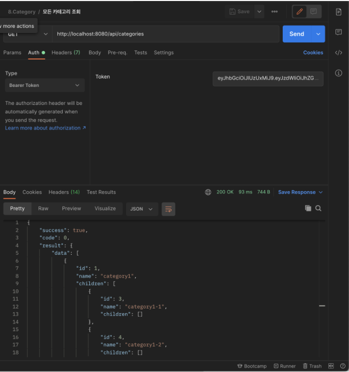
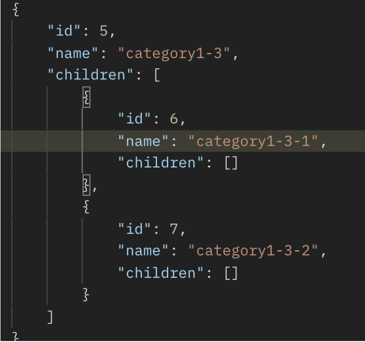
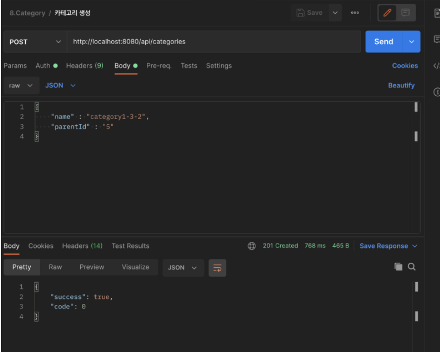
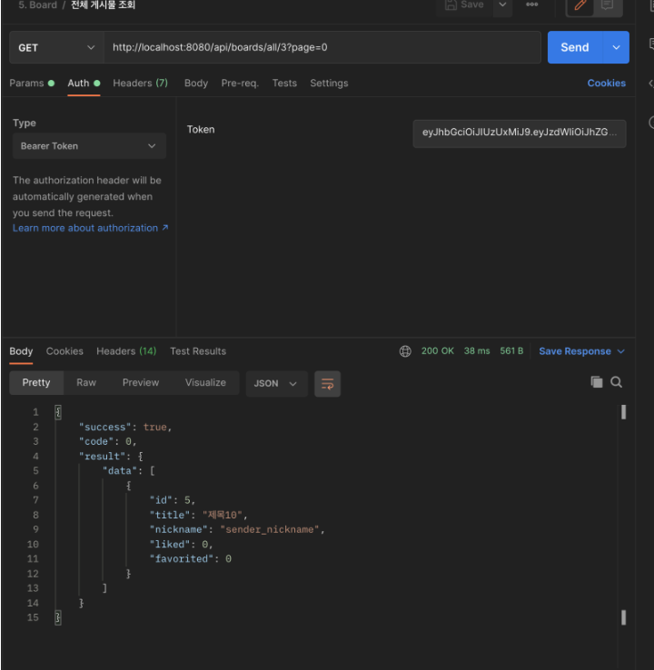

## 본문

### 계층형 카테고리 구현

    ● Entity

    @NoArgsConstructor (access = AccessLevel.PROTECTED)
    @Getter
    @Entity
    public class Category {

        @Id
        @GeneratedValue(strategy = GenerationType.IDENTITY)
        @Column(name = "category_id")
        private int id;

        @Column(length = 30, nullable = false)
        private String name;

        @ManyToOne(fetch = FetchType.Lazy) 
        @JoinColumn(name = "parent_id") 
        @OneDelete(action = OnDeleteAction.CASCADE)
        private Category parent;

        public Category(String name, Category parent) {
            this.name = name;
            this.parent = parent;
        }
    }

    - 지연 로딩 (Lazy Loading): 필요할 때만 관련 데이터를 가져옵니다.
    - Category 객체를 조회할 때, parent가 필요하지 않으면 데이터를 가져오지 않는다.
    - @ManyToOne = Lazy 기본 설정 (성능 최적화)
    - CASCATE = parent Entity 삭제 시, 자동으로 child 삭제 (DB에서 행동)

    ● CategoryRepository

    public interface CategoryRepository extends JpaRepository<Category, Integer> {

        @Query("SELECT c From Category c LETF JOIN c.parent p ORDER BY p.id ASC NULLS FIRST, c.id ASC" )
        List<Category> findAllOrderByParentIdAscNullsFirstCategoryIdAsc();
    }

    ● CategoryService

    @RequiredArgsConstructor
    @Service
    public class CategoryService {

        private final CategoryRepository categoryRepository;
        private final UserRepository userRepository;

        @Transactional(readOnly = true)
        public List<CategoryDto> findAll() {
            
            //  Authentication authentication = SecurityContextHolder.getContext().getAuthentication();
            //  User user = userRepository.findByUsername(authentication.getName().orElseThrow(MemberNotFoundException::new));

            List<Category> categories = categoryRepository.findAllOrderByParentIdAscNullFirstCategoryIdAsc();

            return CategoryDto.toDtoList(categories);
        }

        @Transactional
        public void create(CategoryCreateRequest req) {
            Category parent = Optional.ofNullable(req.getParentId())
                        .map(id -> categoryReposotory.findById(id).orElseThrow(CategoryNotFoundException::new))
                        .orElse(null);
            categoryRepository.save(new Category(req.getName(), parent));
        }

        @Transactional
        public void delete(int id) {
            Category category = categoryRepository.findById(id).orElseThrow(CategoryNotFoundException::new);
            categoryRepository.delete(category);
        }
    }

    ● CategoryController

    @Api(value = "Category Controller", tags = "Category")
    @RequiredArgsConstructor
    @RestController
    @RequestMapping("/api")
    public class CategoryController {
        
        private final CategoryService categoryService;

        @ApiOperation(value = "모든 카테고리 조회", notes = "모든 카테고리를 조회한다.")
        @GetMapping("/categories")
        @ResponseStatus(HttpStatus.OK)
        public Response findAll() {
            return Resposne.success(categoryService.findAll());
        }

        @ApiOperation(value = "카테고리 생성", notes = "카테고리를 생성한다.")
        @PostMapping("/categories")
        @ResponseStatus(HttpStatus.CREATED)
        public Response create(@Valid @RequestBody CategoryCreateRequest req) {
            categoryService.create(req);
            return Response.success();
        }

        @ApiOperation(value = "카테고리 삭제", notes = "카테고리를 삭제한다.")
        @DeleteMapping("/categories/{id}")
        @ResponseStatus(HttpStatus.OK)
        public Response delete(@ApiParam(value = "카테고리 id", required = true) @PathVariable int id) {
            categoryService.delete(id);
            return Response.success();
        }
    }

    ● CategoryTest

    @ExtendWith(MockitoExtension.class)
    public class CategoryTest 
    {
        @InjectMocks
        CategoryController categoryController;

        @Mock
        CategoryService categoryService;

        MockMvc mockMvc;
        ObjectMapper objectMapper = new ObjectMapper();

        @BeforeEach
        void beforeEach()
        {
            mockMvc = MockMvcBuiders.standaloneSetup(CateogryController).build();
        }

        @Test
        @DisplayName("전체 카테고리 조회")
        void readAllTest() throws Exception {
            // given

            // when, then
            mockMvc.perform(get("/api/categories"))
                    .adnExpect(status().isOk());
            verify(categoryService).findAll();
        }

        @Test
        @DisplayName("카테고리 생성")
        void createTest() throws Exception
        {
            // given
            CategoryCreateRequest req = new CategoryCreateRequest("category1", 1);

            // when, then
            mockMvc.perform
            (
                post("/api/caregories")
                        .contentType(MediaType.APPLICATION_JSON)
                        .content(objectMapper.writeValueAsString(req))
            )
                .andExpect(status().isCreated());            
        }

        @Test
        @DisplayName("카테고리 제거")
        void deleteTest() throws Exception
        {
            // given
            int id = 1;

            // when, then
            mockMvc.perform
            (
                delete("/api/categoryies{id}", id)
            )
                .andExpect(status().isOk());
            verify(categoryService).delete(id);           
        }
    }

    ● PostMan

    - 카테고리 조회

   

    - 카테고리 조회 (자식)

    

    - 카테고리 생성

    = 게시글 전체 조회(카테고리 안에 있는)

