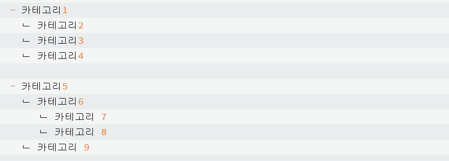

## 본문

### 계층형 카테고리 구현

    ● Entity

    @NoArgsConstructor (access = AccessLevel.PROTECTED)
    @Getter
    @Entity
    public class Category {

        @Id
        @GeneratedValue(strategy = GenerationType.IDENTITY)
        @Column(name = "category_id")
        private int id;

        @Column(length = 30, nullable = false)
        private String name;

        @ManyToOne(fetch = FetchType.Lazy)
        @JoinColumn(name = "parent_id")
    }