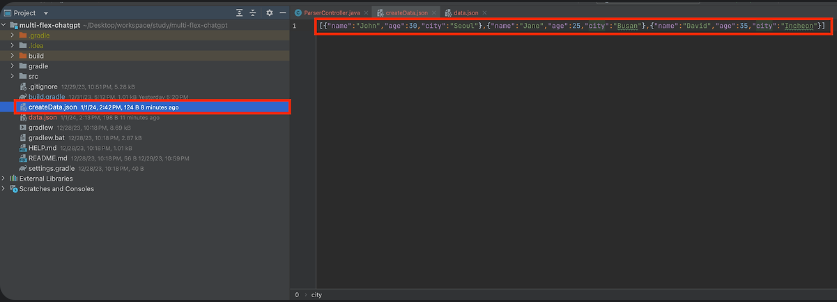
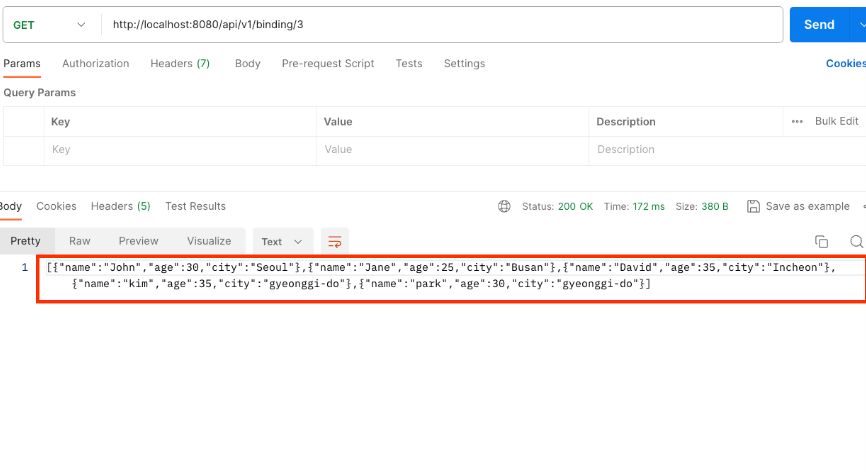
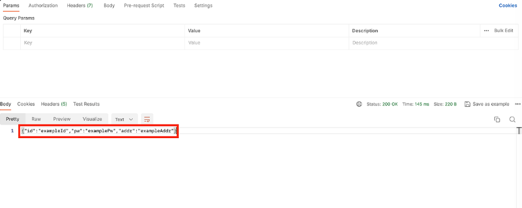
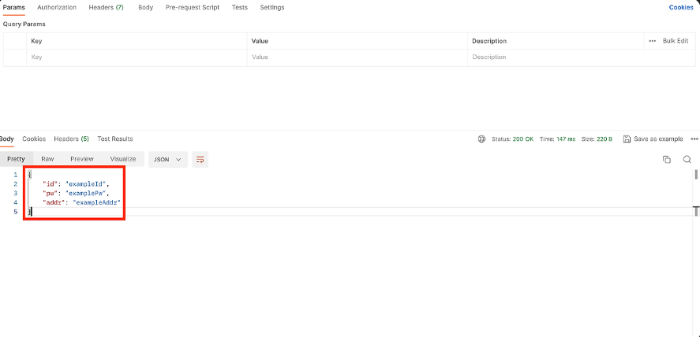

## 본문

## Jackson

    1. JSON 데이터를 작업을 하기 위한 인기 있는 Java 라이브러리.
    2. JSON 파일을 일거나 쓰는 기능을 제공.
    3. Java 객체를 JSON으로 직력화 하거나 JSON을 Java 객체로 역 직렬화 하는 기능을 제공.

### 직렬화 vs 역직렬화

    직렬화 
    - 객체를 바이트 스트림으로 변환하는 과정.
    - 직렬화된 객체는 파일에 저장하거나 네트워크를 통해 전송할 수 있다.
    - 직렬화된 객체는 나중에 역 직렬화를 통해 원래의 객체로 복원.

    역 직렬화
    - 직렬화된 바이트 스트림을 원래의 객체로 복원하는 과정.
    - 역직렬화를 위해서는 직렬화할 때 와 동일한 클래스의 정의가 필요.

### Jackson module

    - Jackson Streaming(=Jackson Core)는 JSON 파일을 읽거나 새로 생성하는 경우의 기능들을 주로 제공.

    - Jackson Annotation은 JSON 파일과 객체를 어노테이션으로 매핑하여 쉽게 데이터 처리.

    - Jackson Databind는 JSON 파일을 가장 쉽게 직렬화와 역직렬화 하는 기능을 제공.
  
### Jackson Streaming API(=Jackson-core)

    - 메모리 사용을 최소화, JSON 데이터 처리에 사용.
    - 대용량의 JSON 데이터를 효율적 처리.

### 주요 클래스

    - JsonFactory : JSON Parser 및 Generator를 만들기 위한 팩토리 클래스, 이 클래스를 사용하여 JSON 데이터를 파싱하고 생성.

    - JsonParser : JSON 데이터를 파싱하는데 사용되는 클래스, 토큰을 읽고 필드 이름 및 값에 엑세스.

    - JsonGenerator : JSON 라이브러리에서 JSON 데이터를 생성하는 데 사용.
    JsonGenerator 객체를 사용하여 JSON 데이터를 생성하고 필드 이름과 값을 설정.

### JsonParser token

    - JSON 데이터 구조의 각 부분을 나타낸다. 토큰은 JSON 데이터의 요소를 읽고 분석하는 데 사용.

    - 예를 들어, 토큰은 객체의 시작과 끝을 나타내거나 배열의 요소를 나타낼 수 있다. 토큰은 JSON 데이터를 파싱하고 처리하는 과정에서 중요한 개념.
  
### library

    dependencies {
	    implementation 'com.fasterxml.jackson.core:jackson-core:2.16.1'
    }

### JSON data read

    1. JsonFactory Builder 구성.
    2. JSON 파일 생성 위치 지정.
    3. jsonGenerator 객체 생성.
    4. Array 형태로 생성.
    5. Object 형태로 생성.
    6. 필드 값을 채워준단.
    7. Object 형태를 닫아준다.
    8. Array 형태를 닫아준다.
    9. JsonGenerator를 닫고 관련 리소스를 해제.

    /**
     * JSONAArray 파일 생성
     */    
    @GetMapping("/2")
    public ResponseEntity<Object> writeJsonDate() {

        String result = "";

        try {
            // [STEP1] JsonFactory Builder 구성
            JsonFactory factory = JsonFactory.builder().build();

            // [STEP2] JSON 파일 생성 위치 지정
            File file = new File(System.getProperty("user.dir") + "/createData.json");

            // [STEP3] jsonGenerator 객체 생성
            JsonGenerator jsonGenerator = factory.createGenerator(file, JsonEncoding.UTF8);

            // [STEP4] Array 형태로 생성
            jsonGenerator.writeStartArray();

            // [STEP5] Object 형태로 생성
            jsonGenerator.writeStartObject();

            // [STEP6] 필드 값을 채워준다.
            jsonGenerator.writeStringField("name", "john");
            jsonGenerator.writeNumberField("age", 30);
            jsonGenerator.writeStringField("city", "Seoul");

            // [STEP7] Object 형태를 닫아줍니다.
            jsonGenerator.writeEndObject();

            jsonGenerator.writeStartObject();
            jsonGenerator.writeStringField("name", "Jane");
            jsonGenerator.writeNumberField("age", 25);
            jsonGenerator.writeStringField("city", "Busan");
            jsonGenerator.writeEndObject();

            // [STEP8] JsonGenerator를 닫고 관련 리소스를 해제.
            jsonGenerator.close();

            System.our.println("json 파일이 성공적으로 생성되었습니다.");
        } catch (IOException e) {
            e.printStackTrace();
        }

        return new ResponseEntity<>(result, HttpStatus.OK);
    }

     

### Jackson annotation

    @JsonProperty : 해당 필드를 JSON 속성에 매핑. 속성의 이름을 지정할 수 있으며, 기본적으로 필드의 이름을 사용.
   
    /**
     *  JSON 객체와 매핑
     *  @author : joo
     *  @fileName : Person
     *  @since : 07/28/24
     */
    @Getter 
    public class Person {
        @JsonProperty("name")
        private String name;

        @JsonProperty("age")
        private int age;

        @JsonProperty("city")
        private String city;

        public Person() {

        }
    }

### JSON 파일 일기 : 역직렬화

    Annotation 기반으로 Object와 JSON을 매핑한 데이터를 조회.

     1. 프로젝트 내의 JSON 파일을 읽어온다.
     2. JSON 파일과 객체를 매핑 : 역 직렬화
     3. 매핑한 객체의 값을 조회.

    /**
     * Annotation 기반으로 Object와 JSON을 매핑한 데이터를 조회합니다.
     */
    @GetMapping("/3")
    public ResponseEntity<Object> readAnnotation() {

        String result = "";

        ObjectMapper objectMapper = new ObjectMapper();

        // [STEP1] 프로젝트 내의 JSON 파일을 읽어온다.
        File file = new File(System.getProperty("user-dir") + "/data.json");

        try {
            // [STEP2] JSON 파일과 객체를 매핑한다. : 역 직렬화
            List<Person> people = Arrays.asList(objectMapper.readValue(file, Person[].class));

            // [STEP3] 매핑한 객체의 값을 조회한다.
            for (Person person : people) {
                System.out.println("Name :: " + person.getName());
                System.out.println("Age :: " + person.getAge());
                System.out.println("City :: " + person.getCity());
            }
        } catch (IOException e) {
            e.printStackTrace();
        }
        return new ResponseEntity<>(result, HttpStatus.OK);
    }

    - reuslt : [name, age, city] 값이 List 형식으로 담겨 클라이언트로 반환.

### 재 구성하여 직렬화 수행

    1. ㅍ로젝트 내의 JSON 파일을 읽어온다.
    2. JSON 파일과 객체를 매핑. (이전과 다르게 가변 객체로 변환.)
    3. 배열 내에 객체를 추가.
    4. 객체를 JSON 파일로 직렬화하여 저장.

    /** 
     * Annotation 기반으로 Object와 JSON을 매핑한 데이터를 조회
     */
    @GetMapping("/3") 
    public ResponseEntity<Object> readAnnotation() {

        String result = "";

        ObjectMapper objectMapper = new ObjectMapper();

        // [STEP1] 프로젝트 내의 JSON 파일을 읽어온다.
        File file = new File(System.getProperty("user.dir") + "/data.json");

        try {
            // [STEP2] JSON 파일과 객체를 매핑합니다. - 이전과 다르게 가변 객체로 변환하였습니다.
            List<Person> peopleList = new ArrayList<>(Arrays.asList(objectMapper.readValue(file, Person[].class)));

            // [STEP3]  배열 내에 객체를 추가하였습니다.
            Person updatePerson = Person
                    .builder()
                    .name("kim")
                    .age(35)
                    .city("gyeonggi-do")
                    .build();

            Person updatePerson2 = Person
                    .builder()
                    .name("park")
                    .age(30)
                    .city("gyeonggi-do")
                    .build();

            peopleList.add(updatePerson);
            peopleList.add(updatePerson2);

            // [STEP4] 객체를 JSON 파일로 직렬화하여 저장.
            result = objectMapper.writeValueAsString(peopleList);

            log.debug("재구성한 직렬화 결과 ::" + result);
        } catch (IOException e) {
            e.printStackTrace();
        }

        return new ResponseEntity<>(result, HttpStatus.OK);
    }

    - 아래와 같이 직렬화된 데이터가 출력된다.

;

### Jackson Databind : 직렬화/역 직렬화

    - Java 객체와 JSON 데이터 간의 매핑을 처리하는데 사용됩니다.
    - Java 객체를 JSON으로 직렬화하거나 JSON을 Java 객체로 역직렬화할 수 있는 기능을 제공합니다.
    - 다양한 형식의 데이터를 다룰 수 있으며, 커스텀 직렬화 및 역직렬화 로직을 구현할 수 있습니다.

    ● 주요 어노테이션

    - writeValueAsString(value: Any) : 지정된 객체를 JSON 문자열로 직렬화.

    - readValue(content: String, valueType: TypeReference<T>)
        JSON 문자열을 지정된 타입의 객체로 변환

### 직렬화 코드

    PersonDto라는 객체를 writeValueAsString() 메서드로 직렬화를 수행.

    @Getter
    @NoArgsConstructor(access = AccessLevel.PROTECTED)
    public class PersonDto {
        private String id;
        private String pw;
        private String addr;

        @Builder
        public PersonDto(String id, String pw, String addr) {
            this.id = id;
            this.pw = pw;
            this.addr = addr;
        }
    }        

    @GetMapping("/3")
    public ResponseEntity<Object> serializationApi() {
        String result = "";
        PersonDto personDto = PersonDto.builder()
                .id("exampleId")
                .pw("examplePw")
                .addr("exampleAddr")
                .build();
        
        ObjectMapper objectMapper = new ObjectMapper();
        try {
            result = objectMapper.writeValueAsString(personDto);
            log.debug("직렬화 ::" + result);
        } catch (JsonProcessingException e) {
            throw new RuntimeException(e);
        }
        return new ResposneEntity<>(result, HttpStatus.OK);
    }

    - 앙래와 같이 객체를 직렬화로 문자열 형태로 변환하였습니다.

    /*
     * 역 직렬화 수행
     */
    PersonDto personDto2;

    try {
        ObjectMapper objectMapper2 = new ObjectMapper();
        personDto2 = objectMapper2.readValue(result, PersonDto.class);
        log.debug("역 직렬화 ::" + personDto2);
    } catch (JsonProcessingException e) {
        throw new RuntimeException(e);
    }

    return new ResponseEntity<>(personDto2, HttpStatus.OK);

    