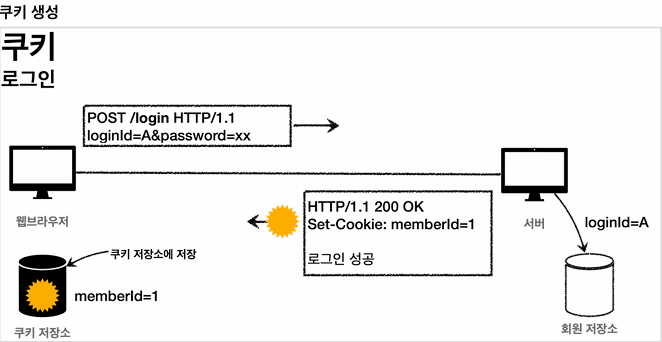
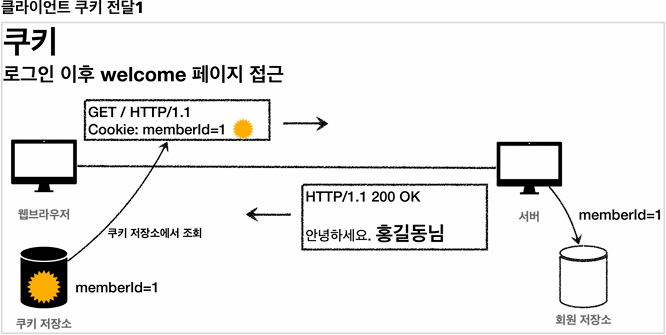
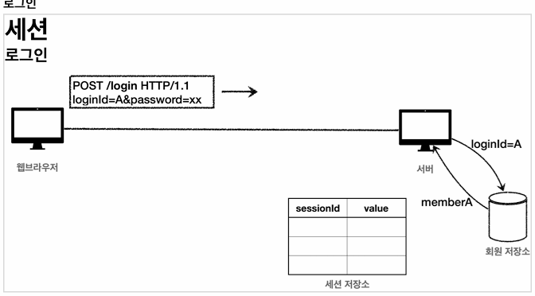
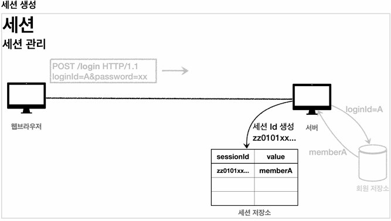
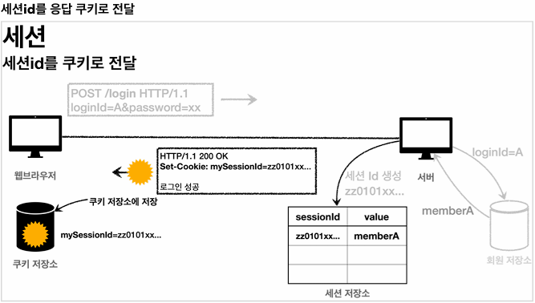
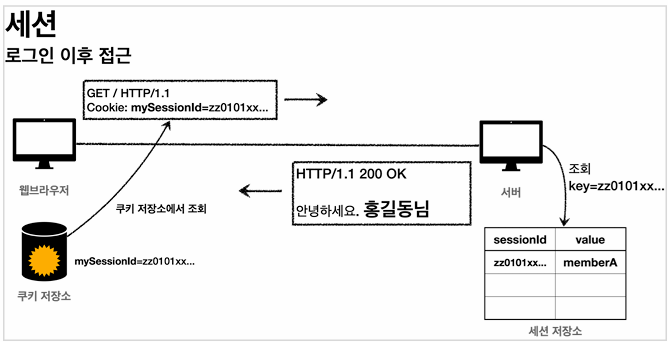

## 본문

### 로그인 요구사항
    - 홈 화면 - 로그인 전
        - 회원 가입
        - 로그인
    - 홈 화면 - 로그인 후        
        - 본인 이름(누구님 환영합니다.)
        - 상품 관리
        - 로그 아웃
    - 보안 요구사항
        - 로그인 사용자만 상품에 접근하고, 관리할 수 있다.
        - 로그인 하지 않은 사용자가 상품 관리에 접근하면 로그인 화면으로 이동
    - 회원 가입, 상품 관리

    ● Member
    @Data 
    public class Member {

        private Long id;

        @NotEmpty
        private String longId; // 로그인 Id
        @NotEmpty
        private String name;
        @NotEmpty
        private String password;
    }

    ● MemberRepository
    @Slf4j
    @Repository
    public class MemberRepository {

        private static Map<Long, Member> store = new HashMap<>(); // static 사용
        private static long sequence = 0L;

        public Member save(Member member) {
            member.setId(++sequence);
            store.put(member.getId(), member);
            return member;
        }

        public Member findById(Long id) {
            return store.get(id);
        }

        public Optional<Member> findByLoginId(String loginId) {
            return findAll().stream()
                .filter(m -> m.getLoginId().equals(loginId))
                .findFirst();
        }
 
        public List<Member> findAll() {
            return new ArrayList<>(store.values());
        }

        public void clearStore() {
            store.clear();
        }
    }

    ● MemberController
    @Controller
    @RequiredArgsConstructor
    @RequestMapping("/members")
    public class MemberController {

        private final MemberRepository memberRepository;

        @GetMapping("/add")
        public String addForm(@ModelAttribute("member") Member member) {
            return "members/addMemberForm";
        }

        @PostMapping("/add")
        public String save(@Valid @ModelAttribute Member member, BindingResult result) {
            if (result.hasErrors()) {
                return "members/addMemberForm";
            }

            memberRepository.save(member)
            return "redirect:/";
        }
    }

    ● templates/members/addMemberForm.html
    <form action="" th:action th:object="${member}" method="post">
        

            
전체 오류 메시지</>
        </>

        

            <label for="loginId">로그인 ID</>
            <input type="text" id="loginId" 
                    th:field="*{loginId}" 
                    class="form-control" 
                    th:errorclass="field-error"> 
            
 
        

        

            <label for="password">비밀번호</>
            <input type="password" id="password"
                    th:field="*{password}" 
                    class="form-control"
                    th:errorclass="field-error">
            

        

        

            <label for="name">이름</>
            <input type="text" id="name" 
                    th:field="*{name}" 
                    class="form-control"
                    th:errorclass="field-error">
            

    </form> 
    
    ● LoginService
    @Service
    @RequiredArgsConstructor
    public class LoginService {
        private final MemberRepository memberRepository;                   

        /**
         * @return null이면 로그인 실패
         */
        public Member login(String loginId, String password) {
            return memberRepository.findByLongId(loginId)
                    .filter(m -> m.getPassword().equals(password))
                    .orElse(null);
        }
    }

    - 로그인의 핵심 비즈니스 로직은 회원을 조회한 다음에 파라미터로 넘어온 password와 비교해서 같으면 회원을 반환하고, 만약 password가 다르면 null을 반환한다.
  
    ● LoginForm
    @Data
    public class LoginForm {
        @NotEmpty
        private String loginId;
        @NotEmpty
        private String password;
    }

    ● LoginController
    @Slf4j
    @Controller
    @RequiredArgsConstructor
    public class LoginController {
        private final LoginService loginService

        @GetMapping("/login")
        public String loginForm(@ModelAttribute("loginForm") LoginForm form) {
            return "login/loginForm";
        }

        @PostMapping("/login")
        public String login(@Valid @ModelAttribute LoginForm form, BindingResult bindingResult) {
            if (bindingResult.hasErrors()) {
                return "login/loginForm";
            }
        }

        Member loginMember = loginService.login(form.getLoginId(),
        form.getPassword());

        if (loginMember == null) {
            bindingResult.reject("loginFail", "아이디 또는 비밀번호가 맞지 않습니다.");
            return "login/loginForm";

            // 로그인 성공 처리 TODO
            return "redirect:/";
        }
    }

    ● 로직 흐름
    1) 로그인 컨트롤러는 로그인 서비스를 호출해서 
    2) 로그인에 성공하면 홈 화면으로 이동하고, 
    3) 로그인에 실패하면 bindingResult.reject()를 사용해서 글로벌 오류(ObjectError)를 생성한다. 그리고 정보를 다시 입력하도록 로그인 폼을 뷰 템플릿으로 사용한다.
 
    ● 문제
    로그인이 되면 홈 화면에 고객 이름이 보여야 한다는 요구사항을 만족하지 못한다. 로그인의 상태를 유지하면서, 로그인에 성공한 사용자는 홈 화면에 접근시 고객의 이름이 보여주려면 어떻게 해야할까?

### 로그인 처리하기 - cookie 사용
    ● 로그인 상태 유지하기 - 쿠키
 

 

 

    - 영속 쿠키 : 만료 날짜를 입력하면 해당 날짜까지 유지
    - 세션 쿠키 : 만료 날짜를 생략하면 브라우저 종료시 까지만 유지
    
    - 쿠키에 시간 정보를 주지 않으면 세션 쿠키(브라우저 종료시 모두 종료)
        Cookie idCookie = new Cookie("memberId", String.valueOf(loginMember.getId()))'
        response.addCookie(idCookie);

        return "redirect:/";

        - 로그인에 성공하면 쿠키를 생성하고, HttpServletResponse에 담는다.
        쿠키 이름은 memberId이고, 값은 회원의 id를 담아둔다. 웹 브라우저는 종료 전까지 회원의 id를 서버에 계속 보내줄 것이다.

### 로그아웃 처리하기 - 쿠키 사용
    ● LoginController - logout 기능 추가
    @PostMapping("/logout")
    public String logout(HttpServletResponse response) {
        expireCookie(response, "memberId");
        return "redirect:/";
    }

    private void expireCookie(HttpServletResponse response, String cookieName) {
        Cookie cookie = new Cookie(cookieName, null);
        cookie.setMaxAge(0);
        response.addCookie(cookie);
    }

    - 로그아웃도 응답 쿠키를 생성하는데 Max-Age=0를 확인할 수 있다. 해당 쿠키는 즉시 종료된다.
    
    ● 쿠키와 보안 문제
    - 쿠키 값은 임의로 변경할 수 있다.
      - 클라이언트가 쿠키를 강제로 변경하면 다른 사용자가 된다.
      - 실제 웹브라우저 개발자모드 -> Application -> Cookie 변경으로 확인
      - Cookie : memberId=1 -> Cookie : memberId=2 (다른 사용자의 이름이 보임)
    - 쿠키에 보관된 정보는 훔쳐갈 수 있다.
      - 만약 쿠키에 개인정보나, 신용카드 정보가 있다면?
      - 이 정보가 웹 브라우저에도 보관되고, 네트워크 요청마다 계속 클라이언트에서 서버로 전달된다.
      - 쿠키의 정보가 나의 로컬 PC에서 털릴 수도 있고, 네트워크 전송 구간에서 털릴 수도 있다.
    - 해커가 쿠키를 한번 훔쳐가면 평생 사용할 수 있다.
    
    ● 대안
    - 사용자 별로 예측 불가능한 임의의 토큰(랜덤 값)을 노출하고, 서버에서 토큰과 사용자 id를 매핑해서 인식한다. 그리고 서버에서 토큰을 관리한다.
    - 토큰은 해커가 임의의 값을 넣어도 찾을 수 없도록 예상 불가능 해야 한다.
    - 서버에서 해당 토큰의 만료시간을 짧게 유지한다.
    
### 로그인 처리하기 - session    
    앞서 쿠키에 중요한 정보를 보관하는 방법은 여러가지 보안 이슈가 있었다.
    이 문제를 해결하려면 결국 중요한 정보를 모두 서버에 저장해야 한다.
    클라이언트와 서버는 추정 불가능한 임의의 식별자 값으로 연결해야 한다.

    이렇게 서버에 중요한 정보를 보관하고 연결을 유지하는 방법을 세션이라 한다.

    - 세션 ID를 생성하는데, 추정 불가능해야 한다.
    - UUID는 추정이 불가능하다.
      - Cookie : mySessionId=zz0101xx-bab9-4b92-9b32-deadb280f4b21
    - 생성된 세션 ID와 세션에 보관할 값(memberA)을 서버의 세션 저장소에 보관한다.

    - 클라이언트와 서버는 결국 쿠키로 연결이 되어야 한다.
    - 클라이언트는 쿠키 저장소에 mySessionId 쿠키를 보관한다.
    
    ● 중요
    - 여기서 중요한 포인트는 회원과 관련된 정보는 전혀 클라이언트에 전달하지 않는다는 것이다.
    - 오직 추정 불가능한 세션 ID만 쿠키를 통해 클라이언트에 전달한다.

    - 클라이언트는 요청시 항상 mySessionId 쿠키를 전달한다.
    - 서버에서는 클라이언트가 전달한 mySessionId 쿠키 정보로 세션 저장소를 조회해서 로그인시 보관한 세션 정보를 사용한다.

    ● 정리
    세션을 사용해서 서버에서 중요한 정보를 관리하게 되었다. 덕분에 다음과 같은 보안 문제들을 해결할 수 있다.
        - 쿠키 값을 변조 가능 -> 예상 불가능한 복잡한 세션Id를 사용한다.
        - 쿠키에 보관하는 정보는 클라이언트 해킹시 털릴 가능성이 있다. 
            -> 세션Id가 털려도 여기에는 중요한 정보가 없다.
        - 쿠키 탈취 후 사용 -> 해커가 토큰을 털어가도 시간이 지나면 사용할 수 없도록 서버에서 세션의 만료시간을 짧게(30분)유지한다. 또는 해킹이 의심되는 경우 서버에서 해당 세션을 강제로 제거하면 된다.
        
### 로그인 처리하기 - session 직접 만들기
    - 세션 생성
      - sessionId 생성(임의의 추정 불가능한 랜덤 값)        
      - 세션 저장소에 sessionId와 보관할 값 저장
      - sessionId로 응답 쿠키를 생성해서 클라이언트에 전달
    - 세션 조회
      - 클라이언트가 요청한 sessionId 쿠키의 값으로, 세션 저장소에 보관한 값 조회
    - 세션 만료
      - 클라이언트가 요청한 sessionId 쿠키의 값으로, 세션 저장소에 보관한 sessionId와 값 제거
      
    ● SessionManager - 세션 관리
    @Component
    public class SessionManager {
        public static final String SESSION_COOKIE_NAME = "mySessionId";

        private Map<String, Object> sessionStore = new ConcurrentHashMap<>();

        /**
         * 세션 생성
         */
        public void createSession(Object value, HttpServletResponse response) {
            // 세션 id를 생성하고, 값을 세션에 저장
            String sessionId = UUID.randomUUID().toString();
            sessionStore.put(sessionId, value);

            // 쿠키 생성
            Cookie mySessionCookie = new Cookie(SESSION_COOKIE_NAME, sessionId);
            response.addCookie(mySessionCookie);
        }

        /**
         *  세션 조회
         */
        public Object getSession(HttpServletRequest request) {
            Cookie sessionCookie = findCookie(request, SESSION_COOKIE_NAME);
            if (sessionCookie == null) {
                return null;
            }
            return sessionStore.get(sessionCookie.getValue());
        }
        /**
         *  세션 만료
         */
        public void expire(HttpServletRequest request) {
            Cookie sessionCookie = findCookie(request, SEESION_COOKIE_NAME);
            if (sessionCookie != null) {
                sessionStore.remove(sessionCookie.getValue());
            }
        }

        private Cookie findCookie(HttpServletRequest request, String cookieName) {
            if (request.getCookies() == null) {
                return null;
            }
            return Arrays.stream(request.getCookies()) 
                    .filter(cookie -> cookie.getName().equals(cookieName))
                    .findAny()
                    .orElse(null);
        }
    }

    - @Component : 스프링 빈으로 자동 등록한다.
    - ConcurrentHashMap : HashMap 은 동시 요청에 안전하지 않다. 동시 요청에 안전한 ConcurrentHashMap 를 사용했다

### LoginController - loginV2 (session 관리 기능 적용)    
    @PostMapping("/login")
    public String loginV2(@Valid @ModelAttribute LoginForm form, BindingResult bindingResult, HttpServletResponse response) {
        if (bindingResult.hasErrors()) {
            return "login/loginForm";
        }

        Member loginMember = loginService.login(form.getLoginId(), form.getPassword());

        if (loginMember == null) {
            bindingResult.reject("loginFail", "아이디 또는 비밀번호가 맞지 않습니다.");
        }

        // 로그인 성공 처리
        // 세션 관리자를 통해 세션을 생성하고, 회원 데이터 보관
        sessionManager.createSession(loginMember, response);

        return "redirect:/";
    }

    - private final SessionManager sessionManager; 주입
    - sessionManager.createManager(loginMember, response);
    로그인 성공시 세션을 등록한다. 세션에 loginMember를 저장해두고, 쿠키도 함께 발행한다.

    ● LoginController - logoutV2()
    @PostMapping("/logout")
    public String logoutV2(HttpServletRequest request) {
        sessionManager.expire(request);
        return "redirect:/";
    }

    ● HomeController - homeLoginV2()
    @GetMapping("/")
    public String homeLoginV2(HttpServletRequest request, Model model) {
        // 세션 관리자에 저장된 회원 정보 조회
        Member member = (Member)sessionManager.getSession(request);
        if (member == null) {
            return "home";
        }
    }

    - 세션 관리자에서 저장된 회원 정보를 조회한다. 만약 회원 정보가 없으면, 쿠키나 세션이 없는 것 이므로 로그인 되지 않은 것으로 처리한다.
  
    ● 정리
    이제 직접 만드는 세션 말고, 서블릿이 공식 지원하는 세션을 알아보자. 서블릿이 공식 지원하는 세션은 우리가 직접 만든 세션과 동작 방식이 거의 같다. 추가로 세션을 일정시간 사용하지 않으면 해당 세션을 삭제하는 기능을 제공한다.

### 로그인 처리하기 - 서블릿 HTTP 세션1
    세션이라는 개념은 대부분의 웹 애플리케이션에 필요한 것이다. 어쩌면 웹이 등장하면서 부터 나온 문제이다.
    서블릿은 세션을 위해 HttpSession이라는 기능을 제공하는데, 지금까지 나온 문제들을 해결해준다. 우리가 직접 구현한 세션의 개념이 이미 구현되어 있고, 더 잘 구현되어 있다.

    ● HttpSession 소개    
    서블릿이 제공하는 HttpSession도 결국 우리가 직접 만든 SessionManager왁 같은 방식으로 동작한다. 서블릿을 통해 HttpSession을 생성하면 다음과 같은 쿠키를 생성한다. 쿠키 이름이 JSESSIONID 이고, 값은 추정 불가능한 랜덤 값이다.

        - cookie : JESSIONID = ~~~

    ● HttpSession 사용
    SessionConst
    public class SessionConst {
        public static final String LOGIN_MEMBER = "loginMember";
    }
    - HttpSession에 데이터를 보관하고 조회할 때, 같은 이름이 중복 되어 사용되므로, 상수를 하나 정의했다.
    
### LoginController - loginV3 (Servlet HTTP Session)
    @PostMapping("/login")
    public String loginV3(@Valid @ModelAttribute LoginForm form, BindingResult bindingResult, HttpServletRequest resquest) {
        if (bindingResult.hasErrors()) {
            return "/login/loginForm";
        }

        Member loginMember = loginService.login(form.getLoginId(),
        form.getPassword());

        if (loginMember == null) {
            bindingResult.reject("loginFail", "아이디 또는 비밀번호가 맞지 않습니다.");
            return "login/loginForm";            
        }

        // 로그인 성공 처리

        // 세션이 있으면 있는 세션 반환, 없으면 신규 세션 생성
        HttpSession session = request.getSession();
        // 세션에 로그인 회원 정보 보관
        session.setAttribute(SessionConst.LOGIN_MEMBER, loginMember);
        return "redirect:/";       
    }    

    - 세션을 생성하려면 request.getSession(true)를 사용하면 된다.
    public HttpSession getSession(boolean create);
    - request.getSession(true)
      - 세션이 있으면 기존 세션을 반환한다.
      - 세션이 없으면 새로운 세션을 생성해서 반환한다.
    - request.getSession(false)
      - 세션이 있으면 기존 세션을 반환한다.
      - 세션이 없으면 새로운 세션을 생성하지 않는다. null을 반환한다.
    - request.getSession() : 신규 세션을 생성하는 request.getSession(true)와 동일하다.
    
    ● login session 흐름 
    1) 로그인 시 : 사용자가 로그인하면, 사용자 정보를 Member 객체에 담아 세션에 저장한다.
        session.setAttribute(SessionConst.LOGIN_MEMBER, loginMember);
    3) 로그인 정보 확인 시 : 이후 요청에서 세션에 저장된 사용자 정보를 확인하기 위해 sesison.getAttribute(SessionConst~~)를 호출하고, 반환된 Object를 Member 타입으로 캐스팅한다.
        Member loginMember = (Member) session.getAttribute(SessionConst.LOGIN_MEMBER);
    4) 로그인한 사용자 정보 사용 : loginMember 변수에는 로그인한 사용자의 'Member' 객체가 담겨 있어, 이를 통해 사용자 정보를 사용할 수 잇따.

    ● LoginController - logoutV3()
    @PostMapping("/logout")
    public String logoutV3(HttpServletRequest request) {
        // 세션을 삭제한다.
        HttpSession session = request.getSession(false);
        if (session != null) {
            session.invalidate();
        }
        return "redirect:/";
    }

    HomeController - homeLoginV3() 
    @GetMapping("/")
    public String homeLoginV3(HttpServletRequest request, Model model) {
        
        // 세션이 없으면 home
        HttpSession session = request.getSession(false);
        if (session == null) {
            return "home";
        }

        Member loginMember = (Member)session.getAttribute(SessionConst.LOGIN_MEMBER);
        // 세션에 회원 데이터가 없으면 home
        if (loginMember == null) {
            return "home";
        }

        // 세션이 유지되면 로그인으로 이동
        model.addAttribute("member", loginMember);
        return "loginHome";
    }

    - request.getSession(false) : request.getSession()를 사용하면 기본 값이 create : true 이므로, 로그인 하지 않을 사용자도 의미없는 세션이 만들어진다. 따라서 세션을 찾아서 사용하는 시점에는 create : false 옵션을 사용해서 세션을 생성하지 않아야 한다.
    - session.getAttribute(SessionConst.LOGIN_MEMBER) : 로그인 시점에 세션에 보관한 회원 객체를 찾는다.
    
    - Member loginMember = (Member) session.getAttribute(SessionConst.LOGIN_MEMBER);
      - 캐스팅을 한 이유?
      다양한 타입의 데이터 저장: 세션은 다양한 타입의 데이터를 저장할 수 있습니다. String, Integer, List, 사용자 정의 객체 등 여러 타입을 저장할 수 있습니다. 하지만 getAttribute 메서드는 모든 데이터를 Object 타입으로 반환하므로, 원래의 타입으로 사용하기 위해 캐스팅이 필요합니다.

    - loginMember 변수에 담기는 데이터
      - 세션에서 가져온 로그인한 사용자 정보를 담고 있다. 이 변수에는 로그인한 회원의 정보를 나타내는 Member 객체가 저장됩니다.
        - id, username, password, email, name,,,   

### 로그인 처리하기 - Servlet HTTP session2
    - 스프링은 세션을 더 편리하게 사용할 수 있도록 @SessionAttribute을 지원.
    
    ● HomeController - homeLoginV3Spring()
    @GetMapping("/")
    public String homeLoginV3Spring(
            @SessionAttribute(name = SessionConst.LOGIN_MEMBER, required = false)
        Member loginMember, Model model) {

        // 세션에 회원 데이터가 없으면 home
        if (loginMember == null) {
            return "home";
        }

        // 세션이 유지되면 로그인으로 이동
        model.addAttribute("member", loginMember);
        return "loginHome";
    }

    - 세션을 찾고, 세션에 들어있는 데이터를 찾는 번거로운 과정을 스프링이 한번에 편리하게 처리해주는 것을 확인할 수 있다.
      - http://localhost:8080/;jsessionid= ~~~
      - 이것은 웹 브라우저가 쿠키를 지원하지 않을 때 쿠키 대신 URL을 통해서 세션을 유지하는 방법이다. 이 방법을 사용하려면 URL에 이 값을 계속 포함해서 전달해야 한다. 타임리프 같은 템플릿은 엔지을 통해서 링크를 걸면 jsessionid를 URL에 자동으로 포함해준다. 서버 입장에서 웹 브라우저가 쿠키를 지원하는지 하지 않는지 최초에는 판단하지 못하므로, 쿠키 값도 전달하고, URL에 jsesionid도 함께 전달한다.
    
      URL 전달 방식을 끄고 항상 쿠키를 통해서만 세션을 유지하고 싶으면 다음 옵션을 넣어주면 된다. 이렇게 하면 URL에 jessionid가 노출되지 않는다.
        - application.properties
          - server.servlet.session.tracking-modes=cookie

### session 정보와 타임아웃 설정
    @Slf4j
    @RestController
    public class SessionInfoController {
        @GetMapping("/session-info")
        public String sessionInfo(HttpServletRequest request) {
            HttpSession session = request.getSession(false);
            if (session == null) {
                return "세션이 없습니다.";
            }

            // 세션 데이터 출력
            session.getAttributeNames().asIterator()
                .foEachRemaining(name->name, session.getAttribute(name));

            log.info("sessionId={}", session.getId());
            log.info("maxInactiveInterval={}", session.getMaxInactiveInterval());
            log.info("creationTime={}", new Date(session.getCreationTime()));
            log.info("lastAccessedTime={}", new Date(session.getLastAccessedTime()));
            log.info("isNew={}", session.isNew());

            return "세션 출력";
        }
    }          

    ● 세션 타임아웃 설정
    세션은 사용자가 로그아웃을 직접 호출해서 session.invalidate() 가 호출되는 경우에 삭제된다. 그런데 대부분의 사용자는 로그아웃을 선택하지 않고, 그냥 웹 브라우저를 종료한다. 문제는 HTTP가 비연결성이므로 서버 입장에서는 해당 사용자가 웹 브라우저를 종료한 것인지 아닌지를 인식할 수 없다. 따라서 서버에서 세션 데이터를 언제 삭제해야 하는지 판단하기가 어렵다. 이 경우 남아있는 세션을 무한정 보관하면 다음과 같은 문제가 발생할 수 있다.

    - 세션과 관련된 쿠키를 탈취 당했을 경우 오랜 시간이 지나도 해당 쿠키로 악의적인 요청을 할 수 있다.
    - 세션은 기본적으로 메모리에 생성된다. 메모리의 크기가 무한하지 않기 때문에 꼭 필요한 경우만 생성해서 사용해야 한다.

    ● 세션의 종료 시점
    세션의 종료 시점을 어떻게 정하면 좋을까? 가장 단순하게 생각해보면, 세션 생성 시점으로부터 30분 정도로 잡으면 될 것이다. 그런데 문제는 30분이 지나면 세션이 삭제되기 때문에, 열심히 사이트를 돌아다니다가 또 로그인을 해서 세션을 생성해야 한다. 그러니까 30분 마다 계속 로그인해야 하는 번거러움이 발생한다.

    더 나은 대안은 세션 생성 시점이 아니라 사용자가 서버에 최근에 요청한 시간을 기준으로 30분 정도를 유지해주는 것이다. 이렇게 하면 사용자가 서비스를 사용하고 있으면, 세션의 생존 시간이 30분으로 계속 늘어나게 된다.
    따라서 30분 마다 로그인해야 하는 번거로움이 사라진다. HttpSession은 이 방식을 사용한다.

    ● 세션 타임아웃 설정
    server.servlet.session.timeout=60초, 기본은 1800(30분)
    (글로벌 설정은 분 단위로 설정해야 한다. 60(1분), 120(2분)...)

    ● 세션 타임아웃 발생
    세션의 타임아웃 시간은 해당 세션과 관련된 JSESSIONID를 전달하는 HTTP 요청이 있으면 현재 시간으로 다시 초기화 된다. 이렇게 초기화 되면 세션 타임아웃으로 설정한 시간동안 세션을 추가로 사용할 수 있다.
    sessoin.getLastAccessedTime() : 최근 세션 접근 시간
    LastAccessedTime 이후로 timeout 시간이 지나면, WAS가 내부에서 해당 세션을 제거한다.

    ● 정리
    서블릿의 HttpSession이 제공하는 타임아웃 기능 덕분에 세션을 안전하고 편리하게 사용할 수 있다. 실무에서 주의할 점은 세션에는 최소한의 데이터만 보관해야 한다는 점이다. 보관한 데이터 용량 * 사용자수로 세션의 메모리 사용량이 급격하게 늘어나서 장애로 이어질 수 있다. 추가로 세션의 시간을 너무 길게 가져가면 메모리 사용이 계속 누적 될 수 있으므로 적당한 시간을 선택하는 것이 필요하다. 기본이 30분이라는 것을 기준으로 고민하면 된다.

    