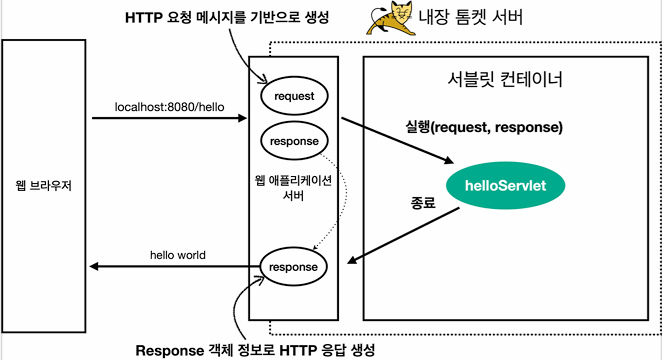
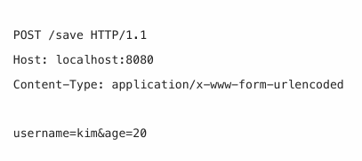

# 본문

### Servlet container 동작 방식

### HttpServletRequest 역할
servlet은 개발자가 HTTP 요청 메시지를 편리하게 사용할 수 있도록 개발자 대신에
HTTP 요청 메시지를 파싱한다. 그리고 그 결과를 HttpServletRequest 객체에 담아서 제공한다.

###  START LINE

    ● HTTP 메소드 = GET
    
    ● URL =  http://localhost:8080/request-header             

    ● 쿼리 스트링 = username=hello       

    ● 스키마, 프로토콜  = http, HTTP/1.1  

###  Header    

    ● [Host 편의 조회]
        request.getServerName() = localhost
        request.getServerPort() = 8080

    ● [Accept-Language 편의 조회]
        locale = ko/ko_KR
        request.getLocale() = ko

    ● [Content 편의 조회]
        request.getContentType() = null
        request.getContentLength() = -1
        request.getCharacterEncoding() = UTF-8   

###  Body (HTTP 요청 데이터 3가지 방법)

    ● URL의 쿼리 파라미터 조회
        ● GET - 쿼리 파라미터
            /url?username=hello&age=20
            메시지 바디 없이, URL의 쿼리 파라미터에 데이터를 포함해서 전달
            ex) 검색, 필터, 페이징등에서 많이 사용하는 방식     

        ● 임시 저장소 기능
            저장 : request.setAttribute(name, value)
            조회 : request.getAttribute(name)
            세션 : reqeust.getSession(create: true)         

        ● request.getParameter() 
            GET URL 쿼리 파라미터, POST HTML Form 형식 둘 다 지원 가능하다.

            메소드를 공공기관 프로젝트에서 처음 접한 코드여서 당황했던 
            기억이 있었고, Servlet을 공부하게 된 가장 큰 비중을 차지합니다.

            String username = request.getParameter("username"); // 단일 파라미터 조회
            Enumneration<String> parameterNames = request.getParameterNames(); // 파라미터 이름들 모두 조회
            Map<String, String[]> parameterMap = request.getParameterMap(); // 파라미터를 Map으로 조회
            String[] usernames = request.getParameterValues("username"); // 복수 파라미터 조회         

    ● form 파라미터 형식 조회
        ● POST - HTML Form
            content-Type : application/x-www-form-urlencoded
            메시지 바디에 쿼리 파라미터 형식으로 전달 username=hello&age=20
            ex) 회원가입, 상품 주문, HTML Form 사용.

            <body>
            <form action="/request-param" method="post">
                username: <input type="text" name="username" />
                age:      <input type="text" name="age" />
                <button type="submit">전송</button>
            </form>
            </body>

            POST 방식 또한, 서버 입장에서는 둘의 형식의 동일하므로, 
            request.getParameter()로 편리하게 구분없이 조회할 수 있다.

        ● HTML 코드에서 <form action="url" method="post">는
            서버의 컨트롤러 PostMapping(value="url")과 매핑할 수 있게 
            연결해주는 코드.

    ● message body - HttpServletRequest
        ● API message body에 JSON 형식 데이터를 직접 담아서 요청
            HTTP API에서 주로 사용, JSON,XML,TEXT   

        ● JSON 형식 전송
            POST http://localhost:8080/request-body-json    
            contentType : application/json
            message body : {"username":"hello", "age":20}

        ● Command object 객체 전달
            @Getter @Setter
            public class HelloData {
                private String username;
                private int age;
            }

        @WebServlet(name = "requestBodyJsonServlet", urlPatterns = "/request-body-json")    
        public class RequestBodyJsonServlet extends HttpServlet {
           
            private void service(HttpServletRequest request, HttpServletResponse response) throw ServletException, IOException {
                ServletInputStream inputStream = request.getInputStream();
                String messageBody = StreamUtils.copyToString(inputStream, StandardCharsets.UTF_8);

                HelloData helloData = objectMapper.readValue(messageBody, HelloData.class);

                response.getWriter().write("ok");
            }
        }

    ● message body - HttpServletResponse
        ● HTTP 응답 API JSON

        @WebServlet(name = "responseHtmlServlet", urlPatterns = "/sresponse-json")
        public class ResponseJsonServlet extends HttpServlet {

            @Override
            protected void service(HttpServletRequest request, HttpServletResponse response) throws ServletException, IOException {
                //Content-Type: application/json
                response.setHeader("content-type", "application/json");
                response.setCharacterEncoding("utf-8");

                HelloData data = new HelloData();
                data.setUsername("kim");
                data.setAge(20);

                //{"username":"kim","age":20}
                String result = objectMapper.writeValueAsString(data);
                response.getWriter().write(result);
            }
            
        }

    ● 참고
    application/json 은 스펙상 utf-8 형식을 사용하도록 정의되어 있다. 
    그래서 스펙에서 charset=utf-8 과 같은 추가 파라미터를 지원하지 않는다. 
    따라서 application/json 이라고만 사용해야지 application/json;charset=utf-8 이라고, 
    전달하는 것은 의미 없는 파라미터를 추가한 것이 된다.    

    