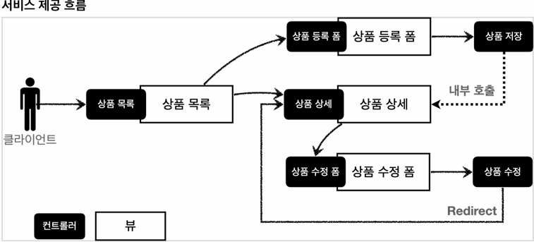
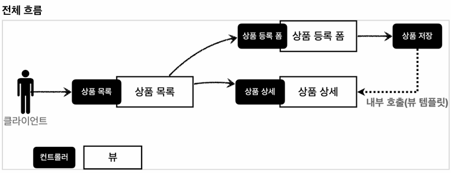
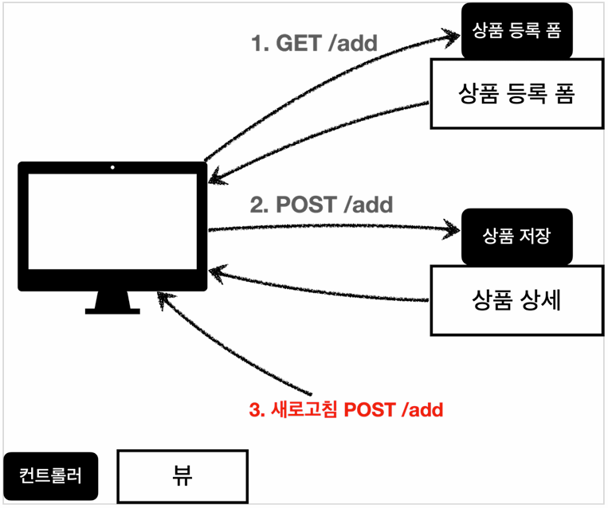
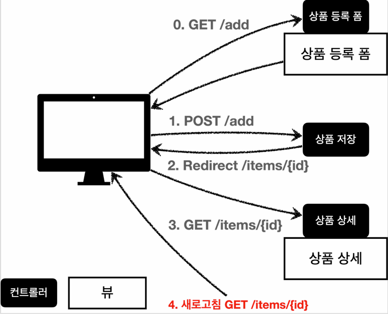

# 본문

### 서비스 제공 흐름

### Item - 상품 객체
    @Data
    public class Item {

        private Long id;
        private String itemName;
        private Integer price;
        private Integer quantity;
    }

### ItemRepository - 상품 저장소
    @Repository
    public class ItemRepoitory {

        private static final Map<Long, Item> store = new HashMap<>();
        private static long sequence = 0L;

        public Item save(Item item) {
            item.setId(++sequence);         // primary key
            store.put(item.getId(), item);  // insert
            return item;
        }

        public Item findById(Long id) {
            return store.get(id);
        }

        public List<Item> findAll() {
            return new ArrayList<>(store.values());
        }

        public void update(Long itemId, Item updateParam) {
            Item findItem = findById(itemId);
            findItem.setItemName(updateParam.getItemName());
            findItem.setPrice(updateParam.getPrice());
            findItem.setQuantity(updateParam.getQuantity());
        }

        public void clearStore() {
            store.clear();
        }
    }

## 상품 목록 - thymeleaf    
### BasicItemController
    @Controller
    @RequestMapping("/basic/items")
    @RequiredArgsConstructor
    public class BasicItemController {

        private final ItemRepository itemRepository;

        @GetMapping
        public String itmes(Model model) {
            List<Item> items = itemRepository.findAll();
            model.addAttribute("items", items);
            return "basic/items";
        }
    }

    ● 컨트롤러 로직은 itemRepository에서 모든 상품을 조회한 다음에 모델에 담는다. 그리고 뷰 템플릿을 호출한다.

    ● @RequiredArgsConstructor
        -final이 붙은 멤버변수만 사용해서 생성자를 자동으로 만들어준다.

        pupblic BasicItemController(ItemRepository itemRepository) {
            this.itemRepository = itemRepository;
        }

        ● 이렇게 생성자가 딱 1개만 있으면 스프링이 해당 생성자에 @Autowired로 의존관계를 주입.
        ● 따라서 final 키워드를 빼면 안된다. 그러면 ItmeRepository 의존관계가 주입이 안된다.

### thymeleaf 간단히 알아보기
    <html xmlns:th="http://www.thymeleaf.org">        

    ● 속성 변경 - th:href
    - th:href="@{/css/bootstrap.min.css}"
    - href="value1"을 th:href="value2"의 값으로 변경한다.
    - 타임리프 뷰 템플릿을 거치게 되면 원래 값을 th:xxx 값으로 변경. 
    - HTML을 그대로 볼 때는 href 속성이 사용되고, 뷰 템플릿을 거치면 th:href의 값이 href로 대체되면서 동적으로 변경할 수 있다.
    
    ● thymeleaf 핵심
    - 핵심은 th:xxx 가 붙은 부분은 서버사이드에서 렌더링 되고, 기존 것을 대체, th:xxx이 없으면 기존 html의 xxx속성이 그대로 사용된다.
    - HTML을 파일로 직접 열었을 때, th:xxx가 있어도 웹 브라우저는 th: 속성을 알지 못아므로 무시한다.
    - 따라서 HTML을 파일 보기를 유지하면서 템플릿 기능도 할 수 있다.
  
    ● URL 링크 표현식 - @{...}
    - th:href="@{/css/bootstrap.min.css}"
    - @{...} 타임리프는 URL 링크를 사용하는 경우 @{..}를 사용한다.
    - URL 링크 표현식을 사용하면 서블릿 컨텍스트를 자동으로 포함한다.
  
    ● 속성 변경 - th:onclick
    - onclick = "location.href='addForm.html'"
    - th:onclick="|location.href='@{/basic/items/add}'|"
    
    ● 리터럴 대체 - |...|
    - 타임리프에서 문자의 표현식 등은 분리되어 있기 때문에 더해서 사용해야 한다.
        ex)    
    - 다음과 같이 리터럴 대체 문법을 사용하면, 더하기 없이 편리하게 사용가능.
        ex) 

        ● 결과를 다음과 같이 만들어야 할 떄
        - location.href='/basic/items/add'

        ● 그냥 사용하면 문자와 표현식을 각각 따로 더해서 사용해야 하므로 다음과 같이 복잡해진다.
        - th:onclick = "'location.href=' + '\' '+ @{/basic/items/add} + '\''"         

        ● 리터럴 대체 문법을 사용하면 다음과 같이 편리하게 사용할 수 있다.
        - th:onclick="|location.href='@{/basic/items/add}'|"
         
    ● 반복 출력 - th:each
    - <tr th:each="item : ${items}">
    - 반복은 th:each를 사용한다. 이렇게 하면 모델에 포함된 items 걸렉션 데이터가 item 변수에 하나씩 포함되고, 반복문 안에서 item 변수를 사용 가능.
    - 컬렉션의 수 만큼 <tr>, </tr>이 하위 태그를 포함해서 생성된다.
  
    ● 변수 표현식 - ${...}
    - <td th:text="${item.price}">10000</td>
    - 모델에 포함된 값이나, 타임리프 변수로 선언한 값을 조회할 수 있다.
    - 프로퍼티 접근법을 사용한다. (item.getPrice())

    ● URL 링크 표현식2 - @{...}
    - th:href="@{/basic/items/{itemId}(itemId=${item.id})}"
    - 상품 ID를 선택하는 링크를 확인해보자
    - 경로 변수 {itemId} 뿐만 아니라 쿼리 파라미터도 생성한다.
      - ex) th:href="@{/basic/items/{itemId}(itemId=${item.id}, query='test')}"
        - 생성 링크 : http://localhost:8080/basic/items/1?query=test 
    - URL에 쿼리 파라미터 추가    
      - ex) th:href="@{/search(query=${query})}"
        - 생성 링크 : http://localhost:8080/search?query=keyword
    - 다중 쿼리 파라미터 추가
      - ex) th:href="@{/search(query=${query}, page=${page})}"  
        - 생성 링크 : http://localhost:8080/search?query=keyword&page=2
    - 절대 URL 사용
      - ex) th:href="@{http://www.example.com}"   

    ● URL 링크 간단히
    - th:href="@{|/basic/items/${item.id}|}"
    - 상품 이름을 선택하는 링크를 확인해보자
    - 리터럴 대체 문법을 활용해서 간단히 사용할 수 있다.    

### 참고
    타임리프는 순수 HTML 파일을 웹 브라우져에서 열어도 내용을 확인할 수 있고,
    서버를 통해 뷰 템플릿을 거치면서 동적으로 변경된 결과를 확인할 수 있다. 
    JSP 파일은 웹 브라우저에서 그냥 열면 JSP 소스코드와 HTML 이 뒤죽박죽 되어서 정상적인 확인이 불가능하다. 오직 서버를 통해서 JSP를 열어야 한다.
    이렇게 순수 HTML을 그대로 유지하면서 뷰 템플릿도 사용할 수 있는 타임리프의 특징을 네츄럴 템플릿이라 한다.

### basicItemController - (thymeleaf 적용)
    @GetMapping("/{itemId}")
    public String item(@PathVariable Long itemId, Model model) {
        Item item = itemRepository.findById(itemId);
        model.addAttribute("item", item);
        return "basic/item";
    }

    ● PathVariable로 넘어온 상품ID로 상품을 조회하고, 모델에 담아둔다.  그리고 뷰 템플릿 호출

    ● 상품 수정 폼 HTML - (thymeleaf 미적용)
    <html>
    <head>
        <meta charset="utf-8">
        <link href="../css/bootstrap.min.css" rel="stylesheet">
        
    </head>

    <body>
    

        

            <h2>상품 상세</h2>
        

        

            <label for="itemId">상품 ID</label>
            <input type="text" id="itemId" name="itemId"class="form-control" 
            value="1" readonly>
        

        

            <label for="itemName">상품명</label>
            <input type="text" id="itemName" name="itemName" class="form-control" value="상품A" readonly>
        

        

            <label for="price">가격</label>
            <input type="text" id="price" name="price" class="form-control" 
            value="10000" readonly>
        

        

            <label for="quantity">수량</label>
            <input type="text" id="quantity" name="quantity" class="form-control" 
            value="10" readonly>
        

        

        

            

                <button class="w-100 btn btn-primary btn-lg" 
                onclick="location.href='editForm.html'" type="button">상품 수정</button>
            

            

                <button class="w-100 btn btn-secondary btn-lg" 
                onclick="location.href='items.html'" type="button">목록으로</button>
            

        

    
 <!-- /container -->
    </body>

    ● 상품 수정 폼 HTML - (thymeleaf 적용)
    - resources/static/html/editForm.html
    <html>
    <head>
        <meta charset="utf-8">
        <link href="../css/bootstrap.min.css" 
        th:href="@{/css/bootstrap.min.css}" rel="stylesheet">
        
    </head>

    <body>

    

        

            <h2>상품 상세</h2>
        

        

            <label for="itemId">상품 ID</label>
            <input type="text" id="itemId" name="itemId"class="form-control" 
            value="1" 
            th:value="${item.id}" 
            readonly>
        

        

            <label for="itemName">상품명</label>
            <input type="text" id="itemName" name="itemName" class="form-control" value="상품A" 
            th:value="${item.itemName}" 
            readonly>
        

        

            <label for="price">가격</label>
            <input type="text" id="price" name="price" class="form-control" 
            value="10000" 
            th:value="${item.price}" 
            readonly>
        

        

            <label for="quantity">수량</label>
            <input type="text" id="quantity" name="quantity" class="form-control" 
            value="10" 
            th:value="${item.quantity}"
            readonly>
        

        

        

            

                <button class="w-100 btn btn-primary btn-lg" 
                onclick="location.href='editForm.html'"

                th:onclick="|location.href='@{/basic/items/{itemId}/edit(itemId=${item.id})}'|"

                type="button">상품 수정</button>
            

            

                <button class="w-100 btn btn-secondary btn-lg" 
                onclick="location.href='items.html'"

                th:onclick="|location.href='@{/basic/items}'|"

                type="button">목록으로</button>
            

        

    
 <!-- /container -->
    </body>

    이제 상품 등록 폼에서 전달된 데이터로 실제 상품을 등록 처리해보자.

    ● POST - HTML Form
    - content-type : application/x-www-form-urleancoded
    - 메시지 바디에 쿼리 파라미터 형식으로 전달
        ex) itemName=itemA&price=10000&quantity=10
        ex) 회원가입, 상품주문, HTML Form

### 상품 등록 처리1 - @RequestParam
    @PostMapping("/add")
    public String addItemV1("@RequestParam String itemName,
                             @RequestParam int price,
                             @RequestParam Integer quantity,
                             Model model)

        Item item = new Item();
        item.setItemName(itemName);
        item.setPrice(price);
        item.setQuantity(quantity);

        itemRepository.save(item);

        model.addAttribute("item", item);

        return "basic/item";

### 상품 등록 처리2 - @ModelAttribute (model.addAttribtue 생략)
    @PostMapping("/add")
    public String addItemV2(@ModelAttribute("item") Item item, Model model) {
        itemRepository.save(item);
        // model.addAttribute("item", item); // 자동 추가, 생략 가능
        return "basic/item";
    }

    ● @ModelAttribute - Model 추가
    @ModelAttribute 는 중요한 한가지 기능이 더 있는데, 바로 모델(Model)에 @ModelAttribute로 지정한 객체를 자동으로 넣어준다. 
    지금 코드를 보면 model.addAttribute("item", item)가 주석처리 
    되어 있어도 잘 동작하는 것을 확인할 수 있다.

    모델에 데이터를 담을 때는 이름이 필요하다. 이름은 @ModelAttribute에 지정한 name(value) 속성을 사용한다. 
    만약 다음과 같이 @ModelAttribute의 이름을 다르게 지정하면 다른 이름으로 모델에 포함된다.

### 상품 등록 처리3 - @ModelAttribute 생략
    @PostMapping("/add")
    public String addItemV3(@ModelAttribute Item item) {
        itemRepository.save(item);
        return "basic/item";
    }

    ● @ModelAttribute의 이름을 생략할 수 있다.

### 상품 등록 처리4 - @ModelAttribute 전체 생략    
    @PostMapping("/add")
    public String addItemV4(Item item) {
        itemRepository.save(item);
        return "basic/item";
    }

    ● @ModelAttribute 자체도 생략가능하다. 대상 객체는 모델에 자동 등록된다.

### 상품 수정 개발 - redirect    
    @PostMapping("/{itemId}/edit")
    public String edit(@PathVariable Long itemId, Item item) {
        itemRepository.update(itemId, item);
        return "redirect:/basic/items/{itemId}";
    }

    ● redirect 
    - 스프링은 redirect:/... 으로 편리하게 리다이렉트를 지원한다.
    - redirect:/basic/items/{itemId}
        - 컨트롤로에 매핑된 @PathVariable의 값은 redirect에도 사용 가능.
        - redirect:/basic/items/{itemId} -> {itemId}는 @PathVariable Long itemId의 값을 그대로 사용한다.

    ● 참고
    > HTML Form 전송은 PUT, PATCH를 지원하지 않는다. GET, POST만 사용할 수 있다.
    > PUT, PATCH는 HTTP API 전송시에 사용
    > 스프링에서 HTTP POST로 Form 요청할 때 히든 필드를 통해서 PUT, PATCH 매핑을 사용하는 방법이 
    있지만, HTTP 요청상 POST 요청이다. 

### PRG Post/Redirect/Get    
    사실 지금까지 진행한 상품 등록 처리 컨트롤러는 심각한 문제가 있다. (addItemV1 ~ addItemV4)
    상품 등록을 완료하고 웹 브라우저의 새로고침 버튼을 클릭해보자.
    상품이 계속해서 중복 등록되는 것을 확인할 수 있다.

    

    ● 중복되는 문제 
    웹 브라우저의 새로 고침은 마지막에 서버에 전송한 데이터를 다시 전송한다.
    상품 등록 폼엥서 데이터를 입력하고 저장을 선택하면 POST/add + 상품 데이터를 서버로 전송한다.
    이 상태에서 새로 고침을 또 선택하면 마지막에 전송함 POST/add + 상품 데이터를 서버로 다시 전송하게 된다.

    그래서 내용은 같고, ID만 다른 상품 데이터가 계속 쌓이게 된다.

### 중복 문제 해결

    ● 중복 문제 해결
    웹 브라우저의 새로 고침은 마지막에 서버에 전송한 데이터를 다시 전송한다.
    새로 고침 문제를 해결하려면 상품 저장 후, 뷰 템플릿으로 이동하는 것이 아니라, 상품 상세 화면으로 리다이렉트를 호출해주면 된다.

    웹 브라우저는 리다이렉트의 영향으로 상품 저장 후에 실제 상품 상세 화면으로 다시 이동한다. 따라서 마지막에 호출한 내용이 상품 상세 화면인 GET/item{id}가 되는 것이다.
    이후 새로고침을 해도 상품 상세 화면으로 이동하게 되므로 새로 고침 문제를 해결할 수 있다.

### BasicController + RPG Post/Redirect/Get
    @PostMapping("/add")
    public String addItemV5(Item item) {
        itemRepository.save(item);
        return "redirect:/basic/items/" + item.getId();
    }

    ● 주의
    "redirect:/basic/items/" + item.getId() redirect에서  +item.getId() 처럼 URL에 변수를 더해서 사용하는 것은 URL 인코딩이 안되기 때문에 위험.
    이에 해결 법은 redirectAttributes 이다.

### RedirectAttributes
    상품을 저장하고 상품 상세 화면으로 리다이렉트 한 것 까지는 좋았다. 그런데 고객 입장에서 저장이 잘 된 것인지 안 된 것인지 확신이 들지 않는다. 그래서 저장이 잘 되었으면 상품 상세 화면에 "저장되었습니다"라는 메시지를 보여달라는 요구사항이 왔다. 간단하게 해결해보자.    
    
    @PostMapping("/add")
    public String addItemV6(Item item, RedirectAttributes redirectAttributes) {
        Item savedItem = itemRepository.save(item);
        redirectAttributes.addAttribute("itemId", savedItem.getId());
        redirectAttributes.addAttribute("status", true);
        return "redirect:/basic/items/{itemId}";
    }

    ● status=true를 추가해서, 템플릿 값이 있으면, 저장되었습니다. 메시지 출력

    ● redirect:/basic/items/{itemId}
    - pathVariable 바인딩: {itemId}
    - 나머지는 쿼리 파라미터로 처리: ?status=true
    
    ● 뷰 템플릿 메시지 추가
     <!-- 추가 -->
    <h2 th:if="${param.status}" th:text="'저장 완료!'"></h2>
    - ${param.status} : 타임리프에서 쿼리 파라미터를 편리하게 조회하는 기능
      - 원래는 컨트롤러에서 모델에 직접 담고 값을 꺼내야 한다.
        그러나 쿼리 파라미터는 자주 사용해서 타임리프에서 직접 지원한다. 