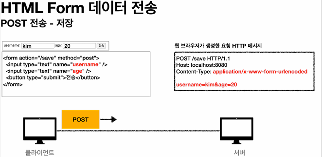
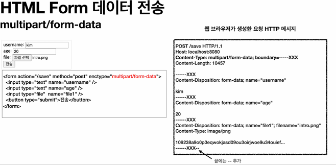

## 본문

### 파일 업로드 소개
    일반적으로 사용하는 HTML Form을 통한 파일 업로드를 이해하려면 먼저 폼을 전송하는 두 가지 방식의 차이를 이해해야 한다.

    ● HTML 폼 전송 방식
    - application/x-www-form-urlencoded
    - multipart/form-data
   

    - application/x-www-form-urlencoded 방식은 HTML 폼 데이터를 서버로 전송하는 가장 기본적인 방법이다. Form 태그에 별도의 enctype 옵션이 없으면 웹 브라우저는 요청 HTTP 메시지의 헤더에 다음 내용을 추가한다.
     
      ex) Content-Type : application/x-www-form-urlencoded
      
    - 그리고 폼에 입력한 전송할 항목을 HTTP Body에 문자로 username=kim&age=20와 같이 &로 구분해서 전송한다.  

    - 파일을 업로드 하려면 파일은 문자가 아니라 바이너리 데이터를 전송해야 한다. 문자를 전송하는 이 방식으로 파일을 전송하기는 어렵다. 그리고 또 한가지 문제가 더 있는데, 보통 폼을 전송할 때 파일만 전송하는 것이 아니라는 점이다.
    
      ex) - 이름, 나이, 첨부파일
      여기에서 이름과 나이도 전송해야 하고,, 첨부파일도 함께 전송해야 한다.
      문제는 이름과 나이는 문자로 전송하고, 첨부파일은 바이너리로 전송해야 한다는 점이다. 여기에서 문제가 발생한다. 문자와 바이너리를 동시에 전송해야 하는 상황이다.

      이 문제를 해결하기 위해 HTTP는 multipart/form-data라는 전송 방식을 제공한다.

    - 이 방식을 사용하려면 Form 태그에 별도의 entype="multipart/form-data"를 지정해야 한다.
    multipart/form-data 방식은 다른 종류의 여러 파일과 폼의 내용 함께 전송할 수 있다. (그래서 이름이 mulipart)

    - 폼의 입력 결과로 생성된 HTTP 메시지를 보면 각각의 전송 항목이 구분이 되어있다. Content-Disposition 이라는 항목별 헤더가 추가되어 있고 여기에 부가 정보가 있다. 예제에서는 username, age, file1이 각각 분리되어 있고, 폼의 일반 데이터는 각 항목별로 문자가 전송되고, 파일의 경우 파일 이름과 Content-Type이 추가되고 바이너리 데이터가 전송된다.
    multipart/form-data는 이렇게 각각의 항목을 구분해서, 한번에 전송하는 것이다.

    - Part
    multipart/form-data는 application/x-www-form-urlencoded와 비교해서 매우 복잡하고 각각의 부분(part)로 나누어져 있따. 그렇다면 이렇게 복잡한 HTTP 메시지를 서버에서 어떻게 사용할 수 있을까?

### Servlet fileupload(1)
    @Slf4j
    @Controller
    @RequestMapping("/servlet/v1")
    public class ServletUploadControllerV1 {

        @GetMapping("/upload")
        public String newFile() {
            return "upload-form";
        }

        @PostMapping("/upload")
        public String saveFileV1(HttpServletRequest request) throws ServletException, IOException {

            String itemName = request.getParameter("itemName");

            Collection<Part> parts = request.getParts();

            return "upload-form";
        }
    }
    - request.getParts() : multipart/form-data 전송 방식에서 각각 나누어진 부분을 받아서 확인할 수 있다.
    
    ● upload-form.html
    <form th:action method="post" enctype="multipart/form-data">
        <ul>
            <li>상품명 <input type="text" name="itemName">
            <li>파일 <input type="file" name="file">
        </>
    </>

    - application.properties 옵션 추가    
      - logging.level.org.apache.coyote.http11=debug

    - 실행 : http://localhost:8080/serlvet/v1/upload
    - 결과 로그
    content-Type : multipart/form-data; boundary=----xxxx
    content-Disposition : form-data; name="itemName"

    Spring
    content-Disposition : form-data; name="file"; fileName="test.data"
    content-Type : application/octet-stream

    ● 업로드 사이즈 제한
    - spring.servlet.multipart.max-file-size=1MB
    - spring.serlvet.multipart.max-request-size=10MB

    - 큰 파일을 무제한 업로드하게 둘 수는 없으므로 업로드 사이즈를 제한할 수 있다. (사이즈를 넘으면 예외 SizeLimitExceededException 발생)

    - max-file-size : 파일 하나의 최대 사이즈, 기본 1MB
    - max-request-size : 멀티파트 요청 하나에 여러 파일을 업로드 할 수 있는데, 그 전체 합이다. 기본 10MB

    ● 참고
    - spring.servlet.multipart.enabled 옵션을 켜면 스프링의 DispatcherServlet에서 MultiPartResolver를 실행한다.
    MultipartResolver는 multipart 요청인 경우 서블릿 컨테이너가 전달하는 일반적인 HttpServletRequest를 MultipartHttpServletRequest로 변환해서 반환한다.
    MultipartHttpServletRequest는 HttpServletRequest의 자식 인터페이스이고, 멀티파트와 관련된 추가 기능을 제공한다.

    하지만 MultipartHttpServletRequest 보다 더 편리한 기능인 MultipartFile이라는 것을 사용할 것 이다.

### Servlet Fileupload(2)    
    - 먼저 파일을 업로드를 하려면 실제 파일이 저장되는 경로가 필요하다.
      - application.properties
        - file.dir=파일 업로드 경로 설정 
          ex) /Users/joo/study/file/ (설정할 때 마지막 '/'가 포함해야 한다.)

    ● ServletUploadControllerV2
    @Slf4j
    @Controller
    @RequestMapping("/servlet/v2)
    public class ServletUploadControllerV2 {

        @Value("${file.dir}") // application.properties 파일에 설정한 file.dir(파일 경로)
        private String fileDir;

        @GetMapping("/upload")
        public String newFile() {
            return "upload-form";
        }

        @PostMapping("/upload")
        public String saveFileV1(HttpServletRequest request) throws
        ServletException, IOException {

            String itemName = request.getParameter("itemName");
            Collection<Part> parts = request.getParts();
            for (Part part : parts) {
                Collection<String> headerNames = part.getHeaderNames();
                for (String headerName : headerNames) {
                    log.info("header : ", headerName, part.getHeader(headerName));
                }

                // 편의 메서드
                // content-disposition; fileName
                log.info("submittedFileName={}", part.getSubmittedFileName());
                log.info("size={}", part.getSize()); // part body size

                // 데이터 읽기
                InputStream inputStream = part.getInputStream();
                String body = StreamUtils.copyToString(inputStream, StandardCharsets.UTF_8);

                // 파일에 저장하기
                if (StringUitls.hasText(part.getSubmittedFileName())) {
                    Strign fulPath = fileDir + part.getSubmittedFileName();
                    part.write(fulPath);
                }
            }

            return "upload-form";
        }
    }
    - multipart 형식은 전송 데이터를 하나하나 각각 부분(part)으로 나누어 전송한다. parts에는 이렇게 나누어진 데이터가 각각 담긴다.
    - 
    - 서블릿이 제공하는 Part는 멀티파트 형식을 편리하게 읽을 수 있는 다양한 메서드를 제공한다.
        
    ● Part 주요 메서드
    part.getSubmittedFileName() : 클라이언트가 전달한 파일명
    part.getInputStream() : Part의 전송 데이터를 읽을 수 있따.
    part.write(...) : Part를 통해 전송된 데이터를 저장할 수 있다.

    ● 실행 : http://localhost:8080/servlet/v2/upload
    - 다음 내용을 전송
      - itemName : 상품A
      - file : 스크린샷.png

    ● 결과 로그
    === PART === 
    name = itemName
    header content-disposition : form-data; name = "itemName"
    submittedFileName = null  
    size = 7
    body = 상품A
    === PART ===
    name = file
    header content-disposition : form-data; name = "file"; filename = "스크린샷.png"
    header content-type : image/png
    submittedFileName = 스크린샷.png
    size = 112384
    body = qwlkjekzijlese.....
    파일 저장 fulPath = /Users/joo/study/file/스크린샷.png

    ● 정리
    서블릿이 제공하는 Part는 편하기는 하지만, HttpServletRequest를 사용해야 하고, 추가로 파일 부분만 구분하려면 여러가지 코드를 넣어야 한다. 이번에는 스프링이 이 부분을 얼마나 편리하게 제공하는지 확인해보자.

### Spring fileupload
    스프링은 MultipartFile 이라는 인터페이스로 멀티파트 파일을 매우 편리하게 지원한다.

    @Slf4j
    @Controller
    @RequestMapping("/Spring")    
    public class SpringUploadController {

        @Value("${file.dir}")
        private String fileDir;

        @GetMapping("/upload")
        public Strign newFile() {
            return "upload-form";
        }

        @PostMapping("/upload")
        public String saveFile(@RequestParam String itemName,
                               @RequestParam MultipartFile file, HttpServletRequest request) throws IOException {
                                
            log.info("request={}", request);
            log.info("itemName={}", itemName);
            log.info("multipartFile={}", file);

            if (!file.isEmpty()) {
                String fullPath = fileDir + file.getOriginalFilename();
                log.info("파일 저장 fullPath={}", fullPath);
                file.transferTo(new File(fullPath));
            }

            return "upload-form";
        }
    }
    - @RequestParam MultipartFile file
    업로드하는 HTML Form의 name에 맞추어 @RequestParam을 적용하면 된다.
    추가로 @ModelAttribute에서도 MultipartFile을 동일하게 사용할 수 있다.

    ● MultiPartFile 주요 메서드
    file.getOriginalFilename() : 업로드 파일 명
    file.transferTo(...) : 파일 저장

    ● 실행 : http://localhost:8080/spring/upload
    
    ● 실행 로그
    request = org.springframework.web.multipart.support.StandardMultipartHttpServletRequest@5c022dc6
    itemName = 상품A
    multipartFile = org.springframework.web.mulipart.support.StandardMultipartHttpServletRequest$StandardMulipartFile@274BA730
    파일 저장 fulPath = /Users/joo/study/file/스크린샷.png

### 예제로 구현하는 파일 업로드, 다운로드
    ● 요구사항
    - 상품을 관리
      - 상품 이름
      - 첨부파일 하나
      - 이미지 파일 여러개
    - 첨부파일을 업로드 다운로드 할 수 있다.
    - 업로드한 이미지를 웹 브라우저에서 확인할 수 있다.

    ● Item - 상품 도메인
    @Data
    public class Item {
        private Long id;
        private String itemName;
        private UploadFile attachFile;
        private List<UploadFile> imageFiles;
    }    

    ● ItemRepository - 상품 리포지토리
    @Repository
    public class ItemRepository {

        private final Map<Long, Item> store = new HashMap<>();
        private long sequence = 0L;

        public Item save(Item item) {
            item.setId(++sequence);
            store.put(item.getId(), item);
            return item;
        }

        public Item findById(Long id) {
            return store.get(id);
        }
    }

    ● UploadFile - 업로드 파일 정보 보관
    @Data
    public class UploadFile {

        private String uploadFileName;  // 고객이 업로드한 파일명
        private String storeFileName;   // 서버 내부에서 관리하는 파일명

        public UploadFile(String uploadFileName, String storeFileName) {
            this.uploadFileName = uploadFileName;
            this.storeFileName = storeFileName;
        }
    }
    - 고객이 업로드한 파일명으로 서버 내부에 파일을 저장하면 안된다. 왜냐하면 서로 다른 고객이 같은 파일이름을 업로드 하는 경우 기존 파일 이름과 충돌이 날 수 있다. 서버에서는 저장할 파일명이 겹치지 않도록 내부에서 관리하는 별도의 파일명이 필요하다.

### FileStore - 파일 저장과 관련된 업무 처리
    @Component
    public class FileStore {

        @Value("${file.dir}")
        private String fileDir;

        public String getFullPath(String filename) {
            return fileDir + filename;
        }

        public List<UploadFile> storeFiles(List<MultipartFile> multipartFiles) throws IOException {
            List<UploadFile> storeFileResult = new ArrayList<>();
            for (MulipartFile multipartFile : multipartFiles) {
                if (!multipartFile.isEmpty()) {
                    storeFileResult.add(storeFile(multipartFile));
                }
            }
            return storeFileResult;
        }

        public UploadFile storeFile(MultipartFile multipartFile) throws IOException {
            if (multipartFile.isEmpty()) {
                return null;
            }

            String originalFilename = multipartFile.getOriginalFiilename();
            String storeFileName = createStoreFileName(originalFilename);
            multipartFile.transferTo(new File(getFulPath(storeFilename)));
            return new UploadFile(originalFilename, storeFileName);
        }

        private String createStoreFileName(String originalFilename) {
            String ext = extracExt(originalFilename);
            String uuid = UUID.randomUUID().toString();
            return uuid + "." + ext;
        }

        private String extractExt(String originalFilename) {
            int pos = originalFilename.lastIndexOf(".");
            return originalFilename.substring(pos + 1);
        }
    } 

    ● 멀티파트 파일을 서버에 저장하는 역할을 담당한다.  
    - createStoreFileName() : 서버 내부에서 관리하는 파일명은 유일한 이름을 생성하는 UUID를 사용해서 충돌하지 않도록 한다.
    - extractExt() : 확장자를 별도로 추출해서 서버 내부에서 관리하는 파일명에도 붍여준다. 예를 들어서 고객이 a.png라는 이름으로 업로드 하면
    5104c62-86c4-4274...png 와 같이 저장된다.

    ● ItemForm
    @Data
    public class ItemForm {
        private Long itemId;
        private String itemName;
        private List<MultipartFile> imageFiles;
        private MultipartFile attchFile;
    }
    - List<MultipartFile> imageFiles : 이미지를 다중 업로드 하기 위해 MultipartFile를 사용했다. 
    - MultipartFile attachFile : 멀티파트는 @ModelAttribute에서 사용할 수 있다.

    ● ItemController
    @Slf4j
    @Controller
    @RequiredArgConstructor
    public class ItemController {

        private final ItemRepository itemRepository;
        private final FileStore fileStore;
 
        @GetMapping("/items/new")
        public String newItem(@ModelAttribute ItemForm form) {
            return "item-form";
        }

        @PostMapping("/items/new")
        public String saveItem(@ModelAttribute ItemForm form, RedirectAttributes redirectAttributes) throws IOException {

            UploadFile attachFile = fileStore.storeFile(form.getAttachFile());
            List<UploadFile> storeImageFiles = fileStore.storeFiles(form.getImageFiles());

            // 데이터베이스에 저장
            Item item = new Item();
            item.setItemName(form.getItemName());
            item.setAttachFile(attachFile);
            item.setImageFiles(storeImageFiles);
            itemRepository.save(item);

            redirectAttribute.addAttribute("itemId", item.getId());

            return "redirect:/item/{itemId}";
        }

        @GetMapping("/Items/{id}")
        public String items(@PathVariable Long id, Model model) {
            Item item = itemRepository.findById(id);
            model.addAttribute("item", itme);
            return "item-view";
        }

        @ResponseBody
        @GetMapping("/images/{filename}")
        public Resource downloadImage(@PathVariable String filename) throws MalformedURLException {
            return new UrlResource("file:" + fileStore.getFullPath(filename));
        }

        @GetMapping("/attach/{itemId}")
        public ResponseEntity<Resource> downloadAttach(@PathVariable Long itemId) throws MalformedURLException {
            Item item = itemRepository.findById(itemId);
            String storeFileName = item.getAttachFile().getStoreFileName();
            String uploadFileName = item.getAttachFile().getUploadFileName();

            UrlResource resource = new UrlResource("file:" + fileStore.getFullPath(storeFileName));

            log.info("uploadFileName={}", uploadFileName);

            String encodedUploadFileName = UrlUtils.encode(uploadFileName, StandardCharsets.UTF_8);
            String contentDisposition = "attachment; filename=\"" + encodedUploadFileName + "\"";
                return ResponseEntity.ok()
                        .header(HttpHeaders.CONTENT_DISPOSITION, contentDisposition)
                        .body(resource);
        }
    }
    - @PostMapping("/items/new") : 폼의 데이터를 저장하고 보여주는 화면으로 리다이렉트 한다.
    - @GetMapping("/images/{filename}") :  태그로 이미지를 조회할 때 사용한다. UrlResource로 이미지 파일을 읽어서 @ResponseBody로 이미지 바이너리를 반환한다.
    - @GetMapping("/attach/{itemId}") : 파일을 다운로드 할 때 실행한다. 예제를 더 단순화 할 수 있지만, 파일 다운로드 시 권한 체크같은 복잡한 상황까지 가정한다. 생각하고 이미지 id를 요청하도록 했다. 파일 다운로드시에는 고객이 업로드한 파일 이름으로 다운로드 하는게 좋다.
    이때는 Content-disposition 헤더에 attachment; filename="업로드 파일명" 값을 주면 된다. 

    ● item-form.html(상품 등록)
    <form th:action method="post" enctype="multipart/form-data">
        <ul>
            <li>상품명 <input type="text" name="itemName"></>
            <li>첨부파일 <input type="file" name="attachFile"></>
            <li>이미지 파일 <input type="file" multipart="multipart" name="imageFiles"></>
        </>
    </>
    - 다중 파일 업로드를 하려면 multipart="multipart" 옵션을 주면 된다.
    - ItemForm의 다음 코드에서 여러 이미지 파일을 받을 수 있다.
    - private List<MultipartFile> imageFiles;

    ● item-view.html(상품 조회)
    상품명 : 상품명
    첨부파일 : <a th:if=${item.attachFile}" 
                th:href="|/attach/${item.id}|" 
                th:text="${item.getAttachFile().getUploadFileName()}" />
                

    - 첨부 파일은 링크로 걸어두고, 이미지는  태그를 반복해서 출력한다.                         

    