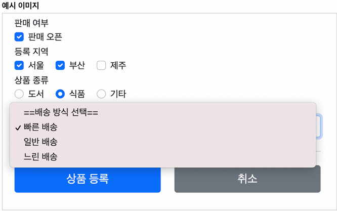

# 본문

### thymeleaf - 특징
    ● 서버 사이드 HTML 렌더링 (SSR)
        - 타임리프는 백엔드 서버에서 HTML을 동적으로 렌더링 하는 용도로 사용.
    ● 네츄럴 템플릿
        - 순수 HTML을 그대로 유지하면서 뷰 템플릿도 사용할 수 있는 타임리프의 특징을 네츄럴 템플릿이라 한다.
    ● 스프링 통합 지원
        - 스프링과 자연스럽게 통합되고, 스프링의 다양한 기능을 편리하게 사용할 수 있게 지원한다.
    ● 강력한 데이터 바인딩
        - th:field 뿐만 아니라 다양한 속성을 통해 서버에서 전달된 데이터를 HTML 요소에 쉽게 바인딩할 수 있다. 이는 폼 처리나 데이터 출력 시 매우 유용하다.
    ● 유효성 검사와 오류 처리의 통합
        - Spring과 통합하여 유효성 검사 결과를 템플릿에 쉽게 반영할 수 있다.
        예를 들어, th:errors, th:errorclass 등을 통해 폼 검증 오류를 사용자에게 직관적으로 전달.
    ● 국제화 지원
        - Thymeleaf는 국제화를 쉽게 지원하여 다국어 웹 애플리케이션을 개발할 때 유용하다. th:text와 같은 속성을 사용하여 메시지 파일의 내용을 쉽게 가져올 수 잇따.    

### thymeleaf - 기본식 표현
    ● 텍스트 - text, utext
        - 기본적으로 HTML 태그의 속성에 기능을 정의해서 동작한다.
        - HTML 컨텐츠에 th:text를 사용하면 된다.
        - 직접 데이터를 출력하고 싶으면 [[...]]를 사용하면 된다.

        @Controller
        @RequestMapping("/basic")
        public class BasicController {
            @GetMapping("/text-basic")
            public String textBasic(Model model) {
                model.addAttribute("data", "Hello Spring");
                return "basic/text-basic";
            }
        }
        
        <li>th:text 사용 </li>
        <li>컨텐츠 안에서 직접 출력하기 = [[${data}]]</li> 

    ● HTML Entity & Escape    
        - 웹 브라우저는 < 를 html 태그로 인식한다. 따라서 문자로 표현할 수 있는 방법이 필요한데 이것을 html 엔티티라 한다.
        - 그리고 이렇게 html에서 사용하는 특수 문자를 html 엔티티로 변경하는 것을 'escape'라 한다.
        - escape 기능을 사용하지 않으려면, th:inline="none"
        - 타임리프가 제공하는 이스케이프 문자
          - th:text 
          - [[...]]  
          - < -> &lt; 
          - > -> &gt;
    
    ● 변수 - SpringEL
        - 타임리프에서 변수를 사용할 때는 변수 표현식을 사용한다.
          - ${...} 

        @Data
        static class User {
            private String username;
            private int age;
        }

        @GetMapping("/variable")   
        public String variable(Model model) {

            User userA = new User("userA", 10);
            User userB = new User("userB", 20);

            List<User> list = new ArrayList<>();
            list.add(userA);
            list.add(userB);

            Map<String, User> map = new HashMap<>();
            map.put("userA", userA);
            map.put("userB", userB);

            model.addAttribute("user", userA);
            model.addAttribute("users", list);
            model.addAttribute("userMap", map);

            return "basic/variable";
        }

        <h1>SpringEL 표현식</h1>

        <ul>Object
            <li>${user.username} = </ul>
            <li>${user['username']} = </li>
            <li>${user.getUsername()} = </li>
        </ul>

        <ul>List
            <li>${users[0].username} = </li>
            <li>${users[0]['username']} = </li>
            <li>${users[0].getUsername()} = </li>
        </ul>

        <ul>Map
            <li>${userMap['userA'].username} =  </li>
            <li>${userMap['userA']['username']} = </li>
            <li>${userMap['userA'].getUsername()} = </li>
        </ul>

    ● 지역 변수 선언
        - th:with 를 사용하면 지역 변수를 선언해서 사용 가능.
        <h1>지역 변수 - (th:with)</h1> 
        

            

    ● 자바8 날짜
        -타임리프는 날짜인 LocalDate, LocalDateTime, Instant를 사용한다.        
        - 

        @GetMapping("/date")
        public String date(Model model) {
            modle.addAttribute("localDateTime", LocalDateTime.now());
            return "basic/date";
        }

        <h1>LocalDateTime</h1>
        <ul>
            <li>default = </li>
            <li>yyyy-MM-dd HH:mm:ss = </li>
        </ul>

    ● URL 링크
        - 타임리프에서 URL을 생성할 때는 @{...} 문법을 사용하면 된다.
        @GetMapping("/link")
        public String link(Model model) {
            model.addAttribute("param1", "data1");
            model.addAttribute("param2", "data2");
            return "basic/link";
        }

        <h1>URL 링크</h1>
        <ul>
            <li><a th:href="@{/hello}">basic url
            <li><a th:href="@{/hello/(param1=${param1}, param2=${param2})}">hello query param
            <li><a th:href="@{/hello/{param1}/{param2}(param1=${param1}, param2=${param2})}">path variable
            <li><a th:href="@{/hello/{param1}{param2}(param1=${param1}, param2=${param2})}">path variable + query parameter 
        </ul>

        - 쿼리 파라미터
          - @{/hello(param1=${param1}, param2=${param2})}
          - /hello?param1=data1&param2=data2
        - 경로 변수
          - @{/hello/{param1}/{param2}(param1=${param1}, param2=${param2})}
          - /hello/data1/data2
          - URL 경로상에 변수가 있으면 () 부분은 경로 변수로 처리된다.  
        - 경로 변수 + 쿼리 파라미터
          - @{/hello/{param1}(param1=${param1}, param2=${param2})}
          - /hello/data1?param2=data2  
          - 경로 변수와 쿼리 파라미터를 함께 사용할 수 있다.
    
    ● 리터럴
        - 리터럴은 코드상에 고정된 값을 말한다.
        - 타임리프에서 문자 리터럴은 항상 ' (작은 따옴표)로 감싸야 한다.
          -  
          - 그러나 항상 따옴표로 감싸는 일은 귀찮다. 그래서 공백 없이 쭉 이어진다면 하나의 의미있는 토큰으로 인지해서 생략 가능하다.
          
        <ul>  
            <li>'hello' + ' world!' = </li>
            <li>'hello world!' = </li>
            <li>'hello ' + ${data} = </li>
            <li>리터럴 대체 |hello ${data}| = </li>
        </ul>

    ● 반복
        - th:each 를 사용한다.    
         
        @GetMapping("/each")
        public String each(Model model) {
            addUsers(model);
            return "basic/each";
        }

        private void addUsers(Model model) {
            List<User> list = new ArrayList<>();
            list.add(new User("userA", 10));
            list.add(new User("userB", 20));
            list.add(new User("userC", 30));

            model.addAttribute("users", list);
        }

        <tr>
            <th>username
            <th>age
        </tr>
        <tr th:each="user : ${users}">
            <td th:text="${user.username}">username</td>            
            <td th:text="${user.age}">0</td>            
        </tr>

        - <tr th:each="user : ${users}">
        - 반복시 오른쪽 컬렉션(${users})의 값을 하나씩 꺼내서 왼쪽 변수(user)에 담아서 태그를 반복 실행한다.

### 타임리프 스프링 통합
    ● 타임리프 스프링 통합 추가 기능
        - 편리한 폼 관리를 위한 추가 속성
          - th:object(기능 강화, 폼 커맨드 객체 선택) 
          - th:field, th:errors, th:errorclass
        - 폼 컴포넌트 기능
          - checkbox, redio button, List
           
    ● 입력 폼 처리
        - th:object : 커맨드 객체를 지정한다.
        - *{...} : 선택 변수 식이라고 한다. th:object에서 선택한 객체에 접근
        - th:field
          - HTML 태그의 id, name, value 속성을 자동으로 처리해준다.
      
        - 렌더링 전
            <input type="text" th:field="*{itemName}" />
        - 렌더링 후
            <input type="text" id="itemName" name="itemName" th:value="*{itemName}" />

        - 등록 폼
            th:object를 적용하려면 먼저 해당 오브젝트 정보를 넘겨주어야 한다. 등록 폼이기 때문에 데이터가 비어있는 빈 오브젝트를 만들어서 뷰에 전달하자.

        @GetMapping("/add")
        public String addForm(Model model) {
            model.addAttribute("item", new Item());
            return "form/addForm";
        }

        - form/addForm.html 변경 코드 부분
        <form action="item.html" th:action th:onject="${item}" mehtod="post">
            

                <label for="itemName">상품명</label>
                <input type="text" id="itemName" th:field="*{itemName}" class="form-control" placeholder="이름을 입력하세요">
            

        - th:object="${item}" : <form>에서 사용할 객체를 지정한다. 선택 변수 식 *{...}을 적용할 수 있다.
        - th:field="*{itemName}"
          - *{itemName}는 선택 변수 식을 사용했는데, ${item.itemName}과 같다. 앞서 th:object로 item을 선택했기 때문에 선택 변수 식을 적용할 수 있다.
          - th:field는 id, name, value 속성을 모두 자동으로 만들어준다.
            - id : th:field에서 지정한 변수 이름과 같다. id="itemName"
            - name : th:field에서 지정한 변수 이름과 같다. name="itemName"
            - value : th:field에서 지정한 변수의 값을 사용한다. value="itemName"

        @GetMapping("/{itemId}/edit")
        public String editForm(@PathVariable Long itemId, Model model)  {
            Item item = itemRepository.findById(itemId);
            model.addAttribute("item", item);
            return "form/editForm";
        }

        <form action="item.html" th:action th:object="${item}" method="post">
            

                <label for="id">상품 ID</>
                <input type="text" id="id" th:field="*{id}" class="form-control" readonly>
            

            
        ● 정리 
        th:object : 폼과 모델 객체 model.addA("user",user);를 바인딩합니다.
        th:field  : 타임리프는 user 객체의 username 필드를 참조하여 자동으로 다음과 같이 설정하여 id, name, value가 자동생성된다.

        th:object를 사용하지 않으면, th:field 부분에 ${...}식으로 *${...}이렇게 사용할 수 없다.

### 타임리프를 이용하여 form 적용해 보기
    ● 타임리프를 사용해서 폼에서 체크박스, 라디오 버튼, 셀렉트 박스를 편리하게 사용하는 방법을 구현해보자.

    ● 요구 사항
        판매 여부
            판매 오픈 여부
            체크 박스로 선택할 수 있다.
        등록 지역
            서울, 부산, 제주
            체크 박스로 다중 선택할 수 있다.
        상품 종류
            도서, 식품, 기타
            라디오 버튼으로 하나만 선택할 수 있다.
        배송 방식
            빠른 배송
            일반 배송
            느린 배송
            셀렉트 박스로 하나만 선택할 수 있다.       
  

    ● itemType - 상품 종류

        public enum ItemType {

            BOOK("도서"), FOOD("식품"), ETC("기타");

            private final String description; // 설명을 위해

            ItemType(String description) { 
                this.description = description;
            }
            public String getDescription() {
                return description;
            }       
        }

    ● DeliveryCode - 배송 방식

        /**
         * FAST  : 빠른 배송
         * NOMAL : 일반 배송
         * SLOW  : 느린 배송 
         */  
        @Data
        @AllArgsConstructor
        public class DeliveryCode {
            private String code;        // 시스템에 전달되는 값
            private String displayName; // 고개게게 보여주는 값
        }  

    ● Item - 상품    

        @Data
        public class Item {
            private Long id;
            private String itemName;
            private Integer price;
            private Integer quantity;

            private Boolean open; //판매 여부
            private List<String> regions; //등록 지역
            private ItemType itemType; //상품 종류
            private String deliveryCode; //배송 방식
        }
### 싱클 체크 박스
    <!-- single checkbox -->
    
 판매 여부

    

        

            <input type="checkbox" id="open" class="form-check-input">
            <label for="open" class="form-check-label>판매 오픈</> 

    ● checkbox - hidden 필드 추가
      - FormItemController : item.open=true // 체크 박스를 선택하는 경우
      - FormItemController : item.open=null // 체크 박스를 선택하지 않는 경우            
        - 체크 박스를 체크하면 HTML Form에서 open=on 이라는 값이 넘어간다.
        스프링은 on 이라는 문자를 true 타입으로 변환해준다.(springConverter)

        - 체크 박스를 선택하지 않고 form을 전송하면 open 이라는 필드 자체가 전송되지 않는다. 
          - hidden trick 
          HTML checkbox는 선택이 안되면 클라이언트에서 서버로 값 자체를 보내지 않는다. 수정의 경우에는 문제가 될 수 있다.
          서버 구현에 따라서 값이 오지 않은 것으로 판단해서 값을 변경하지 않을 수도 있다.

          이런 문제를 해결하기 위해 스프링 MVC는 약간의 트릭을 사용하는데,
          hidden 필드를 하나 만들어서, _open 처럼 기존 체크 박스 이름 앞에 언더스코어를 붙여서 전송하면 체크를 해제했다고 인식할 수 있다.
          hidden 필드는 항상 전송된다.

          따라서 체크를 해제한 경우 여기에서 open은 전송되지 않고, _open만 전송되는데, 이 경우 스프링 MVC는 체크를 해제했다고 판단한다.

        

            <input type="checkbox" id="open" name="open" class="form-check-input">
            <input type="hidden" name="_open" value="on"/> <!-- 히든 필드 추가 -->
            <label for="open" class="form-check-label">판매 오픈</label>
        

    ● checkbox - thymeleaf 기능 추가.
        ● 예제1)
        <input type="checkbox" id="open" th:field="*{open}" class="form-check-input>

            - 타임리프 체크 박스 HTML 생성 결과
            <input type="hidden" name="_open" value="on"/>
                - 타임리프를 사용하면 체크 박스의 히든 필드와 관련된 부분도 함께 해결해준다. 히든 필드 부분이 자동으로 생성되어 있다.
        
        ● 예제2)
        <input type="checkbox" id="open" th:field="${item.open}" class="form-check-input" disabled>

            - 타임리프 체크 박스 HTML 생성 결과
            <input type="checkbox" id="open" class="form-check-input" disabled name="open" value="true" checked="checked"> 
                - 타임리프의 th:field 를 사용하면, 값이 true인 경우 체크를 자동으로 처리해준다.

### 멀티 체크 박스
    @ModelAttribute("regions")
    public Map<String, String> regions() {
        Map<String, String> regions = new LinkedHashMap<>();
        regions.put("SEOUL", "서울");
        regions.put("BUSAN", "부산");
        regions.put("JEJU", "제주");

        return regions;
    }

    ● @ModelAttribute 특별한 사용법
        일일이 model.addAttribute(...)을 사용해서 체크박스를 구성하는 데이터를 반복해서 넣어주기에는 비효율적이다.
        @ModelAttribute를 컨트롤러에 있는 별도의 메서드에 적용하면
        해당 컨트롤러를 요청할 때, regions에서 반환한 값이 자동으로 model에 담기게 된다.

    ● addForm.html 추가
    
        
        <input type="checkbox" th:field="*{regions}" th:value="${region.key}">
        <label th:for="${#ids.prev('regions')}"
               th:text="${region.value}">서울</>

        - <label for="id 값">으로 label의 대상이 되는 id 값을 임의로 지정하는 것은 곤라하여, ids.prev(...), ids.next(...)을 제공.

        ● th:text="${region.value}">
            멀티 체크박스는 같은 이름의 여러 체크박스를 만들 수 있다.
            그런데 문제는 이렇게 반복해서 HTML 태그를 생성할 때,
            생성된 HTML 태그 속성에서 name은 같아도, id 값은 모두 달라야한다. 따라서 임의로 1,2,3 숫자를 뒤에 붙여준다.

        ● each 로 체크박스가 반복 생성된 결과 - id 뒤에 숫자 추가.
        <input type="checkbox" value="SEOUL" class="form-check-input" 
        id="regions1" name="regions">
        <input type="hidden" name="_regions" value="on"/>
        <label for="regions1" class="form-check-label">서울</label>

### 라디오 버튼
    @ModelAttribute("itemTypes")
    public ItemType[] itemTypes() {
        return ItemType.values(); // ENUM의 모든 정보를 배열로 반환.
    }        

    

        <input type="radio" th:field="*{itemType}" th:value="${type.name()}">
        <label th:for="${#ids.prev('itemType')}" th:text="${type.description}"> BOOOK

        ● 실행 결과
        itemType=FOOD // 음식 선택, 선택 않으면 아무 값도 넘어가지 X.

        체크 박스는 수정시 체크를 해제하면 아무 값도 넘어가지 않기 때문에, 별도의 히든 필드로 이런 문제를 해결했다. 
        라디오 버튼은 이미 선택이 되어 있다면, 수정시에도 항상 하나를  선택하도록 되어 있으므로 체크 박스와 달리 별도의 히든 필드를 사용할 필요가 없다.

### 셀렉트 박스
    @ModelAttribute("deliveryCodes")
    public List<DeliveryCode> deliveryCodes() {
        List<DeliveryCode> deliveryCodes = new ArrayList<>();
        deliveryCodes.add(new DeliveryCode("FAST", "빠른 배송"));
        deliveryCodes.add(new DeliveryCode("NORMAL", "일반 배송"));
        deliveryCodes.add(new DeliveryCode("SLOW", "느린 배송"));
        return deliveryCodes;
    }    

    - DeliveryCode 라는 자바 객체를 사용하는 방법으로 진행하겠다.
    - DeliveryCode 를 등록 폼, 조회, 수정 폼에서 모두 사용하므로 @ModelAttribute의 특별한 사용법을 적용하자.
  
    - 참고: @ModelAttribute 가 있는 deliveryCodes() 메서드는 컨트롤러가 호출 될 때 마다 사용되므로 deliveryCodes 객체도 계속 생성된다. 이런 부분은 미리 생성해두고 재사용하는 것이 더 효율적이다.
  
    <select th:field="*{deliveryCode}" class="form-select">
        <option value="">==배송 방식 선택==</option>
        <option th:each="deliveryCode : ${deliveryCodes}" 
        th:value="${deliveryCode.code}" 
        th:text="${deliveryCode.displayName}">FAST</option>
    </select>

    ● 타임리프로 생성된 HTML
    
배송 방식

    <select class="form-select" id="deliveryCode" name="deliveryCode">
        <option value="">==배송 방식 선택==</option>
        <option value="FAST">빠른 배송</option>
        <option value="NORMAL">일반 배송</option>
        <option value="SLOW">느린 배송</option>
    </select>

### 프로젝트 타임리프 적용 (상품 등록)    

    <form action="/admin/goodsEnroll" method="post" id="enrollForm" th:object="${book}" enctype="multipart/form-data">
        

            

                <label for="bookName">책 제목</label>
            

            

                <input type="text" th:field="*{bookName}" id="bookName"> 
                책 이름을 입력해주세요.
            

        

        

            

                <label for="authorName_input">작가</label>
            

            

                <input type="text" id="authorName_input" readonly="readonly" th:field="*{authorName}">
                <input type="hidden" id="authorId_input" th:field="*{authorId}">
                <button type="button" class="authorId_btn">작가 선택</button>
                작가를 선택해주세요
            

        

        

            

                <label for="publeYear">출판일</label>
            

            

                <input type="text" th:field="*{publeYear}" id="publeYear" autocomplete="off" readonly="readonly">
                출판일을 선택해주세요.
            

        

        

            

                <label for="publisher">출판사</label>
            

            

                <input type="text" th:field="*{publisher}" id="publisher"> 
                출판사를 입력해주세요.
            

        

        

            

                <label>책 카테고리</label>
            

            

                

                    대분류 
                    <select class="cate1" th:field="*{cate1}">
                        <option selected value="none">선택</option>
                    </select>
                

                

                    중분류 
                    <select class="cate2" th:field="*{cate2}">
                        <option selected value="none">선택</option>
                    </select>
                

                

                    소분류 
                    <select class="cate3" th:field="*{cateCode}">
                        <option selected value="none">선택</option>
                    </select>
                

                카테고리를 선택해주세요.
            

        

        

            

                <label for="bookPrice">상품 가격</label>
            

            

                <input type="text" th:field="*{bookPrice}" id="bookPrice" value="0"> 
                상품 가격을 입력해주세요.
            

        

        

            

                <label for="bookStock">상품 재고</label>
            

            

                <input type="text" th:field="*{bookStock}" id="bookStock" value="0"> 
                상품 재고를 입력해주세요.
            

        

        

            

                <label for="discount_interface">상품 할인율</label>
            

            

                <input type="text" id="discount_interface" maxlength="2" value="0" th:oninput="this.nextElementSibling.value = this.value"> 
                <input type="hidden" th:field="*{bookDiscount}" value="0">
                할인 가격 : 
                1~99 숫자를 입력해주세요.
            

        

        

            

                <label for="bookIntro_textarea">책 소개</label>
            

            

                <textarea th:field="*{bookIntro}" id="bookIntro_textarea"></textarea>
                책 소개를 입력해주세요.
            

        

        

            

                <label for="bookContents_textarea">책 목차</label>
            

            

                <textarea th:field="*{bookContents}" id="bookContents_textarea"></textarea>
                책 목차를 입력해주세요.
            

        

        

            

                <label>상품 이미지</label>
            

            

                <input type="file" id="fileItem" name='uploadFile' style="height: 30px;" multiple>
                

					
            

        

    </form>
    

        <button id="cancelBtn" class="btn">취 소</button>
        <button id="enrollBtn" class="btn enroll_btn" th:onclick="|document.getElementById('enrollForm').submit()|">등 록</button>
    

