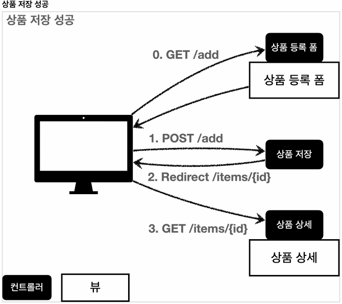
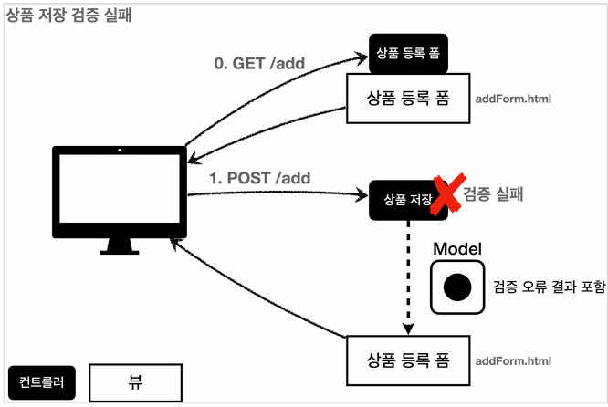

dㅇ## 본문

### 검증 요구사항
    지금까지 만든 웹 애플리케이션은 폼 입력시 숫자를 문자로 작성하거나해서 검증 오류가 발생하면 오류 화면으로 이동한다. 이렇게 되면 사용자는 처음부터 해당 폼으로 다시 이동해서 입력을 해야 한다.
    아마다 이런 서비스라면 사용자는 금방 떠나버릴 것이다. 웹 서비스는 폼 입력시 오류가 발생하면, 고객이 입력한 데이터를 유지한 상태로 어떤 오류가 발생했는지 친절하게 알려주어야 한다.

    컨트롤러의 중요한 역할중 하나는 HTTP 요청이 검증하는 것이다. 

    ● 참고 : 클라이언트 검증, 서버 검증
    - 클라이언트 검증은 조작할 수 있으므로 보안에 취약한다.
    - 서버만으로 검증하면, 즉각적인 고객 사용성이 부족하다.
    - 둘을 적절히 섞어서 사용하되, 최종적으로 서버 검증은 필수
    - API 방식을 사용하면 API 스펙을 잘 정의해서 검증 오류를 API 응답 결과에 잘 넘겨주어야 한다.

    - 사용자가 상품 등록 폼에서 정상 범위의 데이터를 입력하면, 서버에서는 검증로직이 통과하고, 상품을 저장하고, 상품 상세 화면으로 redirect한다.

    - 고객이 상품 등록 폼에서 상품명을 입력하지 않거나, 가격, 수량 등이 너무 작거나 커서 검증 범위를 넘어서면, 서버 검증 로직이 실패해야 한다.
    이렇게 검증에 실패한 경우 고객에게 다시 상품 등록 폼을 보여주고, 어떤 값을 입력한지 알려주어야 한다.

### validationItemControllerV1 - addItem() 수정
    @PostMapping("/add")    
    public String addItem(@ModelAttribute Item item, RedirectAttributes redirectAttributes, Model model) {

        // 검증 오류 결과를 보관
        Map<String, String> errors = new HashMap<>();

        // 검증 로직
        if(@StringUtils.hasText(item.getItemName())) {
            errors.put("itemName", "상품 이름은 필수입니다.");
        }

        - 검증시 오류가 발생하면 errors에 담아둔다. 이때 어떤 필드에서 오류가 발생했는지 구분하기 위해 오류가 발생한 필드명을 key로 사용한다. 이후 뷰에서 이 데이터를 사용해서 고객에게 친절한 오류 메시지를 출력할 수 있다.

        if (item.getPrice() == null || item.getPrice() < 1000 || item.getPrice() > 1000000) {
            errors.put("price", "가격은 1,000 ~ 1,000,000 까지 허용합니다.");
        }

        if (item.getQuantity() == null || item.getQuantity() >= 9999) {
            errors.put("quantity", "수량은 최대 9,999 까지 허용됩니다.");
        }

        // 특정 필드가 아닌 복합 룰 검증
        if (item.getPirce() != null && item.getQuantity() != null) {
            int resultPrice = item.getPrice() * item.getQuantity();
            if (resultPirce < 10000) {
                errors.put("globalError", "가격 * 수량의 합은 10,000원 이상이어야 합니다. 현재 값 = " + resultPirce);
            }
        }

        - 특정 필드를 넘어서는 오류를 처리해야 할 수도 있다. 이때는 필드 이름을 넣을 수 없으므로 globalError 라는 key를 사용한다.

        // 검증에 실패하면 다시 입력 폼으로
        if (!errors.isEmpty()) {
            model.addAttribute("errors", errors);
            return "validation/v1/addForm";
        }

        - 만약 검증에서 오류 메시지가 하나라도 있으면 오류 메시지를 출력하기 위해 model 에 errors 를 담고, 입력 폼이 있는 뷰 템플릿으로 보낸다.
        // 성공 로직
        Item savedItem = itemRepository.save(item);
        redirectAttributes.addAttribute("itemId", savedItem.getId());
        redirectAttributes.addAttribute("status", true);
        return "redirect://validation/v1/items/{itemId}";
    }

    v1/addForm.html
    <form action="item.html" th:action th:object="${item}" method="post">
        

            
전체 오류 메시지</>
        

        

            <label for="itemName" th:text="#{label.item.itemName}">상품명</>
            <input type="text" 
                   id="itemName" th:field="*{itemName}"
                   th:class="${errors?.containskey('itemName')} ? 'form-controlfield-error' : 'form-control'"
            class="form-control" placeholder="이름을 입력하세요">
            

        

    ● 참고 safe navigation operator
    만약 여기에서 errors가 null 이라면 어떻게 될까?
    등록폼에 진입한 시점에는 errors가 없다.
    errors.containKey() 를 호출하는 순가 NullPointerException 이 발생.

    error?. 은 error가 null 일때, NullPointerException이 발생하는 대신, null을 반환하는 문법이다.
    th:if 에서 null 은 실패로 처리되므로 오류 메시지가 출력되지 않는다.

    ● 필드 오류 처리
    <input type="text" th:classappend="${errors?.containsKey('itemName')} ? 'field-error' : _" class="form-control">

        - classappend를 사용해서 해당 필드에 오류가 있으면 field-error 라는 클래스 정보를 더해서 폼의 색깔을 빨간색으로 강조한다. 만약 값이 없으면
        _(Nd-Operation)을 사용해서 아무것도 하지 않는다.

    ● 필드 오류처리 - 메시지
    
 상품명 오류

    ● 정리
    - 만약 검증 오류가 발생하면 입력 폼을 다시 보여준다.
    - 검증 오류들을 고객에게 친절하게 안내해서 다시 입력할 수 있게 한다.
    - 검증 오류가 발생해도 고객이 입력한 데이터가 유지된다.
  
    ● 남은 문제점
    1) 뷰 템플릿에서 중복 처리가 많다. 뭔가 비슷하다.
    2) 타입 오류 처리가 안된다. Item의 price, quantity 같은 숫자 필드는 타입이 Integer 이므로 문자 타입으로 설정하는 것이 불가능하다. 숫자 타입에 문자가 들어오면 오류가 발생한다. 그런데 이러한 오류는 스프링MVC에서 컨트롤러에 진입하기도 전에 예외가 발생하기 때문에, 컨트롤러가 호출되지 않고, 400예외가 발생하면서 오류 페이지를 띄워준다.
    3) Item의 price에 문자를 입력하는 것 처럼 타입 오류가 발생해도 고객이 입력한 문자를 화면에 남겨야 한다. 만약 컨트롤러가 호출된다고 가정해도
    Item의 price는 Integer이므로 문자를 보관할 수가 없다.
    결국 문자는 바인딩이 불가능하므로 고객이 입력한 문자가 사라지게 되고, 고객은 본인이 어떤 내용을 입력해서 오류가 발생했는지 이해하기 어렵다.
    4) 결국 고객이 입력한 값도 어딘가에도 별도로 관리가 되어야 한다.
 
### ValidationItemControllerV2 - addItemV2 (BindingResult)
    @PostMapping("/add")
    public String addItemV1(@ModelAttribute Item item, BindingResult bindingResult, RedirectAttributes redirectAttributes) {
        if (!StringUtils.hasText(item.getItemName())) {
            bindingResult.addError(new FieldError("item", "itemName", "상품 이름은 필수입니다."));
        }
    }

    ● addItemV1 와 비교 
    - errors -> bindingResult 로 바꾼다.
  
    ● 필드 오류 - FieldError
    bindingResult.addError(new FieldError("item", "itemName", "상품~~"));
        - public FieldError(String objectName, String field, String defaultMessage) {}
            - objectName : @ModelAttribute 이름
            - field : 오류가 발생한 필드 이름
            - defaultMessage : 오류 기본 메시지
    
    ● 글로벌 오류 - ObjectError
    bindingResult.addError(new ObjectError("item", "가격 * 수량의 합은 10,000원 이상이어야 합니다. 현재 값 = " + resultPrice));
        - public ObjectError(String objectName, String defaultMessage) {}
            - objectName : @ModelAttribute의 이름
            - defaultMessage : 오류 기본 메시지
    
    v2/addForm.html
    <form action="item.html" th:action th:object="${item}" method="post">
        

            
글로벌 오류 메시지</>
            
   
        

        
        

            <label for="intemName" th:text="#{label.item.itemName}"> 상품명</>
            <input type="text" id="itemName" 
            th:field="*{itemName}"     
            th:errorclass="field-error" 
            class="form-control" >               
        

        
상품명 오류
        

        ● v1/addForm.html 과 비교
        - ${errors?.containskey('globalError')} -> "${#fields.hasGlobalErrors()}, errors?. 코드가 #fields. 로 바뀌었다.

            ● ${#...} : #을 붙이는 이유?
            - 타임리프에서 내장된 객체나 유틸리티 메서드를 호출하기 위해서.
              - 타임리프에는 여러 가지 내장된 객체와 유틸리티 메서드가 있으며, 이를 사용하기 위해서는 '#' 기호를 사용한다. 이러한 객체들은 타임리프 표준 표현식 EL 과 통합되어 있다. 위에 #field는 form binding과 검증 관련 유틸리티 메서드를 제공하는 타임리프의 내장 객체 중 하나이다.
      
        ● 코드 분석 및 흐름
        1) 입력 필드 바인딩 : 'th:field="*{itemName}"'는 모델의 'itemNanme' 필드와 바인딩되어 있다. 사용자가 이 필드에 값을 입력하면 서버로 전송된다.
        2) 검증 오류 발생 시 'th:errorclass' 자동 : 폼이 제출되고 서버 측에서 검증을 수행할 때, 'itemName' 필드에 오류가 발생하면 'th:errorclass="field-error"'가 작동하여 'input' 태그에 'field-error' 클래스가 추가 된다. 이를 통해 css로 오류 필드를 시각적으로 강조할 수 있다.
        3) 검증 오류 메시지 출력 : 'th:error="*{itemName}"' 속성은 'itemName' 필드에 검증 오류가 있는 경우에만 해당 'div' 태그를 렌더링한다. 오류 메시지를 해당 'div' 태그 안에 표시할 수 있다.
     
            ●  정리
            1) th:field 는 모델 객체의 필드와 바인딩 된다.
            2) th:errorclass 는 검증 오류가 있는 경우 지정된 클래스를 추가하여 시각적으로 강조.
            3) th:errors 는 해당 필드에 오류가 있는 경우 오류 메시지를 출력
            
            따라서 입력 필드에 오류가 발생하면 'th:errorclass'가 작동하여 'field-error' 클래스를 추가하고, 'th:errors' 속성이 있는 'div' 태그가 렌더링 되어 오류 메시지를 표시하게 된다. 이를 통해 사용자는 어떤 필드에 오류가 생겼는지 명확하게 알 수 있따.

        ● 타임리프 스프링 검증 오류 통합 기능
        - 타임리프는 스프링의 BindingResult 를 활용해서 편리하게 검증 오류를 표현하는 기능을 제공한다.
        - #fields : #fields 로 BindingResult 가 제공하는 검증 오류에 접근할 수 있다.
        - th:errors : 해당 필드에 오류가 있는 경우에 태그를 출력한다. th:if의 편의 버젼이다.
        - th:errorclass : th:field에서 지정한 필드에 오류가 있으면 class 정보를 추가한다.
      
        ● 글로벌 오류 처리
        

            
전체 오류 메시지</>
        
        ● 필드 오류 처리
        <input type="text" id="itemName" th:field="*{itemName}"
            th:errorclass="field-error" 
            class="form-control" placeholder="이름을입력하세요">상품명 오류
        

### ValidationItemControllerV2 - addItemV2 (BindingResult2)
    @PostMapping("/add")
    public String addItemV2(@ModelAttribute Item item, BindingResult bindingResult, RedirectAttributes RedirectAttributes) {

        if(!StringUtils.hasText(item.getItemName())) {
            bindingResult.addError(new FieldError("item", "itemName",
            ite.getItemName(), false, null, null, "상품 이름은 필수"));
        }

        if(item.getPrice() == null || item.getPrice() < 1000 || item.getPrice() > 1000000) {
            bindingResult.addError(new FieldError("item", "price", item.getPrice(), false, null, "가격은 1,000 ~ 1,000,000 까지 허용합니다."));
        }

        // 특정 필드 예외가 아닌 전체 예외
        if(item.getPrice() != null && item.getQuantity() != null) {
            int resultPrice = item.getPrice() * item.getQuantity();
            if(resultPrice < 10000) {
                bindingResult.addError(new ObjectError("item", null, null, "가격 * 수량의 합은 10,000원 이상이어야 합니다. 현재 값 = " + resultPrice));
            }
        }

        if (bindingResult.hasErrors()) {
            log.info("errors={}", bindingResult);
            return "validation/v2/addForm";
        }

        // 성공 로직
        Item savedItem = itemRepository.save(item);
        redirectAttributes.addAttribute("itemId", savedItem.getId());
        redirectAttributes.addAttribute("status", true);
        return "redirect:/validation/v2/items/{itemId}";
    }

    ● FieldError 생성자
    - public FieldError(String objectName, 
                        String field, 
                        String defaultMessage)
    - public FieldError(String objectName, (오류가 발생한 객체 이름)
                        String field, (오류 필드)
                        @Nullable Object rejectValue, (사용자가 입력한 값 = 거절된 값)
                        boolean bindingResult, (바인딩 or 검증 실패인지 구분 해주는 값)
                        @Nullable String[] codes, (메시지 코드)
                        @Nullable Object[] arguments, (메시지에서 사용하는 인자)
                        @Nullable String defaultMessage) (기본 오류 메시지)

    ● FieldError, ObjectError 의 생성자는 codes, arguments를 제공한다. 이것은 오류 발생시 오류 코드로 메시지를 찾기 위해 사용된다.                        
                            
    ● 오류 발생시 사용자 입력 값 유지
    new FieldError("item", "price", item.getPrice(), false, null, null, "가격은 1,000 ~ 1,000,000 까지 허용합니다.")                       
        - 사용자의 입력 데이터가 컨트롤러의 @ModelAttribute 에 바인딩되는 시점에 오류가 발생하면 모델 객체에 사용자 입력 값을 유지하기 어렵다.
        예를 들어 가격에 숫자가 아닌 문자가 입력된다면 가격은 Integer 타입이므로 문ㄷ자를 보관할 수 있는 방법이 없다. 그래서 오류가 발생한 경우 사용자 입력 값을 보관하는 별도의 방법이 필요하다.
        그리고 이렇게 보관한 사용자 입력 값을 검증 오류 발생시 화면에 다시 출력하면 된다.

        - fieldError는 오류 발생시 사용자가 입력 값을 저장하는 기능을 제공한다.
        - rejectedValue는 오류 발생시 사용자 입력 값을 저장하는 필드이다.(fieldError를 사용해야 rejectedValue가 사용 가능 한가?)
    
    ● 타임리프의 사용자 입력 값 유지
        th:field="*{price}"
    타임리프의 th:field 는 매우 똑똑하게 작동하는데, 정상 상황에는 모델 객체의 값을 사용하지만, 오류가 발생하면 FieldError에서 보관한 값을 사용해서 값을 출력한다.

        ex) 
        @Controller
        @RequestMapping("/items")
        public class ItemController {

            @PostMapping("/add")
            public String addItem(@ModelAttribute Item item, BindingResult bindingResult) {

                if(item.getPrice() <0) { // 값이 음수일 때
                    bindingResult.addError(new FieldError("item", "price", item.gePrcie(), false));
                }

                if(bindingResult.hasErrors()) {
                    return "item/addForm";
                }

                // save item logic here
                return "redirect:/items";
            }
        }

        ● view 에서 오류 메시지와 거부된 값 표시
        <form th:object="${item} th:action="@{/items/add}" method="post">
            

                <label for="price">Price</label>
                <input type="text" id="price" th:field="*{price}" class="form-control"/>
                
Price Error

                    Price Error</>
                     
            

            <button type="submit">Add Item</button>
        </form>

        ● 요약
        - #fields.rejectedValue('price')는 거부된 값을 반환
        - FieldError 를 사용하면 검증 오류가 발생한 필드와 관련된 자세한 정보를 저장할 수 있다.
        - rejectedValue를 통해 거부된 값을 확인할 수 있다.
        - 타임리프를 사용하여 뷰에서 오류 메시지와 거부된 값을 표시할 수 있다.
    
    ● errors 메시지 파일 생성
    message.properties를 사용해도 되지만, 오류 메시지를 구분하기 쉽게 errors.properties라는 별도의 파일로 관리해보자.

    스프링 부트가 인식할 수 있게 설정을 해준다.
        - message.properties, errors.properties 두 파일을 모두 인식한다.
        (생략하면 message.properties를 기본으로 인식한다.)
        - 메시지 설정 추가
        sprig.message.basename=message, errors
        - errors.properties 추가
            required.item.itemName=상품 이름은 필수입니다.
            range.item.price=가격은 {0} ~{1} 까지 허용합니다.
            max.item.quantity=수량은 최대 {0} 까지 허용합니다.
            totalPriceMin=가격 * 수량의 합은 {0}원 이상이어야 합니다. 현재 값 = {1}
        - 참고: errors_en.properties 파일을 생성하면 오류 메시지도 국제화 처리를 할 수 있다            

### ValidationItemControllerV3 - addItemV3 (errors.properties)
    if(!StringUtils.hasText(item.getItemName())) {
        bindingResult.addError(new FieldError("item", "itemName",
        item.getItemName(), false, new String[]{"required.item.itemName"}, null, null));
    }

    if(item.getPrice() == null || item.getPrice() < 1000 || item.getPrice() > 1000000) {
        bindingResult.addError(new FieldError("item", "price", item.getPrice(), fasle, new String[]{"range.item.price"}, new Object[]{1000, 1000000}, null));
    }

    if(item.getQuantity() == null || item.getQuantity() > 10000) {
        bindingResult.addError(new FieldError("item", "quantity", item.getQuantity(), false, new String[]{"max.item.quantity}, new Object[]{9999}, null));
    }

    // 특정 필드 예외가 아닌 전체 예외
    if(item.getPrice() != null && item.getQuantity() != null) {
        int resultPrice = item.getPrice() * item.getQuantity();
        if(resultPrice < 10000) {
            bindingResult.addError(new ObjectError("item", new String, new Object[]{10000, resultPrice}, null));
        }
    }

    if(bindingResult.hasErrors()) {
        log.info("errors={}", bindingResult);
        return "validation/v2/addForm";
    }

    ● addItemV2 와 차이점은
    - errors.properties 설정을 추가하여 코드에 적용하였다.
        - "상품 이름은 필수" -> new String[]{"required.item.itemName"}
        - "가격은 1,000 ~ 1,000,000 까지 허용합니다." ->  new String[]{"range.item.price"}
        - "수량은 최대 9,999 까지 허용합니다." ->  new String[]{"max.item.quantity"}
        -  "가격 * 수량의 합은 10,000원 이상이어야 합니다. 현재 값 = " + resultPrice ->  new String[]{"totalPriceMin"}
    
    - codes : required.item.itemName를 사용해서 메시지 코드를 지정한다.
    메시지 코드는 하나가 아니라 배열로 여러 값을 전달할 수 있는데, 순서대로 매칭해서 처음 매칭되는 메시지가 사용된다.
    - arguments : Object[]{1000, 100000}를 사용해서 코드의 {0}, {1}로 치환할 값을 전달한다.
    
    ● FieldError, ObjectError 는 다루기가 너무 번거롭다.
        오류 코드도 좀 더 자동화 할 수 있지 않을까? ex) item.itemName 처럼?

      컨트롤러에서 BindingResult는 검증해야 할 객체인 target 바로 다음에 온다. 따라서 BindingResult는 이미 본인이 검증해야 할 객체인 target을 알고 있다.

      ● 다음 컨트롤러에서 실행
      log.info("objectName={}", bindingResult.getObjectName());
        -> objectName=item // @ModelAttribute name
      log.info("target={}", bindingResult.getTarget());
        -> target=Item(id=null, itemName=상품, price=100, quantity=1234)  

    BindingResult가 제공하는 rejectValue(), reject()를 사용하면 FieldError, ObjectError를 직접 생성하지 않고, 깔끔하게 검증 오루를 다룰 수 있다.        

### ValidationItemControllerV4 - addItemV4 (rejectValue, reject)      
    if(!StringUtils.hasText(item.getItemName())) {
        bindingResult.rejectValue("itemName", "required");
    }

    if(item.getPrice() == null || item.getPrice() < 1000 || item.getPrice() > 1000000) {
        bindingResult.rejectValue("price", "range", new Object[]{9999}, null);
    }

    // 특정 필드 예외가 아닌 전체 예외
    if(item.getPrice() != null && item.getQuantity() != null) {
        int resultPrice = item.getPrice() * item.getQuantity();
        if(resultPrice < 1000) {
            bindingResult.reject("totalPriceMin", new Object[]{10000, resultPrice}, null);
        }
    }

    if(bindingResult.hasErrors()) {
        log.info("errors={}", bindingResult);
        return "validation/v2/addForm";
    }

    ● addItemV3 와 차이점은
        bindingResult.addError(new FieldError("item", "itemName",
        item.getItemName(), false, new String[]{"required.item.itemName"}, null, null));
        
        위에 긴 코드가 
        bindingResult.rejectValue("itemName", "required") 로 바뀜.

        ● rejectValue()
        - void rejectValue(@Nullable String, (오류 필드명)
                           String errorCode, (오류 코드, messageResolver)
                           @Nullable Object[] errorArgs, ({0}을 치환 위한 값)
                           @Nullable String defaultMessage (오류 메시지를 찾을 수 없을 때, 사용하는 기본 메시지)
                           );

        앞에서 BindingResult 는 어떤 객체를 대상으로 검증하는지 target을 이미 알고있따. 따라서 target(item)에 대한 정보는 없어도 된다.
        오류 필드명은 동일하게 price를 사용했따.

    ● 축약된 오류 코드
    FieldError() 를 직접 다룰 때는 오류 코드를 range.item.price와 같이 모두 입력했다. 그런데 rejectValue()를 사용하고 부터는 오류 코드를 range로 입력해도 잘 실해잉 되었다. 그 이유가 MessageCodesResolver 때문이다. 이제 알아보자        

    ● 오류 코드와 메시지 
    단순하게 만들면 범용성은 좋으나 세밀함이 부족해지고, 너무 자세하게 만들면 범용성이 떨어진다. 이를 해결하기 위해 아래 설정 처럼 메시지를 선택해 기용.
    ex) required : 필수 값 입니다.
    그런데 오류 메시지에 required.item.itemName 와 같이 객체명과 필드명을 조합한 세밀한 메시지 코드가 있으면 우선순위를 정해 사용한다.

    이 우선순위를 정해주는 기능이 MessageCodesResolver 이다.

### MessageCodesResolver
    - 검증 오류 코드로 메시지 코드들을 생성한다.
    - MessageCodesResolver 인터페이스이고, DefaultMessageCodesResolver는 기본 구현체이다.
    - 주로 다음과 함께 사용 ObjectError, FieldError
     
    ● DefaultMessageCodesResolver 의 기본 생성 규칙
    - 객체 오류
    1. : code + "." + object name
    2. : code 
        ex) 오류 코드 : required, object name: item
        1. : required.item
        2. : required
    
    - 필드 오류
    필드 오류의 경우 다음 순서로 4가지 메시지 코드 생성
    1.: code + "." + object name + "." + field
    2.: code + "." + field
    3.: code + "." + field type
    4.: code
        ex) 오류 코드: typeMismatch, object name "user", field "age", field type: int
        1. "typeMismatch.user.age"
        2. "typeMismatch.age"
        3. "typeMismatch.int"
        4. "typeMismatch"
    
    ● 동작 방식
    - rejectValue(), reject() 는 내부에서 MessageCodesResolver를 사용한다.
    - FieldError, ObjectError의 생성자를 보면, 오류 코드를 하나가 아니라 여러 오류 코드를 가질 수 있다. MessageCodesResolver를 통해서 생성된 순서대로 오류 코드를 보관한다.
    - 이 부분을 BindingResult 의 로그를 통해서 확인해보자
        - codes [range.item.price, range.price, range.java.lang.Integer, range]
    
    ● FieldError rejectValue("itemName", "required")
    다음 4가지 오류 코드를 자동으로 생성
        required.item.itemName
        required.itemName
        required.java.lang.String
        required

    ● ObjectError reject("totalPriceMin")
    다음 2가지 오류 코드를 자동으로 생성
        totalPriceMin.item
        totalPriceMin

    크게 중요하지 않은 메시지는 범용성 있는 requried 같은 메시지로 끝내고, 정말 중요한 메시지는 꼭 필요할 때 구체적으로 적어서 사용하는 방식이 더 효과적이다.

### validator 분리1
    @Component
    public class ItemValidator implements Validator {

        @Override
        public boolean supports(Class<?> clazz) {
            return Item.class.isAssignableFrom(clazz);
        }

        @Override
        public void validate(Object target, Errors errors) {
            Item item = (Item) target;

            ValidationUtils.rejectIfEmptyOrWhitespace(errors, "itemName", "required");
        }
    }  

    ● 스프링은 검증을 체계적으로 제공하기 위해 다음 인터페이스를 제공한다.
    public interface Validator {
        boolean supports(Class<?> clazz);
        void validate(Object target, Errors errors);
    }  

    - supports() {} : 해당 검증기를 지원하는 여부 확인
    - validate(Object target, Errors errors) : 검증 대상 객체와 BindingResult
 
### ValidationItemControllerV2 - addItemV5 (Validator)

    private final ItemValidator itemValidator;

    @PostMapping("/add")
    public String addItemV5(@ModelAttribute Item item, BindingResult bindingResult, RedirectAttributes redirectAttributes) {

        itemValidator.validate(item, bindingResult);
    
        if(bindingResult.hasErrors()) {
            return "validation/v2/addForm";
        }
    }

### ValidationItemControllerV2 - addItemV6 (@Validator)
    @PostMapping("/add")
    public String addItemV6(@Validated @ModelAttribute Item item, BindingResult bindingResult, RedirectAttributes redirectAttributes) {
    
        if(bindingResult.hasErrors()) {
            log.info("errors={}", bindingResult);
            return "validation/v2/addForm";
        }
    }

    - validator를 직접 호출하는 부분이 사라지고, 대신에 검증 대상 앞에 @Validated가 붙었다.
    
    ● 동작 방식
    - @Validaed 는 검증기를 실행하라는 어노테이션이다.
    이 어노테이션이 붙으면 앞서 WebDataBinder 에 등록한 검증기를 찾아서 실행한다. 그런데 어러 검증기를 등록한다면 그 중에 어떤 검증기가 실행되어야 할지 구분이 필요하다. 이때 supports()가 사용된다.

    여기서는 supports(Item.class) 호출되고, 결과가 true이므로 ItemValidator의 validate()가 호출된다.

    ● 전체 흐름
    1) 폼 제출: 사용자가 폼을 제출합니다.
    2) 유효성 검증: 컨트롤러에서 @Validated와 BindingResult를 사용하여      유효성 검증을 수행합니다.
    3) 오류 저장: 검증 오류가 발생하면 BindingResult에 FieldError 또는 ObjectError로 오류를 저장합니다.
    4) 오류 확인: BindingResult의 메서드를 사용하여 오류를 확인합니다.
    5) 오류 표시: 타임리프 템플릿에서 #fields 객체를 사용하여 오류 메시지를 표시합니다.